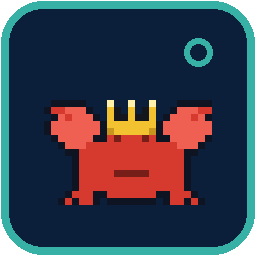
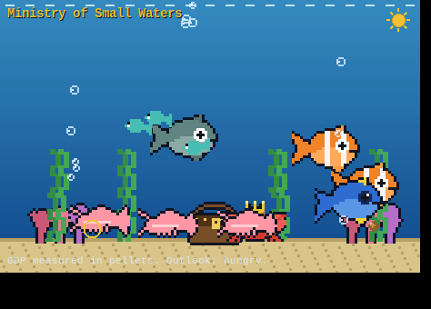
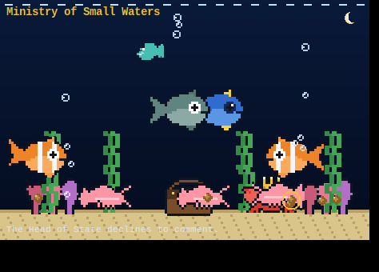

<div align="center">



# 🦀 Ministry of Small Waters

### *A sovereign 32×32 nation. The crab is head of state. You are a guest.*

A ridiculous little **Windows system-tray app**: a pixelated digital aquarium
that lives by your taskbar clock. Poke the citizens, feed the nation, and try
to stay on the crab's good side.




</div>

---

## What is this

It's a self-contained pixel aquarium that minimizes to your system tray as a
tiny crowned-crab seal. Click the seal for the state menu; open the tank to
watch a hand-drawn (well, code-drawn) ecosystem of fish, shrimp, interns and
one very important crab go about their day — complete with a slow day→dusk→night
cycle, bubbling seabed vents, swaying kelp, and a deadpan "State of the Nation"
ticker.

Every pixel is generated in code (Pillow) — there are **no image assets to
ship**. The whole thing is a handful of small Python files.

## The citizens

| Who | Role | Behaviour |
|-----|------|-----------|
| 🦀 **The Crab** | Head of State | Patrols the seabed, raises his claws in ceremony, *sulks* when poked, pinches pellets that reach the sand. Wears a gold crown, obviously. |
| 🐠 **Clownfish** | The Citizen | Fast, curious, first to chase food, startles hard when poked. |
| 🐟 **Cod** | The Bureaucrat | Big, grey-teal, dignified. Will not hurry for anyone. Eats only if a pellet drifts right past his mouth. |
| 🦐 **Shrimp** ×3 | The Constituents | Twitchy bottom-dwellers that flick backward the instant you touch them. |
| 🐡 **Blue Tang & Goldfish** | Assorted public | General mid-water life. |
| ✨ **Tetras** ×3 | The Interns | A tiny school that drifts together and scatters when startled. |

## How to govern

- **Left-click a creature** → poke it (it startles and darts off).
- **Left-click open water** (or **right-click** anywhere) → drop a food pellet.
- **Keyboard:** `F` feed the whole nation · `P` poke the Head of State · `Esc` hide the tank.
- **Tray menu** (right-click the crab seal): Open/Hide the Tank, *Feed the Nation*,
  *Poke the Head of State*, Always on Top, Launch at Windows Startup,
  About, and *Resign (Quit)*.
- **Easter egg:** double-poke the crab and he plants a tiny provisional flag. 🚩

## Install & run (Windows)

1. Install **Python 3.9+** from [python.org](https://www.python.org/downloads/)
   — tick **“Add python.exe to PATH”** during setup.
2. Double-click **`Install Dependencies.bat`** (installs Pillow + pystray).
3. Double-click **`Run Ministry.bat`**.

That's it — the tank opens and a crowned crab appears in your system tray.

<sub>Prefer the terminal? `pip install -r requirements.txt` then `pythonw main.py`.</sub>

## Build a standalone .exe (optional)

Want to hand it to someone who doesn't have Python? Double-click
**`Build Standalone EXE.bat`** (it uses PyInstaller). You'll get a single
self-contained file at `dist\MinistryOfSmallWaters.exe` — crowned-crab icon
and all.

## Does it run on macOS / Linux?

The simulation and window are cross-platform (Tkinter + Pillow). The **system
tray** part needs a tray backend: it's zero-effort on Windows, needs a tray
host on Linux (e.g. `AppIndicator`/GTK), and works on macOS. If no tray backend
is found, the Ministry politely falls back to **windowed-only** mode — you just
lose the tray icon, not the aquarium.

## For the curious (developers)

```
main.py        entry point: boots the sim, opens the window, installs the tray
config.py      the "founding charter" — every constant, the palette, branding
pixelart.py    procedural pixel-art sprite factory (fish, crab, shrimp, props)
entities.py    the pure, headless simulation (physics + behaviour + the World)
aquarium.py    the Tkinter renderer (cached PhotoImages, 30fps animation loop)
seal.py        the crowned-crab state seal → tray icon + multi-size .ico
tray.py        the pystray system-tray presence and menu
autostart.py   optional "launch at Windows startup" (HKCU Run key)
```

The simulation is deliberately GUI-free, so it's testable without a display:

```bash
python tests/test_headless.py           # runs 90 simulated seconds, asserts invariants
```

`pixelart.py` and `seal.py` can be run directly to preview sprites as ASCII /
write `icon.ico`. `tests/gui_smoke.py` drives the real window (used under Xvfb
in CI-style checks and to grab the screenshots above).

## License

MIT. See [LICENSE](LICENSE). No crustaceans were granted actual sovereignty.
