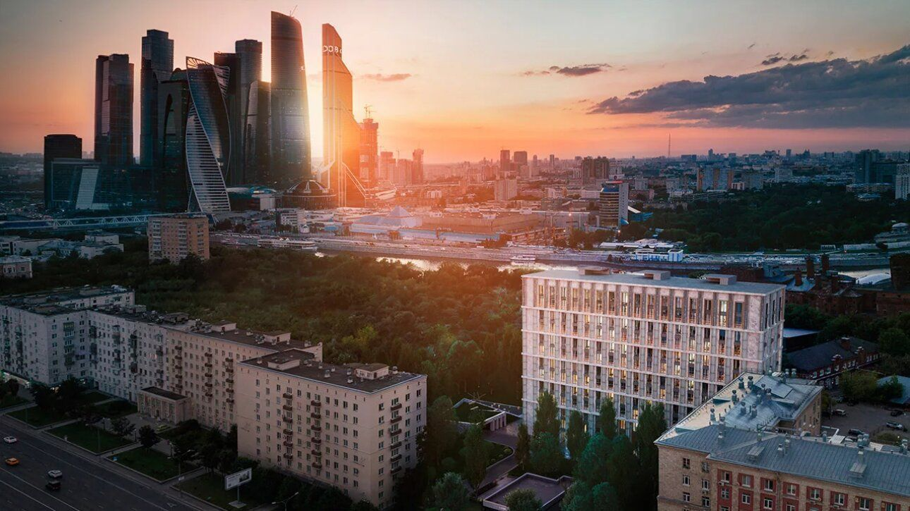

# Кутузовский 12 — Club House landing (concept)

A premium, single-page site for the real **«Кутузовский 12»** deluxe club house
on Kutuzovsky Prospekt, Moscow (architecture by Tsimailo, Lyashenko & Partners).
The hero is a full-screen **Three.js** reconstruction of the actual building —
an 11-storey limestone palazzo with its signature full-height glass/steel
colonnade banded in brass — rendered at twilight against Moscow-City and the
Moskva River. Copy is in Russian; the gallery uses real photography of the
building.

> **Just want to see it? Open `kutuzovsky-12.html` — double-click, no server, no
> internet.** It's the whole site (3D building + the "video-from-text" section +
> gallery) in one self-contained file. `index.html` is the multi-file source and
> **must be served over HTTP** (ES modules can't load from `file://`), e.g.
> `python3 -m http.server` — opening `index.html` directly will look blank.



> Modelled from reference photos of the completed building. This is a
> conceptual presentation, not affiliated with the developer.

## Highlights

- **Faithful 3D model** — the building is rebuilt procedurally from the real
  design: a beige-limestone mass with floor string-courses, a regular bay
  rhythm of **clustered fluted columns wrapped in brass rings**, dark bronze
  glazing, a setback penthouse, a 9-metre warm-lit lobby, and a granite
  courtyard — set against Moscow-City towers, low Stalin-era neighbours, the
  river and trees.
- **The background IS "video from text".** The 3D model is rendered to a hidden,
  low-resolution WebGL canvas and **redrawn every frame as a full-screen grid of
  colored text characters** (`#asciiBg`). There's no `<video>` — the moving
  backdrop is live 3D disguised as text. Real **HDRI image-based lighting** (a
  dusk sky) still drives the reflections and a low warm sun the shadows, so the
  source frames look right before they become glyphs.
- **Cinematic camera** — a timed intro fly-in, then a scroll-driven journey that
  tracks the colonnade, rises to the penthouse and pulls back over the river,
  with idle drift and mouse parallax.
- **Full-bleed + real imagery** — the text background is fixed full-viewport;
  content floats over it on translucent glass with a scroll-driven veil, and the
  gallery shows real photographs of the building.
- **Premium art direction** — dark editorial palette with brass accents,
  Cormorant Garamond + Manrope, custom cursor, scroll-rail, preloader, scroll
  reveals, animated counters and a working (front-end only) viewing-request form.
- **Robust & accessible** — graceful CSS fallback if WebGL is unavailable, full
  `prefers-reduced-motion` support, per-device quality scaling (shadows off on
  small screens), keyboard-friendly forms, responsive to mobile.

## Run it

It's a static site. Because it uses ES modules + an import map, serve it over
HTTP rather than opening the file directly:

```bash
# from the project root
python3 -m http.server 8000
# then open http://localhost:8000
```

Any static server works (`npx serve`, VS Code Live Server, etc.).

> Three.js (r160) and its post-processing addons are **vendored locally** under
> `js/vendor/three/`, so the scene works fully offline — no CDN. If WebGL is
> unavailable for any reason, the page degrades gracefully to a styled gradient
> sky and everything else still works. (Google Fonts are still loaded from a CDN
> and fall back to system serif/sans if blocked.)

## Single-file download

`kutuzovsky-12.html` is a **fully self-contained build** — CSS, the UI
script, and the entire Three.js module graph (core + post-processing addons +
the scene) are inlined into one file. You can download it and **open it
directly by double-clicking** (no web server, no internet); the full cinematic
scene still renders. It's regenerated from the source files with:

```bash
node build-standalone.js
```

The 3D code is an ES-module graph, which browsers refuse to load from `file://`.
The build sidesteps this by embedding every module as text and reconstructing
the graph at runtime with **Blob URLs**: each module's import specifiers are
rewritten to the Blob URLs of its dependencies, created in dependency order.
Blob URLs are same-origin, so the graph imports cleanly even from disk.

## Structure

```
index.html             Markup & content (Russian copy lives here)
css/styles.css         Design system, layout, animations, responsive rules
js/scene.js            WebGL scene: the building model, lighting, camera, bloom
js/main.js             UI: preloader, reveals, counters, nav, veil, cursor, form
js/vendor/three/       Vendored Three.js r160 + post-processing addons
img/                   Real photographs of Кутузовский 12 (gallery)
build-standalone.js    Bundles the module graph + images into one HTML file
kutuzovsky-12.html  Self-contained single-file build (downloadable)
build-text-video.js    Generates the "video-as-text" experiment
text-video.html        Plays footage with no <video>/ — pure colored text
docs/preview.svg       Static preview (earlier concept)
```

## Experiment: video without a video player

`text-video.html` (built by `node build-text-video.js`) plays the building
footage with **no `<video>` and no visible ``** — every frame is rebuilt as
colored text characters in a `<pre>`. Real photos are animated (Ken-Burns +
crossfade), sampled to a grid, and each cell becomes a glyph chosen by luminance
and coloured by the pixel. It looks like video; technically it's text you can
select. A small "reveal" toggle enlarges the glyphs to show what it really is.

## Customising the listing

All listing details are plain HTML in `index.html` — price, area, floor,
amenities, floor-plan specs, location distances, and contact details. Brand
colours and fonts are CSS custom properties at the top of `css/styles.css`
(`--gold`, `--bg`, `--serif`, …). The tower's proportions, window density, and
skyline are parameters inside the builder functions in `js/scene.js`.

---

*Conceptual presentation. Imagery, pricing, and contact details are
illustrative.*
