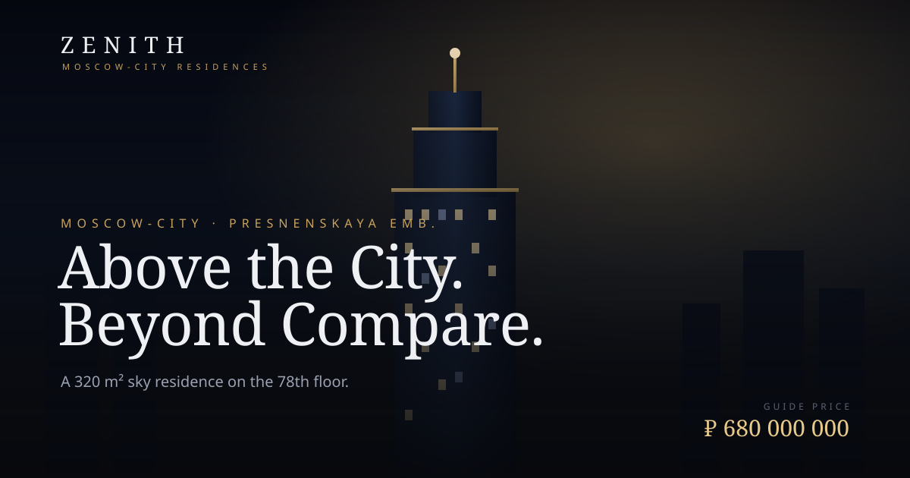

# ZENITH · Sky Residence — Moscow-City

A premium, single-page **3D landing site** for the sale of a luxury penthouse
in Moscow-City. The hero features a fully procedural, animated skyscraper scene
rendered in real time with **Three.js** — no external 3D assets, images, or
build step required.



## Highlights

- **Real-time 3D hero** — a tiered glass tower with lit windows, a glowing
  bronze crown, a surrounding Moscow-City skyline, drifting light motes, a
  gradient sky dome, and reflective ground. The camera slowly orbits and
  responds to mouse movement and scroll.
- **Premium art direction** — dark editorial palette with bronze/gold accents,
  Cormorant Garamond + Manrope typography, film-grain texture, and a custom
  cursor.
- **Motion & polish** — preloader, scroll-reveal animations, animated stat
  counters, tilting gallery cards, a sticky glass header, and a working
  (front-end only) enquiry form.
- **Robust & accessible** — graceful CSS fallback if WebGL is unavailable,
  full `prefers-reduced-motion` support, keyboard-friendly forms, and a
  responsive layout down to mobile.

## Run it

It's a static site. Because it uses ES modules + an import map, serve it over
HTTP rather than opening the file directly:

```bash
# from the project root
python3 -m http.server 8000
# then open http://localhost:8000
```

Any static server works (`npx serve`, VS Code Live Server, etc.).

> Three.js (r160) is **vendored locally** under `js/vendor/three/`, so the 3D
> hero works fully offline — no CDN or build step. If WebGL is unavailable for
> any reason, the page degrades gracefully to a styled gradient sky and
> everything else still works. (Google Fonts are still loaded from a CDN and
> fall back to system serif/sans if blocked.)

## Single-file download

`zenith-residence.html` is a **fully self-contained build** — CSS, JS and the
entire Three.js library are inlined into one file. You can download it and
**open it directly by double-clicking** (no web server, no internet); the 3D
hero still renders. It's regenerated from the source files with:

```bash
node build-standalone.js
```

The 3D code uses ES modules, which browsers normally refuse to load from
`file://`. The build sidesteps this by embedding Three.js + the scene module as
text and loading them through runtime **Blob URLs**, which are same-origin and
import cleanly even from disk.

## Structure

```
index.html             Markup & content (all copy lives here)
css/styles.css         Design system, layout, animations, responsive rules
js/scene.js            Three.js hero scene (procedural tower, skyline, particles)
js/main.js             UI: preloader, reveals, counters, nav, cursor, form
js/vendor/three/       Vendored Three.js r160 + RoomEnvironment addon
build-standalone.js    Bundles everything into the single-file build
zenith-residence.html  Self-contained single-file build (downloadable)
docs/preview.svg       Static preview used in this README
```

## Customising the listing

All listing details are plain HTML in `index.html` — price, area, floor,
amenities, floor-plan specs, location distances, and contact details. Brand
colours and fonts are CSS custom properties at the top of `css/styles.css`
(`--gold`, `--bg`, `--serif`, …). The tower's proportions, window density, and
skyline are parameters inside the builder functions in `js/scene.js`.

---

*Conceptual presentation. Imagery, pricing, and contact details are
illustrative.*
