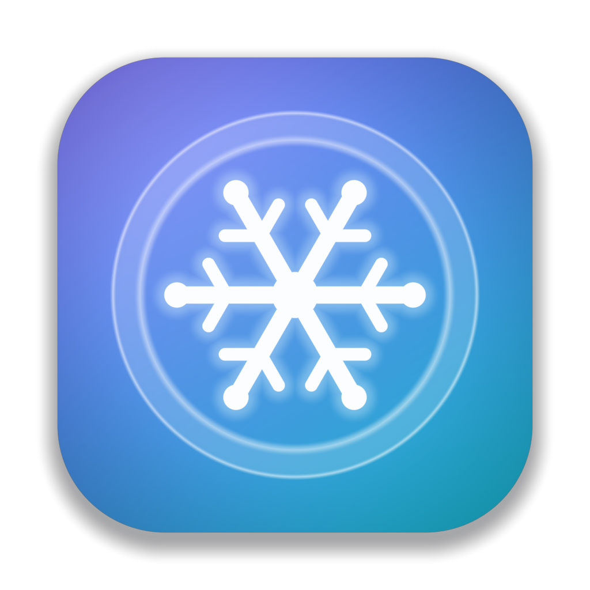

# Veil — Tor-клиент со Snowflake для macOS 26 Tahoe в стиле Liquid Glass

<p align="center"></p>

Veil — нативное SwiftUI-приложение для macOS 26 Tahoe. Одна кнопка: запускает
встроенный **Tor** через мосты **Snowflake**, строит цепочку из трёх узлов и
переводит системный трафик Mac на Tor. Интерфейс полностью на новом
**Liquid Glass**: стеклянная кнопка питания с кольцом прогресса, стеклянные
плитки статистики и «чипы» цепочки, плавающий сайдбар над живым mesh-градиентом,
окно в строке меню.

> **Готовый DMG:** <https://github.com/parfentsevandrey-blip/test/releases/tag/veil-v0.6.0>
> Сборка универсальная (Apple silicon + Intel), собирается автоматически
> GitHub Actions на macOS-раннере из этого каталога.

## Возможности

- **Tor + Snowflake из коробки.** В приложение встроен Tor Expert Bundle
  (`tor`, `lyrebird` с транспортом snowflake/obfs4/webtunnel/meek, `conjure-client`,
  базы GeoIP) — те же бинарники и те же строки мостов, что в Tor Browser.
- **Транспорты:** Snowflake (по умолчанию), встроенные obfs4-мосты, свои строки
  мостов (obfs4 / webtunnel / snowflake / meek_lite / conjure с bridges.torproject.org
  или бота @GetBridgesBot), прямое подключение без мостов.
- **«VPN» для всей системы.** После загрузки Tor Veil выставляет SOCKS5-, HTTP- и
  HTTPS-прокси во всех активных сетевых службах (Wi-Fi, Ethernet…) и возвращает
  настройки при отключении или выходе. HTTP(S)-прокси — собственный мост
  HTTP CONNECT → SOCKS5 на Network.framework, имена хостов резолвит Tor (без утечек DNS).
- **Страна выходного узла** — 30 стран одним кликом, применяется на лету
  (`SETCONF ExitNodes` + `NEWNYM`, без перезапуска Tor).
- **Живая цепочка:** мост → промежуточный узел → выход, с флагами (GeoIP через
  control port), «Новая личность», проверка через `check.torproject.org/api/ip`.
- **Активность:** график скорости (Swift Charts) и журнал Tor с фильтром предупреждений.
- **Строка меню:** тумблер, прогресс загрузки, выбор страны, новая личность.
- **Настройки:** автозапуск (SMAppService), порты, автопрокси, команда для терминала
  (`ALL_PROXY=socks5h://…`), подробный лог.
- **Маскировка трафика в стиле DAITA.** Пустой трафик подмешивается в туннель по
  расписанию, зависящему от реальной активности: фоновый шум с пуассоновскими
  паузами, всплески по распределению Рэлея в начале загрузки страниц (защита FRONT)
  и режим постоянной скорости. Шум проходит через Tor до приватного onion-сервиса
  на вашем Mac — ни один сайт его не получает. Дополнительно принудительно включаются
  `CircuitPadding` и `ConnectionPadding` самого Tor. В отличие от DAITA реальные
  пакеты не задерживаются — только добавляется шум.
- **Многократный переход.** Карточка маршрута с живой схемой (Mac → Snowflake →
  промежуточный → выходной → интернет), выбор страны промежуточного узла
  (`MiddleNodes`), исключение стран (`ExcludeNodes`), пресет «Пять глаз», смена
  маршрута по таймеру и измеренная задержка маршрута. Всё применяется на лету через
  control port.
- **YouTube без тормозов.** Раздельная маршрутизация по доменам: YouTube (youtube.com,
  googlevideo.com, ytimg.com, ggpht.com и остальные хосты) может идти через Tor, напрямую
  с обходом замедления или просто напрямую; плюс свой список доменов в обход Tor. Обход
  замедления работает в собственном HTTP-мосте Veil: первый TLS ClientHello дробится по
  середине SNI на две TLS-записи и два TCP-сегмента (техники GoodbyeDPI / ByeDPI / zapret
  «split» и «tlsrec», четыре варианта на выбор), поэтому DPI-замедлитель не видит имя хоста.
  Режим **YouTube Turbo** включает тот же прокси вообще без Tor: через Veil идёт только
  YouTube, остальной трафик не трогается. Кнопка «Проверить YouTube» прогоняет запрос
  к youtube.com через прокси Veil ровно так, как это делает Safari.
- **Kill switch и автопереподключение.** Прокси включается до старта Tor и не отпускается при
  его падении (приложения с прокси блокируются, а не утекают); после смены сети или сна Veil
  проверяет цепочки и переподключается сам.
- **Автоматический транспорт и мосты от Tor Project.** Проверка прямой доступности Tor,
  перебор транспортов с обнаружением зависаний, запрос мостов через Moat (напрямую или через
  CDN с domain fronting).
- **Сайты.** Пресеты для Discord, Telegram, Twitch, Instagram, Facebook, X, Signal, RuTube;
  автоподбор техники обхода замедления по реальной скорости.
- **Быстрый маршрут.** Гонка цепочек: после подключения и каждой смены маршрута Veil строит
  несколько цепочек в выбранных странах, измеряет время их сборки и закрепляет самые быстрые
  выходные (и промежуточный) узлы; повторное измерение каждые полчаса и при отказе узлов. Conflux
  в режиме минимальной задержки, несколько Snowflake-прокси одновременно.
- **Бесшовный multihop.** Смена страны, исключений и ротация не рвут открытые соединения:
  Tor получает новые ограничения, первая цепочка нового маршрута строится заранее, старые
  соединения дорабатывают на прежних цепочках, новые идут по новому маршруту.
- **Живой дашборд.** Анимированный маршрут Mac → мост → узлы → интернет: частицы движутся со
  скоростью реального трафика, узлы загораются по мере загрузки Tor, наведение показывает детали,
  клик ведёт на нужный экран; красная «быстрая полоса» — YouTube в обход Tor, kill switch — барьер.
  Плитки скорости, сессии, задержки, защиты, маскировки, маршрутизации, YouTube, приложений и сети.
- **Сброс сети.** Перед запуском Tor и после каждого пробуждения Veil проверяет, что интернет
  действительно работает; если сеть «есть», но молчит (после сна или другого VPN), сам выключает и
  включает Wi-Fi (CoreWLAN → `networksetup` → перезапуск сетевой службы) и только потом запускает
  Tor. Зависший транспорт вызывает тот же сброс и повторяется. «Сбросить сеть» — ⇧⌘R.
- **Telegram и Apple.** Кнопка «Добавить прокси Veil в Telegram» передаёт приложению ссылку
  `tg://socks`, и Telegram идёт через Tor; App Store, iCloud и обновления по умолчанию напрямую.
- **Удобства.** Онбординг, мини-окно, карта маршрута, спарклайн в строке меню, уведомления,
  тактильный отклик, проверка обновлений, экспорт/импорт настроек, отчёт диагностики, действия
  для Shortcuts, юнит-тесты в CI.
- Локализация: русский, английский, украинский, персидский, китайский (упрощённый).

## Установка из DMG

1. Откройте DMG, перетащите **Veil.app** в «Программы».
2. Сборка подписана ad-hoc (без сертификата Apple Developer), поэтому Gatekeeper
   при первом запуске откажет. Откройте **Системные настройки → Конфиденциальность
   и безопасность → «Всё равно открыть»** либо выполните
   `xattr -cr /Applications/Veil.app`.
3. Нажмите кнопку питания. При первом подключении macOS один раз спросит пароль
   администратора — это право `system.services.systemconfiguration.network`,
   нужное для смены системного прокси.
4. Проверьте на <https://check.torproject.org> или кнопкой **Check Tor**.

Требуется macOS 26 Tahoe.

## Сборка из исходников

Нужны macOS 26, Xcode 26 и [XcodeGen](https://github.com/yonaskolb/XcodeGen)
(`brew install xcodegen`).

```bash
cd VeilVPN
make tor        # скачать Tor Expert Bundle (arm64 + x86_64) и слить в универсальные бинарники
make xcodeproj  # сгенерировать Veil.xcodeproj из project.yml
make test       # юнит-тесты (XCTest, Debug)
make app        # универсальная сборка + встраивание Tor в Veil.app
make dmg        # ad-hoc подпись и build/Veil-<версия>.dmg
```

Быстрый просмотр интерфейса без Tor: `swift run Veil` (Package.swift) — приложение
стартует в **демо-режиме** и имитирует подключение. Если рядом есть `build/tor`,
тот же запуск использует настоящий Tor.

Подпись своим сертификатом: `CODESIGN_IDENTITY="Developer ID Application: …" make dmg`.

Версия Tor задаётся в файле `TOR_VERSION`; при обновлении `pt_config.json`
из бандла автоматически обновляет и строки мостов.

## GitHub Actions

Workflow `.github/workflows/veil-dmg.yml` собирает DMG при каждом пуше, затрагивающем
`VeilVPN/`, и выкладывает его как артефакт. Запуск вручную с параметром
**publish_release** создаёт GitHub Release с DMG.

## Как это устроено

```
Veil/
├── App/        VeilApp (сцены, команды, MenuBarExtra), AppDelegate, AppState — оркестратор
├── Models/     состояние, настройки, страны выхода, узлы цепочки, лог
├── Services/   TorProcessEngine (запуск tor, парсинг лога, TAKEOWNERSHIP),
│               TorControlClient (control-протокол по TCP), TorConfiguration (torrc),
│               HTTPProxyBridge (HTTP CONNECT → SOCKS5), SystemProxy (SystemConfiguration +
│               fallback networksetup), TorCheck, TrafficMonitor, PortAllocator
└── Views/      RootView (NavigationSplitView), Dashboard, Locations, Activity, Settings, MenuBar
```

Подключение: выбор свободных портов → генерация `torrc` → запуск `tor` → cookie-авторизация
на control port → ожидание `Bootstrapped 100%` → старт HTTP-моста → включение системного
прокси → опрос цепочки и счётчиков трафика. Отключение и выход из приложения выполняют
всё в обратном порядке; `TAKEOWNERSHIP` гарантирует, что tor умрёт вместе с Veil.

### Liquid Glass

Используются API macOS 26: `glassEffect(_:in:)` с `.regular.tint().interactive()`,
`GlassEffectContainer` и `glassEffectID` для слияния/морфинга стекла, стили кнопок
`.glass` / `.glassProminent`, `ToolbarSpacer`, `backgroundExtensionEffect()` для фона под
плавающим сайдбаром, `MeshGradient` как «живой» фон, `NavigationSplitView`, `MenuBarExtra`
в стиле окна, `SettingsLink`, symbol effects.

## Ограничения и честные оговорки

- Это **прокси-режим**, а не туннель на уровне ядра. Через Tor идут приложения,
  уважающие системный прокси (Safari, Chrome, Firefox с системными настройками,
  Mail, большинство программ). Утилиты вроде `curl`, `git`, Homebrew — только с
  переменными окружения из Настройки → Сеть. UDP-трафик Tor не поддерживает в принципе.
- Полный системный VPN (Packet Tunnel через NetworkExtension) требует подписанного
  Apple Network Extension: платный аккаунт Developer ID и нотаризация. Архитектура
  Veil к этому готова (`TorEngine` абстрагирован), но в ad-hoc-сборке это невозможно.
- Ограничение стран узлов (выход, промежуточный, исключения) сужает множество
  возможных цепочек и снижает анонимность — это осознанный компромисс пользователя.
- В режимах «напрямую» и YouTube Turbo YouTube видит ваш реальный IP-адрес: это ускорение,
  а не анонимность. Какая техника фрагментации обходит DPI конкретного провайдера,
  заранее неизвестно — в настройках их четыре, есть встроенная проверка.
- Маскировка трафика расходует полосу волонтёров Snowflake и узлов Tor; используйте
  самый лёгкий подходящий уровень. Это не DAITA/Maybenot на уровне пакетов, а
  padding-only защита поверх Tor.
- Snowflake зависит от доступности волонтёрских прокси: первое подключение может занять
  до минуты. Если Snowflake не работает, попробуйте свои obfs4/webtunnel-мосты.

## Лицензии

Код Veil — MIT. Tor, Lyrebird (Snowflake) и Conjure — © The Tor Project, Inc. и авторы,
распространяются по своим лицензиям (тексты в `Veil.app/Contents/Resources/tor-licenses`).

---

### English summary

Veil is a native SwiftUI Tor client for macOS 26 Tahoe with a Liquid Glass UI. It bundles the
Tor Expert Bundle (universal), connects through Snowflake (or obfs4 / custom bridges), switches
the system SOCKS/HTTP(S) proxies to Tor while connected, lets you pin the exit country, shows the
live circuit and throughput, and lives in the menu bar. Build with `make dmg` on macOS 26 with
Xcode 26 + XcodeGen, or download the DMG from the GitHub Release. The DMG is ad-hoc signed:
allow it in *System Settings → Privacy & Security* on first launch.
