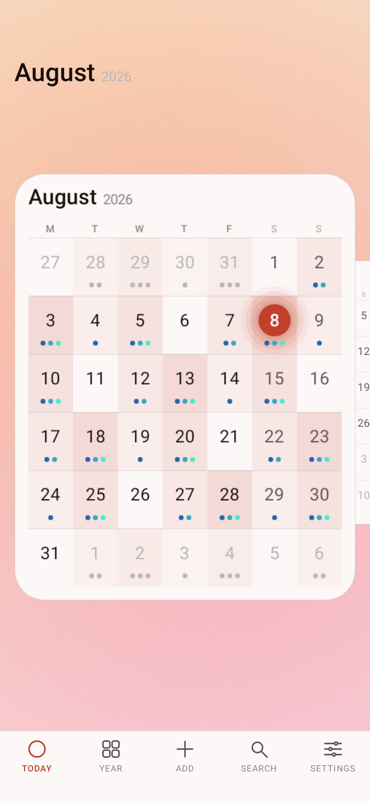
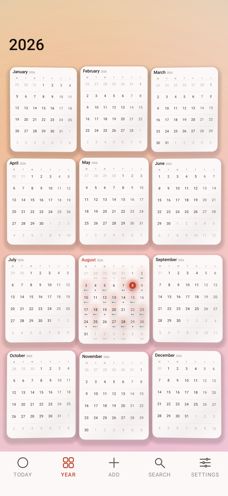
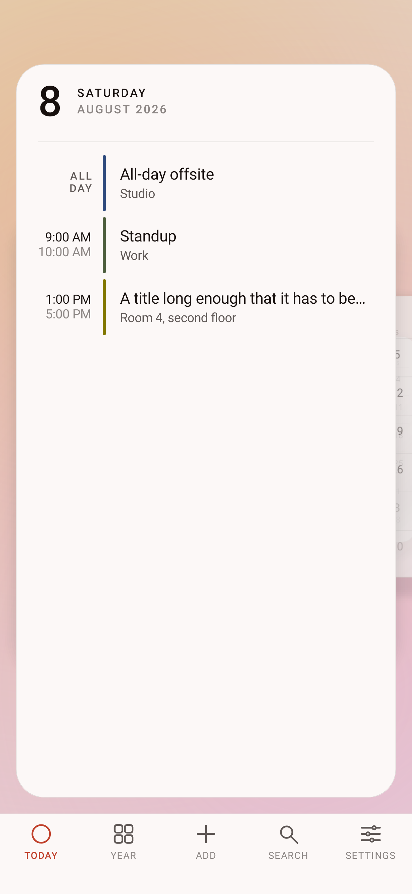
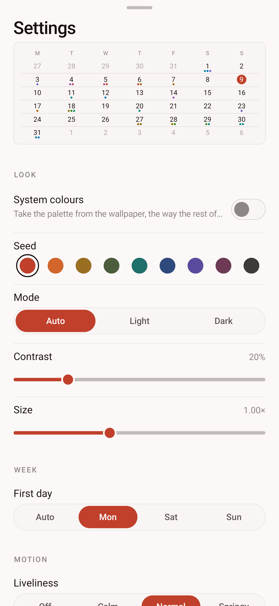
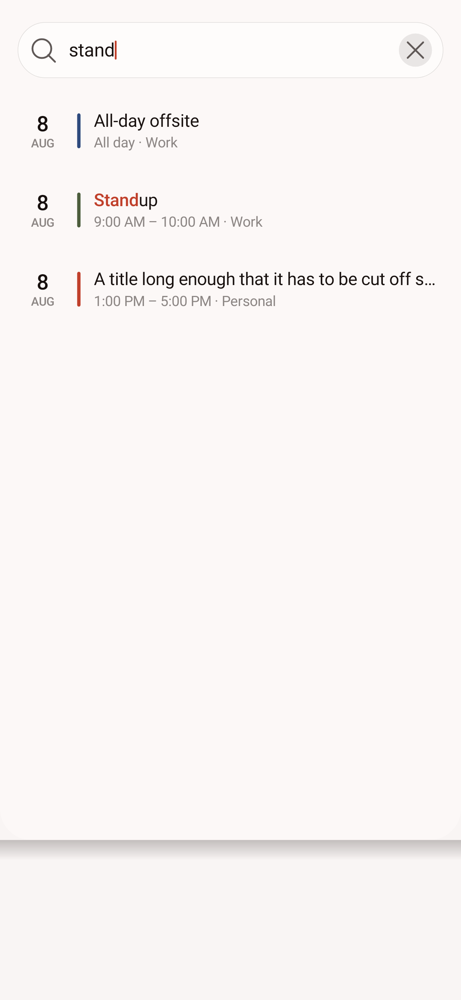
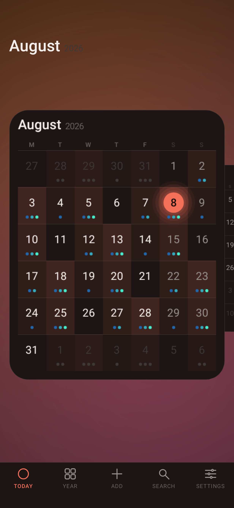
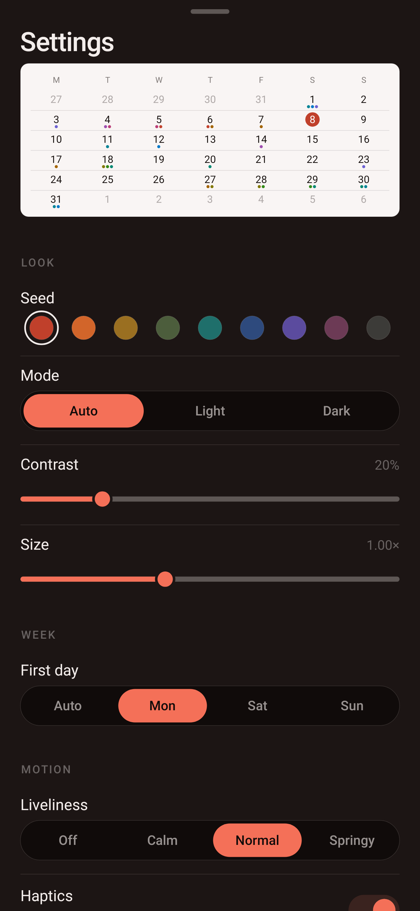
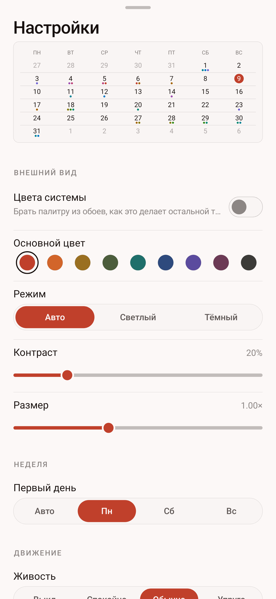
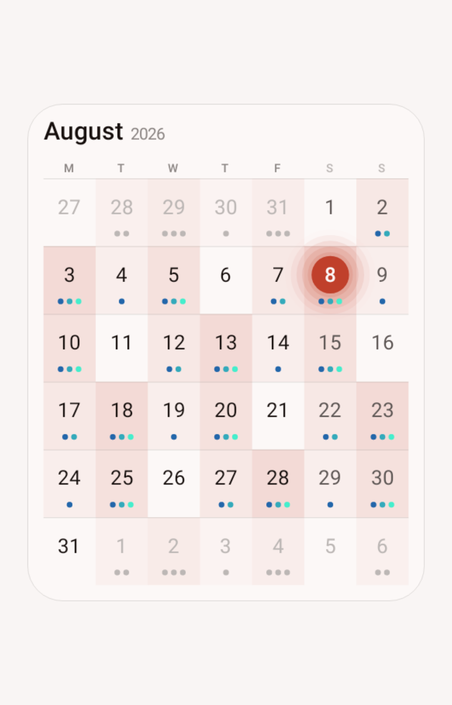

# Quire

An Android calendar in two halves that share nothing but their arithmetic: a home-screen widget
that holds perfectly still, and an app that is a place you fly through.

Nothing in the app is a platform widget, a platform animator, or a platform gesture detector.
Every pixel is drawn on a Canvas and every moving value is integrated by an engine in this
repository. That is not a stunt — the reason is at [Why none of it is the
platform's](#why-none-of-it-is-the-platforms), and it is the whole point of the rewrite.

**Install:** [`dist/quire-3.2.apk`](dist/quire-3.2.apk) · 748 KB · Android 8.0+ (minSdk 26,
targetSdk 35) · `sha256 1970cf1467581551eefd4fc7b561344c8d08326135ec85f8e19b14f1504aa5a4`

Copy it to the phone and open it, or `adb install -r dist/quire-3.2.apk`. You will need to allow
installing from an unknown source once — the APK is signed with the self-signed key in
`keystore/`, not by a store.

| Month | Year | Day | Settings | Search |
|---|---|---|---|---|
|  |  |  |  |  |

| Month, ink | Settings, ink | Settings, Russian | The plate itself |
|---|---|---|---|
|  |  |  |  |

Every image is a real render of the shipping code, produced by the test suite — not a mockup.

---

## The app is a corridor

There are no screens and no navigation. Months are plates standing in a corridor that recedes
from you, and the whole interface is two numbers:

```
travel     ── a fractional month index: where the camera stands, and where on the wall it looks
distance   ── 1: one month fills the view        12: the whole year, three across and four down
```

Pulling back with two fingers does not switch to a year view. The same twelve plates are placed
by the same function, blended between two layouts, so a pinch stopped halfway is a real position
rather than an animation caught between two states — the months fly out of the corridor and into
their cells on a wave that starts at the one you were reading. Choosing a day lifts its tile out
of the plate it was drawn on and opens it into the day panel.

The year is a whole calendar year, January to December, every date legible at once — and it is
still a scene rather than a page: the twelve cards stand on a gently curved wall, each turned a
little towards the eye, each with its own shadow, and the wall answers the tilt of the phone.

**Moving through it**

- **Drag** sideways to travel. One screen is one month down the corridor, and a year once the
  wall is under your finger.
- **Pinch** to move along the distance continuously; **double-tap** to jump a level. Both land on
  whatever your fingers were over.
- **Tap** a month to enter it, a day to open it, an entry to hand it to your calendar app.
- **Long-press a day** to start a new event on it.
- **Back** steps out one level — the day into its month, the month into its year — before it
  leaves the app.

**The bar is deliberately ordinary.** Today, Year, Add, Search, Settings sit in a fixed row at
the bottom, icon over label, exactly where the thumb expects them. Everything above it is
bespoke; the bar is not, on purpose — a gesture that has to be learned belongs anywhere but the
one control you reach for without looking.

## The engines

Seventeen files under [`app/quire/engine/`](app/src/main/java/app/quire/engine), about 3,300
lines, and nothing in them knows what a calendar is.

| | |
|---|---|
| **math** | `Vec3`, `Mat4` — column-major, allocation-free, with `perspective` and `lookAt` |
| **scene** | `Camera3D`, `Quad3D` — a quad projects its four corners and hands back a `Matrix` via `setPolyToPoly`, so a flat drawing lands on a plane in space in one `drawBitmap` |
| **anim** | `Clock` (one Choreographer loop for the whole app), `Spring`, `Decay`, `Track`, `Timeline`, `MotionProfile` |
| **input** | `GestureEngine` — its own tap, double-tap, long-press, drag, fling and pinch recognition, with its own velocity fit; `Tilt`, gravity smoothed |
| **fx** | `Particles` (struct-of-arrays), `Glow` (stacked rings, no mask filter), `Noise`, `Shaders` (AGSL where the device has it, hand-drawn where it does not) |
| **design** | `Oklch` — perceptual colour, gamut-mapped; `Theme` — a whole palette walked out of one seed; `Metrics` — every size from one density and one user scale |
| **state** | `Signal`, `Store` — observation that skips a rebuild when the value did not really change |

**The palette is one number.** `Theme(seed, dark, contrastBoost)` derives fifteen colours by
walking lightness in Oklch until each pair actually clears its contrast target — measured on the
real eight-bit colours, because chroma pulled in to fit the gamut moves luminance too. The worst
ink-on-canvas pair measures 16.9:1; the worst text-on-accent pair 4.5:1. Move the *Seed* slider
and everything from the today disc to the settings pills follows, still legible.

## Why none of it is the platform's

`ValueAnimator` and `ViewPropertyAnimator` are both scaled by
`Settings.Global.ANIMATOR_DURATION_SCALE`. On a phone with system animations turned down — a
common tweak, and what battery saver does by itself — every one of them completes instantly.
An earlier version of this app used them, and on such a phone the entire interface stood still.

Motion here *is* the interface rather than decoration on it, so nothing in the app may depend on
a setting outside it. Every moving value is a spring integrated at a 4 ms substep from a
nanosecond clock. Liveliness runs from **Off** to **Springy** and the app's own setting is the
authority; the system's animator scale only chooses the value on first launch.

The same reasoning rules out `GestureDetector`, `VelocityTracker` and the platform widgets: a
drawn control can be given a spring, and a `Switch` cannot.

**A spring, not a curve.** A duration-and-easing animation restarts from zero when its target
changes mid-flight, which is exactly what a flick between months does. A spring carries its
velocity across the change, so an interrupted gesture continues instead of snapping.

## What it does

**The app**

- The month corridor, the year wall and the day panel, all as one continuous position.
- The day panel grows out of the square you tapped and carries the day's entries: time in
  tabular figures, a rule in the calendar's colour, title, place. It scrolls with real inertia
  and rubber-bands at both ends.
- **Search** across eight months either way, live as you type, straight into the day it found,
  with the matched text picked out in the accent.
- **Settings** are one drawn sheet with a live month at the top that answers every change as it
  is made — the point of a setting called *Seed* is easier to see than to read. Pills travel,
  switches spring, sliders keep the velocity your finger let go at, rows arrive on a stagger.
- **Density** tints each square by how full the day is — a soft warmth that pools where a run of
  busy days meets, rather than a row of coloured pills. **Depth** answers the tilt of the phone.
- Creating and opening events hands off to whatever calendar app is installed. Quire never
  writes to your calendar and asks only for read access.

**Light is the one thing that is never baked.** A plate is rasterised once and thereafter costs a
single `drawBitmap`, but its shadow, the sheen sliding across it as it turns, and the bloom on
today all answer where the plate is *standing* rather than what is written on it. So they are
drawn over the picture from the projected quad — and because they are pure functions of where the
quad ended up, a world that has stopped moving holds a still image and asks for no frames at all.

**The widget**

| Half width | Full width | Named entries |
|---|---|---|
|  |  |  |

- **Four skins.** *Paper* and *Ink* are the calendar as a printed page. *Colour* fills the card
  with the accent taken down to a deep ground, sets the dates in near-white on a lattice, and puts
  a filled add button in the header — a card that carries its own colour reads as an object on a
  wallpaper rather than a hole in it. Every value is walked in Oklch from the accent, so all six
  accents give a card of the same weight instead of one nearly black and another that glows. It is
  what a newly placed widget wears.
- **A day is named where there is room for a name, and dotted where there is not.** Given a column
  at least 44dp wide the filled card labels each day with its earliest entry, in that calendar's
  own colour. Seven columns of a half-width card are 25dp each, so there the dots say the same
  thing in the space available. The title costs no extra query — it was already in the one the
  marks are counted from.
- The full month, always six rows, so the geometry never shifts between months.
- Today is a filled disc in the accent. Days with something in them carry up to three dots,
  coloured by the calendar the event belongs to.
- `‹ ○ ›` in the header: previous month, back to this month, next month, without opening the app.
  It returns to the current month by itself at midnight.
- Sizes from two cells to the full width of the screen. Two cells on the usual four-column
  launcher is exactly half the width; below 200dp the card tightens its own padding, drops the
  year and shrinks the header controls rather than clipping them.
- Repaints at midnight, on timezone or locale change, and within seconds of anything being
  written to the calendar — a JobScheduler content trigger, not polling.
- Configured per placement: two widgets can run different skins and accents side by side. That
  is why the widget keeps its own six fixed accents while the app derives its palette from a
  seed: two placements are configured independently of each other and of the app, so there is
  nothing for them to share.

No account, no network permission, no analytics. The only permission requested is
`READ_CALENDAR`, and the grid still works without it.


The launcher icon is the same two moves as the grid and nothing else: three week rules and one
marked day.

## Layout of the source

```
engine/   math scene anim input fx design state — no calendar anywhere in it
world/    MonthPlate  a month baked to a bitmap, pasted onto a plane
          WorldView   the scene: travel, distance, the corridor and the year wall
          Ambience    the driven background, answering travel and depth rather than a clock
          DayPanel    the opened day        Hud       the fixed foreground
          SettingsPanel  SearchPanel  Notice          OverlayView  the sheets above the world
          WorldActivity  the only Activity of the app half
core/     MonthModel (grid maths, julian days)   EventRepository (provider, search)
          MonthLoader (off-thread, cached)       Prefs   Tokens (the widget's palette)
widget/   WidgetRenderer  MonthWidgetProvider  WidgetConfigActivity
          MidnightScheduler  CalendarWatchService
ui/       what is left: the widget's configuration screen, and nothing the app half uses
tools/    generate_assets.py — launcher icon and widget picker preview
```

Five things worth knowing before editing:

- **A view that is only measured and laid out never gets a frame.** The world subscribes to
  `Clock` in `onAttachedToWindow`, so a render test has to host it in a real window or every
  spring stays at the value it was seeded with.
- **A `RuntimeShader` is a GPU program.** Handing one to a software canvas throws rather than
  degrading, so the AGSL background is gated on `canvas.isHardwareAccelerated`, not only on the
  API level.
- **`TextUtils.ellipsize` is a no-op under Robolectric.** It measures correctly and truncates
  nothing, so a title that overflowed would look fine in a render and be cut on a real phone.
  Truncation here is written out with `breakText`.
- **RemoteViews will not inflate a bare `<View>`.** The host's inflater rejects any class not
  annotated `@RemoteView`, at runtime, with no compile-time warning. Hairlines inside widget
  layouts are therefore `FrameLayout`s.
- **The widget's week rows are built at runtime** with `RemoteViews.addView`, so each row and
  cell is its own `RemoteViews` and duplicate ids across siblings are fine. That is what lets
  all 42 squares carry a tap target.

## Building

Needs JDK 17+ and an Android SDK with platform 35 and build-tools 35.0.0.

```bash
echo "sdk.dir=$ANDROID_HOME" > local.properties
gradle assembleRelease          # dist-ready APK, signed with keystore/
gradle assembleDebug            # installs alongside it (.debug suffix)
gradle testDebugUnitTest        # writes app/build/screenshots/*.png
gradle lintRelease              # must stay at 0 errors
python3 tools/generate_assets.py   # after editing the icon or picker preview
```

There is no emulator in this project's development environment, so **the tests are how the
interface is looked at**. They run on Robolectric with native graphics and write real PNGs: the
world at each of its three levels in both skins, the month plate, the day panel, the settings and
search sheets, the same sheets in Russian — because Cyrillic labels are longer than their English
originals almost everywhere, and that is when a hand-drawn row runs out of width — the launcher
icon inside its mask, and the widget through `RemoteViews.apply`. Look in
`app/build/screenshots/` after a run to see what the current code actually draws.

Every visual bug found during this rewrite was found by reading those PNGs — a today marker drawn
twice, a title that ran off the edge, a HUD title landing on the day panel's own header. Two more
came from writing the tests rather than from running them:

- **A sheet asked for frames forever.** The overlay returned "still moving" for as long as
  anything was open, and the search field claimed a frame for a caret it had been told not to
  blink. Both would have kept a core busy at sixty frames a second for as long as settings or
  search were on screen — under Liveliness → Off, which exists to make things stand still. They
  surfaced because a Robolectric test that idles the looper never returns against a view that
  never stops asking.
- **`lintRelease` is not optional.** `assembleRelease` runs `lintVitalRelease`, which passed a
  call to `BitmapShader.setFilterMode` guarded at API 31 when it needs 33 — a `NoSuchMethodError`
  on every Android 12 device, caught only by the full lint.

## Signing

`keystore/quire.p12` and its password in `keystore.properties` are committed on purpose:
rebuilding with a different key produces an APK that cannot install over the one you already
have, and this is a personal build with no store account behind it. It is a throwaway self-signed
key and should be replaced before this is published anywhere. Delete `keystore.properties` and
the release build falls back to the debug key.
