# Quire

Two Android apps out of one source tree — a calendar and a weather app, each with a home-screen
card. Both are built entirely from Material 3 Expressive; the widgets cannot be, because a widget
is `RemoteViews` and `RemoteViews` is not Compose.

They install and update independently, and — the part that matters — they are permissioned
independently. **The calendar asks for `READ_CALENDAR` and nothing else: no location, no network,
no account.** A calendar carrying a location permission because it happens to also show the
weather is asking for something it does not need, and separate applications are the only
arrangement in which it does not. What they share is a source tree, not a process: the Oklch
palette, the Material theme and the card surface are the same code, so the two widgets sitting
next to each other on a home screen are plainly the same object at two jobs.

The app half was rebuilt from nothing for Android 17. It has no components of its own: the app
bar, the navigation bar, the search field, the list rows, the switches and the segmented buttons
are Material's, so the calendar answers the wallpaper's colour scheme, the system font scale and
every accessibility setting without holding an opinion about any of them. What survived the
rewrite is the part that reads your calendar — the grid arithmetic, the provider queries and the
off-thread loader — because that part had tests and had been debugged against a real provider.

**Install** — Android 8.0+ (minSdk 26, targetSdk 37 — Android 17), either or both:

| | | |
|---|---|---|
| **Calendar** | [`dist/quire-calendar-7.2.apk`](dist/quire-calendar-7.2.apk) · 1.9 MB | `sha256 04b0149c9fe0a5b01b41ffc8118753d8d6b3f0fe0f0f01e76014ab7e5dbec369` |
| **Weather** | [`dist/quire-weather-7.2.apk`](dist/quire-weather-7.2.apk) · 1.5 MB | `sha256 b3fcdb9b53aa19e3765814cd769cd28e89c799ec42a7a15827dee0ab864ff955` |

Copy one to the phone and open it, or `adb install -r dist/quire-calendar-7.2.apk`. You will need
to allow installing from an unknown source once — the APKs are signed with the self-signed key in
`keystore/`, not by a store.

| Month | Month, dark | Year | Settings | Search |
|---|---|---|---|---|
|  |  |  |  |  |

| An entry, in full | The actions | Year to month, part way through |
|---|---|---|
| 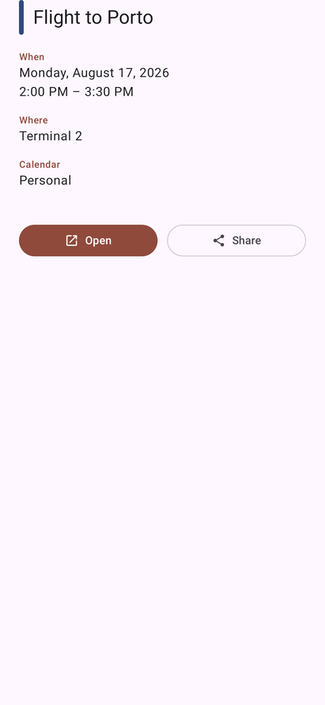 | 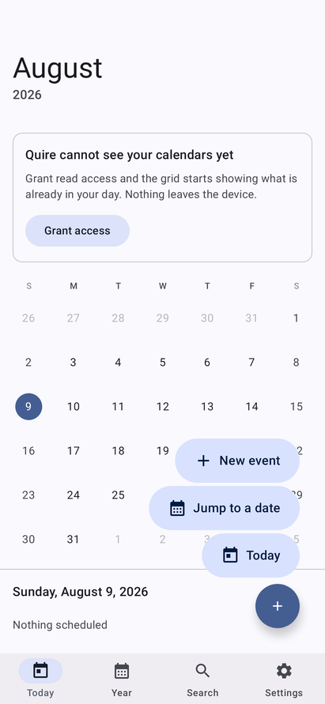 | 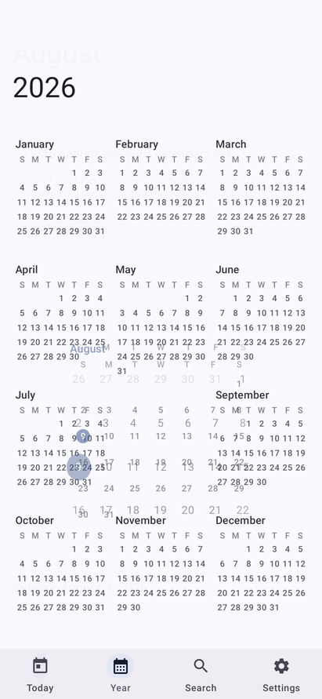 |

Every image is a real render of the shipping code, produced by the test suite — not a mockup.

---

## The calendar app

Four destinations in a `ShortNavigationBar`, which is the Expressive one: a shorter band, and a
selection pill that grows around the icon on the theme's own spring.

- **Today** — the month, swiped through a pager, with the selected day's entries underneath.
  Tapping Today again while you are already there returns to today rather than doing nothing.
  Pull down to ask the provider again.
- **Year** — all twelve months at once, three across and four down, every date legible. The tiles
  take whatever height the page has, so a year fills its screen instead of ending half way down.
- **Search** — `AppBarWithSearch`, so the field *is* the app bar rather than a box floating over
  one. Results filter as you type and open the day they were found in.
- **Settings** — everything the app can be told.

The month grid is six rows whatever the month, so the geometry never shifts underneath a swipe.
Today is a filled `primary` disc, a selection elsewhere the quieter `secondaryContainer` one, and
marks take each event's own calendar colour. Those are Material roles rather than colours, which
is what makes the whole grid follow the wallpaper on Android 12 and up.

**Colour comes from the device.** From Android 12 the platform derives a full Material scheme from
the wallpaper; `dynamicLightColorScheme` hands it over as the roles, and the app wears it. That is
what *System colours* switches, and turning it off falls back to a fixed cinnabar scheme. Motion is
`MotionScheme.expressive()` — springs with a little overshoot — rather than the standard one.

**Light and dark follow the system**, which took two fixes to actually be true. `MODE_NIGHT_AUTO`
is not "follow the system" — it is "switch by the time of day", a different thing and the wrong
one, and setting it took a phone that was light at ten at night and made the app dark anyway;
following the system means saying nothing and letting the configuration through. And the filled
card was pinned dark on the reasoning that a card carrying its own colour is an object rather than
a page — but an object on a home screen that stays night-black through a bright morning is not an
object, it is a widget that forgot to look. It has a daylight face now: the same hue, the same
layout, at the other end of the lightness axis.

**Settings are grouped, not listed.** Android's own settings from 16 onwards draw a run of related
rows as one connected block, outer corners rounded and inner ones squared off, which is what
`ListItemDefaults.segmentedShapes` computes from a row's position. Each row is a toggleable
`SegmentedListItem`, so the whole row is the switch — a screen reader announces one control rather
than a label and a separate widget it cannot connect to it.

**The month is a card, and so is every entry under it.** Both used to be ink straight on the
page, with a full-width rule between them — which is how a list separates two of its own rows, not
how a page separates two different things. Cards say it by being objects: the grid has edges, the
entries have edges, and the tap target for an entry is visibly the whole of it rather than the
text you happen to hit. The year's twelve tiles are the same card, so the container transform
between a tile and the month it opens grows a card into a card instead of a rectangle out of
nothing, and the current month wears a `secondaryContainer` wash so a year is not twelve
identical blocks. All of them are flat: twelve resting shadows are twelve extra layers to
compose, and they are all being animated at once during that transform, which is where the year
showed it.

**A year has to fit on a screen**, or it is a list of months with extra steps. Two things stopped
it fitting on a real phone. The large app bar spends about a fifth of the screen on four digits,
which the month view can afford and this one cannot — the year gets the compact bar, and only the
year. And the day numbers were `labelSmall` at whatever scale the system asked for: a cell in the
year is a seventh of a third of a screen, sixteen points, and two digits are wider than that
before the font scale is touched at all. Turned up, they ran together — "12131415161718".

The type in a tile is now sized from the tile, in pixels, and converted back through the current
scale, so what is drawn is pinned to the space there is. It is capped at the style's own size, so
this can only make the year smaller than the theme asked for and never larger, and the month a tap
away honours the scale in full. The test measures it without knowing any of the layout constants:
it groups every day number into rows, takes the smallest gap between two neighbours' centres as
the column width, and fails if the widest number anywhere does not fit inside it.

| A year at one and a half times the type |
|---|
| 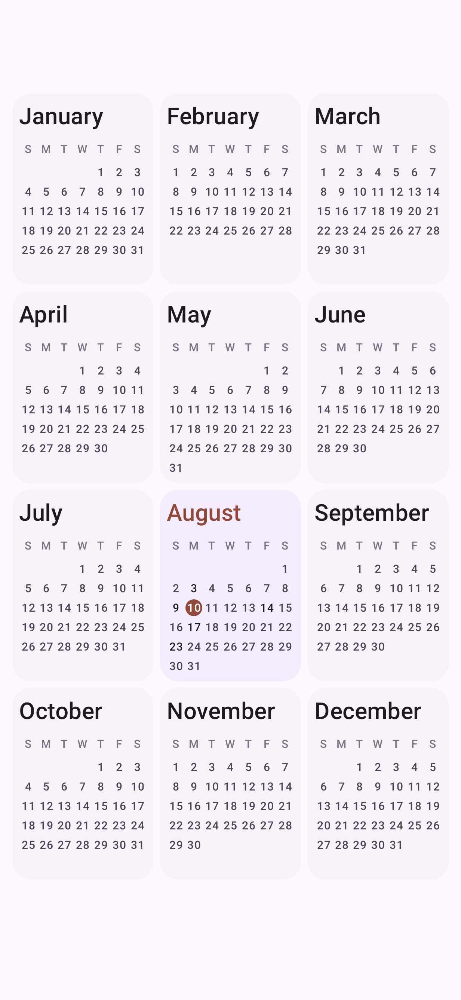 |

**Nothing to show is drawn rather than written.** An empty day, a search with nothing typed and a
search with no matches each get the outline of the thing that is missing, centred, with one line
under it — instead of a sentence hung on the left margin of an otherwise blank page.

**Density** tints each square by how full the day is, using the surface stepping up rather than a
colour of its own, so a busy day reads as raised paper instead of a stain.

**Today is read against the clock, not off it.** A calendar's real question is "what is next",
and a column of times leaves that arithmetic to the reader. So the entry under way wears a filled
*Now*, the next one says how soon in the units the decision is made in — minutes under an hour,
hours over one — and one that has finished steps back to a little over half strength. It stays in
the list: a day you can no longer see the start of is a day that has been edited behind your back.
The clock is read once a minute rather than once per composition, because "in 40 min" that was
true when the screen opened and has said so ever since is worse than no figure at all. The day's
heading carries the count, so a day has a shape before any of it is read.

| Today, against the clock |
|---|
| 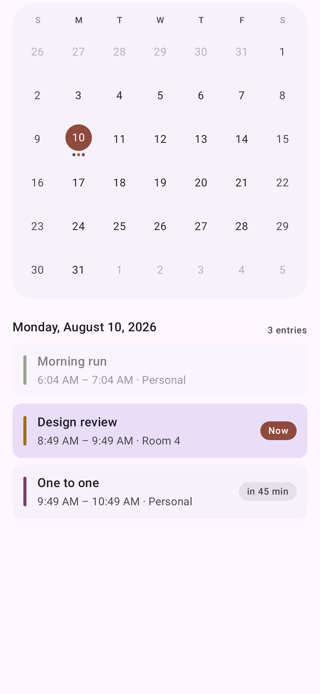 |

**Hold a day to put something in it.** A calendar's second verb after "look at this day" is "put
something in this day", and the button at the bottom of the screen always means today — reaching a
Thursday three weeks out took a tap, a scroll and a date picker to say what the finger was already
resting on.

**An entry opens where it is**, in a sheet with the whole of it laid out — when, where, which
calendar — rather than by throwing you into another app to read a room number. Opening it properly
and passing it on are both still there as buttons; sharing sends it as text, because the receiver
is as likely to be a chat as a calendar.

**The button is a menu.** `FloatingActionButtonMenu` opens into the three things worth doing from
a month — a new event, a jump to any date through Material's own date picker, and back to today —
and the plus turns into a close as it opens, driven by the toggle's own progress rather than
swapped half way.

Creating and opening events hands off to whatever calendar app is installed. Quire never writes to
your calendar and asks only for read access.

## Motion

Every animation takes its spec from `MaterialTheme.motionScheme` rather than from a duration
written here, which is what keeps them one family: *spatial* springs for anything that moves or
changes size, and they overshoot slightly; *effects* springs for anything that only fades or
changes colour, and they do not — a colour that overshoots is a colour that goes somewhere it was
never asked to be.

- **Between destinations**, Material's fade-through: the outgoing screen fades, the incoming one
  fades and grows the last tenth of its size. Nothing slides, because the four destinations are
  siblings rather than a stack.
- **Between the year and a month**, a container transform instead. They are the same twelve months
  at two sizes, so a `SharedTransitionLayout` keyed by month means the tile you tapped keeps its
  place on screen and grows into the grid — and the grid shrinks back into its tile on the way
  out. Only the settled pager page may claim those bounds; a page still sliding past has no
  business growing into anything.
- **Between days**, a shared axis: the agenda travels the way the date did, later to the left,
  earlier to the right. The day is handed to the transition as one value, so the copy on its way
  out keeps showing its own entries instead of being repainted with the new day's half way
  through.
- **The title** rolls in the direction the months moved — up for a later month, down for an
  earlier one. It has to be told which way that is, because "August" is not after "July" in any
  ordering a string knows about.
- **The month you are swiping away** sinks and fades a little as it goes, driven by the pager's
  own offset, so a half-finished swipe reads as one month passing behind another rather than two
  grids sliding on the same plane.
- **Today's disc and a selection** grow into the cell that was tapped instead of appearing in it,
  and the marks under a date grow in when the month's events arrive — a frame or two after the
  grid itself, which without this reads as a glitch.
- **Back** returns to the month before it leaves the app, and it does it under the finger:
  `PredictiveBackHandler` drives the screen's own retreat from the gesture's progress, so a back
  you change your mind about springs back rather than committing.
- **While a day is being fetched**, the expressive `LoadingIndicator` — the shape-morphing one —
  rather than the sentence "nothing scheduled", which was what an unasked-for day used to claim
  for the frame before its entries arrived.
- **Under the finger**, a day sinks while it is held and springs back on release, because a day is
  a small target with no edges of its own and the ripple alone is easy to miss. Picking one ticks,
  and so does a swipe that carries to the next month — which is the only thing that tells it apart
  from one that sprang back to where it started.

## The weather app

A separate application, `app.quire.weather`, with its own icon and its own permissions.

**The next twenty-four hours, as a shape.** A five-day forecast tells you what kind of week it is;
the hourly strip tells you whether to leave now. Each temperature rides its own point on a curve
rather than sitting in a row of numbers above one — a flat row over a line is two things to read,
and the whole reason to draw a curve is that the shape should be readable without reading
anything.

**Where the day is.** Sunrise and sunset as a pair of numbers are something to subtract in your
head; drawn as an arc with the sun on it, "how much daylight is left" is a glance, which is the
only question anybody actually asks of a sunset time. The arc is a plain half-circle rather than
the true solar path: the true one depends on latitude and season and would be a different shape
every day, which is precision nobody wants at the cost of a picture nobody recognises.

**There is a sky behind it.** A wash of the theme's own container colour over the top of the page,
gone by the time the hour strip starts — warm while the sun is up, cool once it is down. It is the
one thing on the screen that says which of those it is without spelling it out, and it gives the
temperature something to sit on other than flat paper.

It runs from the top of the window, behind the app bar, which is transparent over the forecast for
exactly that reason. Starting it under the bar instead — and leaving the bar opaque — drew one hard
horizontal line across the full width of the screen with a square corner at each end: the only
edge on a page otherwise made entirely of rounded cards, and the thing that made the colour look
stuck on rather than behind. The test walks down the left margin and fails on any step between
neighbouring rows, because a step is exactly what a hard edge is; with the opaque bar it reports
"the sky steps by 22 at row 456".

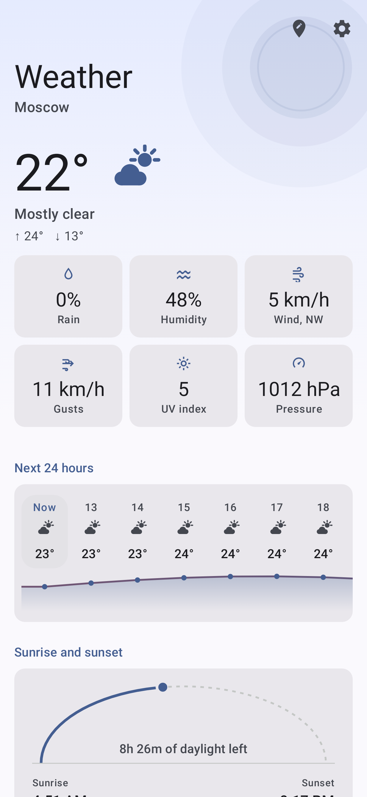

**Six readings, and none of them invented.** The chance of rain, the humidity, the wind and the
quarter it blows from, the gusts, the peak UV index and the pressure — in a grid of cards three
across. A reading the provider did not send is left out entirely rather than shown as a dash,
because a card that says "—" is a card spent saying nothing. The wind's quarter goes in the label
rather than the value: it is what kind of wind this is, not how much of it there is. Pressure is
offered in hectopascals or millimetres of mercury, chosen rather than inferred from the locale —
plenty of people read millimetres in a country that publishes hectopascals, and the other way
round.

**And the readings the card has no room for** — the chance of rain, the humidity, the wind — plus
five days each with a bar showing where its swing sits inside the week's, which is the part a list
of numbers cannot do.

| The app | The same, in daylight | Settings | Four by two |
|---|---|---|---|
| 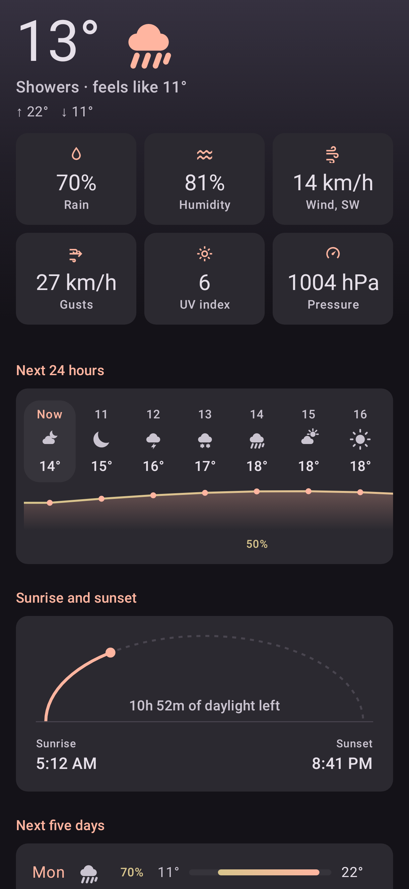 | 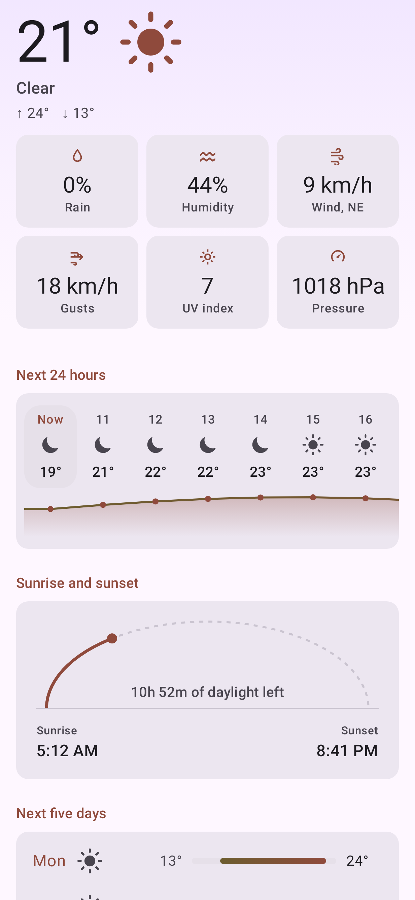 | 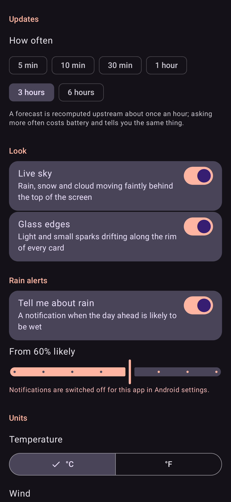 | 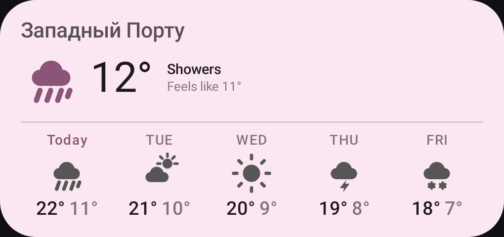 |

**One left edge.** Every block on the screen — the temperature, each section heading, and all four
cards — starts at the same x, from one constant rather than from a number typed at each call site.
That is not a detail: the screen before this one had the headings inset 24dp and the cards under
them 16dp, so each heading hung eight points left of the thing it named, the whole way down. The
render test measures it, walking in from the margin on a row through the middle of each card and
failing if the four disagree by more than a pixel, because that is the kind of fault that comes
back the moment somebody adds a block and types a number.

**The hourly numbers sit on one line.** They used to ride the curve, each label just above its
own point, on the argument that a number and its place on the line should be the same place on
screen. On a real afternoon that is wrong: a stretch of weather that changes by a degree an hour
moves each label three points, so the row comes out neither aligned nor visibly stepped — it reads
as badly set type rather than as data. And wherever the line happened to sit, the rest of the band
was empty, so every screenful carried a dead strip along its top or its bottom. The numbers are a
row now and the curve runs under them as a short filled band, which is the one thing a row of
numbers cannot say: where the afternoon peaks and how sharply the evening falls off.

That curve is **one path across the whole strip**, not a slice drawn inside each column. Two
translucent shapes that share an edge do not add up to one shape — each edge is antialiased
against what is behind it, so the seam comes out lighter than either side, and the first version
of the fill had a row of notches along its foot, one per hour. The fill fades to its own colour at
zero alpha rather than to `Color.Transparent`, because transparent is black and a gradient run in
non-premultiplied sRGB walks the hue towards it on the way down.

Three more things were crooked for reasons worth naming. The sun's arc put its apex at a fixed
fraction of the card's width, which is a half-circle at exactly one width: on a phone it wanted to
be a hundred points tall inside a seventy-point box, so its whole middle was clipped away and what
was left looked like two stubs in the corners. It now puts the apex where the box ends. The hourly
strip gave every column a line for a chance of rain and wrote a blank into it on dry hours, which
opened a dead band across the strip on exactly the days nothing was happening; the line is now
decided once for the whole strip. And the five-day rows wrote "—" where a day had no rain, which
in a column of percentages does not read as "none" — it reads as a stray minus sign. The column
keeps its width and writes nothing.

The six refresh intervals were a segmented row of six, which on a phone leaves about fifty points
each and cut "1 hour", "3 hours" and "6 hours" down to "1", "3" and "6" — three settings nobody
could tell apart, with the unit dropped from precisely the options that needed it. They are chips
now, and chips wrap instead of shrinking.

The card was built by looking at the one it sits next to. Google's weather widget spends a
four-by-two placement on one temperature, a place name truncated to "Западный адм…", a "feels
like" truncated to nothing, and says not one word about tomorrow. This one puts the place, the
temperature, the sky, the feels-like **and five days** in the same space — because five days are
the reason to look at a weather widget rather than at a thermometer.

Fitting that in is a question of what gets measured first. The strip is dealt its share of the
height before anything else, and the "now" row is sized from what is left; sizing the temperature
first is exactly what produces a card with a huge number and no forecast. As the card shrinks,
things leave in order rather than being clipped: below 172dp the sky and the feels-like go and the
number takes their width, below 46dp per column the low goes and the high stays, and below 128dp
tall the strip goes entirely and the card becomes an honest "now".

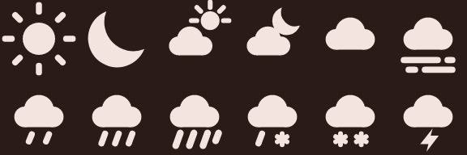

The sun and the moon sit clear of the cloud rather than behind it. Overlapped, the two shapes
merged into one blob at the twenty-two points a strip draws them at, which is what "primitive"
looks like from arm's length; separated, both are still legible at half that. Only the five rays
pointing away from the cloud are drawn — the three that would point into it are the ones that made
the blob, and a sun is recognisable from an arc of rays without the full eight.

The twelve glyphs are drawn here, on Material's 24dp grid, as XML vectors — so the widget and the
app show the same picture rather than two versions of it, since `RemoteViews` cannot use Compose's
icons. WMO's weather codes distinguish things a person standing outside does not (light, moderate
and dense drizzle are three codes and one picture), so they are folded into eleven states, each
with a day and a night face where that matters.

**Where, without being followed.** There are two ways to answer "where", and the app works with
either: name a place, or let the device say. Naming one needs no permission at all, which is why
it is offered first rather than buried under a refusal — an app that only works if you hand over a
location has not really left the choice open. A named place then outranks the device: somebody who
typed Berlin while sitting in Munich meant Berlin, and a location fix arriving afterwards is not
new information about what they wanted.

**Where the numbers come from.** Open-Meteo, because it needs no account and no key: an app that
asks somebody to register for an API key before it can tell them whether to take a coat has
already failed. Nothing leaves the device but a latitude and a longitude rounded to two decimal
places — about a kilometre, which is finer than the weather and coarser than a person, and there
is a test asserting it rather than a sentence claiming it. Location, when it is used at all, is
coarse and last-known rather than a live fix: waking the GPS to find out if it is raining would
cost more than it could buy.

**What it can be told.** How often to refresh, from 5 minutes to 6 hours. The default is an hour,
because that is roughly how often the forecast is recomputed upstream and asking twice as often
gets the same answer twice — but the short intervals are offered anyway, since somebody watching a
storm come in has a reason. They need a different mechanism: `JobScheduler` will not run periodic
work more often than every 15 minutes and, below that, does not refuse but silently *clamps*, so
an app offering 5 minutes and getting 15 would be lying to the person who chose it. Under the
floor the refresh is an inexact alarm instead, re-armed on each firing — about right while the
phone is in use, deferred by Doze once it has been idle a while, and the setting says so rather
than leaving it to be discovered. The age at which a stored forecast is worth replacing follows
the same setting; leaving it at the old flat 45 minutes would have had nine ticks in ten fire and
then decline to fetch. Whether to say something when rain is likely, and from what
probability — one notification a day, for today, and never the same day twice, which is the only
part of an hourly job that needs writing down. And units: °C or °F, km/h or m/s or mph, applied
where the number is written rather than where it is fetched, so switching one changes the card you
are already looking at instead of the one that arrives in an hour.

**A taller card buys a line, and spends it on rain.** Given a row more height than the four-by-two
it was designed for, the strip writes each day's chance of precipitation under its temperatures —
but only if some day in it has a chance worth writing, and only if paying for the line still
leaves an icon worth looking at. A row of blanks on a dry week is a line spent saying nothing, and
an eleven-point icon is a smudge.

| Four by two | A row taller |
|---|---|
|  | 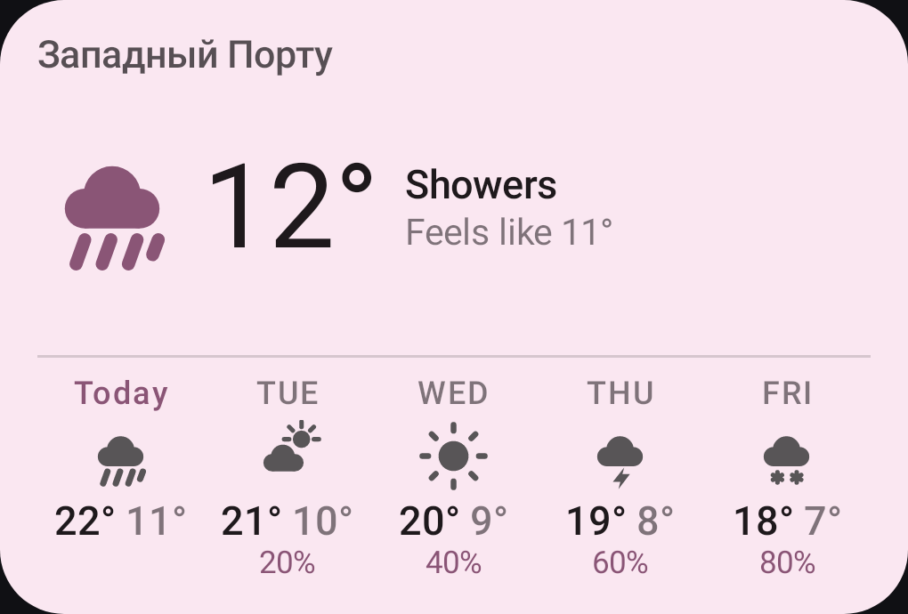 |

**A widget is a fixed rectangle.** It cannot scroll and it cannot grow, so type asked for in `sp`
against a budget kept in `dp` is arithmetic that stops being true the moment the phone's font
scale goes above one — which is how the chance of rain came back from a real home screen with its
bottom sliced off, and how "Сегодня" came back as "Сег…". Both cards now do their sizing through
the scale: the type is still asked for in `sp`, so a larger setting is honoured as far as it fits,
and where it would not fit the card keeps the layout and gives up the extra size rather than the
other way round. Whether the word "today" is written at all is decided by whether it fits, from
its own length at its own size — and where it does not, the short weekday stands in, which loses
nothing, because what actually marks today is that its column is in the accent colour.

The test reads it off the layout rather than the picture, and looks for both shapes of the fault:
a view placed past the edge of the one holding it, and — the one a widget actually produces,
because a `LinearLayout` with a fixed height hands the last child whatever is left — a view that
fits with text that does not. From outside, both are a number with its bottom cut off.

| At one and a third times the type |
|---|
| 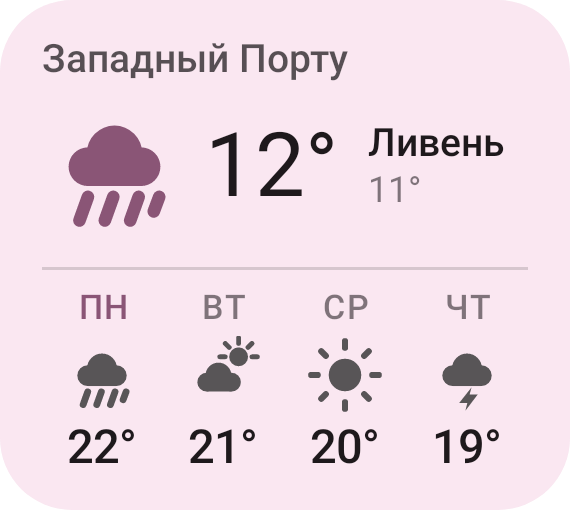 |

The forecast is fetched by an hourly job with a network requirement and stored; the card is always
painted from the store, never from a request, because a widget is repainted at moments nobody
chose and none of them are a good time to wait on a network.

## The calendar widget

| Half width | Full width | Named entries | Too small for a dot |
|---|---|---|---|
|  |  |  | 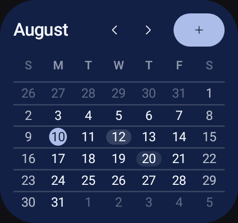 |

A widget is `RemoteViews`: inflated by the launcher, in the launcher's process, from a fixed set of
view classes. None of the app half applies here, so this half is drawn from XML layouts and a
palette computed in Oklch.

- **Four skins.** *Paper* and *Ink* are the calendar as a printed page. *Colour* fills the card
  with the accent taken down to a deep ground, sets the dates in near-white on a lattice, and puts
  a filled add button in the header — a card that carries its own colour reads as an object on a
  wallpaper rather than a hole in it. Every value is walked in Oklch from the accent, so all six
  accents give a card of the same weight instead of one nearly black and another that glows. It is
  what a newly placed widget wears, and with *System colours* on it takes the device's own scheme
  instead of a fixed accent.
- **A day is named where there is room for a name, and dotted where there is not.** Given a column
  at least 44dp wide the filled card labels each day with its earliest entry, in that calendar's
  own colour. Seven columns of a half-width card are 25dp each, so there the dots say the same
  thing in the space available. The title costs no extra query — it was already in the one the
  marks are counted from. Below the height where a dot fits, the day's own ground is tinted by
  how full it is instead — which is the bottom rung of the same ladder, and a size that used to
  say nothing whatever about which numbers mattered.
- **No lattice.** The filled card used to draw a hairline down every column to meet the rule under
  every week, and seven verticals crossing six horizontals is a spreadsheet. The verticals are
  gone: they said where the columns were, which the numbers already said, and the tint that
  replaced them says something the numbers cannot.
- The full month, always six rows, so the geometry never shifts between months.
- Today is a filled disc in the accent. Days with something in them carry up to three dots,
  coloured by the calendar the event belongs to.
- `‹ ○ ›` in the header: previous month, back to this month, next month, without opening the app.
  It returns to the current month by itself at midnight.
- Sizes from two cells to the full width of the screen. Two cells on the usual four-column
  launcher is exactly half the width; below 200dp the card tightens its own padding, drops the
  year and shrinks the header controls rather than clipping them.
- Repaints at midnight, on timezone or locale change, within seconds of anything being written to
  the calendar, and **when the phone's colours change** — all content triggers and alarms, no
  polling.
- Configured per placement: two widgets can run different skins and accents side by side. That is
  why the widget keeps its own six fixed accents rather than sharing the app's setting.

**Keeping up with the phone's theme** is the one thing a widget cannot be told about. A widget is
a picture the launcher holds on to, Quire bakes its colours into that picture, and nothing asks
for a new one when the user picks new wallpaper colours: `ACTION_CONFIGURATION_CHANGED` cannot be
delivered to a receiver declared in a manifest, and the wallpaper-changed broadcast has not been
sent since API 26. So the change is caught two ways, either of which is enough on its own — the
app process compares and repaints whenever it starts or is reconfigured, and the watch job also
wakes on the setting the theme picker writes, which is what reaches a widget whose app is not
running. The comparison is what keeps it cheap: every rotation and every launch arrives at the
same check, and a repaint is a cross-process query, so it only happens when the colours really
moved. The night mode is part of the comparison too — a widget following the system paints a
different half of the scheme when the phone goes dark.

The configuration screen the launcher shows is Compose like the rest of the app, and every change
in it repaints the real widget rather than a preview of one.

No account, no network permission, no analytics. The only permission requested is `READ_CALENDAR`,
and the grid still works without it.


The launcher icon is the same two moves as the grid and nothing else: three week rules and one
marked day.

## Layout of the source

```
src/main/     what both applications need and neither owns
  core/Tokens     the widget palette, walked in Oklch     core/Prefs
  m3/Theme        the Expressive theme                    m3/Locale  the observable locale
  engine/design/  Oklch (perceptual colour)  SystemScheme (the platform's Material roles)

src/calendar/ the calendar application
m3/       MainActivity   the whole app: scaffold, bars, destinations, the action menu
          Screens        month, year, search, settings
          Calendar       MonthGrid and MiniMonth — the only two drawn things left
          EventSheet     one entry in full, and the details on their own for the camera
          Rows           the settings row and its grouping
          CalendarModel  everything the screens read and everything they can ask for
core/     MonthModel (grid maths, julian days)   EventRepository (provider, search)
          MonthLoader (off-thread, cached)       Prefs   Tokens (the widget's palette)
widget/   WidgetRenderer  MonthWidgetProvider  WidgetConfigActivity
          MidnightScheduler  CalendarWatchService

src/weather/  the weather application
weather/  Forecast  Sky (WMO codes folded to eleven pictures)
          WeatherRepository (Open-Meteo, parsing separable from fetching)
          WeatherStore (what the card paints from)  Whereabouts (coarse, last-known)
          WeatherRefresh (the periodic job)  WeatherWidgetProvider  WeatherWidgetRenderer
          PlaceSearch (naming a place)  WeatherSettings  RainAlert
          ui/WeatherActivity  ui/WeatherScreen  ui/WeatherSettingsScreen
          ui/PlaceSheet  ui/WeatherModel
tools/    generate_assets.py — launcher icon and widget picker preview
```

`engine/` is what is left of a much larger set of hand-written engines the app used to be built
from. Only the two files the widget still needs survived: the widget cannot use Compose, so it
cannot use Material's colour system either, and it computes its palette itself.

Four things worth knowing before editing:

- **`Locale.getDefault()` in a composable is a bug.** It is a plain global, so a composable that
  reads it keeps whatever it saw first and a language change leaves month names in the old one.
  Lint catches it; `rememberLocale()` is the way through.
- **RemoteViews will not inflate a bare `<View>`.** The host's inflater rejects any class not
  annotated `@RemoteView`, at runtime, with no compile-time warning. Hairlines inside widget
  layouts are therefore `FrameLayout`s.
- **The widget's week rows are built at runtime** with `RemoteViews.addView`, so each row and cell
  is its own `RemoteViews` and duplicate ids across siblings are fine. That is what lets all 42
  squares carry a tap target.
- **`TextUtils.ellipsize` is a no-op under Robolectric.** It measures correctly and truncates
  nothing, so a widget title that overflowed would look fine in a render and be cut on a real
  phone. Truncation there is written out with `breakText`.
- **An animation that never ends will hang the test that waits for one.** `waitForIdle` on an
  automatic clock waits for animations to finish, and the loading indicator's does not. The
  screen tests drive `mainClock` by hand for that reason; the raw Robolectric ones use `idleFor`,
  because `idle` alone runs what is already due and the Choreographer's next frame never is.

## Building

Needs JDK 17+. Needs the Android 17 platform (`platforms;android-37.1`) and build-tools 37. The
Gradle wrapper pins the toolchain, so use it rather than a system Gradle:

```bash
echo "sdk.dir=$ANDROID_HOME" > local.properties
./gradlew assembleCalendarRelease assembleWeatherRelease   # the two dist-ready APKs
./gradlew assembleCalendarDebug                            # installs alongside (.debug suffix)
./gradlew testCalendarDebugUnitTest testWeatherDebugUnitTest  # writes build/screenshots/*.png
./gradlew lintCalendarRelease lintWeatherRelease           # must stay at 0 errors
python3 tools/generate_assets.py                           # after editing icons or previews
```

**Two applications, one module.** They are Gradle product flavours over one source tree rather
than separate modules, because the alternative is a library module whose only job is to hold four
files. `src/main` holds what both need — the Oklch palette, the Material theme, the card surface —
and everything else lives in `src/calendar` or `src/weather`, *including the manifests*. That last
part is the whole point: a permission asked for by one must not be asked for by the other, and a
shared manifest cannot express that. Tests are split the same way, into `src/testCalendar` and
`src/testWeather`.

Gradle 9.5, AGP 9.3.1, Kotlin via AGP's built-in support — AGP 9 registers the `kotlin` extension
itself, so applying `org.jetbrains.kotlin.android` on top of it fails. `android.nonFinalResIds` is
on because AGP 9 shrinks resources through R8, which needs ids it can rewrite.

Compose comes from the BOM plus an explicit `material3:1.5.0-alpha25`: the BOM pins 1.4.0, where
`MaterialExpressiveTheme`, `MotionScheme`, `SegmentedListItem` and `AppBarWithSearch` are either
internal or absent.

There is no emulator in this project's development environment, so **the tests are how the
interface is looked at**. They run on Robolectric with native graphics and write real PNGs: each
screen composed on its own, the whole app assembled through the real `onCreate` and drawn through
the real window, the launcher icon inside its mask, and the widget through `RemoteViews.apply` —
which is the only way to find out that the launcher's inflater would have rejected a view class.
Look in `app/build/screenshots/` after a run to see what the current code actually draws.

`AppFlowTest` goes further and drives the real Activity by pressing what a finger would press.
Because the animation clock is stopped and stepped by hand, it can photograph a transition *part
of the way through* — which is the only way to see that the year grows out of the month rather
than dissolving into it, and it is where `docs/app-transition.png` comes from.

Every visual bug found in this project was found by reading those PNGs — a today marker drawn
twice, a title that ran off the edge, an add button that measured to nothing. Two things the tests
are pointed at specifically:

- **A screenshot that depends on what ran before it is not evidence.** Preferences outlive a test
  class, so the end-to-end shot pins the light/dark mode rather than inheriting whatever the
  previous class left behind.
- **`lintRelease` is not optional.** `assembleRelease` runs `lintVitalRelease`, which is a subset;
  the full lint is what catches a locale read that will not recompose or a `LocalContext` cast to
  an Activity.

## Signing

`keystore/quire.p12` and its password in `keystore.properties` are committed on purpose:
rebuilding with a different key produces an APK that cannot install over the one you already have,
and this is a personal build with no store account behind it. It is a throwaway self-signed key
and should be replaced before this is published anywhere. Delete `keystore.properties` and the
release build falls back to the debug key.
