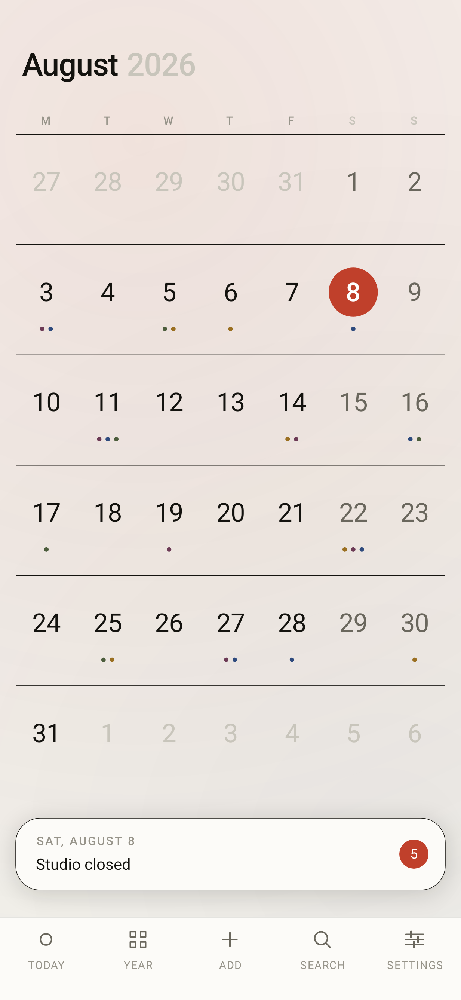
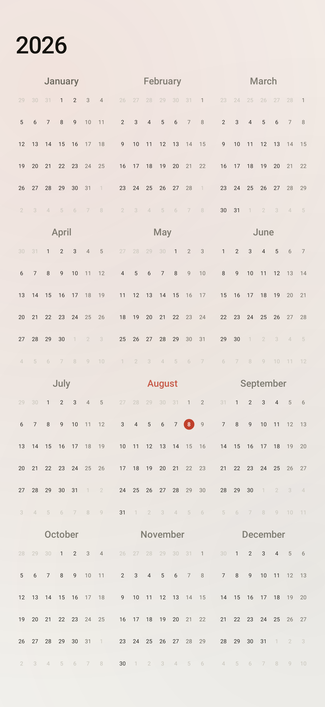
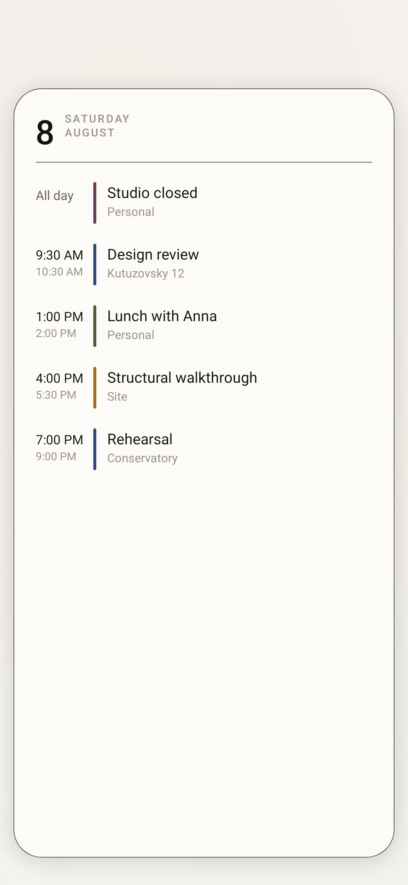
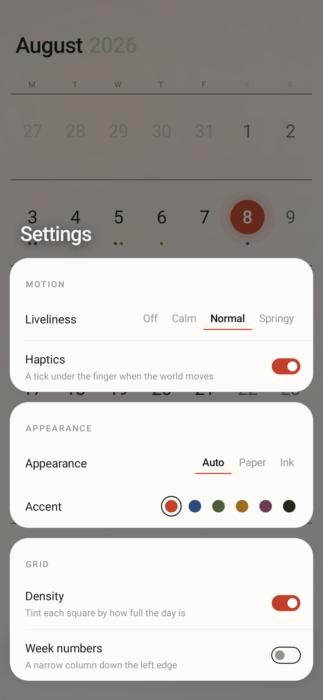
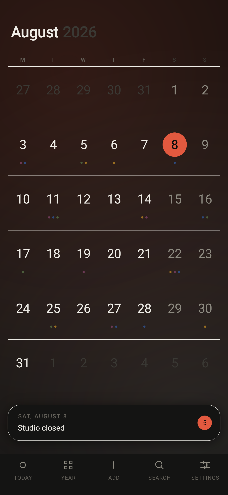
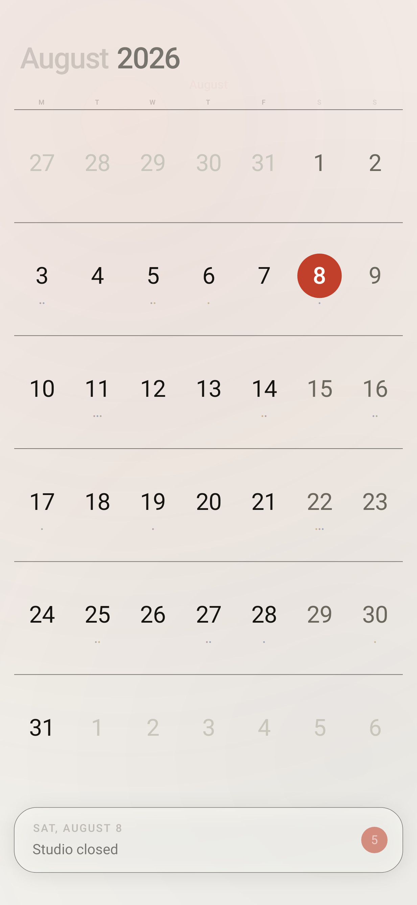

# Quire

An Android calendar in two halves that share nothing but their palette: a
home-screen widget that holds perfectly still, and an app that is a single
zoomable world with no screens in it.

**Install:** [`dist/quire-2.2.apk`](dist/quire-2.2.apk) · 700 KB · Android 8.0+
(minSdk 26, targetSdk 35) · `sha256 07c8217cf348d55910a5af007a7dc04a0a66a856f008868a1ecc863a641c7364`

Copy it to the phone and open it, or `adb install -r dist/quire-2.2.apk`. You
will need to allow installing from an unknown source once — the APK is signed
with the self-signed key in `keystore/`, not by a store.

| Month | Year | Day | Panels | Ink |
|---|---|---|---|---|
|  |  |  |  |  |

Every image is a real render of the shipping code, produced by the test suite
(`app/src/test/.../RenderTest.kt`) — not a mockup.

---

## The app is one number

There are no screens and no navigation. The whole interface is a single surface
with one continuous coordinate, `zoom`:

```
0 ────────────── 1 ────────────── 2
year            month            day
```

Pulling back from a month to its year is that same month shrinking into its slot
among the other eleven — not one view replacing another. Every month rectangle is
`lerp(yearCell, monthCell, zoom)`, so any value in between is a real frame, and
the frames between the levels are worth looking at:

| zoom 0.55 — the year dissolving into a month |
|---|
|  |

The title does the same thing rather than crossfading: the year slides right to
clear space and the month name grows in ahead of it.

**Moving through it**

- **Drag** sideways to pan. At month level that is one month per screen, at year
  level twelve — the same gesture, scaled by where you are.
- **Pinch** anywhere to move along the zoom continuously, or **double-tap** to
  jump a level. Both land on whatever your fingers were over.
- **Tap** a month to enter it, a day to choose it, the dock at the bottom to open
  that day.
- **Back** steps out one level before it leaves the app.
- **Pull the dock up** from the bottom and the day comes with your finger — let
  go past the halfway mark and it opens, short of it and it falls back.
- **Long-press a day** to start a new event on it.

**The bar is deliberately ordinary.** Today, Year, Add, Search, Settings sit in
a fixed row at the bottom, icon over label, exactly where the thumb expects
them. Everything above the bar is bespoke; the bar is not, on purpose — a
gesture that has to be learned belongs anywhere but the one control you reach
for without looking. *Year* is the only entry with a state: it lights up while
the year is showing and takes you back to the month.

**Springs, not curves.** Nothing in the app animates on a duration. Every moving
value is a spring integrator (`ui/Motion.kt`) substepped at 4 ms, because a
duration-and-easing animation has to restart from zero when its target changes
mid-flight — which is exactly what a flick between months does. A spring carries
its velocity across the change, so an interrupted gesture continues instead of
snapping. There are four liveliness settings from **Off** to **Springy**, and
the app switches itself to Off when the system animator scale is zero, which is
how someone who needs reduced motion tells every app at once.

**Depth is earned, not decorated.** Opening a panel pushes the world back a few
per cent behind it — the calendar is still there, just no longer
the thing being touched. The ground underneath does not move, because it is not
being held.

**The background is driven, not timed.** Two soft pools of colour sit behind
everything, positioned from the focused month and the zoom level rather than
from a clock. Idle, the screen is perfectly still and costs nothing; moving
through the calendar shifts them underneath at their own slower rate.

## What it does

**The app**

- Month grid, year overview and day card, all as one zoom.
- The day card grows out of the square you tapped and carries the day's entries:
  time in tabular figures, a rule in the calendar's colour, title, place. Drag it
  down past the top to close it.
- A plain bottom bar: today, year, add, search, settings.
- **Search** across eight months either way, live as you type, straight into the
  day it found.
- **Density** tints each square by how full the day is — a heat map of the month
  under the numbers.
- Creating and opening events hands off to whatever calendar app is installed.
  Quire never writes to your calendar and asks only for read access.
- Settings float in as a stack of slabs over the world, one after another, and
  apply live — the accent changes under your finger with nothing recreated.

**The widget**

- The full month, always six rows, so the geometry never shifts between months.
- Today is a filled disc in the accent. Days with something in them carry up to
  three dots, coloured by the calendar the event belongs to.
- `‹ ○ ›` in the header: previous month, back to this month, next month, without
  opening the app. It returns to the current month by itself at midnight.
- Sizes from two cells to the full width of the screen. Two cells on the usual
  four-column launcher is exactly half the width; below 200dp the card tightens
  its own padding, drops the year and shrinks the header controls rather than
  clipping them.
- Repaints at midnight, on timezone or locale change, and within seconds of
  anything being written to the calendar — a JobScheduler content trigger, not
  polling.
- Configured per placement: two widgets can run different skins and accents side
  by side.

No account, no network permission, no analytics. The only permission requested
is `READ_CALENDAR`, and the grid still works without it.

## The design system

The whole visual language is [`core/Tokens.kt`](app/src/main/java/app/quire/calendar/core/Tokens.kt) —
one file of plain numbers, read by both the Canvas-drawn app and the RemoteViews
widget, because those two cannot share an Android theme.

**Two skins.** *Paper* is a warm off-white (`#F6F5F1`) under a warm near-black
(`#14130F`). *Ink* inverts it (`#0C0C0B` / `#F0EEE8`). Both are warm-shifted on
purpose: pure `#FFFFFF` on `#000000` reads as a spec sheet, not as a page.

**Six accents, one at a time.** Cinnabar (default), Indigo, Moss, Ochre, Plum,
Graphite. The accent is spent on today, the live segment in a settings strip, and
the live entry in the bottom bar. Everything else is ink at four strengths. The launcher icon is the same two moves and nothing else — three week
rules and one marked day.


**Structure from rules, depth from shadow — and only where it earns it.** The
grid is held together by hairlines between weeks, edge to edge, the way a printed
calendar is set: no cards, no elevation. The things that genuinely float — the
day card, the dock, the settings slabs — get one soft shadow
each, because they are meant to read as objects above the grid rather than parts
of it.

**Type does the ranking.** System sans with deliberate tracking: the month title
at 28sp with −0.025, weekday initials at 10sp with +0.16, day numbers with `tnum`
so columns of digits do not shimmer between months. Weekend numbers drop one ink
step, neighbouring months drop three.

Choices made against the grain of the platform, on purpose: no Material
components, no dynamic colour, no dialogs, no second Activity and therefore no
window transition anywhere. The switch, the segmented strip and the accent
swatches are all drawn by hand.

## Layout of the source

```
core/     Tokens (palette, accents)   MonthModel (grid maths, julian days)
          EventRepository (provider, search)   Prefs (app + per-widget)
ui/       Motion — spring integrator and the four liveliness profiles
          MonthPainter — one month into any rectangle at any detail
          StageView — the world: zoom, pan, gestures, day card
          Ambient — the driven background
          RadialMenu, SheetOverlay, Panel, Widgets (switch, swatch)
          MainActivity — the only Activity
widget/   WidgetRenderer — builds the RemoteViews tree
          MonthWidgetProvider, WidgetConfigActivity
          MidnightScheduler, CalendarWatchService
tools/    generate_assets.py — launcher icon and widget picker preview
```

Three things worth knowing before editing:

- **The widget's week rows are built at runtime** with `RemoteViews.addView`, so
  each row and cell is its own `RemoteViews` and duplicate ids across siblings
  are fine. That is what lets all 42 squares carry a tap target.
- **RemoteViews will not inflate a bare `<View>`.** The host's inflater rejects
  any class not annotated `@RemoteView`, at runtime, with no compile-time
  warning. Hairlines inside widget layouts are therefore `FrameLayout`s.
- **A `GONE` view is never measured.** Anything that computes geometry from its
  own bounds when it appears — the radial menu did — has to start `INVISIBLE`.

## Building

Needs JDK 17+ and an Android SDK with platform 35 and build-tools 35.0.0.

```bash
echo "sdk.dir=$ANDROID_HOME" > local.properties
gradle assembleRelease          # dist-ready APK, signed with keystore/
gradle assembleDebug            # installs alongside it (.debug suffix)
gradle testDebugUnitTest        # 35 tests; writes app/build/screenshots/*.png
gradle lintRelease              # must stay at 0 errors
python3 tools/generate_assets.py   # after editing the icon or picker preview
```

The tests run on Robolectric with native graphics, so `testDebugUnitTest` checks
the calendar-provider parsing against a fake provider, proves the springs
converge and survive a dropped frame, and renders the real views — the stage at
five points along its zoom, the bar in both skins, the settings stack, the
launcher icon inside its mask, and the widget through `RemoteViews.apply`. Look in `app/build/screenshots/` after a
run to see what the current code actually draws.

## Signing

`keystore/quire.p12` and its password in `keystore.properties` are committed on
purpose: rebuilding with a different key produces an APK that cannot install over
the one you already have, and this is a personal build with no store account
behind it. It is a throwaway self-signed key and should be replaced before this
is published anywhere. Delete `keystore.properties` and the release build falls
back to the debug key.
