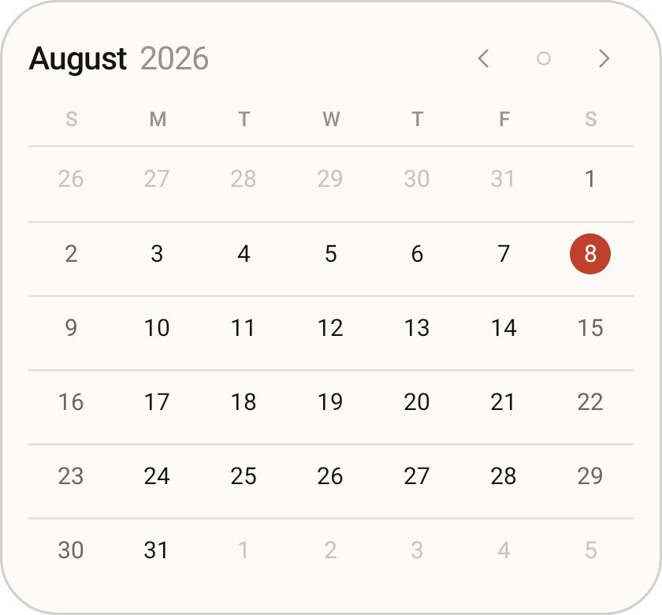
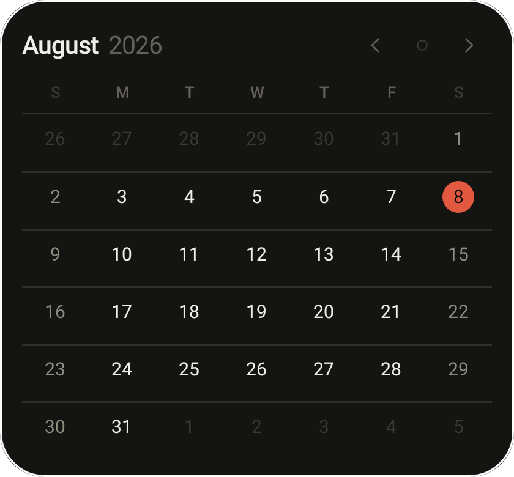
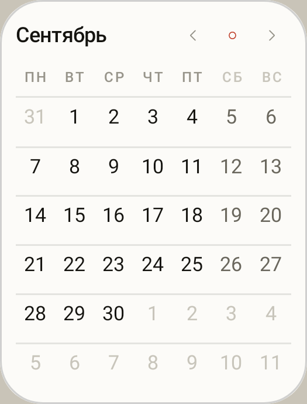

# Quire

An Android month calendar — a home-screen widget and a small app behind it.
Six rows, hairline rules, one accent colour, tabular figures. The iPhone month
grid is the reference; the finish is deliberately plainer than either platform's
defaults.

**Install:** [`dist/quire-1.1.apk`](dist/quire-1.1.apk) · 760 KB · Android 8.0+
(minSdk 26, targetSdk 35) · `sha256 fbc146cfcee201d09f4948d63f3056845b74a09850cd7464beb599f2a3c84c95`

Copy it to the phone and open it, or `adb install -r dist/quire-1.1.apk`. You
will need to allow installing from an unknown source once — the APK is signed
with the self-signed key in `keystore/`, not by a store.

| App | Widget, paper | Widget, ink | Half width |
|---|---|---|---|
|  |  |  |  |

Every image above is a real render of the shipping code, produced by the test
suite (`app/src/test/.../RenderTest.kt`) — not a mockup.

---

## What it does

**The widget**

- The full month, always six rows, so the geometry never shifts between months.
- Today is a filled disc in the accent. Days with something in them carry up to
  three dots, coloured by the calendar the event belongs to.
- `‹ ○ ›` in the header: previous month, back to this month, next month —
  without opening the app. It returns to the current month by itself at
  midnight.
- Tap any day to open the app on that day; tap the month name to open the month.
- Repaints when the clock rolls past midnight, when the timezone or locale
  changes, and within seconds of anything being written to the calendar
  (a JobScheduler content trigger, not polling).
- Sizes from two cells to the full width of the screen. Two cells on the usual
  four-column launcher is exactly half the width, so it sits next to any other
  half-width widget; the card lands at that size and grows by dragging. Below
  200dp it tightens its own padding, drops the year and shrinks the header
  controls rather than clipping them.
- Configurable per placement — two widgets can run different skins and accents
  side by side. Re-openable later from the widget's own settings on Android 12+.

**The app**

- Month grid, swipeable, with the day's entries listed underneath: time in
  tabular figures, a rule in the calendar's colour, title, place.
- Tap the month name for the year: twelve compact months, tap one to jump.
- `+` hands off to whatever calendar app is installed to create an event; tapping
  an entry opens it there. Quire never writes to your calendar and asks only for
  read access.
- Settings: first day of the week, skin, accent, neighbouring months, quiet
  weekends, week numbers, coloured marks, and which calendars count. On Auto the
  first day comes from `java.util.Calendar`, so Android 13's own regional
  "first day of week" preference is honoured, not just the locale's region.

No account, no network permission, no analytics. The only permission requested
is `READ_CALENDAR`, and the app is useful (as a plain grid) without it.

## The design system

The whole visual language is [`core/Tokens.kt`](app/src/main/java/app/quire/calendar/core/Tokens.kt) —
one file of plain numbers, read by both the Canvas-drawn app views and the
RemoteViews widget, because those two cannot share an Android theme.

**Two skins.** *Paper* is a warm off-white (`#F6F5F1`) under a warm near-black
(`#14130F`). *Ink* inverts it (`#0C0C0B` / `#F0EEE8`). Both are warm-shifted on
purpose: pure `#FFFFFF` on `#000000` reads as a spec sheet, not as a page.

**Six accents, one at a time.** Cinnabar (default), Indigo, Moss, Ochre, Plum,
Graphite. The accent is spent on exactly one thing — today — plus the `Today`
control and the live segment in settings. Everything else is ink at four
strengths (`ink`, `inkMuted`, `inkFaint`, `inkGhost`).

**Structure comes from rules, not boxes.** Horizontal hairlines at 10–12% ink
between weeks, edge to edge, the way a printed calendar is set. No cards, no
elevation, no shadow, no rounded container. The widget gets exactly one border
hairline because it floats on a wallpaper and needs an edge.

**Type does the ranking.** System sans at four sizes with deliberate tracking:
the month title at 27sp with −0.025 tracking, weekday initials at 10sp with
+0.16, day numbers with `tnum` so columns of digits do not shimmer as months
change. Weekend numbers drop one ink step. Neighbouring months drop three.

**Motion is short and singular.** One easing curve (`0.2, 0, 0, 1`), 170 ms,
used by the selection disc and the settings switch alike.

Choices made against the grain of the platform, on purpose: no Material
components, no dynamic colour, no ripple-heavy chrome, no dialogs — settings are
segmented strips that keep the alternatives on screen next to the choice, and
the switch is drawn by hand rather than imported.

## Layout of the source

```
core/     Tokens (palette, accents)   MonthModel (grid maths, julian days)
          EventRepository (provider)  Prefs (app + per-widget)
ui/       MonthGridView — the grid, drawn on a Canvas, compact mode for the year
          WeekdayHeaderView, Panel (settings rows), Widgets (switch, swatch)
          MainActivity, YearActivity, SettingsActivity
widget/   WidgetRenderer — builds the RemoteViews tree
          MonthWidgetProvider, WidgetConfigActivity
          MidnightScheduler, CalendarWatchService
tools/    generate_assets.py — launcher icon and widget picker preview
```

Two implementation notes worth knowing before editing:

- **The widget's week rows are built at runtime** with `RemoteViews.addView`, so
  each row and cell is its own `RemoteViews` and duplicate ids across siblings
  are fine. This is what lets all 42 squares carry a tap target without
  declaring 42 ids.
- **RemoteViews will not inflate a bare `<View>`.** The host's inflater rejects
  any class not annotated `@RemoteView`, at runtime, with no compile-time
  warning. Hairlines inside widget layouts are therefore `FrameLayout`s. Lint's
  `RemoteViewLayout` check catches regressions, and `RenderTest` inflates the
  real tree so a mistake fails the build rather than the home screen.

## Building

Needs JDK 17+ and an Android SDK with platform 35 and build-tools 35.0.0.

```bash
echo "sdk.dir=$ANDROID_HOME" > local.properties
gradle assembleRelease          # dist-ready APK, signed with keystore/
gradle assembleDebug            # installs alongside it (.debug suffix)
gradle testDebugUnitTest        # 27 tests; writes app/build/screenshots/*.png
gradle lintRelease              # must stay at 0 errors
python3 tools/generate_assets.py   # after editing the icon or picker preview
```

The tests run on Robolectric with native graphics, so `testDebugUnitTest` both
checks the calendar-provider parsing against a fake provider and renders the
real views and the real widget to PNG — including the widget at its tightest
half-width placement, in both languages, since the header is what runs out of
room first. Look in `app/build/screenshots/` after a
run to see what the current code actually draws.

## Signing

`keystore/quire.p12` and its password in `keystore.properties` are committed on
purpose: rebuilding with a different key produces an APK that cannot install
over the one you already have, and this is a personal build with no store
account behind it. It is a throwaway self-signed key and should be replaced
before this is published anywhere. Delete `keystore.properties` and the release
build falls back to the debug key.
