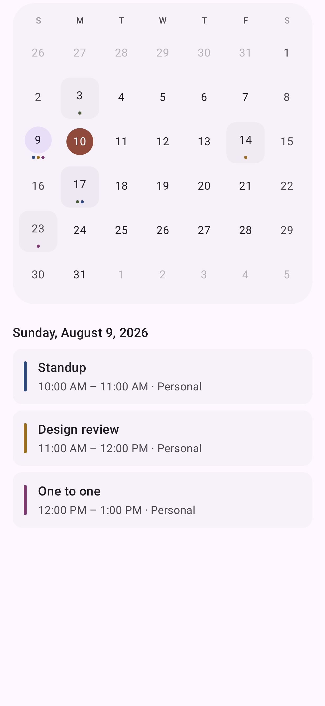
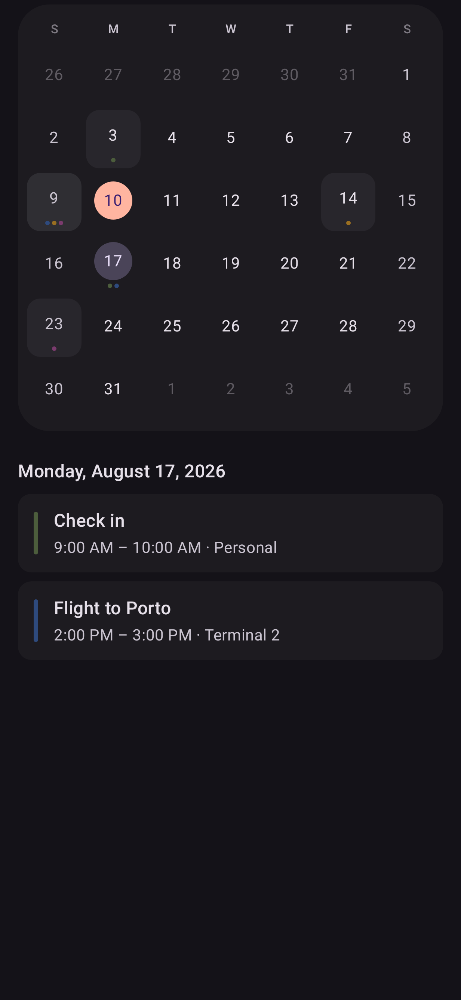
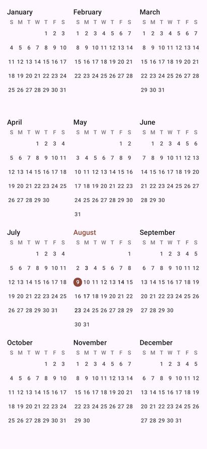
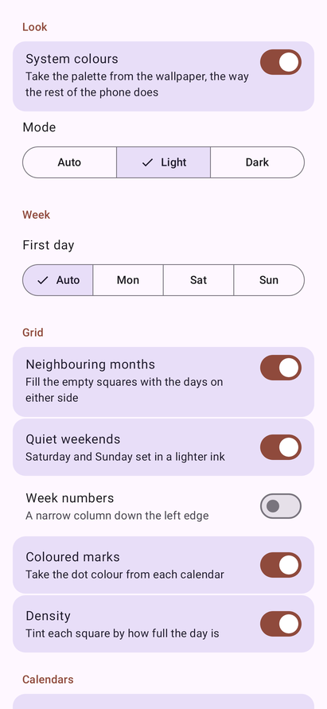
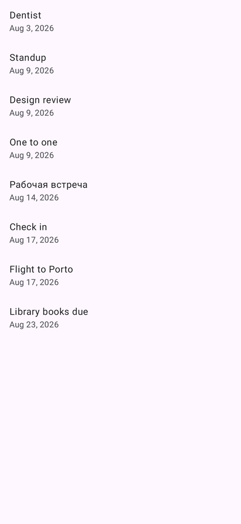
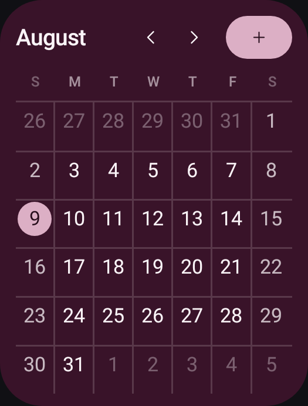
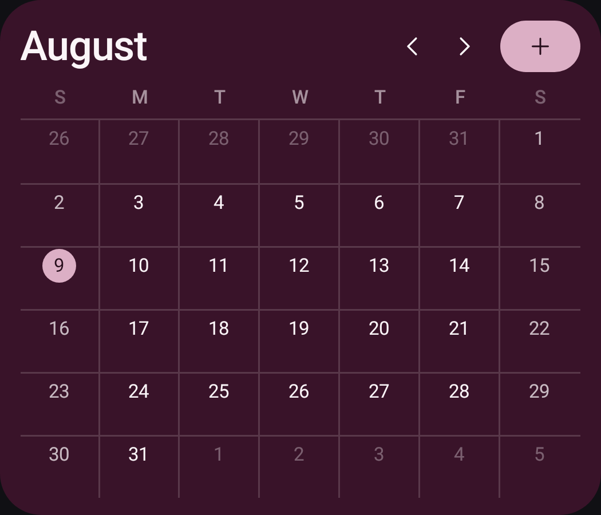
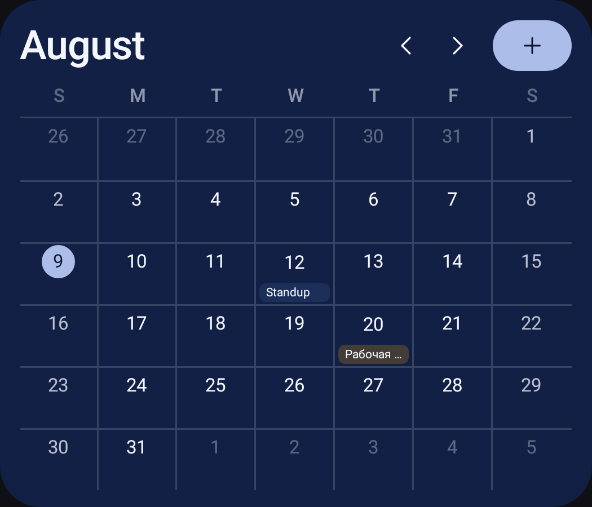
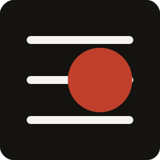

# Quire

An Android calendar in two halves: an app built entirely from Material 3 Expressive, and a
home-screen widget that cannot be, because a widget is `RemoteViews` and `RemoteViews` is not
Compose.

The app half was rebuilt from nothing for Android 17. It has no components of its own: the app
bar, the navigation bar, the search field, the list rows, the switches and the segmented buttons
are Material's, so the calendar answers the wallpaper's colour scheme, the system font scale and
every accessibility setting without holding an opinion about any of them. What survived the
rewrite is the part that reads your calendar — the grid arithmetic, the provider queries and the
off-thread loader — because that part had tests and had been debugged against a real provider.

**Install:** [`dist/quire-5.2.apk`](dist/quire-5.2.apk) · 1.4 MB · Android 8.0+ (minSdk 26,
targetSdk 37 — Android 17) ·
`sha256 8a91367008ff9b97ed1ce544ea111553a8e4f3632c4634950931735645e1e946`

Copy it to the phone and open it, or `adb install -r dist/quire-5.2.apk`. You will need to allow
installing from an unknown source once — the APK is signed with the self-signed key in
`keystore/`, not by a store.

| Month | Month, dark | Year | Settings | Search |
|---|---|---|---|---|
|  |  |  |  |  |

Every image is a real render of the shipping code, produced by the test suite — not a mockup.

---

## The app

Four destinations in a `ShortNavigationBar`, which is the Expressive one: a shorter band, and a
selection pill that grows around the icon on the theme's own spring.

- **Today** — the month, swiped through a pager, with the selected day's entries underneath.
  Tapping Today again while you are already there returns to today rather than doing nothing.
- **Year** — all twelve months at once, three across and four down, every date legible. The tiles
  take whatever height the page has, so a year fills its screen instead of ending half way down.
- **Search** — `AppBarWithSearch`, so the field *is* the app bar rather than a box floating over
  one. Results filter as you type and open the day they were found in.
- **Settings** — everything the app can be told.

The month grid is six rows whatever the month, so the geometry never shifts underneath a swipe.
Today is a filled `primary` disc, a selection elsewhere the quieter `secondaryContainer` one, and
marks take each event's own calendar colour. Those are Material roles rather than colours, which
is what makes the whole grid follow the wallpaper on Android 12 and up.

**Colour comes from the device.** From Android 12 the platform derives a full Material scheme from
the wallpaper; `dynamicLightColorScheme` hands it over as the roles, and the app wears it. That is
what *System colours* switches, and turning it off falls back to a fixed cinnabar scheme. Motion is
`MotionScheme.expressive()` — springs with a little overshoot — rather than the standard one.

**Settings are grouped, not listed.** Android's own settings from 16 onwards draw a run of related
rows as one connected block, outer corners rounded and inner ones squared off, which is what
`ListItemDefaults.segmentedShapes` computes from a row's position. Each row is a toggleable
`SegmentedListItem`, so the whole row is the switch — a screen reader announces one control rather
than a label and a separate widget it cannot connect to it.

**Density** tints each square by how full the day is, using the surface stepping up rather than a
colour of its own, so a busy day reads as raised paper instead of a stain.

Creating and opening events hands off to whatever calendar app is installed. Quire never writes to
your calendar and asks only for read access.

## Motion

Every animation takes its spec from `MaterialTheme.motionScheme` rather than from a duration
written here, which is what keeps them one family: *spatial* springs for anything that moves or
changes size, and they overshoot slightly; *effects* springs for anything that only fades or
changes colour, and they do not — a colour that overshoots is a colour that goes somewhere it was
never asked to be.

- **Between destinations**, Material's fade-through: the outgoing screen fades, the incoming one
  fades and grows the last tenth of its size. Nothing slides, because the four destinations are
  siblings rather than a stack.
- **Between days**, a shared axis: the agenda travels the way the date did, later to the left,
  earlier to the right. The day is handed to the transition as one value, so the copy on its way
  out keeps showing its own entries instead of being repainted with the new day's half way
  through.
- **The title** rolls in the direction the months moved — up for a later month, down for an
  earlier one. It has to be told which way that is, because "August" is not after "July" in any
  ordering a string knows about.
- **The month you are swiping away** sinks and fades a little as it goes, driven by the pager's
  own offset, so a half-finished swipe reads as one month passing behind another rather than two
  grids sliding on the same plane.
- **Today's disc and a selection** grow into the cell that was tapped instead of appearing in it,
  and the marks under a date grow in when the month's events arrive — a frame or two after the
  grid itself, which without this reads as a glitch.
- **Back** returns to the month before it leaves the app, and it does it under the finger:
  `PredictiveBackHandler` drives the screen's own retreat from the gesture's progress, so a back
  you change your mind about springs back rather than committing.
- **While a day is being fetched**, the expressive `LoadingIndicator` — the shape-morphing one —
  rather than the sentence "nothing scheduled", which was what an unasked-for day used to claim
  for the frame before its entries arrived.

## The widget

| Half width | Full width | Named entries |
|---|---|---|
|  |  |  |

A widget is `RemoteViews`: inflated by the launcher, in the launcher's process, from a fixed set of
view classes. None of the app half applies here, so this half is drawn from XML layouts and a
palette computed in Oklch.

- **Four skins.** *Paper* and *Ink* are the calendar as a printed page. *Colour* fills the card
  with the accent taken down to a deep ground, sets the dates in near-white on a lattice, and puts
  a filled add button in the header — a card that carries its own colour reads as an object on a
  wallpaper rather than a hole in it. Every value is walked in Oklch from the accent, so all six
  accents give a card of the same weight instead of one nearly black and another that glows. It is
  what a newly placed widget wears, and with *System colours* on it takes the device's own scheme
  instead of a fixed accent.
- **A day is named where there is room for a name, and dotted where there is not.** Given a column
  at least 44dp wide the filled card labels each day with its earliest entry, in that calendar's
  own colour. Seven columns of a half-width card are 25dp each, so there the dots say the same
  thing in the space available. The title costs no extra query — it was already in the one the
  marks are counted from.
- The full month, always six rows, so the geometry never shifts between months.
- Today is a filled disc in the accent. Days with something in them carry up to three dots,
  coloured by the calendar the event belongs to.
- `‹ ○ ›` in the header: previous month, back to this month, next month, without opening the app.
  It returns to the current month by itself at midnight.
- Sizes from two cells to the full width of the screen. Two cells on the usual four-column
  launcher is exactly half the width; below 200dp the card tightens its own padding, drops the
  year and shrinks the header controls rather than clipping them.
- Repaints at midnight, on timezone or locale change, within seconds of anything being written to
  the calendar, and **when the phone's colours change** — all content triggers and alarms, no
  polling.
- Configured per placement: two widgets can run different skins and accents side by side. That is
  why the widget keeps its own six fixed accents rather than sharing the app's setting.

**Keeping up with the phone's theme** is the one thing a widget cannot be told about. A widget is
a picture the launcher holds on to, Quire bakes its colours into that picture, and nothing asks
for a new one when the user picks new wallpaper colours: `ACTION_CONFIGURATION_CHANGED` cannot be
delivered to a receiver declared in a manifest, and the wallpaper-changed broadcast has not been
sent since API 26. So the change is caught two ways, either of which is enough on its own — the
app process compares and repaints whenever it starts or is reconfigured, and the watch job also
wakes on the setting the theme picker writes, which is what reaches a widget whose app is not
running. The comparison is what keeps it cheap: every rotation and every launch arrives at the
same check, and a repaint is a cross-process query, so it only happens when the colours really
moved. The night mode is part of the comparison too — a widget following the system paints a
different half of the scheme when the phone goes dark.

The configuration screen the launcher shows is Compose like the rest of the app, and every change
in it repaints the real widget rather than a preview of one.

No account, no network permission, no analytics. The only permission requested is `READ_CALENDAR`,
and the grid still works without it.



The launcher icon is the same two moves as the grid and nothing else: three week rules and one
marked day.

## Layout of the source

```
m3/       MainActivity   the whole app: scaffold, bars, destinations
          Screens        month, year, search, settings
          Calendar       MonthGrid and MiniMonth — the only two drawn things left
          Rows           the shared settings row and its grouping
          CalendarModel  everything the screens read and everything they can ask for
          Theme          the Expressive theme        Locale  the observable locale
core/     MonthModel (grid maths, julian days)   EventRepository (provider, search)
          MonthLoader (off-thread, cached)       Prefs   Tokens (the widget's palette)
widget/   WidgetRenderer  MonthWidgetProvider  WidgetConfigActivity
          MidnightScheduler  CalendarWatchService
engine/   design/Oklch        perceptual colour, gamut-mapped
          design/SystemScheme the platform's own Material roles, read as resources
tools/    generate_assets.py — launcher icon and widget picker preview
```

`engine/` is what is left of a much larger set of hand-written engines the app used to be built
from. Only the two files the widget still needs survived: the widget cannot use Compose, so it
cannot use Material's colour system either, and it computes its palette itself.

Four things worth knowing before editing:

- **`Locale.getDefault()` in a composable is a bug.** It is a plain global, so a composable that
  reads it keeps whatever it saw first and a language change leaves month names in the old one.
  Lint catches it; `rememberLocale()` is the way through.
- **RemoteViews will not inflate a bare `<View>`.** The host's inflater rejects any class not
  annotated `@RemoteView`, at runtime, with no compile-time warning. Hairlines inside widget
  layouts are therefore `FrameLayout`s.
- **The widget's week rows are built at runtime** with `RemoteViews.addView`, so each row and cell
  is its own `RemoteViews` and duplicate ids across siblings are fine. That is what lets all 42
  squares carry a tap target.
- **`TextUtils.ellipsize` is a no-op under Robolectric.** It measures correctly and truncates
  nothing, so a widget title that overflowed would look fine in a render and be cut on a real
  phone. Truncation there is written out with `breakText`.
- **An animation that never ends will hang the test that waits for one.** `waitForIdle` on an
  automatic clock waits for animations to finish, and the loading indicator's does not. The
  screen tests drive `mainClock` by hand for that reason; the raw Robolectric ones use `idleFor`,
  because `idle` alone runs what is already due and the Choreographer's next frame never is.

## Building

Needs JDK 17+. Needs the Android 17 platform (`platforms;android-37.1`) and build-tools 37. The
Gradle wrapper pins the toolchain, so use it rather than a system Gradle:

```bash
echo "sdk.dir=$ANDROID_HOME" > local.properties
./gradlew assembleRelease        # dist-ready APK, signed with keystore/
./gradlew assembleDebug          # installs alongside it (.debug suffix)
./gradlew testDebugUnitTest      # writes app/build/screenshots/*.png
./gradlew lintRelease            # must stay at 0 errors
python3 tools/generate_assets.py # after editing the icon or picker preview
```

Gradle 9.5, AGP 9.3.1, Kotlin via AGP's built-in support — AGP 9 registers the `kotlin` extension
itself, so applying `org.jetbrains.kotlin.android` on top of it fails. `android.nonFinalResIds` is
on because AGP 9 shrinks resources through R8, which needs ids it can rewrite.

Compose comes from the BOM plus an explicit `material3:1.5.0-alpha25`: the BOM pins 1.4.0, where
`MaterialExpressiveTheme`, `MotionScheme`, `SegmentedListItem` and `AppBarWithSearch` are either
internal or absent.

There is no emulator in this project's development environment, so **the tests are how the
interface is looked at**. They run on Robolectric with native graphics and write real PNGs: each
screen composed on its own, the whole app assembled through the real `onCreate` and drawn through
the real window, the launcher icon inside its mask, and the widget through `RemoteViews.apply` —
which is the only way to find out that the launcher's inflater would have rejected a view class.
Look in `app/build/screenshots/` after a run to see what the current code actually draws.

Every visual bug found in this project was found by reading those PNGs — a today marker drawn
twice, a title that ran off the edge, an add button that measured to nothing. Two things the tests
are pointed at specifically:

- **A screenshot that depends on what ran before it is not evidence.** Preferences outlive a test
  class, so the end-to-end shot pins the light/dark mode rather than inheriting whatever the
  previous class left behind.
- **`lintRelease` is not optional.** `assembleRelease` runs `lintVitalRelease`, which is a subset;
  the full lint is what catches a locale read that will not recompose or a `LocalContext` cast to
  an Activity.

## Signing

`keystore/quire.p12` and its password in `keystore.properties` are committed on purpose:
rebuilding with a different key produces an APK that cannot install over the one you already have,
and this is a personal build with no store account behind it. It is a throwaway self-signed key
and should be replaced before this is published anywhere. Delete `keystore.properties` and the
release build falls back to the debug key.
