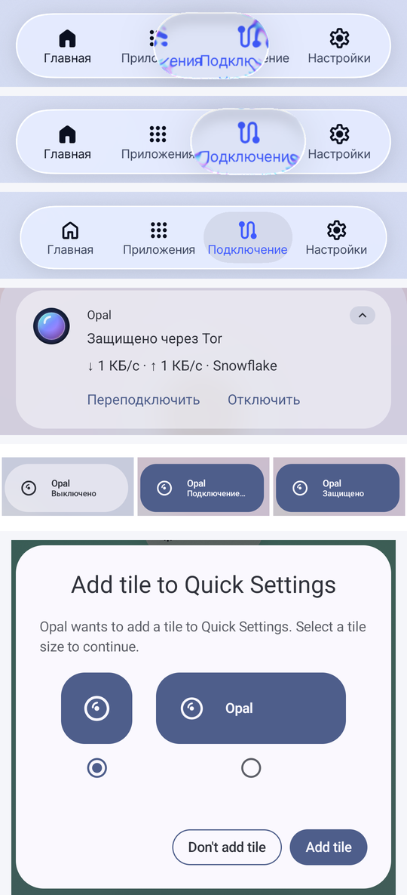

# Отчёт о проверке (тест-план, раздел 15 ТЗ)

Дата: 2026-09-26 (версия 1.0.3). Сборка: ветка `claude/dazzling-thompson-cpvvtq`.

**Главное ограничение:** реального устройства не было. Версии 1.0.1 и 1.0.3 прогнаны в эмуляторе
Android 17 (разделы ниже); утечки, смена Wi-Fi ↔ LTE, Doze, батарея, скорость и российские сети —
**не проверены**.

## 1.0.3: уведомление, плитка, таб-бар (эмуляция Android 17)

Та же среда, что для 1.0.1 (эмулятор Android 17 без KVM, локальная цепочка Snowflake → настоящая
сеть Tor, см. ниже). Сборка — 1.0.3-debug x86_64. Для проверки уведомления и плитки в приложении
включена «Упрощённая графика»: живое стекло в программной эмуляции рисуется по 1–2 с на кадр, и
SystemUI не успевал (ANR). Таб-бар проверялся с живым стеклом.

| Что | Результат |
|---|---|
| Таб-бар: палец зажат на «Главная» и ведётся по панели, не отрываясь (`input motionevent DOWN/MOVE/UP`) — стеклянная линза поднимается над панелью, увеличивает и преломляет вкладки под собой; при отпускании выбрана вкладка под пальцем, экран переключился | работает (кадры 1–3 на картинке) |
| Разрешение на уведомления снято → нажатие «Подключить» → системный вопрос «Allow Opal to send you notifications?» → после «Allow» подключение продолжилось | работает |
| «Подключение к Tor…» — Live Update (`PROMOTED_ONGOING`), кнопки «Переподключить» и «Отключить» | работает |
| «Переподключить» (кнопка в уведомлении): `Reconnect requested` → новый Tor через 8 с, VPN-интерфейс не опускался | работает |
| «Защищено через Tor · ↓ … · ↑ … · Snowflake»; при загрузке 1 МБ через VPN (`nc` от uid 2000, файл получен целиком — 1 048 815 байт) скорость в уведомлении менялась: ↓ 18,2 → 86,5 → 13 КБ/с | работает |
| Смахнуть уведомление: система записала отмену пользователем (`notification_canceled`, причина 2), через 0,56 с уведомление снова на месте — те же флаги (`ONGOING_EVENT`, `NO_CLEAR`, `FOREGROUND_SERVICE`) и кнопки; Android переносит его в раздел «Беззвучные» | работает |
| «Отключить» в уведомлении: `tun0` исчез, уведомление снято вместе с VPN | работает |
| Плитка: после первого подключения — системный диалог «Add tile to Quick Settings» (Android 17 предлагает размер плитки) → добавлена; нажатие пальцем: «Выключено» → «Подключение…» (tun0 поднят сразу) → «Защищено»; следующее нажатие выключает | работает (нижние кадры) |

**Найдено и исправлено этим прогоном:** запуск Tor молча зависал на «Подключение… 0 %» — под
нагрузкой эмулятора Tor не ответил на команду управления за 120 с, а таймаут
(`TimeoutCancellationException`) все вызывающие считали отменой: сессия тихо умирала без ошибки и
без повтора (CLAUDE.md, ADR 42). Исправление сделано после прогона и в эмуляторе не повторялось —
покрыто юнит-тестами (`ControlTimeoutTest`); выручила новая кнопка «Переподключить».

**Не проверено:** выключение плиткой с заблокированного экрана (в эмуляторе блокировка экрана
отключена — нужна разблокировка, `unlockAndRun`); новая плитка добавляется в конец списка — в
эмуляторе на вторую страницу быстрых настроек (передвинуть: «Изменить»); release-сборка 1.0.3 в
эмуляторе не запускалась (отличается от debug только R8 и подписью). Чек-лист для ручной проверки — в [README](../README.md#проверка-на-устройстве-чек-лист).

## Эмуляция Android 17 (1.0.1)

**Среда.** Android Emulator 37.1.11, образ `system-images;android-37.0;google_apis;x86_64`
(Android 17, SDK 37, userdebug). KVM нет — эмулятор работал в программном режиме (`-accel off`,
TCG), поэтому всё в 10–50 раз медленнее телефона. Чтобы система вообще загрузилась:
`ro.hw_timeout_multiplier=10` (иначе Watchdog убивал system_server каждые 4 минуты), отключены
тяжёлые приложения Google, `hide_error_dialogs=1`, приложение скомпилировано заранее
(`cmd package compile -m speed`). Тестировалась debug-сборка x86_64 (логи в logcat).

**Сеть.** Из среды сборки нет исходящего UDP (кроме DNS), а TLS идёт через перехватывающий
прокси, поэтому до волонтёрских прокси Snowflake отсюда не дотянуться ни одному клиенту. Цепочка
для проверки: приложение (своя строка `snowflake … url=http://<хост>:8080/ ice=stun:<хост>:3478`,
введена в настройки приложения) → локальные брокер, прокси и сервер Snowflake **той же версии,
что в IPtProxy 5.5.1 (v2.14.1)** + минимальный STUN → сервер Snowflake передаёт поток настоящему
мосту Tor через meek (lyrebird 0.8.1 из Tor Browser 15.0.23) → **настоящая сеть Tor**.

**Проверено:**

| Что | Результат |
|---|---|
| Установка, запуск, онбординг, согласие на VPN, русский интерфейс | работает |
| VPN (`tun0`), приложение исключено из своего VPN (uidrange без 10234), VPN `VALIDATED` | работает |
| MapDNS: `check.torproject.org` → `100.64.0.2` через DNS VPN | работает |
| Tor 0.4.9.12 в процессе `:tunnel`, SOCKS на фиксированном порту, тот же порт в `hev.yml` | работает |
| Клиент Snowflake (IPtProxy): рандеву с брокером, WebRTC-канал к прокси (`Data Channel … open`) | работает |
| Tor через Snowflake: `Bootstrapped 100% (done)` в настоящей сети Tor | работает (2 прогона) |
| HTTP от другого процесса через VPN → hev → Tor → Snowflake → exit: ответ `check.torproject.org` | работает |
| Внешний IP трафика через VPN — **45.84.107.33, есть в официальном списке выходов Tor** (`torbulkexitlist`) | подтверждено |
| После `DisableNetwork 1/0` SOCKS-слушатель вернулся на тот же порт | подтверждено |
| **Release-сборка (R8, подпись):** предзапуск Tor, VPN, «Защищено», цепочка из трёх узлов, график скорости; выход через VPN — **192.42.116.17, есть в списке выходов Tor** | подтверждено, [скриншот](android17-release-connected.png) |

**Найдено и исправлено этим прогоном** (подробно — CLAUDE.md, ADR 34–38):

1. Старт без сети → «Tor не запустился» (Tor с `DisableNetwork 1` не открывает SOCKS).
2. SOCKS `auto` уезжал на новый порт после каждого `DisableNetwork 1/0`, hev слал трафик на старый.
3. Свой VPN приходил в `NetworkMonitor` как «смена сети» при каждом подключении → обрыв первой
   попытки (в 1.0.0 вместе с п. 2 — мёртвый трафик сразу после подключения).
4. Адрес TUN 198.18.0.1 попадал в WebRTC-кандидаты клиента Snowflake.
5. Watchdog разрывал соединения Snowflake в режимах «Свои мосты» и «Авто».
6. Медленная загрузка кеша Tor при старте → Tor убивали по таймауту → петля перезапусков.

**Настоящая сеть Snowflake** (с хоста этой среды, Tor 0.4.9.12 и Snowflake из Tor Browser
15.0.23, строки — те же, что в приложении): рандеву с брокером проходит и через CDN77 (фронты
Tor Browser и фронты набора для России), и через AMP cache — `200 OK`, ответы настоящих прокси;
дальше WebRTC упирается в отсутствие UDP в среде. Из России — не проверено.

**Не проверено в эмуляции:** режим Snowflake по умолчанию с волонтёрскими прокси (нет UDP),
страны узлов (GeoIP в программной эмуляции разбирается минутами — на экране «Страна неизвестна»),
Chrome (в программной эмуляции падал сам; вместо него — HTTP-запросы процесса устройства через
VPN), IPv6, смена сетей, «Постоянная VPN».

### Изменения 1.0.2

Найдено сверкой пути обновления 1.0.0 → 1.0.1 с живым Settings API (2026-09-26): если сервер не
определил страну, `/settings` отвечает ошибкой, и приложение берёт `/defaults` — там встроенные
строки Snowflake с фронтами `datapacket` (для России хуже, ADR 32). 1.0.0 (режим «Авто» по
умолчанию) кешировала такой ответ, а 1.0.1 предпочитала кеш API региональному набору — при
обновлении пользователь из России мог остаться на встроенных строках. Теперь кеш API используется,
только если ответ получен для текущей страны. Покрыто юнит-тестом (без исправления он падает);
в эмуляторе 1.0.2 не прогонялась — изменение затрагивает только выбор строк Snowflake из кеша, а
в прогоне эмулятора строки задавались вручную.

## Что проверено автоматически

| Проверка | Результат |
|---|---|
| Юнит-тесты `:core:model` (JVM): torrc, bridge lines, машина состояний, парсер control-протокола и событий (Flow/Turbine), настройки, «Переподключить» в машине состояний | 47 / 47 |
| Юнит-тесты `:core:tunnel` (JVM + Robolectric): гонка транспортов, политика режимов, watchdog, учёт мостов, SOCKS5, фиксированный SOCKS-порт, `NetworkMonitor` (VPN не считается сетью), конфиг hev, журнал с редактированием, каталог мостов (набор Snowflake для РФ, без смешивания, кеш Settings API — только для своей страны), torrc Snowflake, распаковка GeoIP, уведомление (кнопки по состояниям, скорость, возврат после смахивания), таймаут команды управления Tor — сбой, а не отмена | 55 / 55 |
| Юнит-тесты фич: раздельное туннелирование (фильтры, пресет), разбор своих мостов, график скорости | 9 / 9 |
| UI-тесты Compose (Robolectric): сфера подключения (действие и TalkBack-семантика), выбор транспорта, отметка приложения; таб-бар: касание, перетаскивание линзы без отрыва пальца, возврат на исходную вкладку, выход за край, TalkBack — с живым стеклом и в упрощённой графике | 14 / 14 |
| Скриншот-тесты Roborazzi: 10 экранов/состояний (в том числе линза таб-бара под пальцем) × светлая, тёмная, упрощённая графика | 30 / 30 (сверка с эталонами) |
| Нативный мост hev-socks5-tunnel на Linux-ядре (`tools/hev-host-test`): MapDNS, перехват DNS, TCP по имени через SOCKS, отказ UDP (ICMP за ~0,2 мс) | 7 / 7 (IPv6-путь не проверен: ядро песочницы без IPv6) |
| Android Lint (все модули, `checkDependencies`) | 0 ошибок, 0 предупреждений |
| detekt 1.23.8 + compose-rules 0.4.28 | 0 замечаний |
| ktfmt (Spotless) | чисто |
| Проверка зависимостей Gradle (`verification-metadata.xml`, SHA-256, 796 компонентов) | сборка проходит с проверкой |

Итого JVM-тестов (включая UI- и скриншот-тесты `:app`): 155, падений нет.

## Сборка release

Подпись — локальный RSA-4096 ключ (вне репозитория), APK Signature Scheme v2, `apksigner verify` —
OK. R8 (минификация + сжатие ресурсов) включён.

| APK | Размер (скачивание) |
|---|---|
| `app-arm64-v8a-release.apk` | 19,1 МБ |
| `app-armeabi-v7a-release.apk` | 19,4 МБ |
| `app-x86_64-release.apk` | 20,2 МБ |
| `app-universal-release.apk` | 44,7 МБ |

Из чего состоит arm64 (сжато / распаковано): IPtProxy `libgojni.so` 8,1 / 24,3 МБ, `libtor.so`
3,1 / 7,6 МБ, GeoIP 4,7 / 25,9 МБ, dex 2,0 / 3,9 МБ, zxing-cpp 0,7 / 1,7 МБ, hev 0,14 / 0,32 МБ,
шрифты Inter 0,14 МБ. `.so` хранятся сжатыми (ADR 18): меньше скачивать, но на устройстве они
распаковываются (~34 МБ).

Аудит APK:

- **16 КБ страницы:** у всех `.so` для arm64-v8a и x86_64 сегменты LOAD выровнены на 0x4000
  (Tor, IPtProxy, hev, zxing-cpp, библиотеки AndroidX). У armeabi-v7a `libtor.so` и `libgojni.so`
  выровнены на 4 КБ — это не проблема: 16-КБ ядра бывают только на 64-битных устройствах.
- **R8 и JNI:** имена сохранены — `org.torproject.jni.TorService` (поля `torConfiguration`,
  `torControlFd`, native-методы), `HevNative` (4 native-метода, регистрируются по имени),
  классы gomobile `go.*` и `IPtProxy.*`, `zxingcpp.*`, ключи Navigation 3 (`Dest*`).
- **Манифест:** `allowBackup=false`, cleartext запрещён, разрешения и экспортированные
  компоненты — ровно из таблицы в README; нет LeakCanary и тестовых активити; локали — только
  ru и en.
- **Отладочная информация:** нативные библиотеки очищены от символов; в hev нет абсолютных путей.

### Найдено и исправлено при аудите

1. `libhev-socks5-tunnel.so` попадал в APK с отладочной информацией (1,46 МБ вместо 0,32 МБ) —
   в модуле `:app` не был указан NDK для strip. Исправлено (`ndkVersion` в `:app`).
2. **GeoIP не загрузился бы на устройстве:** упаковщик APK распаковывает ассеты `*.gz` и кладёт
   их без расширения (`assets/geoip`), а код открывал `geoip.gz`. Страны узлов и «Страна выхода»
   молча не работали бы. Исправлено (`TorFiles` читает оба варианта), добавлен тест.
3. Ассерты lwIP встраивали `__FILE__` с абсолютным путём сборки (утечка локальных путей и
   невоспроизводимость). Исправлено: `-ffile-prefix-map`, release без DWARF (`-g0`).

## Воспроизводимость

Две чистые сборки `:app:assembleRelease` с одним ключом: A — в рабочем каталоге, B — копия
исходников в другом каталоге, `--no-build-cache`, все 357 задач выполнены заново (включая
ndk-build).

- До исправления п. 3 различался только `libhev-socks5-tunnel.so` (17 встроенных путей); dex,
  ресурсы, ассеты, остальные `.so`, подписи — побайтно совпадали.
- После исправления все четыре APK версии 1.0.0 **побайтно совпадали** (SHA-256; для 1.0.1 и
  1.0.2 двойная сборка не повторялась, хеши выданных файлов — в `SHA256SUMS` рядом с APK):

  | APK | SHA-256 |
  |---|---|
  | arm64-v8a | `c5fddd97e9986ed23152acd52cf9cc5bfcf92992e5838d6725e6b2253929577b` |
  | armeabi-v7a | `acabb7ea35532eb4d700857a9844b01d661b7f6ff61c6dd032f80cd4d7a834cd` |
  | x86_64 | `32050f6054309bfa780bed2b8e25277a345316eea5aff3bd8b8375e052602b4c` |
  | universal | `6cd752059b0165c3c130a72b8ec3c629fa5466751a6e69796cfda4350eb287c4` |

  Хеши относятся к этому ключу подписи; с другим ключом совпадёт всё, кроме блока подписи.

Не проверено: сборка на другой ОС (macOS/Windows) и с другим JDK — IPtProxy, Tor и
библиотеки берутся готовыми артефактами, поэтому основной риск — только наш нативный код (hev) и
R8; оба детерминированы при одинаковых версиях NDK/AGP.

## Не проверено (нужно устройство)

| Пункт ТЗ | Статус |
|---|---|
| Выход трафика через Tor | проверено в эмуляторе (IP выхода — в списке выходов Tor); на устройстве — нет |
| DNS- и IPv6-leak, «Частный DNS» (DoT на 853 сейчас уходит в Tor и ждёт до отказа) | не проверено |
| Wi-Fi ↔ LTE, режим полёта, Doze 30 мин, убийство UI, перезагрузка с «Постоянной VPN» | не проверено |
| Гонка при сломанном Snowflake (есть debug-переключатель), мосты из Settings API | не проверено |
| Тёплый кеш (< 1 суток, 1,5–2 суток, с фоновым обновлением и без) | не проверено |
| Время до готовности по транспортам; холодный старт < 500 мс; доля подтормаживающих кадров < 5 % | не измерено (готовы Macrobenchmark и генератор Baseline Profile) |
| Память процесса `:tunnel`, батарея в горячем резерве | не измерено |
| Liquid Glass на реальном GPU (lens/blur, 60/120 fps) | только скриншоты Robolectric; на железе не проверено |
| TalkBack, шрифт 200 %, predictive back, большие экраны | семантика проверена тестами; вживую не проверено |

Скриншоты интерфейса (эталоны тестов): `app/src/test/screenshots/`.
