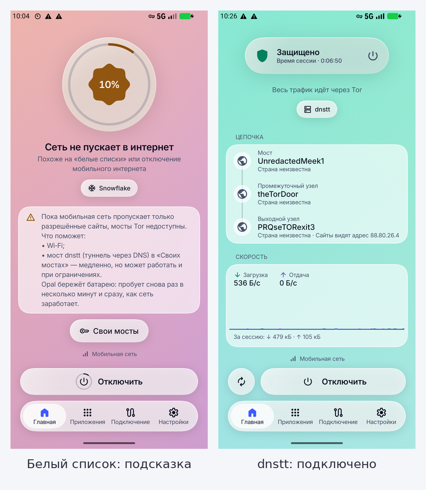
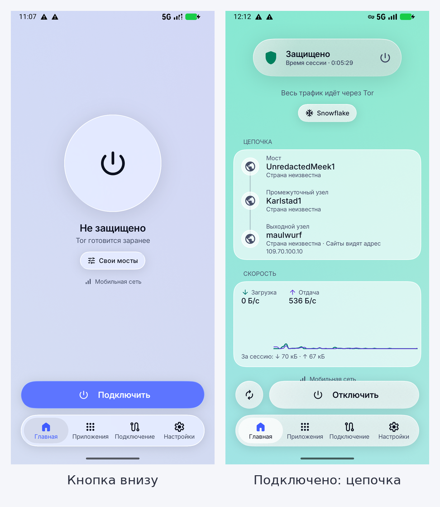
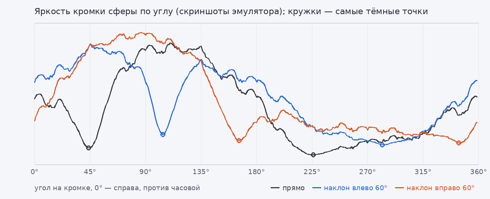
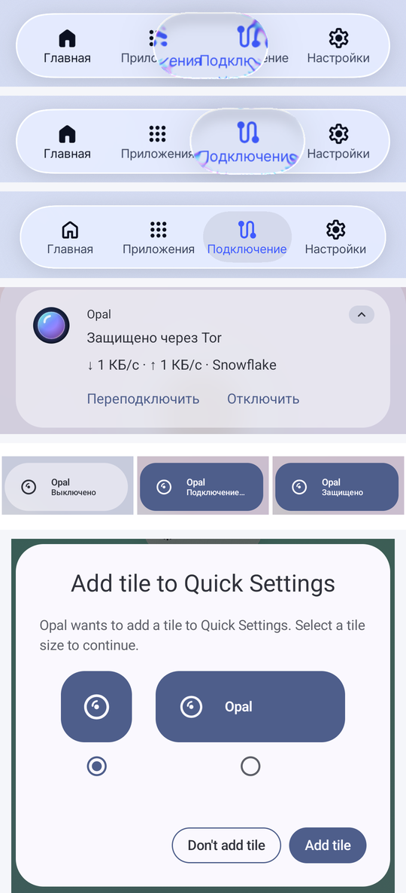

# Отчёт о проверке (тест-план, раздел 15 ТЗ)

Дата: 2026-09-29 (версия 1.0.6). Сборка: ветка `claude/dazzling-thompson-cpvvtq`.

**Главное ограничение:** реального устройства не было. Версии 1.0.1, 1.0.3–1.0.6 прогнаны в
эмуляторе Android 17 (разделы ниже); «белые списки» и смена Wi‑Fi ↔ мобильная сеть — только там, с
имитацией; утечки, Doze, батарея, скорость и российские сети — **не проверены**.

## 1.0.6: мобильная сеть без вмешательства в Snowflake, быстрее после подключения и сна

Пользователь сообщил, что в мобильной сети 1.0.5 работала хуже 1.0.4. Причина — в самой 1.0.5
(CLAUDE.md, ADR 50, 54): 1.0.4 из-за ошибки не видела смену сети при поднятом VPN, и сессия Snowflake
спокойно переживала переключения и провалы связи; 1.0.5 эту смену увидела и на каждую отвечала
`DisableNetwork 1/0` (на пропажу сети — `DisableNetwork 1`), то есть выбрасывала сессию Snowflake,
а при сети, которую Android не подтвердил, ещё и ставила Tor на паузу. Всё это убрано; по просьбе
пользователя добавлены два ускорения (ADR 55).

Стенд: эмулятор Android 17; локальный Snowflake той же версии 2.14.1 (брокер, три прокси, сервер)
→ настоящий мост Tor через meek. Для стенда probetest собран без симулятора NAT: иначе прокси
считали себя «restricted», и клиент Snowflake после первой неудачи их не видел — это и ломало стенд
Snowflake в 1.0.5.

| Что | Результат |
|---|---|
| Подключение через Snowflake-стенд (мобильная сеть эмулятора) | Bootstrapped 100 %, HTTP 200 |
| GeoIP: Tor готов в 07:24:22, разбор GeoIP начался в 07:24:42 — через 20 с, в затишье трафика (в 1.0.5 — сразу после готовности, и первые запросы ждали его окончания) | работает |
| Мобильная → Wi‑Fi: «Network changed (Wifi): the session carries on», ни `DisableNetwork`, ни новой сессии; Snowflake сам закрыл старый прокси и взял новый; статус всё время «Защищено через Tor»; HTTP 200 | работает |
| Wi‑Fi → мобильная: «Network lost … waits» → «Network back after 6s (Cellular): the session carries on»; HTTP 200, и выход тот же, что до переключения (193.189.100.197): цепочка Tor пережила смену сети | работает |
| Провал сети на 54 с: во время провала статус «Нет сети», после — сразу «Защищено» («Network back after 54s … carries on»), HTTP 200 | работает |
| Провал на 280 с (дольше, чем сервер Snowflake помнит сессию, 4 мин): «Network back (Cellular) after 280s: new Snowflake session», мост снова доступен через 31 с, «Защищено», HTTP 200 | работает |
| «Белый список» при подключении (весь трафик процесса туннеля отклоняется): через 60 с — подсказка «Сеть не пускает в интернет», дальше ни паузы, ни перезапусков — клиент Snowflake пробует брокер каждые 10 с. Блокировку сняли — Opal подключился сам, как только прокси стенда снова были доступны (подсказка снята через 10 с, Bootstrapped 100 % через 40 с), HTTP 200 | работает |
| Экран выключен 5 мин: эмулятор в глубокий сон не уходит (процессор хоста работает), сессия жила — HTTP 200 через ту же цепочку. Новая сессия при включении экрана после сна дольше 4 мин проверена только юнит-тестами (`SleepWatch`) | в эмуляторе не проверить |
| Релиз 1.0.6 (R8, x86_64) поверх 1.0.5, мобильная сеть эмулятора, dnstt: «Подключить» → «Защищено через Tor · dnstt» примерно через 1,5 мин, HTTP 200. Мобильная → Wi‑Fi (Wi‑Fi стал сетью по умолчанию, подлежащая сеть VPN сменилась — VPN стал безлимитным, как Wi‑Fi) и обратно: статус всё время «Защищено через Tor», после каждого переключения HTTP 200, через переключение Wi‑Fi → мобильная — тот же выход (45.84.107.198). Панель цепочки со странами — GeoIP загрузился в затишье | работает |

**Особенности стенда:** после снятия «белого списка» прокси стенда перестали опрашивать брокер (так
уже бывало в 1.0.4) — 8 минут клиент получал «no snowflake proxies currently available»; после
перезапуска прокси подключение прошло само. Сразу после загрузки эмулятора Tor дважды не ответил
на первую команду за 120 с (разбор 37 МБ кеша, см. 1.0.4); первое нажатие «Подключить» после
запуска приложения в эмуляторе иногда теряется — интерфейс ещё не связался с процессом туннеля.
В первом прогоне релиза Wi‑Fi эмулятора подключался дольше минуты, и проверка прошла до
переключения; повторена с ожиданием смены сети по умолчанию (84 с на Wi‑Fi, 31 с обратно).

## 1.0.5: мобильная сеть в России (эмуляция Android 17)

Что изменилось в мобильных сетях РФ к осени 2026 (форум Tor Project, ntc.party, отчёты user
support Tor Project): по регионам мобильный интернет часами, местами сутками, работает по «белым
спискам» — наружу проходят только адреса из утверждённого списка (фильтр по IP, подмена SNI не
помогает), DNS при этом работает. Ни один мост Tor тогда не работает, Snowflake не доходит даже до
брокера; поддержка Tor Project в таких случаях выдаёт мосты dnstt (туннель через DNS). Вне белых
списков мобильные сети чаще блокируют obfs4 (как «полностью зашифрованный» трафик). Что сделано —
CLAUDE.md, ADR 50–52.

Стенд — тот же эмулятор Android 17 без KVM. «Белый список» имитировался правилами iptables в
эмуляторе для UID приложения: разрешены loopback и UDP 53, всё остальное отклоняется (IPv4 и
IPv6). Сеть эмулятора — «мобильная», и Android её не подтверждает (серверы проверки Android
недоступны) — как в белом списке. Для dnstt — `dnstt-server` из исходников dnstt на хосте, ключ и
домен сгенерированы для теста (чужие строки мостов в тестах не использовались); сервер отдаёт поток
через meek настоящему мосту Tor Project (стенд из 1.0.1), дальше — настоящая сеть Tor.

| Что | Результат |
|---|---|
| «Белый список», режим Snowflake: Tor запущен 10:02:50; в 10:04:00 — «No progress for 45s and Android does not validate the Cellular network: restricted», на экране «Сеть не пускает в интернет» с подсказкой для мобильной сети (снимок слева); гонка, Settings API и вердикт «сеть блокирует все способы» не запускались | работает |
| Через 3 мин без прогресса (10:06:14) — «Tor paused until the next try» (`DisableNetwork 1`); до попытки в 10:11:14 («trying again», через 5 мин) транспорт не набирал соединений (две ошибки набора — в первую секунду паузы). В другом прогоне — циклы «90 с попытки, 5 мин паузы»: 10:36:38 пауза → 10:41:39 попытка → 10:43:09 пауза → 10:48:10 → 10:49:40 | работает |
| dnstt при том же правиле «только DNS»: строка `dnstt … udp=… pubkey=… domain=…` в «Своих мостах» → Bootstrapped 100 % за ~1,5 мин; запрос через VPN — `HTTP/1.1 200 OK`, адрес выхода 88.80.26.4 — тот же, что на панели цепочки (снимок справа) | работает |
| Смена сети до исправления (dnstt, без правил iptables): Wi‑Fi стал сетью по умолчанию, но приложение этого не заметило — ни «Network changed», подлежащая сеть VPN осталась мобильной; трафик при этом шёл (HTTP 200) | найдено, исправлено (п. 1 ниже) |
| Смена сети после исправления: Wi‑Fi выкл → «Network 106 lost», «Network available (Cellular)», Tor открыл новую сессию dnstt, мост снова доступен через 21 с, HTTP 200 (выход 185.220.101.12); Wi‑Fi вкл → «Network changed (Wifi, 100 → 109)», подлежащая сеть VPN — 109, мост доступен через 19 с, HTTP 200 (выход 45.66.35.21) | работает |
| Ограничение посреди сессии (debug, dnstt): Tor готов в 15:40:13; весь трафик процесса туннеля отклоняется; сеть сменилась (Wi‑Fi пропал, 15:42:40 → мобильная 15:43:03) — подсказка «Сеть не пускает в интернет» только через 46 с после смены, пауза ровно через 3 мин без прогресса (15:46:07), без перезапуска Tor. Блокировку сняли; на попытке в 15:51:07 мост снова доступен (15:51:20), запрос через VPN — `HTTP/1.1 200 OK`, выход 23.128.248.168 (в списке выходов Tor), уведомление снова «Защищено через Tor · dnstt» | работает (после исправления п. 3) |
| Релиз 1.0.5 (R8, x86_64) поверх установленного 1.0.1: настройки сохранились. Строку dnstt добавили кнопкой «QR из картинки» (картинка с QR-кодом через системный выбор фото) — распознана целиком. Предфинальная сборка, Wi‑Fi: «Защищено через Tor · dnstt» через ~4,5 мин (кеш Tor двухдневной давности); первый запрос через VPN ответа не получил (соединение закрылось без данных), повтор — `HTTP/1.1 200 OK`, выход 204.8.96.85 — в официальном списке выходов Tor и на панели цепочки | работает |
| Промежуточная сборка (с п. 2, без п. 3–4 ниже), после перезагрузки эмулятора, мобильная сеть: редактор показал сохранённую строку; «Очистить» → «QR из картинки» → «Сохранить»; «Защищено через Tor · dnstt» через ~2 мин; `HTTP/1.1 200 OK`, выход 150.40.127.237 (в списке выходов Tor); следующий запрос — выход 45.66.35.40, тот же адрес на панели цепочки (снимок сразу после ответа; до этого панель показывала цепочку более позднего фонового потока) | работает |
| Сборка 1.0.5 (все правки 1.0.5), установлена поверх, мобильная сеть эмулятора: «Подключить» → «Защищено через Tor · dnstt» через ~1 мин 45 с; `HTTP/1.1 200 OK`, выход 171.25.193.37 — в списке выходов Tor | работает |

**Найдено эмуляцией и исправлено:**

1. **Смена Wi‑Fi ↔ мобильная сеть не доходила до приложения** (CLAUDE.md, ADR 52): при поднятом
   VPN колбэк сети по умолчанию процесса туннеля сообщал только наш VPN — Android 17 удовлетворял
   запрос нашего UID сетью VPN (`dumpsys connectivity`), хотя UID из VPN исключён, а VPN
   приложение справедливо не считает подлежащей сетью. Не было мягкого переподключения,
   подлежащая сеть VPN не обновлялась, распознавание белых списков смотрело бы на устаревший
   признак проверки Android. Теперь на Android 12+ приложение следит за лучшей сетью без VPN
   (`registerBestMatchingNetworkCallback`); на Android 8–11 — прежний колбэк, там не проверялось.
2. **Поле «Свои мосты» получало свой текст с опозданием** (ADR 53): при вводе строки через
   `adb input text` символы перемешивались. В основном это особенность эмулятора — тот же ввод
   перемешивается и в системных «Контактах», — но поле и правда получало текст через `StateFlow`,
   на кадр позже правки, а руководство Compose по полям ввода такую задержку не советует (поле и
   клавиатура рассинхронизируются). Теперь текст редактора — синхронное состояние Compose.
   Эффект в эмуляторе не измерить; строку для проверки релиза вводили QR-картинкой.
3. **Смена сети во время «ограничения» ставила Tor на паузу и перезапускала его** (ADR 50): в
   журнале «No progress for 422s … restricted» через секунду после «Network changed», затем
   пауза посреди переподключения и «Restarting Tor: SOCKS listener did not reopen». Автомат
   сбрасывался сразу, а часы прогресса — только после медленной команды Tor, и таймер успевал
   между ними; проверка SOCKS-порта после `DisableNetwork 0` принимала выключение сети другим
   обработчиком за сбой. Теперь часы сбрасываются до первой команды, проверка учитывает
   последнее запрошенное состояние сети, перезапуск Tor начинает эпизод заново. После
   исправления — см. строку «Ограничение посреди сессии» выше.
4. **Подсказка советовала dnstt тому, кто уже на dnstt**: теперь для этого случая свой текст —
   сеть отключена целиком или закрыт резолвер из строки моста; помогут Wi‑Fi или строки dnstt с
   другим резолвером.

**Особенности эмуляции:** эмулятор никогда не подтверждает сеть, поэтому возврат из «белого списка»
по проверке Android (сеть снова пускает в интернет) проверен только юнит-тестами; по той же
причине в эмуляторе подсказка появилась бы и на рабочей сети, если Tor 45 с не продвигается, — на
телефоне рабочая сеть подтверждена, и подсказки нет. В одном прогоне локальный стенд Snowflake
перестал подключаться: клиент после неудачи с неизвестным типом NAT берёт только прокси с
«неограниченным» NAT, а прокси стенда такими не были (политика Snowflake, в реальной сети таких
прокси много) — проверки смены сети поэтому шли через dnstt. Разбор GeoIP снова держал главный
цикл Tor больше 30 с (команды `SETCONF` при смене сети не дождались ответа и выполнились по
порядку после разбора). Долгоживущий lyrebird стенда (meek через CDN) к вечеру получал от CDN
ответ 570 (40 раз), и Tor через него не мог ни построить цепочку, ни скачать консенсус; хостовый
Tor с новым lyrebird подключился за 150 с, после перезапуска цепочки стенда сценарий
«ограничение посреди сессии» прошёл. Ввод текста через `adb input text` в медленном эмуляторе
перемешивает символы и в системных приложениях (проверено на «Контактах»).

## 1.0.4: кнопка внизу, свет на стекле, стабильность Snowflake (эмуляция Android 17)

Та же среда (эмулятор Android 17 без KVM, локальная цепочка Snowflake → настоящая сеть Tor, см.
ниже). Сборка — 1.0.4-debug x86_64; сетевые проверки — с «Упрощённой графикой», свет на стекле —
с живым стеклом.

| Что | Результат |
|---|---|
| Кнопка «Подключить» внизу, над панелью вкладок: нажатие поднимает VPN (`tun0`) и запускает Tor; после ошибки запуска кнопка снова «Подключить»; при «Готовить при открытии» — «Tor готовится заранее». «Отключить» там же убирает `tun0`, кнопка снова «Подключить» | работает |
| torrc, записанный приложением (строка только Snowflake): `CircuitStreamTimeout 30`; в журнале Tor «We tried for 38 seconds to connect … Retrying on a new circuit» — поток ждал больше 30 с (по умолчанию Tor ушёл бы через 10–15 с) | подтверждено |
| `hev.yml` на устройстве: `tcp-read-write-timeout: 1800000`, `max-session-count: 1024`; hev принял конфиг, трафик идёт | подтверждено |
| HTTP от другого процесса через VPN → hev → Tor → Snowflake → выход: ответ `check.torproject.org` (Apache, `301` на HTTPS) через ~16–21 с после запроса | работает |
| «Мёртвая» сессия Snowflake: сервер стенда перезапущен посреди соединения в 22:42:06 (он забывает клиента — как настоящий после 4 минут без него). При ожидающем запросе ровно одно «Watchdog: Frozen, nothing read for 61s: new Snowflake session» (22:43:08, `DisableNetwork 1/0`, SOCKS-порт тот же), в 22:43:28 — новый прокси, запрос через VPN — `HTTP/1.1 200 OK` от example.com, в уведомлении снова «Защищено через Tor» | работает (до исправления п. 1 ниже — два срабатывания подряд) |
| Свет на стекле: без «Упрощённой графики» и с включёнными системными анимациями (при нулевой скорости анимаций — «уменьшенная анимация» — датчик не включается, это тоже видно) приложение держит акселерометр (`dumpsys sensorservice`: `GlassLightKt`, период 66 мс — `SENSOR_DELAY_UI`); наклон эмулятора на 60° влево и вправо (`sensor set acceleration 8.5:4.9:0` и `-8.5:4.9:0`) поворачивает блик: самая тёмная точка верхней кромки сферы 44° → 104° и 166°, то есть ровно на ±60° (график ниже); приложение ушло в фон — датчик снят | работает |
| Панель «Цепочка» (после исправления п. 3): мост → Karlstad1 → maulwurf, «Сайты видят адрес 109.70.100.10»; запрос через VPN к api.ipify.org вернул `109.70.100.10` — панель показывает цепочку, по которой идёт трафик | работает |
| Snowflake без прокси ~2,5 мин (у брокера стенда не осталось прокси): Tor пометил мост недоступным, «No running bridges»; через ~35 с после того, как клиент снова получил прокси («Tor network liveness: up»), — «Bridge (Snowflake) reachable again» и Bootstrapped 100 % без вмешательства приложения | Tor восстанавливается сам |
| Занятый Tor (после исправления п. 4): запрос отправлен сразу после подключения, разбор GeoIP держал Tor ~2,5 мин — ни одного «Watchdog … new Snowflake session», сессия продолжилась без переподключения (таймер не сбросился); запрос состояния цепочек трижды не дождался ответа и повторялся каждые 10 с, после разбора панель заполнилась сама. Новый запрос к api.ipify.org ушёл по другой цепочке — панель переключилась на неё, адрес совпал: `185.220.101.17` | работает |

**Найдено эмуляцией и исправлено:**

1. **Две сессии Tor одновременно** (CLAUDE.md, ADR 48): «Готовить при открытии» по таймауту
   останавливало сессию не до конца, а «Подключить» создавало вторую на том же Tor. В журнале
   каждое событие Tor и транспорта — дважды, watchdog сработал дважды за секунду, двойные
   `SETCONF`. После исправления — одна сессия, строки не задваиваются.
2. **VPN пропадал после перезапуска процесса туннеля в фоне** (ADR 47): Android 17 не
   запланировал рестарт `START_STICKY`-сервиса (нет `am_schedule_service_restart`) и через минуту
   остановил его как простаивающий (`am_stop_idle_service`). Теперь сервис ставит себе будильник
   на восстановление; прошлый Tor ждём до 120 с. Сам путь через будильник в эмуляторе не
   воспроизводился (нужен Tor, который не завершается 120 с) — сделан по исходникам AOSP.
3. **Панель «Цепочка» пустая при идущем трафике** (ADR 49): после 10 минут и 8,5 МБ —
   «Цепочка появится после первого соединения». Tor 0.4.9 отдаёт потоки conflux-наборам
   (`CONFLUX_LINKED`), а панель принимала только `GENERAL`; запрос состояния цепочек, не
   дождавшийся ответа занятого Tor, стирал панель, а повторного запроса не было. Заодно по разбору
   кода: отмена между постановкой команды в очередь и её отправкой сдвинула бы все следующие
   ответы управляющего канала на одну команду.
4. **Ложная «мёртвая сессия» при занятом Tor** (ADR 46): пока Tor разбирал GeoIP, watchdog
   объявил сессию мёртвой; `DisableNetwork 1/0` выполнились после разбора, закрыли рабочие
   соединения, и Tor пометил мост недоступным. Теперь вердикт — только пока Tor присылает отчёты.
5. Предупреждение lint `AnnotateVersionCheck` (с 1.0.3) — `TunnelTileService.canRequestAdd()`.

**Особенности программной эмуляции (на телефоне их нет):** разбор кеша Tor (37 МБ
микродескрипторов) занимал ~4,5 мин, и Tor не отвечал на первую команду за 120 с; разбор GeoIP
после подключения держал главный цикл Tor ~2,5 мин (поэтому страны на панели цепочки в этих
прогонах неизвестны: `SETCONF GeoIPFile` не дождался ответа); после таких заморозок Tor помечал
мост недоступным и возвращал его сам через 8–40 с (в ранних прогонах 1.0.4, пока у строки
моста стенда не было отпечатка, — только через 10 минут); прокси стенда время от времени переставали опрашивать
брокер и перезапускались; при нехватке памяти на хосте эмулятор был убит. На телефоне эти
разборы занимают секунды.

## 1.0.3: уведомление, плитка, таб-бар (эмуляция Android 17)

Та же среда, что для 1.0.1 (эмулятор Android 17 без KVM, локальная цепочка Snowflake → настоящая
сеть Tor, см. ниже). Сборка — 1.0.3-debug x86_64. Для проверки уведомления и плитки в приложении
включена «Упрощённая графика»: живое стекло в программной эмуляции рисуется по 1–2 с на кадр, и
SystemUI не успевал (ANR). Таб-бар проверялся с живым стеклом.

| Что | Результат |
|---|---|
| Таб-бар: палец зажат на «Главная» и ведётся по панели, не отрываясь (`input motionevent DOWN/MOVE/UP`) — стеклянная линза поднимается над панелью, увеличивает и преломляет вкладки под собой; при отпускании выбрана вкладка под пальцем, экран переключился | работает (кадры 1–3 на картинке) |
| Разрешение на уведомления снято → нажатие «Подключить» → системный вопрос «Allow Opal to send you notifications?» → после «Allow» подключение продолжилось | работает |
| «Подключение к Tor…» — Live Update (`PROMOTED_ONGOING`), кнопки «Переподключить» и «Отключить» | работает |
| «Переподключить» (кнопка в уведомлении): `Reconnect requested` → новый Tor через 8 с, VPN-интерфейс не опускался | работает |
| «Защищено через Tor · ↓ … · ↑ … · Snowflake»; при загрузке 1 МБ через VPN (`nc` от uid 2000, файл получен целиком — 1 048 815 байт) скорость в уведомлении менялась: ↓ 18,2 → 86,5 → 13 КБ/с | работает |
| Смахнуть уведомление: система записала отмену пользователем (`notification_canceled`, причина 2), через 0,56 с уведомление снова на месте — те же флаги (`ONGOING_EVENT`, `NO_CLEAR`, `FOREGROUND_SERVICE`) и кнопки; Android переносит его в раздел «Беззвучные» | работает |
| «Отключить» в уведомлении: `tun0` исчез, уведомление снято вместе с VPN | работает |
| Плитка: после первого подключения — системный диалог «Add tile to Quick Settings» (Android 17 предлагает размер плитки) → добавлена; нажатие пальцем: «Выключено» → «Подключение…» (tun0 поднят сразу) → «Защищено»; следующее нажатие выключает | работает (нижние кадры) |

**Найдено и исправлено этим прогоном:** запуск Tor молча зависал на «Подключение… 0 %» — под
нагрузкой эмулятора Tor не ответил на команду управления за 120 с, а таймаут
(`TimeoutCancellationException`) все вызывающие считали отменой: сессия тихо умирала без ошибки и
без повтора (CLAUDE.md, ADR 42). Исправление сделано после прогона и в эмуляторе не повторялось —
покрыто юнит-тестами (`ControlTimeoutTest`); выручила новая кнопка «Переподключить».

**Не проверено:** выключение плиткой с заблокированного экрана (в эмуляторе блокировка экрана
отключена — нужна разблокировка, `unlockAndRun`); новая плитка добавляется в конец списка — в
эмуляторе на вторую страницу быстрых настроек (передвинуть: «Изменить»); release-сборка 1.0.3 в
эмуляторе не запускалась (отличается от debug только R8 и подписью). Чек-лист для ручной проверки — в [README](../README.md#проверка-на-устройстве-чек-лист).

## Эмуляция Android 17 (1.0.1)

**Среда.** Android Emulator 37.1.11, образ `system-images;android-37.0;google_apis;x86_64`
(Android 17, SDK 37, userdebug). KVM нет — эмулятор работал в программном режиме (`-accel off`,
TCG), поэтому всё в 10–50 раз медленнее телефона. Чтобы система вообще загрузилась:
`ro.hw_timeout_multiplier=10` (иначе Watchdog убивал system_server каждые 4 минуты), отключены
тяжёлые приложения Google, `hide_error_dialogs=1`, приложение скомпилировано заранее
(`cmd package compile -m speed`). Тестировалась debug-сборка x86_64 (логи в logcat).

**Сеть.** Из среды сборки нет исходящего UDP (кроме DNS), а TLS идёт через перехватывающий
прокси, поэтому до волонтёрских прокси Snowflake отсюда не дотянуться ни одному клиенту. Цепочка
для проверки: приложение (своя строка `snowflake … url=http://<хост>:8080/ ice=stun:<хост>:3478`,
введена в настройки приложения) → локальные брокер, прокси и сервер Snowflake **той же версии,
что в IPtProxy 5.5.1 (v2.14.1)** + минимальный STUN → сервер Snowflake передаёт поток настоящему
мосту Tor через meek (lyrebird 0.8.1 из Tor Browser 15.0.23) → **настоящая сеть Tor**.

**Проверено:**

| Что | Результат |
|---|---|
| Установка, запуск, онбординг, согласие на VPN, русский интерфейс | работает |
| VPN (`tun0`), приложение исключено из своего VPN (uidrange без 10234), VPN `VALIDATED` | работает |
| MapDNS: `check.torproject.org` → `100.64.0.2` через DNS VPN | работает |
| Tor 0.4.9.12 в процессе `:tunnel`, SOCKS на фиксированном порту, тот же порт в `hev.yml` | работает |
| Клиент Snowflake (IPtProxy): рандеву с брокером, WebRTC-канал к прокси (`Data Channel … open`) | работает |
| Tor через Snowflake: `Bootstrapped 100% (done)` в настоящей сети Tor | работает (2 прогона) |
| HTTP от другого процесса через VPN → hev → Tor → Snowflake → exit: ответ `check.torproject.org` | работает |
| Внешний IP трафика через VPN — **45.84.107.33, есть в официальном списке выходов Tor** (`torbulkexitlist`) | подтверждено |
| После `DisableNetwork 1/0` SOCKS-слушатель вернулся на тот же порт | подтверждено |
| **Release-сборка (R8, подпись):** предзапуск Tor, VPN, «Защищено», цепочка из трёх узлов, график скорости; выход через VPN — **192.42.116.17, есть в списке выходов Tor** | подтверждено, [скриншот](android17-release-connected.png) |

**Найдено и исправлено этим прогоном** (подробно — CLAUDE.md, ADR 34–38):

1. Старт без сети → «Tor не запустился» (Tor с `DisableNetwork 1` не открывает SOCKS).
2. SOCKS `auto` уезжал на новый порт после каждого `DisableNetwork 1/0`, hev слал трафик на старый.
3. Свой VPN приходил в `NetworkMonitor` как «смена сети» при каждом подключении → обрыв первой
   попытки (в 1.0.0 вместе с п. 2 — мёртвый трафик сразу после подключения).
4. Адрес TUN 198.18.0.1 попадал в WebRTC-кандидаты клиента Snowflake.
5. Watchdog разрывал соединения Snowflake в режимах «Свои мосты» и «Авто».
6. Медленная загрузка кеша Tor при старте → Tor убивали по таймауту → петля перезапусков.

**Настоящая сеть Snowflake** (с хоста этой среды, Tor 0.4.9.12 и Snowflake из Tor Browser
15.0.23, строки — те же, что в приложении): рандеву с брокером проходит и через CDN77 (фронты
Tor Browser и фронты набора для России), и через AMP cache — `200 OK`, ответы настоящих прокси;
дальше WebRTC упирается в отсутствие UDP в среде. Из России — не проверено.

**Не проверено в эмуляции:** режим Snowflake по умолчанию с волонтёрскими прокси (нет UDP),
страны узлов (GeoIP в программной эмуляции разбирается минутами — на экране «Страна неизвестна»),
Chrome (в программной эмуляции падал сам; вместо него — HTTP-запросы процесса устройства через
VPN), IPv6, смена сетей, «Постоянная VPN».

### Изменения 1.0.2

Найдено сверкой пути обновления 1.0.0 → 1.0.1 с живым Settings API (2026-09-26): если сервер не
определил страну, `/settings` отвечает ошибкой, и приложение берёт `/defaults` — там встроенные
строки Snowflake с фронтами `datapacket` (для России хуже, ADR 32). 1.0.0 (режим «Авто» по
умолчанию) кешировала такой ответ, а 1.0.1 предпочитала кеш API региональному набору — при
обновлении пользователь из России мог остаться на встроенных строках. Теперь кеш API используется,
только если ответ получен для текущей страны. Покрыто юнит-тестом (без исправления он падает);
в эмуляторе 1.0.2 не прогонялась — изменение затрагивает только выбор строк Snowflake из кеша, а
в прогоне эмулятора строки задавались вручную.

## Что проверено автоматически

| Проверка | Результат |
|---|---|
| Юнит-тесты `:core:model` (JVM): torrc (в том числе `CircuitStreamTimeout`), bridge lines (в том числе dnstt: три вида резолвера, ключ сервера — 64 hex, поиск в тексте), машина состояний (в том числе: после провала сети, который Tor пережил с цепочками, — сразу «Защищено»), парсер control-протокола и событий (Flow/Turbine), настройки, «Переподключить» в машине состояний | 52 / 52 |
| Юнит-тесты `:core:tunnel` (JVM + Robolectric): гонка транспортов, политика режимов, watchdog, учёт мостов, SOCKS5, фиксированный SOCKS-порт, `NetworkMonitor` (VPN не считается сетью), конфиг hev, журнал с редактированием, каталог мостов (набор Snowflake для РФ, без смешивания, кеш Settings API — только для своей страны), torrc Snowflake, распаковка GeoIP, уведомление (кнопки по состояниям, скорость, возврат после смахивания), таймаут команды управления Tor — сбой, а не отмена; watchdog Snowflake — смена прокси не трогается, минута тишины при ожидающих потоках — мёртвая сессия; `CircuitStreamTimeout 30` только при одних Snowflake и сброс при смене мостов; таймаут простоя и лимит сессий hev; время сна (Doze) и молчание занятого Tor не считаются тишиной; панель цепочки — conflux-набор с потоком (`CONFLUX_LINKED`), без связывающихся ног и цепочек onion-сервисов, в журнал — только назначения цепочек; подлежащая сеть — лучшая без VPN, смена сети и проверка Android доходят до сессии; «белый список» — только подсказка: показ, снятие при прогрессе и проверке Android, сброс; какие транспорты несут свою сессию и сколько её помнят серверы (Snowflake 4 мин, dnstt 2); новая сессия после долгого сна — только при включённом экране, ответ моста снимает отметку; dnstt — сессия не рвётся, `CircuitStreamTimeout 30`, аргументы влезают в лимит SOCKS5 Tor | 83 / 83 |
| Юнит-тесты фич: раздельное туннелирование (фильтры, пресет), разбор своих мостов, редактор своих мостов (загрузка сохранённых, добавление из QR и буфера без повторов, сохранение и смена режима), график скорости | 13 / 13 |
| Юнит-тесты `:core:designsystem`: свет на стекле по наклону — телефон вертикально, повёрнут, единичный толчок, лёжа | 4 / 4 |
| UI-тесты Compose (Robolectric): сфера подключения (действие и TalkBack-семантика), выбор транспорта, отметка приложения; таб-бар: касание, перетаскивание линзы без отрыва пальца, возврат на исходную вкладку, выход за край, TalkBack — с живым стеклом и в упрощённой графике; кнопка внизу — «Подключить», «Отключить» и новая личность рядом, «Отключение…» неактивна | 17 / 17 |
| Скриншот-тесты Roborazzi: 12 экранов/состояний (в том числе линза таб-бара под пальцем и «Сеть не пускает в интернет» — обычная и для dnstt) × светлая, тёмная, упрощённая графика | 36 / 36 (сверка с эталонами) |
| Нативный мост hev-socks5-tunnel на Linux-ядре (`tools/hev-host-test`): MapDNS, перехват DNS, TCP по имени через SOCKS, отказ UDP (ICMP за ~0,2 мс) | 7 / 7 (IPv6-путь не проверен: ядро песочницы без IPv6) |
| Android Lint (все модули, `checkDependencies`) | 0 ошибок, 0 предупреждений |
| detekt 1.23.8 + compose-rules 0.4.28 | 0 замечаний |
| ktfmt (Spotless) | чисто |
| Проверка зависимостей Gradle (`verification-metadata.xml`, SHA-256, 796 компонентов) | сборка проходит с проверкой |

Итого JVM-тестов (включая UI- и скриншот-тесты `:app`): 205, падений нет (1.0.6).

## Сборка release

Подпись — локальный RSA-4096 ключ (вне репозитория), APK Signature Scheme v2, `apksigner verify` —
OK. R8 (минификация + сжатие ресурсов) включён.

| APK | Размер (скачивание) |
|---|---|
| `app-arm64-v8a-release.apk` | 19,1 МБ |
| `app-armeabi-v7a-release.apk` | 19,4 МБ |
| `app-x86_64-release.apk` | 20,3 МБ |
| `app-universal-release.apk` | 44,7 МБ |

Из чего состоит arm64 (сжато / распаковано): IPtProxy `libgojni.so` 8,1 / 24,3 МБ, `libtor.so`
3,1 / 7,6 МБ, GeoIP 4,7 / 25,9 МБ, dex 2,0 / 3,9 МБ, zxing-cpp 0,7 / 1,7 МБ, hev 0,14 / 0,32 МБ,
шрифты Inter 0,14 МБ. `.so` хранятся сжатыми (ADR 18): меньше скачивать, но на устройстве они
распаковываются (~34 МБ).

Аудит APK:

- **16 КБ страницы:** у всех `.so` для arm64-v8a и x86_64 сегменты LOAD выровнены на 0x4000
  (Tor, IPtProxy, hev, zxing-cpp, библиотеки AndroidX). У armeabi-v7a `libtor.so` и `libgojni.so`
  выровнены на 4 КБ — это не проблема: 16-КБ ядра бывают только на 64-битных устройствах.
- **R8 и JNI:** имена сохранены — `org.torproject.jni.TorService` (поля `torConfiguration`,
  `torControlFd`, native-методы), `HevNative` (4 native-метода, регистрируются по имени),
  классы gomobile `go.*` и `IPtProxy.*`, `zxingcpp.*`, ключи Navigation 3 (`Dest*`).
- **Манифест:** `allowBackup=false`, cleartext запрещён, разрешения и экспортированные
  компоненты — ровно из таблицы в README; нет LeakCanary и тестовых активити; локали — только
  ru и en.
- **Отладочная информация:** нативные библиотеки очищены от символов; в hev нет абсолютных путей.

### Найдено и исправлено при аудите

1. `libhev-socks5-tunnel.so` попадал в APK с отладочной информацией (1,46 МБ вместо 0,32 МБ) —
   в модуле `:app` не был указан NDK для strip. Исправлено (`ndkVersion` в `:app`).
2. **GeoIP не загрузился бы на устройстве:** упаковщик APK распаковывает ассеты `*.gz` и кладёт
   их без расширения (`assets/geoip`), а код открывал `geoip.gz`. Страны узлов и «Страна выхода»
   молча не работали бы. Исправлено (`TorFiles` читает оба варианта), добавлен тест.
3. Ассерты lwIP встраивали `__FILE__` с абсолютным путём сборки (утечка локальных путей и
   невоспроизводимость). Исправлено: `-ffile-prefix-map`, release без DWARF (`-g0`).

## Воспроизводимость

Две чистые сборки `:app:assembleRelease` с одним ключом: A — в рабочем каталоге, B — копия
исходников в другом каталоге, `--no-build-cache`, все 357 задач выполнены заново (включая
ndk-build).

- До исправления п. 3 различался только `libhev-socks5-tunnel.so` (17 встроенных путей); dex,
  ресурсы, ассеты, остальные `.so`, подписи — побайтно совпадали.
- После исправления все четыре APK версии 1.0.0 **побайтно совпадали** (SHA-256; для 1.0.1 и
  1.0.2 двойная сборка не повторялась, хеши выданных файлов — в `SHA256SUMS` рядом с APK):

  | APK | SHA-256 |
  |---|---|
  | arm64-v8a | `c5fddd97e9986ed23152acd52cf9cc5bfcf92992e5838d6725e6b2253929577b` |
  | armeabi-v7a | `acabb7ea35532eb4d700857a9844b01d661b7f6ff61c6dd032f80cd4d7a834cd` |
  | x86_64 | `32050f6054309bfa780bed2b8e25277a345316eea5aff3bd8b8375e052602b4c` |
  | universal | `6cd752059b0165c3c130a72b8ec3c629fa5466751a6e69796cfda4350eb287c4` |

  Хеши относятся к этому ключу подписи; с другим ключом совпадёт всё, кроме блока подписи.

Не проверено: сборка на другой ОС (macOS/Windows) и с другим JDK — IPtProxy, Tor и
библиотеки берутся готовыми артефактами, поэтому основной риск — только наш нативный код (hev) и
R8; оба детерминированы при одинаковых версиях NDK/AGP.

## Не проверено (нужно устройство)

| Пункт ТЗ | Статус |
|---|---|
| Выход трафика через Tor | проверено в эмуляторе (IP выхода — в списке выходов Tor); на устройстве — нет |
| DNS- и IPv6-leak, «Частный DNS» (DoT на 853 сейчас уходит в Tor и ждёт до отказа) | не проверено |
| Wi‑Fi ↔ мобильная сеть | в эмуляторе на Android 17 (1.0.5, через dnstt); на устройстве и на Android 8–11 — нет |
| Режим полёта, Doze 30 мин, убийство UI, перезагрузка с «Постоянной VPN» | не проверено |
| «Белые списки» мобильной сети РФ: подсказка, пауза, возврат, когда сеть снова пускает в интернет | имитация в эмуляторе (iptables) и юнит-тесты; в настоящей сети — нет |
| dnstt с мостами поддержки Tor Project, резолверы DoH/DoT | не проверено (в эмуляторе — свой dnstt-сервер и `udp=`) |
| Гонка при сломанном Snowflake (есть debug-переключатель), мосты из Settings API | не проверено |
| Тёплый кеш (< 1 суток, 1,5–2 суток, с фоновым обновлением и без) | не проверено |
| Время до готовности по транспортам; холодный старт < 500 мс; доля подтормаживающих кадров < 5 % | не измерено (готовы Macrobenchmark и генератор Baseline Profile) |
| Память процесса `:tunnel`, батарея в горячем резерве | не измерено |
| Liquid Glass на реальном GPU (lens/blur, 60/120 fps) | только скриншоты Robolectric; на железе не проверено |
| TalkBack, шрифт 200 %, predictive back, большие экраны | семантика проверена тестами; вживую не проверено |

Скриншоты интерфейса (эталоны тестов): `app/src/test/screenshots/`.
