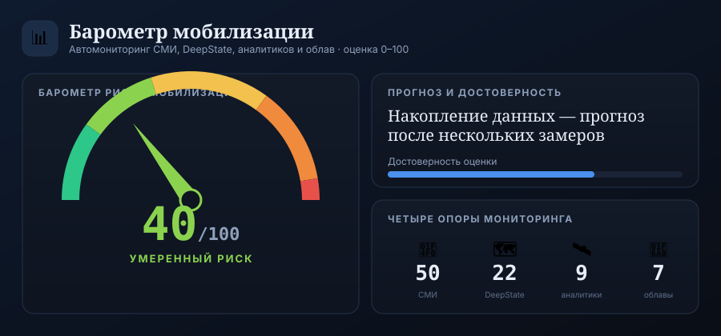

# Барометр мобилизации

Веб-приложение, которое **автоматически отслеживает открытые источники** и
сводит их к одному числу — **барометру риска новой волны мобилизации в России
от 0 до 100** — плюс ориентировочной дате.

> ⚠️ **Дисклеймер.** Это экспериментальный аналитический индикатор на основе
> открытых данных (OSINT). Барометр и «ожидаемая дата» — эвристическая оценка
> тональности и интенсивности публичных новостей, **а не предсказание с
> гарантией** и не официальная информация. Используйте как один из сигналов,
> а не как истину.



## Что он делает

Четыре «опоры» мониторинга (ровно по запросу):

1. **Независимые СМИ** — Meduza, Медиазона, Вёрстка, Новая газета Европа, Холод,
   The Moscow Times, BBC Русская служба. Тянутся реальные RSS-ленты, новости
   фильтруются по теме (мобилизация / война / повестки) и анализируются.
2. **DeepState** — ежедневный снимок карты фронта через открытый API
   `deepstatemap.live`. Считается площадь оккупированной территории и её
   **суточное изменение** (продвижение / отступление РФ).
3. **Военные аналитики и соцсети** — Telegram (публичный веб-превью `t.me/s/…`,
   без ключей) и X/Twitter (реальный API при наличии токена, иначе пример-данные
   ISW, Rob Lee и др.).
4. **Облавы и бусификация** — отдельный поток Telegram-каналов (Осторожно,
   новости; ASTRA; SOTA) и СМИ про рейды, повестки, принудительную отправку.

Затем приложение присваивает **барометр 0–100** и показывает **ожидаемую дату**.

## Как считается барометр

Прозрачная модель (всё настраивается в `config.py`):

1. Каждая релевантная новость в окне (по умолчанию 10 дней) даёт **сигналы** из
   лексикона — ключевые фразы RU/EN с **полярностью** (к мобилизации `+` /
   против `−`, напр. «указ о мобилизации» vs «мобилизации не будет») и **весом**.
2. Сигналы складываются с учётом **свежести** (полураспад 3 дня) и **доверия к
   источнику**, группируются по 6 категориям и нормируются в диапазон `[-1, 1]`.
   DeepState нормируется отдельно из суточного Δ площади (отступление → вверх).
3. Композит `X = Σ вес_категории · норма` → барометр `= 100 · sigmoid(K·X + B)`.
   Фон (нет сигналов) ≈ 19, максимальная эскалация ≈ 89, опровержения тянут вниз.
4. **Дата** — экстраполяция по скорости роста барометра (линейная регрессия по
   истории показаний) до порога 90. Пока истории мало — «накопление данных».

Категории и веса: законы/указы (28%), подготовка/облавы/повестки (24%),
заявления власти (16%), фронт: потери/нехватка людей (12%), DeepState (10%),
общество/экономика (10%).

## Запуск

```bash
cd barometer
./run.sh                      # поставит зависимости и запустит
# или вручную:
python3 -m pip install -r requirements.txt
python3 app.py
```

Откройте **http://127.0.0.1:5000**. При первом запуске идёт сбор источников
(до минуты), дальше данные обновляются фоном раз в час и по кнопке «Обновить».

### Движок ИИ-аналитики (бесплатно)

Можно подключить **бесплатный** ИИ-анализ: LLM оценивает вероятность мобилизации
(0–100) и даёт обоснование, которое подмешивается к правиловому барометру
(65% правила + 35% ИИ). Оба числа показываются отдельно для прозрачности.

Поддерживается несколько бесплатных провайдеров (все работают прямо из браузера):

| Провайдер | Бесплатный ключ | Заметки |
|---|---|---|
| **OpenRouter** | [openrouter.ai/keys](https://openrouter.ai/keys) | модели `:free`, один ключ ко многим моделям — **рекомендуется** |
| **Groq** | [console.groq.com/keys](https://console.groq.com/keys) | очень быстро, Llama 3.3 70B |
| **Mistral** | [console.mistral.ai/api-keys](https://console.mistral.ai/api-keys) | бесплатный тариф |
| **Gemini** | [aistudio.google.com/apikey](https://aistudio.google.com/apikey) | в РФ обычно недоступен |

- **В браузерной версии (`barometer.html`)** — нажмите **«⚙ ИИ»**, выберите
  провайдера и вставьте ключ. Ключ хранится только в вашем браузере (localStorage)
  и шлётся напрямую провайдеру.
- **В серверной версии** — задайте соответствующую переменную окружения (ниже).

### Опциональные переменные окружения (серверная версия)

| Переменная | Назначение |
|---|---|
| `OPENROUTER_API_KEY` / `GROQ_API_KEY` / `MISTRAL_API_KEY` | Бесплатный ИИ-анализ. Модель — `BAROMETER_OPENROUTER_MODEL` / `BAROMETER_GROQ_MODEL` / `BAROMETER_MISTRAL_MODEL`. |
| `GEMINI_API_KEY` | Анализ Gemini (модель `BAROMETER_GEMINI_MODEL`). |
| `ANTHROPIC_API_KEY` | Анализ Claude, платный (модель `BAROMETER_LLM_MODEL`). |
| `BAROMETER_LLM_PROVIDER` | Принудительно `openrouter`/`groq`/`mistral`/`gemini`/`anthropic` (по умолчанию — авто по наличию ключа). |
| `X_BEARER_TOKEN` | Реальная выгрузка из X/Twitter API v2 (иначе `data/samples/twitter.json`). |
| `BAROMETER_REFRESH_MINUTES` / `BAROMETER_WINDOW_DAYS` | Период автообновления (60) и окно новостей (10). |

## Архитектура

```
barometer/
├── app.py                 Flask: маршруты + фоновый планировщик
├── config.py              Источники, лексикон сигналов, веса, пороги
├── core/
│   ├── sources.py         Адаптеры: RSS, Telegram (t.me/s), X, DeepState (+площадь)
│   ├── analyze.py         Правиловый разбор текста → сигналы
│   ├── llm.py             Опциональный ИИ-анализ: Gemini (беспл.) или Claude
│   ├── scoring.py         Барометр 0–100, драйверы, скорость, прогноз даты
│   ├── store.py           Хранилище SQLite (новости, снимки фронта, история)
│   └── pipeline.py        Оркестровка сбора и пересчёта + сборка состояния
├── templates/index.html   Дашборд
├── static/css|js          Тёмная «приборная» тема, шкала-барометр, графики (vanilla)
└── data/samples/          Пример-данные для платных источников (X)
```

API: `GET /api/state` (текущее состояние), `POST /api/refresh` (форс-пересчёт,
`?nollm=1` — без Claude), `GET /api/health`.

## Как расширять

- **Добавить СМИ** — строка в `RSS_SOURCES` (`config.py`).
- **Добавить Telegram-канал** — строка в `TELEGRAM_CHANNELS`.
- **Подкрутить чувствительность** — фразы и веса в `LEXICON`, веса категорий в
  `SIGNAL_CATEGORIES`, коэффициенты сигмоида `SCORE_K` / `SCORE_B`.
- **Реальные X/Telegram-аккаунты** — задать `X_BEARER_TOKEN`; для приватного
  Telegram можно подключить `telethon` в отдельном адаптере по образцу.

## Этика и ограничения

Используются **только публичные** новостные ленты и открытые API. Барометр
агрегирует уже опубликованную журналистами информацию. Это инструмент
наблюдения и анализа, а не источник «инсайда»; точность ограничена качеством и
полнотой открытых источников.
