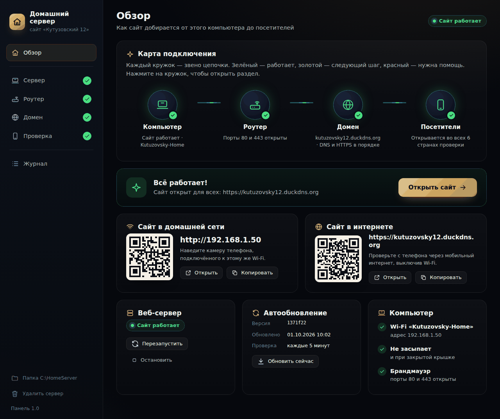

# Сайт на домашнем компьютере: «Домашний сервер»

Панель для Windows 10/11, которая превращает ваш ноутбук в сервер для этого
сайта. Ничего не нужно вводить в консоли: панель сама ставит веб-сервер,
настраивает автозапуск и автообновление сайта, запрещает ноутбуку засыпать,
пытается открыть порты на роутере, подключает домен с HTTPS и проверяет, что
сайт открывается из интернета.



## Коротко

1. Скачайте архив: <https://github.com/parfentsevandrey-blip/test/archive/refs/heads/claude/friendly-hamilton-gvizld.zip>
2. Щёлкните по нему правой кнопкой → **«Извлечь все…»** → **«Извлечь»**.
3. Откройте папку `deploy\windows` и дважды щёлкните **`home-server.cmd`**.
   - Если Windows предупредит о файле из интернета, нажмите «Подробнее» →
     «Выполнить в любом случае» (или «Запустить»).
   - На вопрос «Разрешить этому приложению вносить изменения?» ответьте **«Да»**.
4. Откроется окно панели. Нажимайте золотые кнопки по порядку:
   **Сервер → Роутер → Домен → Проверка**. Каждый шаг объясняет, что происходит.

Окно панели можно закрыть в любой момент: сервер продолжит работать и сам
запустится после перезагрузки. Открыть панель снова — тот же `home-server.cmd`.

## Почему не SelfPrivacy

[SelfPrivacy](https://selfprivacy.org) — хороший проект, но для этой задачи не подходит:

- **Ставится только на арендованный облачный сервер** (Hetzner или DigitalOcean):
  приложение само создаёт его через API провайдера. На своё железо — нельзя, это
  прямо сказано в их [FAQ](https://selfprivacy.org/docs/faq/) («Can I put
  SelfPrivacy on my hardware? — Unfortunately, no») и в
  [инструкции](https://selfprivacy.org/docs/getting-started/).
- **Среди его сервисов нет хостинга обычного сайта**: почта, Nextcloud, Forgejo,
  Vaultwarden, Jitsi и т. п.
- Его установщик стирает систему и рассчитан на сервер с кабельной сетью —
  Wi-Fi он не настраивает. Из России к тому же нельзя оплатить Hetzner или
  DigitalOcean российской картой.

Поэтому здесь сделано то же по духу (свой сервер, свои данные, без посредников),
но для вашего ноутбука и вашего сайта.

## Как это устроено

```
 Посетитель ──► домен (имя.duckdns.org) ──► ваш внешний IP ──► роутер
                                                                  │ порты 80 и 443
                                                                  ▼
            GitHub ── каждые 5 минут ──►  ноутбук: Caddy (HTTPS) ──► файлы сайта
```

- **Caddy** — веб-сервер. Работает как служба Windows «Домашний сервер (сайт)»
  и сам получает бесплатный HTTPS-сертификат Let's Encrypt.
- **Сайт** скачивается из GitHub (основная ветка репозитория). Задача планировщика
  проверяет обновления каждые 5 минут: изменили сайт в GitHub — через 5 минут он
  обновится на ноутбуке.
- **Роутер** должен пропускать посетителей из интернета на ноутбук (порты 80 и 443).
  Панель пробует настроить это сама (UPnP), а если роутер не позволяет — показывает
  пошаговую инструкцию для популярных моделей.
- **Домен** — адрес сайта. Бесплатно: `ваше-имя.duckdns.org`
  ([DuckDNS](https://www.duckdns.org) — вход через GitHub или Google, имя и
  токен вставляются в панель). Или свой домен, например `.ru` или `.рф`.

## Что важно знать заранее

**Нужен «белый» IP-адрес.** Многие провайдеры дают абонентам «серый» адрес —
один на многих. Тогда к роутеру нельзя подключиться из интернета, и сайт будет
виден только дома. Панель определяет это автоматически (если роутер умеет UPnP)
или подскажет, как проверить за минуту. Если IP серый:

1. Попросите у провайдера «белый» (лучше статический) IP — обычно это недорогая
   платная услуга. Самый надёжный вариант.
2. Или используйте туннель — например, [Tuna](https://tuna.am) (российский
   сервис, постоянный адрес на платном тарифе). Cloudflare Tunnel бесплатный, но
   с лета 2025 года российские провайдеры [замедляют Cloudflare](https://habr.com/ru/news/922532/),
   и посетители из России могут не открыть сайт.

**VPN на компьютере-сервере лучше выключить.** Иначе внешний адрес определится
неверно, и посетители не попадут на сайт. Панель предупредит, если увидит VPN.

**Из дома сайт по домену может не открываться** — это особенность некоторых
роутеров. Проверяйте с телефона через мобильный интернет (выключив Wi-Fi) или
кнопкой «Проверить из интернета» в панели. Дома открывайте адрес вида
`http://192.168.1.50` — панель покажет его и QR-код.

## Ноутбук как сервер 24/7

- Держите ноутбук **на зарядке**. Батарея работает как бесперебойник: если
  отключат свет, сайт продолжит работать.
- Если в BIOS или фирменной утилите есть **ограничение заряда** («Conservation
  mode» у Lenovo, «Battery Health Charging» у ASUS, «Primarily AC use» у Dell),
  включите его: постоянные 100 % изнашивают батарею.
- **Крышку можно закрыть** — панель настроила Windows так, что ноутбук не уснёт.
  Если он сильно греется, оставьте крышку приоткрытой и не ставьте его на мягкое.
- Обновления Windows могут перезагрузить ноутбук. Это не страшно: сервер и
  автообновление запускаются сами, даже без входа в систему. Wi-Fi должен быть
  с отметкой «Подключаться автоматически».

## Если что-то не работает

Начните с раздела **«Обзор»**: красный кружок показывает, какое звено сломалось,
а кнопка рядом ведёт к решению. Подробности — в разделе **«Журнал»**.

| Что видно | Что сделать |
|---|---|
| «Порт занят другой программой» при установке | Закройте её (например, Skype или IIS) или отключите её службу и нажмите «Установить» ещё раз |
| Роутер «не ответил по UPnP» | Откройте порты вручную по инструкции на странице «Роутер» или включите UPnP в настройках роутера |
| Домен «указывает не на ваш IP» | Для DuckDNS проверьте имя и токен; для своего домена — A-запись у регистратора. После изменений подождите 5–10 минут |
| HTTPS-сертификат не получен | Let's Encrypt должен достучаться до ноутбука по портам 80/443: проверьте роутер и «белый» IP |
| Проверка из интернета не проходит | Порты не открыты, IP серый или провайдер блокирует порты 80/443 — уточните у поддержки провайдера |
| Окно панели не открылось | Журнал запуска: `%TEMP%\home-server-panel.log` |

## Удаление

В панели слева внизу — **«Удалить сервер»**. Будут удалены служба, задача
автообновления, правила брандмауэра, правила UPnP на роутере и папка
`C:\HomeServer`. Настройки сна остаются как есть (их можно вернуть в «Параметры
→ Система → Питание»). Сам сайт в GitHub и домен не пострадают.

## Что внутри

| Файл | Зачем |
|---|---|
| `windows/home-server.cmd` | Запуск панели двойным щелчком |
| `windows/home-server.ps1` | Сама панель: локальный «движок» на PowerShell (только для этого компьютера, доступ по одноразовому ключу) и все действия — установка, домен, проверки, удаление |
| `windows/panel.html` | Окно панели (открывается в Microsoft Edge в режиме приложения) |
| `windows/update.ps1` | Автообновление сайта из GitHub и динамического DNS (каждые 5 минут) |
| `linux/setup-server.sh` | То же самое для Ubuntu / Debian / Linux Mint одной командой — если решите отдать ноутбук целиком под Linux |

Всё ставится в `C:\HomeServer`: `caddy.exe`, настройки `Caddyfile`, папка `site`
с сайтом, `data` с сертификатами и `logs` с журналами.

## Вариант для Linux

Если ноутбук больше ни для чего не нужен, надёжнее поставить на него Ubuntu
Desktop 26.04 LTS: Wi-Fi там настраивается мышкой, и обновления Windows не
перезагружают ноутбук. После установки откройте «Терминал» и выполните:

```bash
sudo apt update && sudo apt install -y git
git clone --depth 1 -b claude/friendly-hamilton-gvizld https://github.com/parfentsevandrey-blip/test.git ~/site-setup
sudo bash ~/site-setup/deploy/linux/setup-server.sh
```

Скрипт задаст пару вопросов (домен можно пропустить и добавить позже, запустив
его снова) и сделает то же, что и панель: Caddy с HTTPS, автообновление сайта
из GitHub, запрет сна при закрытой крышке, файрвол и, при необходимости, DuckDNS.

## А если без своего компьютера?

Сайт статический, поэтому его можно бесплатно разместить и на GitHub Pages
(«Settings → Pages» в репозитории). Тогда не нужны ни ноутбук, ни роутер, ни
белый IP. Свой сервер даёт полный контроль: свои данные, свой домен и
возможность позже добавить что-то кроме сайта.
