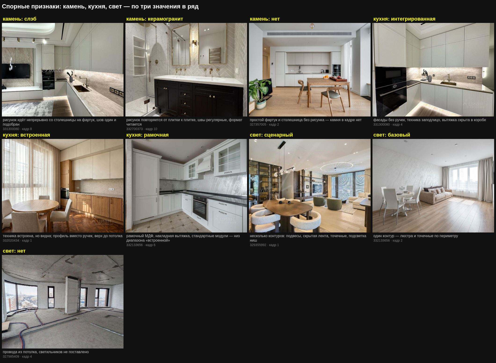

# Чтение фотографий

Единственный способ узнать, что за ремонт в квартире. Поля объявления
заявительные и врут несимметрично, текст описывает намерения продавца, а
фотографии показывают то, что есть. Проверено на тридцати одной квартире:
поля не отличили пустую коробку от авторского интерьера ни разу, кадры —
каждый раз.

Отсюда и порядок: поля и текст — дешёвый отсев, кадры — ответ.

## Два шага, и второй обязателен

```bash
# шаг 1: контактный лист, двенадцать кадров в одном изображении
node tools/cian/cian.js verify --ids 326035617 --photos 12 --cols 4 --dir sheets

# шаг 2: выбранные кадры в исходном разрешении
node tools/cian/cian.js verify --ids 326035617 --frames 3,6,11 --dir sheets
```

**Шаг 1 отвечает на вопрос «что в квартире есть».** Двенадцать кадров по
четыре в ряд — этого хватает, чтобы увидеть: есть ли вообще интерьер, пусто
или обжито, что за кадры (квартира, фасад, лобби, план) и чем продавец
открывает галерею.

**Шаг 2 отвечает на вопрос «настоящее ли это».** В мелком размере рендер уже
один раз сошёл у меня за съёмку: лот 329819607 на контактном листе читался
как набор визуализаций из-за тёмной палитры и студийного света, а в
оригинале оказался фактурой ткани, вышивкой на наволочке и экраном духового
шкафа. Ошибка возможна и в обратную сторону, и она дороже.

Смотреть в оригинале **не меньше трёх кадров**: одна картинка не решает.

### Какие кадры брать в оригинал

| Кадр | Что он решает |
|---|---|
| кухня целиком | класс всей квартиры: фасады, техника, столешница, фартук |
| санузел | камень и арматура — самая честная статья сметы |
| жилая зона с окном | проверка на рендер: виден ли вид из окна |
| деталь с тканью или постелью | проверка на рендер: есть ли фактура |

## Рендер или съёмка

Автоматически не отличить — это проверено и закрыто: ни поля Циан, ни
размеры, ни JPEG-заголовки, ни EXIF не разделяют классы, Циан перекодирует
всё одинаково (traps.md, пункт 23). Значит смотреть глазами, и знать, куда.

### Приметы рендера

1. **Окна выбиты в белое.** Самая надёжная. В интерьерной съёмке фотограф
   экспонирует по окну или сшивает кадр, и вид почти всегда виден. В рендере
   окно — источник света, за ним пусто.
2. **Свет без затухания.** Светильник горит, а на соседней стене нет
   градиента; лампа стоит у стены, но пятна на ней не даёт.
3. **Повторяющийся рисунок.** Паркет планка в планку, ковёр с механическим
   раппортом, одинаковые листья у растений.
4. **Стекло без преломления.** Витрины шкафов залиты ровным градиентом,
   вместо содержимого — дымка.
5. **Стерильность.** Ни пыли, ни отпечатков, ни проводов, ни отражения
   фотографа в зеркале или в тёмном стекле.
6. **Камень без шва.** Здесь легко ошибиться: книжный раскрой — это и есть
   зеркальная пара, две соседние плиты, раскрытые как страницы. Отличает
   его **настоящий шов по оси отражения**. У текстуры шва нет, зеркало
   бывает сразу по двум осям, а рисунок повторяется через равные
   промежутки.
7. **Невозможная точка съёмки.** Камера в стене, потолок и пол в одном
   кадре, идеально фронтальная геометрия без завала вертикалей.

### Приметы съёмки

1. Фактура ткани, ворс ковра, складки постели, вышивка.
2. Экраны техники с реальным интерфейсом, наклейки, шнуры, розетки в работе.
3. Дисторсия широкоугольника, завал вертикалей, виньетка.
4. Неравномерный свет, тени от нескольких источников, пересвет у окна.
5. Водяной знак агентства поверх кадра, отражение фотографа.
6. Мелкий беспорядок жизни: полотенце не так висит, провод на полу, пятно.

### Промежуточные случаи

- **Смешанное.** Часть кадров снята, часть дорисована. Встречается у
  застройщиков: фасад и лобби — рендер, квартира — съёмка. Но бывает и
  внутри квартиры: у лота 331300080 жилая часть снята, а санузлы
  нарисованы, и заметно это только в исходном разрешении.

  **Признаки читаются только по снятой части.** Всё, что видно на
  дорисованных кадрах, — это намерение, а не квартира; ставить по ним
  признак значит выдавать картинку за отделку.

  Самая надёжная примета: **ростовое зеркало во фронтальном кадре.** Снять
  его в лоб и не попасть в отражение невозможно. Нет фотографа в зеркале —
  кадр нарисован.

  Вторая: **формат кадра.** Дорисованные часто отличаются пропорцией от
  снятых в той же галерее — 768×960 против 1260×945. Само по себе это не
  доказательство, но повод присмотреться.
- **Интерьера нет.** Все кадры про дом, двор, бассейн и лифтовый холл. Это
  не «нет данных», а сигнал: показывать нечего. У лота 331610113 таких
  двенадцать из двенадцати.
- **Рендер — не всегда обман.** Если продавец сам застройщик и квартира
  идёт с пакетной отделкой, визуализация показывает именно пакет, и это
  честно. Разница остаётся в другом: подтверждено против заявлено, и она
  должна попадать в цену.

## Восемь признаков и как их читать

Оценка ставится не буквой, а признаками; буква выводится из них
арифметикой. Меньше четырёх видимых признаков — оценки нет вовсе.

**`null` — «не видно», `нет` — «нечего видеть».** Правило общее для всех
восьми признаков, а не только для камня. В бетонной коробке кухни нет не
потому, что кадр неудачный, а потому что кухни нет: это `нет`. В квартире,
где кухня просто не попала в кадр, — `null`. Разница не косметическая: `нет`
опускает букву до D или E, `null` её не трогает.

**Признаки читаются только по квартире.** Лобби, лифтовый холл, паркинг,
двор, бассейн — не квартира, даже когда они сняты, а не дорисованы. Мрамор
слэбом и сценарный свет в вестибюле встречаются у домов, где сама квартира
стоит бетоном. Я сам на этом попался: у Космодамианской 4/22 в записи стояли
«свет сценарный» и «мебель полный», прочитанные с рендера ЛОББИ.

### `stone` — камень

| Значение | Как узнать |
|---|---|
| `слэб` | **сплошная панель без плиточных швов** — камень или агломерат. Продолжение рисунка со столешницы на фартук бывает и означает дорогое исполнение, но обязательным признаком не является: две детали одного материала без швов — тоже слэб |
| `керамогранит` | **плитка с читаемым форматом**: рисунок повторяется от плитки к плитке, швы регулярные. Название историческое — значение про формат, а не про материал: мелкоформатный натуральный мрамор тоже сюда |
| осторожно | признак меряет формат, а не породу: светлый агломерат с крапом — такой же слэб, как драматичный мрамор, просто дешевле |
| осторожно | скинали на мелком кадре читается как слэб: непрерывный рисунок, швов нет. Выдают круглые бобышки крепежа и просвечивающая сквозь стекло штукатурка — видно только в кропе исходника |
| `нет` | крашеная стена, ЛДСП, либо камня в квартире нет вовсе |
| `null` | кухня и санузел в кадр не попали — читать не по чему |

На сплошной выверке тридцати одной квартиры камень оказался самым
недооценённым признаком: на контактном листе сплошная панель без швов
читается как плитка, и четыре лота из двадцати четырёх пришлось поднять со
«слэба». Смотреть только в оригинале.

**Если помещения расходятся, решает кухня**: слэб на столешнице и фартуке —
самая дорогая и самая нарочитая статья, её ставят первой. Кухни в кадре нет
— читать по санузлу. Расхождение бывает настоящим: на Ордынском 4А кухня
слэбом, а гостевой санузел выложен мелкой мозаикой. Записывать, откуда
прочитано; тот же камень при этом честно работает и на `bath` — это не
двойной счёт, а два разных вопроса: чем облицовано и что за сантехника.

### `joinery` — столярка и хранение

| Значение | Как узнать |
|---|---|
| `на заказ` | фасады в размер помещения, от пола до потолка, ниши по месту, единый рисунок, доборов нет |
| `серийная` | стандартные модули, видны зазоры и доборные планки, верх не доходит до потолка |
| `нет` | открытые стеллажи, привозная мебель, ничего встроенного |

### `kitchen` — кухня

| Значение | Как узнать |
|---|---|
| `интегрированная` | **холодильник или посудомойка видны за мебельным фасадом**, ни один прибор не показывает лица, вытяжка скрыта, фасады без ручек |
| `встроенная` | техника встроена в мебель, но холодильник или посудомойка стоят своими фасадами; ручки или профиль |
| `эконом` | ЛДСП-фасады с видимыми кромками, накладная вытяжка, отдельностоящая плита, техника не встроена |
| `нет` | кухни в кадре нет; на стене выводы воды и розетки |

**Когда холодильник не показан ни разу.** Так бывает чаще, чем кажется:
шесть оценщиков из двенадцати назвали кухню самым трудным признаком именно
поэтому. Соблазн — поставить `интегрированная` от обратного: раз ни один
прибор не смотрит наружу, значит всё за фасадами. Это вывод из отсутствия, а
не наблюдение.

Правило: `интегрированная` ставится, когда **хотя бы один из двух —
холодильник или посудомоечная машина — виден за мебельным фасадом** (створка
приоткрыта, видна начинка; полноростовой фасад с той же фрезеровкой в ряду),
и при этом ни один прибор не показывает лица. Духовка и варочная не в счёт —
они открыты и в кухнях за десять миллионов. Не видно ни того ни другого, но
техника в кухне есть — `встроенная`. Не видно вообще ничего — `null`.

На Усачева 11Д посудомойка приоткрыта, за ней корпус машины: `интегрированная`
по наблюдению. На Софийской 18 и в Capital Towers духовки видны только
отражением, холодильник не показан — `встроенная`, и это ровно тот признак,
который развёл мою букву с буквой слепых оценщиков.

### `light` — свет

Признак легко раздуть: скрытая лента сегодня есть почти везде. Поэтому счёт
идёт по контурам, и нужны оба типа — декоративный и скрытый.

**Скрытый — тот, у которого не виден источник.** Лента в нише, под шкафами,
за панелью, контур подсветки зеркала. Врезанный в потолочный короб трек,
у которого светильники смотрят наружу, — контур архитектурный, но не
скрытый; на Усачева 11Д именно он не дал поднять свет до сценарного.

**Контуры считаются в одном помещении, и берётся лучшее.** Свет ставят
неравномерно: в гостиной сценарий, в спальне люстра и точечные. Складывать
контуры по всей квартире нельзя — тогда сценарным окажется каждый второй
лот. Записывать, по какому помещению прочитано.

| Значение | Как узнать |
|---|---|
| `сценарный` | **три и более контура в одном помещении**, из них хотя бы один декоративный (подвесы, люстра) и хотя бы один скрытый (лента в нише, под шкафами, за панелью) |
| `базовый` | один-два контура: люстра и точечные, или лента и точечные |
| `нет` | крюки и провода из потолка |

### `furniture` — мебель

`полный` — можно жить: спальные места, обеденная группа, хранение, текстиль.
`частичный` — часть комнат пуста. `нет` — пусто.

Кровать без белья при полном остальном комплекте — это `полный`: квартиру
готовили к съёмке, а не вывозили.

### `bath` — санузлы

| Значение | Как узнать |
|---|---|
| `камень и бренд` | крупноформатный камень или керамогранит на стенах **и** дизайнерская арматура |
| `плитка` | обычный формат или серийная арматура |
| `не отделан` | голые стены, разводка |

Обязательны оба условия, и их достаточно. Отдельностоящая ванна и подсветка
зеркала усиливают, но не требуются: душевая без ванны встречается и в
дорогих квартирах. На Усачева 11Д я записал «плитку» при крупном формате и
чёрной настенной арматуре с двумя душами — это «камень и бренд», и слепая
проверка поймала ошибку дважды из двух.

### `floor` — пол

`массив ёлочкой` — ёлочка, палуба, наборный рисунок.
`инженерная доска` — широкая доска, ровный настил.
`ламинат` — виден повтор рисунка, фаска, стык у порога.
`стяжка` — бетон.

Признак меряет **рисунок, а не породу**: массив от инженерной доски по кадру
не отличить, и три оценщика подряд об это споткнулись. Ёлочка и шеврон — это
`массив ёлочкой`, даже если основа многослойная; ровный настил широкой доской
— `инженерная доска`. Название историческое, как и у `керамогранит`.

Пол разделяет B и C лучше остальных признаков: он дорогой, его видно почти
на каждом кадре и заменить его позже труднее всего.

Но сам по себе он букву не делает. При серийной столярке и серийной кухне
ёлочка из массива оставляет квартиру в C — одна дорогая позиция не вытягивает
ремонт. Пол решает на границе: когда столярка на заказ и камень уже есть, он
переводит ступень.

### `doors` — двери

`скрытые` — скрытый монтаж, полотно в уровень стены, наличников нет.
`в наличнике` — обычная коробка. `нет` — проёмы без дверей.

Двери скрытого монтажа — самая дешёвая примета авторской работы: их не
ставят там, где экономили на остальном.

## Буквы

| Буква | Что это |
|---|---|
| A | авторский премиум: камень слэбом, столярка на заказ, интегрированная техника, световые сценарии, полный комплект |
| B | качественный полный ремонт на серийных материалах |
| C | жилая массовая отделка: ламинат, кухня эконом, базовый свет |
| D | отделка застройщика: полы, стены и санузлы есть, кухни и мебели нет |
| E | бетон или белая коробка |

D и E ставятся не по баллам, а по состоянию: если нет ни кухни, ни мебели —
это D, а если и санузлы не отделаны — E. Считать средний балл там нечего.

**Буква измеряет то, что стоит в квартире, а не то, кто это поставил.**
Пакетная отделка застройщика в премиальном доме бывает уровня A, частный
ремонт — уровня C. В Capital Towers я записал «отделка застройщика плюс
меблировка» и поставил C, а в санузле там тёмный камень во всю высоту
книжным раскроем и отдельностоящая ванна. Происхождение — сведение о цене
(за пакет платили один раз, и он входил в стоимость), но не о ступени.

**Средний балл по шести признакам и по восьми — разные шкалы.** Пол и двери
оба стоят по два: стоит дописать их к шестёрке, и средний ползёт вверх. На
Усачева 11Д именно это перевело B в A — два признака были не исправлены, а
дописаны. Сравнивать буквы честно только при сопоставимом наборе;
`grade --check` показывает, у кого буква стоит на пяти признаках и меньше.

## Состояние: жить можно или нельзя

Буква говорит, какого уровня отделка; состояние — можно ли въезжать. Это
разные вопросы, и в записи они стоят рядом. Словарь короткий:

| Значение | Что это |
|---|---|
| `под ключ` | кухня стоит, мебель есть, можно жить |
| `оболочка` | бетон, белая коробка или отделка без кухни и мебели — въехать нельзя |
| `ремонт не сдан` | работы идут: плёнка на дверях, санузлы не закончены, в тексте срок |
| `неизвестно` | кадров квартиры нет вовсе |

Состояние выводится из кадров (`kitchen` и `furniture`), а из текста берётся
только тогда, когда кадры молчат. Расхождение между тем и другим — само по
себе сведение: «пентхаус полностью укомплектован» при пустых комнатах
описывает продавца, а не квартиру, и остаётся в записи полем `conflict`.

Пять оценщиков из двенадцати пожаловались, что этого словаря в инструкции
нет, и выводили значения сами. Выводили верно — но проверять надо не удачу.

## Что записывать

```bash
node tools/cian/cian.js grade --lots lots.json --marks marks.json
```

В `marks.json` на каждый лот: `markers`, `proof`, `photosSeen` (сколько
кадров смотрели), `framesSeen` (номера кадров), `framesFull` (какие из них
открывали в оригинале) и `note` — что именно видно, своими словами.

Заметка важнее буквы. Через полгода «A» не скажет ничего, а «камень слэбом
на столешнице и фартуке, латунная мойка, гнутые фасады с подсветкой,
встроенный Bosch» — скажет всё, и позволит перепроверить.

Номера кадров записываются ради того же: оценка без указания, что именно
показало камень, остаётся впечатлением.

### Галерея растёт — оценка стареет

`photosSeen` нужен не для отчётности. Продавцы досылают кадры, и оценка,
поставленная по двенадцати, описывает уже не весь товар: у Космодамианской
4/22 к двенадцати рендерам дома потом добавили съёмку квартиры, и в ней
оказалась бетонная коробка. Из шести лотов второй слепой проверки галерея
выросла у пяти — вдвое.

`verify` сравнивает сам и предупреждает:

```
ГАЛЕРЕЯ ВЫРОСЛА: смотрели 12 кадров, сейчас 21 — оценку надо пересмотреть
```

Пересматривать стоит с новых кадров: продавцы дописывают галерею не начала,
а конца — и добавляют обычно то, чего раньше не показывали.

## Эталонный лист




Восемь случаев рядом, по одному кадру на каждый: рендер против съёмки на
одинаково тёмной палитре, бетон, отделка без мебели, массовая отделка,
качественный ремонт, авторский премиум и книжный раскрой камня. Пересобрать:

```bash
node tools/cian/cian.js verify --ids 326035617 --frames 6 --dir sheets
```

Сверяться с ним стоит до того, как ставить буквы: глаз калибруется по
соседним примерам гораздо надёжнее, чем по словесному описанию.

## Проверка записанного

```bash
node tools/cian/cian.js grade --check
```

Хранилище оценок возражает само. Четыре претензии, каждая уже случалась:

- **буква поставлена по картинке.** Уровень при `proof: рендер` описывает
  визуализацию, а не квартиру, и в сравнении цен это другой товар;
- **текст расходится с кадрами** — продавец обещает больше, чем показывает;
- **премиальные признаки при пустой квартире** — отделка есть, жить нельзя,
  сравнивать только с такими же;
- **одинаковые признаки при разных буквах** — значит арифметика разъехалась
  с записями.

Плюс две сводки: у кого признаков меньше четырёх (буквы нет) и у кого
пропущен второй шаг — кадры в исходном разрешении.

Проверка сразу нашла мою собственную ошибку: у трёх лотов без единого кадра
интерьера были записаны «кухни нет» и «мебели нет». Это вывод из текста, а
не наблюдение, и признаки заменены на `null`. Правило простое: **если
подтверждение — «интерьера нет», то и признаков нет ни одного.**

## Чего кадры не решают

- **Возраст ремонта.** Стиль подсказывает десятилетие, но не год. Классика
  с лепниной и хрусталём читается как середина 2010-х, и это догадка.
- **Качество работ.** Видны материалы, не видны стяжка, разводка и стыки.
- **Что остаётся при продаже.** Мебель на кадрах бывает и хозяйской, и
  привезённой для съёмки. Ответ даёт текст, а окончательный — договор.
- **Шум, соседи, инсоляция.** Из окна виден вид, а не то, что слышно.

## Проверка на переносимость

Инструкцию проверили вслепую дважды: шесть квартир, по два независимых
оценщика на каждую, у них были только этот документ, эталонные листы и
кадры. Свериться с моими оценками они не могли.

**Первая проверка — на калибровочном наборе**, то есть на тех самых
квартирах, из которых собраны эталонные листы:

| Что проверялось | Итог |
|---|--:|
| буква сошлась с записанной | **12 из 12** |
| вид подтверждения сошёлся | 11 из 12 |
| двое вслепую сошлись между собой | **6 из 6** |

Единственное расхождение оказалось не ошибкой оценщика, а **ошибкой в моей
записи**: он поставил лоту 331300080 «смешанное» вместо «фото» и оказался
прав — санузлы там дорисованы.

Двенадцать из двенадцати — цифра льстивая: оценщики сверялись с примерами,
выведенными из этих же квартир. Поэтому проверку повторили.

**Вторая проверка — на лотах, которых нет ни на эталонных листах, ни в
тексте инструкции** (322282922, 324077709, 330937338, 331631350, 332239634,
332312603). Кадры на этот раз выбирал не я: в папке лежала вся галерея, и
какие открыть в оригинале, решал оценщик.

| Что проверялось | Итог |
|---|--:|
| буква сошлась с записанной | 6 из 12 |
| вид подтверждения сошёлся | 10 из 12 |
| состояние сошлось | 10 из 12 |
| двое вслепую сошлись между собой | **6 из 6** |

Читать это надо так: **прибор повторяем, а мерил им плохо я.** Двенадцать
оценщиков, разбитые на шесть независимых пар, ни разу не разошлись между
собой — при том что кадры каждый выбирал сам. Разошлись они с записями, и в
каждом случае, перепроверив кадры в оригинале, правым оказывался не я:

- **330937338**, Космодамианская 4/22 — у меня «буква не ставится, рендер»,
  у обоих «E, оболочка, смешанное». В галерее появились кадры самой
  квартиры: бетон. Плюс два признака в моей записи были прочитаны с рендера
  лобби. Исправлено.
- **332239634**, Capital Towers — у меня C, у обоих A. Я прочитал интерьер
  как «отделку застройщика» и не заметил камня в санузле. После сплошной
  выверки стало B: `kitchen` осталась «встроенной», потому что холодильник
  не показан ни разу, и на этом одном признаке расходятся B и A.
- **322282922**, Усачева 11Д — у меня B, у обоих A. Санузел был недочитан
  («плитка» вместо «камень и бренд»), кухня тоже; ещё два признака просто не
  были записаны. Стало A.

Против первой проверки изменилось одно: там оценщики работали на моём поле,
здесь — на своём. Совпадение упало с 12 из 12 до 6 из 12, и это честная
цифра приёма, а не поражение: пары сходятся, значит рубрики читаются
одинаково; расхождение с записями означает, что записи ставились небрежнее,
чем инструкция требует.

Три трудных места повторились у всех и вошли в рубрики: кухня без видимого
холодильника, санузел на границе «плитки», признаки из мест общего
пользования.

### Что оказалось трудным для всех

В первой проверке семь оценщиков из двенадцати назвали самым трудным
`stone`, и по одной и той же причине: рубрика написана в расчёте на готовую
кухню. Если кухни нет вовсе, читать столешницу и фартук не по чему.

Правило, которое из этого следует и которое один из них сформулировал
точнее меня: **`нет` и `null` — разное.** `null` — «не видно», `нет` —
«нечего видеть». В бетонной коробке камня нет не потому, что кадр плохой, а
потому что камня нет; это `нет`. В квартире, где кухня в кадр не попала, —
`null`.

Во второй проверке трудным стал `kitchen` — шесть жалоб из двенадцати, все
об одном: холодильник не показан. Рубрика требовала наблюдения, а кадры его
не давали, и оценщики выводили признак из отсутствия чужих лиц в ряду. Это
разошлось с моей записью на двух лотах из шести и решило букву на одном.
Правило дописано в саму рубрику.

Второй по частоте — `bath`: четыре жалобы. Рубрика перечисляла четыре
приметы, не говоря, сколько нужно; теперь обязательны две — формат и
арматура.

Второе: **скинали читается как слэб на мелком размере.** Стекло на
креплениях-грибках даёт непрерывный рисунок без швов, и отличить его от
цельной плиты можно только в кропе исходника — по круглым бобышкам крепежа
и по тому, что сквозь стекло просвечивает штукатурка.

Третье: **интегрированная против встроенной.** Здесь рубрика была
двусмысленной, и слепая проверка это вскрыла: «техника заподлицо» и «техника
видна» друг друга не исключают, встроенная заподлицо духовка — и то, и
другое сразу.

Разводит их не видимость вообще, а **что именно видно**. Духовка и варочная
открыты всегда, даже в кухнях за десять миллионов, — это не признак.
Признак — холодильник и посудомоечная машина: спрятаны за мебельным фасадом
значит `интегрированная`, стоят своими лицами значит `встроенная`.

Проверено на четырёх лотах с открытой духовкой (331300080, 311102437,
320386160, 332867884): все четыре остаются интегрированными, потому что
холодильник у всех за фасадом.

## Осечки, которые уже случились

**Мелкий размер выдал съёмку за рендер.** 329819607: тёмная палитра и
студийный свет на контактном листе читались как CGI. Полное разрешение
показало фактуру. Отсюда правило про три кадра в оригинале.

**Признаки прочитаны с рендера чужого помещения.** Космодамианская 4/22: у
лота двенадцать кадров, из них один интерьерный — визуализация лобби со
львами. Я записал «свет сценарный» и «мебель полный». Это вестибюль, а не
квартира. Правило «нет кадров интерьера — нет признаков» я к тому моменту
уже написал и сам же обошёл: интерьерный кадр формально был, только чужой.
Сама квартира, как выяснилось позже из добавленных кадров, стоит бетоном —
при цене метра как у готовой квартиры на Софийской 18.

**Происхождение отделки принято за её уровень.** Capital Towers: «отделка
застройщика плюс меблировка», буква C. В санузле — тёмный камень во всю
высоту книжным раскроем, отдельностоящая ванна у панорамного окна, шкафы в
размер до потолка. Пакет застройщика в премиальном доме бывает дороже
частного ремонта; буква меряет то, что стоит, а не то, кто это купил.

**Восемь лотов подряд подтвердили поле, девятый опроверг.** `repairType` из
карточки совпал с оценкой по фото семь раз, и я уже записал его в надёжные.
Lucky (327357005) помечен «дизайнерский» при кухне эконом и крашеных
дверях. Поле заявительное: `no` продавцу невыгодно, `design` ничего не
стоит.

**Текст обещал больше, чем показал.** Костянский 13: «пентхаус под ключ,
полностью укомплектован», на кадрах кухня стоит, а комнаты пустые.
Расхождение теперь помечается машинно и остаётся в записи.

**Я сам нарушил собственное правило про второй шаг.** Кухню в Lucky
(327357005) я записал как «эконом» по контактному листу, не открыв ни одного
кадра в оригинале. В исходном разрешении это встроенная кухня без ручек:
техника заподлицо, холодильник за фасадом, варочная в уровень столешницы.
Буква осталась C, но признак был поставлен неверно — и попал в разбор,
который я показывал.

Мораль не в том, что глаз ошибается, а в том, что порядок работает: правило
про три кадра в оригинале существует ровно для таких случаев, и стоило его
пропустить, как ошибка появилась. `grade --check` теперь показывает, у кого
второй шаг пропущен.

**Эталонный лист остался без примера «эконом».** Среди тридцати одной
оценённой квартиры чистого эконома не нашлось: самое дешёвое — рамочный МДФ
с накладной вытяжкой на Ленинском, и это нижний край «встроенной». Ставить в
эталон выдуманный пример хуже, чем оставить пробел; значение остаётся в
шкале, но сверяться с ним пока не с чем.
