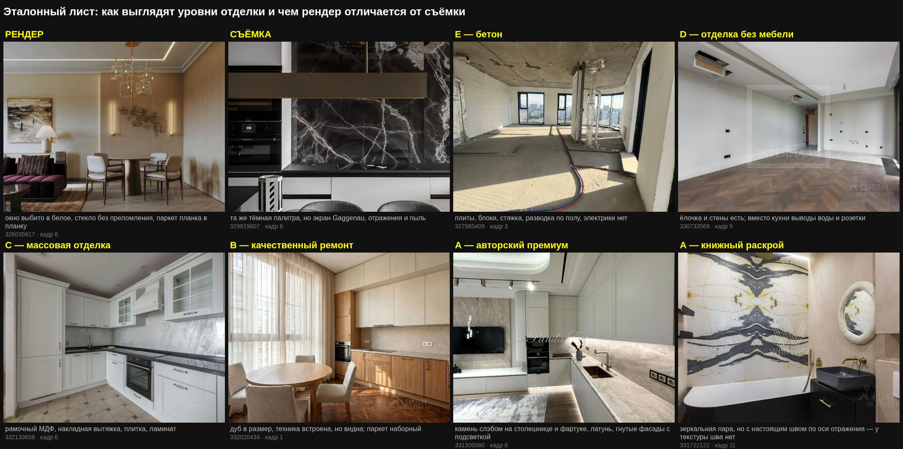

# Чтение фотографий

Единственный способ узнать, что за ремонт в квартире. Поля объявления
заявительные и врут несимметрично, текст описывает намерения продавца, а
фотографии показывают то, что есть. Проверено на тридцати одной квартире:
поля не отличили пустую коробку от авторского интерьера ни разу, кадры —
каждый раз.

Отсюда и порядок: поля и текст — дешёвый отсев, кадры — ответ.

## Два шага, и второй обязателен

```bash
# шаг 1: контактный лист, двенадцать кадров в одном изображении
node tools/cian/cian.js verify --ids 326035617 --photos 12 --cols 4 --dir sheets

# шаг 2: выбранные кадры в исходном разрешении
node tools/cian/cian.js verify --ids 326035617 --frames 3,6,11 --dir sheets
```

**Шаг 1 отвечает на вопрос «что в квартире есть».** Двенадцать кадров по
четыре в ряд — этого хватает, чтобы увидеть: есть ли вообще интерьер, пусто
или обжито, что за кадры (квартира, фасад, лобби, план) и чем продавец
открывает галерею.

**Шаг 2 отвечает на вопрос «настоящее ли это».** В мелком размере рендер уже
один раз сошёл у меня за съёмку: лот 329819607 на контактном листе читался
как набор визуализаций из-за тёмной палитры и студийного света, а в
оригинале оказался фактурой ткани, вышивкой на наволочке и экраном духового
шкафа. Ошибка возможна и в обратную сторону, и она дороже.

Смотреть в оригинале **не меньше трёх кадров**: одна картинка не решает.

### Какие кадры брать в оригинал

| Кадр | Что он решает |
|---|---|
| кухня целиком | класс всей квартиры: фасады, техника, столешница, фартук |
| санузел | камень и арматура — самая честная статья сметы |
| жилая зона с окном | проверка на рендер: виден ли вид из окна |
| деталь с тканью или постелью | проверка на рендер: есть ли фактура |

## Рендер или съёмка

Автоматически не отличить — это проверено и закрыто: ни поля Циан, ни
размеры, ни JPEG-заголовки, ни EXIF не разделяют классы, Циан перекодирует
всё одинаково (traps.md, пункт 23). Значит смотреть глазами, и знать, куда.

### Приметы рендера

1. **Окна выбиты в белое.** Самая надёжная. В интерьерной съёмке фотограф
   экспонирует по окну или сшивает кадр, и вид почти всегда виден. В рендере
   окно — источник света, за ним пусто.
2. **Свет без затухания.** Светильник горит, а на соседней стене нет
   градиента; лампа стоит у стены, но пятна на ней не даёт.
3. **Повторяющийся рисунок.** Паркет планка в планку, ковёр с механическим
   раппортом, одинаковые листья у растений.
4. **Стекло без преломления.** Витрины шкафов залиты ровным градиентом,
   вместо содержимого — дымка.
5. **Стерильность.** Ни пыли, ни отпечатков, ни проводов, ни отражения
   фотографа в зеркале или в тёмном стекле.
6. **Камень без шва.** Здесь легко ошибиться: книжный раскрой — это и есть
   зеркальная пара, две соседние плиты, раскрытые как страницы. Отличает
   его **настоящий шов по оси отражения**. У текстуры шва нет, зеркало
   бывает сразу по двум осям, а рисунок повторяется через равные
   промежутки.
7. **Невозможная точка съёмки.** Камера в стене, потолок и пол в одном
   кадре, идеально фронтальная геометрия без завала вертикалей.

### Приметы съёмки

1. Фактура ткани, ворс ковра, складки постели, вышивка.
2. Экраны техники с реальным интерфейсом, наклейки, шнуры, розетки в работе.
3. Дисторсия широкоугольника, завал вертикалей, виньетка.
4. Неравномерный свет, тени от нескольких источников, пересвет у окна.
5. Водяной знак агентства поверх кадра, отражение фотографа.
6. Мелкий беспорядок жизни: полотенце не так висит, провод на полу, пятно.

### Промежуточные случаи

- **Смешанное.** Часть кадров снята, часть дорисована. Встречается у
  застройщиков: фасад и лобби — рендер, квартира — съёмка.
- **Интерьера нет.** Все кадры про дом, двор, бассейн и лифтовый холл. Это
  не «нет данных», а сигнал: показывать нечего. У лота 331610113 таких
  двенадцать из двенадцати.
- **Рендер — не всегда обман.** Если продавец сам застройщик и квартира
  идёт с пакетной отделкой, визуализация показывает именно пакет, и это
  честно. Разница остаётся в другом: подтверждено против заявлено, и она
  должна попадать в цену.

## Восемь признаков и как их читать

Оценка ставится не буквой, а признаками; буква выводится из них
арифметикой. Значение `null` — «на кадрах не видно», и это не то же самое,
что «нет». Меньше четырёх видимых признаков — оценки нет вовсе.

### `stone` — камень

| Значение | Как узнать |
|---|---|
| `слэб` | рисунок непрерывен через столешницу и фартук, швы редкие и подобранные; книжный раскрой — с видимым швом по оси зеркала |
| `керамогранит` | рисунок повторяется от плитки к плитке, швы регулярные, формат читается |
| `нет` | крашеная стена, скинали, ЛДСП |

### `joinery` — столярка и хранение

| Значение | Как узнать |
|---|---|
| `на заказ` | фасады в размер помещения, от пола до потолка, ниши по месту, единый рисунок, доборов нет |
| `серийная` | стандартные модули, видны зазоры и доборные планки, верх не доходит до потолка |
| `нет` | открытые стеллажи, привозная мебель, ничего встроенного |

### `kitchen` — кухня

| Значение | Как узнать |
|---|---|
| `интегрированная` | техника заподлицо, фасады без ручек, вытяжка скрыта, холодильник за фасадом |
| `встроенная` | техника встроена, но видна; ручки или профиль |
| `эконом` | плоские ЛДСП-фасады, накладная вытяжка, отдельностоящая плита |
| `нет` | кухни в кадре нет; на стене выводы воды и розетки |

### `light` — свет

| Значение | Как узнать |
|---|---|
| `сценарный` | несколько контуров: треки, скрытые ленты в нишах, декоративные подвесы |
| `базовый` | люстра плюс точечные, один контур |
| `нет` | крюки и провода из потолка |

### `furniture` — мебель

`полный` — можно жить: спальные места, обеденная группа, хранение, текстиль.
`частичный` — часть комнат пуста. `нет` — пусто.

Кровать без белья при полном остальном комплекте — это `полный`: квартиру
готовили к съёмке, а не вывозили.

### `bath` — санузлы

| Значение | Как узнать |
|---|---|
| `камень и бренд` | крупноформатный камень или керамогранит на стенах, дизайнерская арматура, отдельностоящая ванна, подсветка зеркала |
| `плитка` | обычный формат, серийная сантехника, стандартный смеситель |
| `не отделан` | голые стены, разводка |

### `floor` — пол

`массив ёлочкой` — ёлочка, палуба из массива, наборный рисунок.
`инженерная доска` — широкая доска, ровный настил.
`ламинат` — виден повтор рисунка, фаска, стык у порога.
`стяжка` — бетон.

Пол разделяет B и C лучше остальных признаков: он дорогой, его видно почти
на каждом кадре и заменить его позже труднее всего.

Но сам по себе он букву не делает. При серийной столярке и серийной кухне
ёлочка из массива оставляет квартиру в C — одна дорогая позиция не вытягивает
ремонт. Пол решает на границе: когда столярка на заказ и камень уже есть, он
переводит ступень.

### `doors` — двери

`скрытые` — скрытый монтаж, полотно в уровень стены, наличников нет.
`в наличнике` — обычная коробка. `нет` — проёмы без дверей.

Двери скрытого монтажа — самая дешёвая примета авторской работы: их не
ставят там, где экономили на остальном.

## Буквы

| Буква | Что это |
|---|---|
| A | авторский премиум: камень слэбом, столярка на заказ, интегрированная техника, световые сценарии, полный комплект |
| B | качественный полный ремонт на серийных материалах |
| C | жилая массовая отделка: ламинат, кухня эконом, базовый свет |
| D | отделка застройщика: полы, стены и санузлы есть, кухни и мебели нет |
| E | бетон или белая коробка |

D и E ставятся не по баллам, а по состоянию: если нет ни кухни, ни мебели —
это D, а если и санузлы не отделаны — E. Считать средний балл там нечего.

## Что записывать

```bash
node tools/cian/cian.js grade --lots lots.json --marks marks.json
```

В `marks.json` на каждый лот: `markers`, `proof`, `photosSeen` (сколько
кадров смотрели), `framesSeen` (номера кадров), `framesFull` (какие из них
открывали в оригинале) и `note` — что именно видно, своими словами.

Заметка важнее буквы. Через полгода «A» не скажет ничего, а «камень слэбом
на столешнице и фартуке, латунная мойка, гнутые фасады с подсветкой,
встроенный Bosch» — скажет всё, и позволит перепроверить.

Номера кадров записываются ради того же: оценка без указания, что именно
показало камень, остаётся впечатлением.

## Эталонный лист



Восемь случаев рядом, по одному кадру на каждый: рендер против съёмки на
одинаково тёмной палитре, бетон, отделка без мебели, массовая отделка,
качественный ремонт, авторский премиум и книжный раскрой камня. Пересобрать:

```bash
node tools/cian/cian.js verify --ids 326035617 --frames 6 --dir sheets
```

Сверяться с ним стоит до того, как ставить буквы: глаз калибруется по
соседним примерам гораздо надёжнее, чем по словесному описанию.

## Чего кадры не решают

- **Возраст ремонта.** Стиль подсказывает десятилетие, но не год. Классика
  с лепниной и хрусталём читается как середина 2010-х, и это догадка.
- **Качество работ.** Видны материалы, не видны стяжка, разводка и стыки.
- **Что остаётся при продаже.** Мебель на кадрах бывает и хозяйской, и
  привезённой для съёмки. Ответ даёт текст, а окончательный — договор.
- **Шум, соседи, инсоляция.** Из окна виден вид, а не то, что слышно.

## Осечки, которые уже случились

**Мелкий размер выдал съёмку за рендер.** 329819607: тёмная палитра и
студийный свет на контактном листе читались как CGI. Полное разрешение
показало фактуру. Отсюда правило про три кадра в оригинале.

**Восемь лотов подряд подтвердили поле, девятый опроверг.** `repairType` из
карточки совпал с оценкой по фото семь раз, и я уже записал его в надёжные.
Lucky (327357005) помечен «дизайнерский» при кухне эконом и крашеных
дверях. Поле заявительное: `no` продавцу невыгодно, `design` ничего не
стоит.

**Текст обещал больше, чем показал.** Костянский 13: «пентхаус под ключ,
полностью укомплектован», на кадрах кухня стоит, а комнаты пустые.
Расхождение теперь помечается машинно и остаётся в записи.
