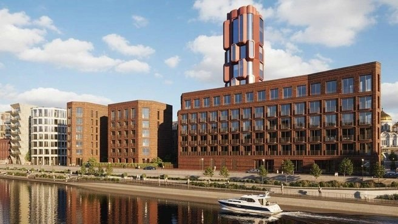
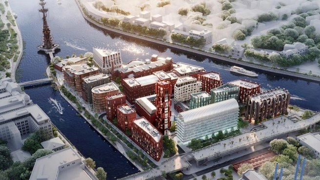
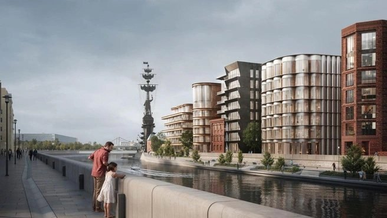
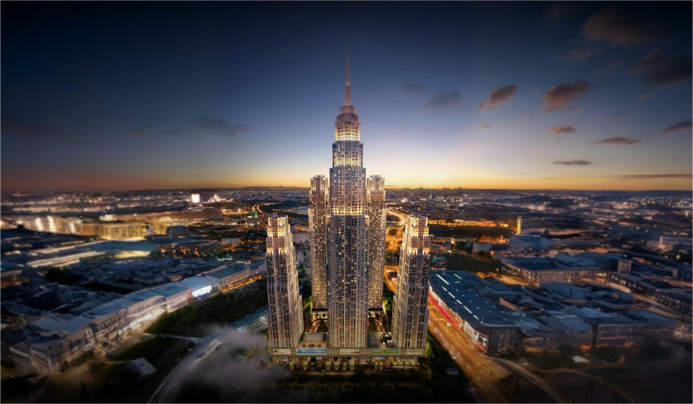
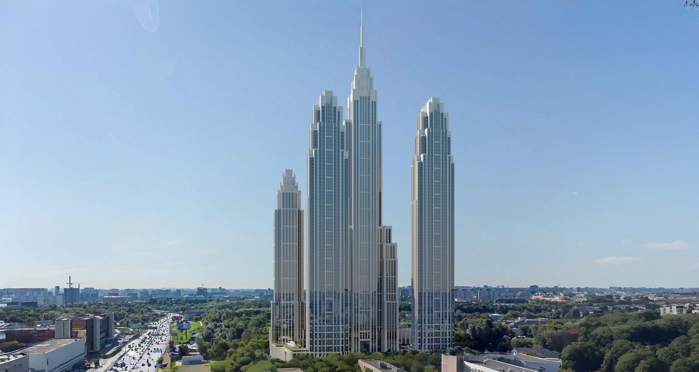
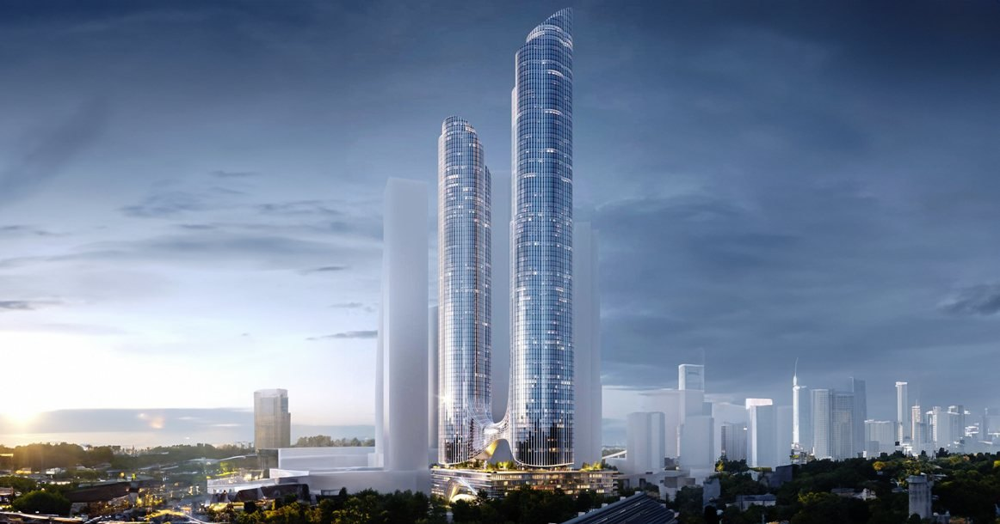
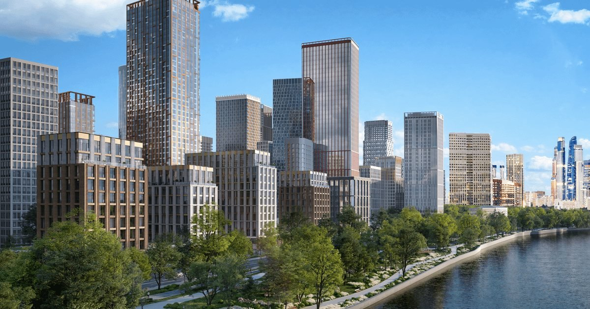
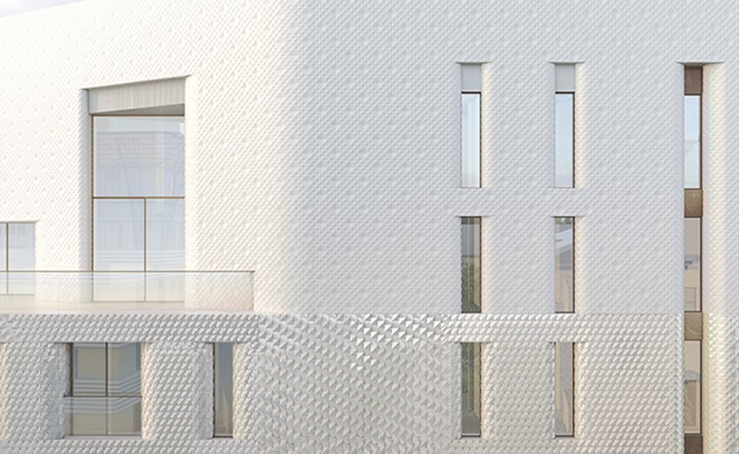
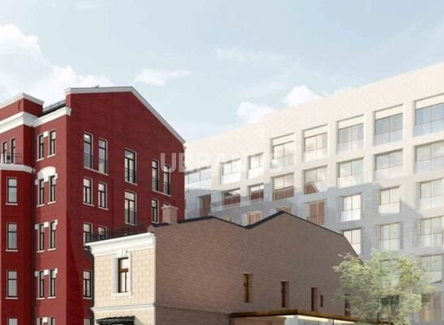

# Информационная справка по площадкам будущих ЖК в Москве

**Сет из 15 площадок · подготовлено 28 июля 2026 г.**

По каждой площадке: (1) расположение на Яндекс.Картах, (2) характеристики и застройщик/собственник,
(3) рендеры, (4) возможный старт продаж и цены, (5) последние новости.

---

## Как читать справку

**Степень подтверждённости** проставлена у каждой площадки — это принципиально, потому что
глубина публичной информации по сету различается на порядок:

| Метка | Что это значит |
|---|---|
| 🟢 **Подтверждено** | Девелопер и параметры названы в официальных сообщениях мэрии/девелопера или в профильных СМИ |
| 🟡 **Частично** | Девелопер известен, проектные параметры не раскрыты либо расходятся в источниках |
| 🔴 **Проект публично не раскрыт** | По самому земельному участку открытых данных о проекте нет; даны локация, текущее использование и градостроительный контекст |

**Про рендеры.** Опубликованные визуализации приведены **изображениями с указанием источника**.
Собственных изображений проектов не создавалось: где публичных рендеров нет, так и написано.

**Про карты.** Схемы в папке [`maps/`](maps/) собраны из тайлов Яндекс.Карт (© Яндекс).
У каждой площадки — схема расположения и ссылка на интерактивную карту.

---

## Сводная таблица

| # | Площадка | Округ / район | Застройщик / собственник | Статус | Класс |
|---|---|---|---|---|---|
| 1 | Берсеневская, 6 + Болотная, 15 | ЦАО, Якиманка | **Гута-Девелопмент** | 🟢 Концепция согласована, 1-я очередь вводится | Элит / делюкс |
| 2 | Пятницкий пер., 2 | ЦАО, Замоскворечье | **Capital Group** (ООО «Персеяпрофи») | 🟡 Проработка проекта | Премиум / элит |
| 3 | ТПУ «Новорижская» | ЗАО, анклав Кунцево | **Ингеоком** | 🟢 ППТ утверждён 17.07.2026 | Бизнес (ожид.) |
| 4 | 5-й Донской, 21Б | ЮАО, Донской | СЗ «5 Донской» / **«Союз»** (М. Блажко), GORN | 🟢 ППТ 9,3 га, 1-я башня вводится | Премиум |
| 5 | «Сити-2» (кв. 804 «Камушки») | ЦАО, Пресненский | **Capital Group** + Москва (СП 40/60) | 🟡 Расселение, проект в работе | Премиум / элит |
| 6 | Курсовой, 15 | ЦАО, Хамовники | ООО **«Курсовой Лайф»** (УК «Бердз») | 🟡 Концепция разработана | Элит |
| 7 | Амурская, 5 | ВАО, Гольяново | не раскрыт | 🔴 В контуре промзоны «Калошино» | Комфорт / бизнес |
| 8 | Боженко, 7-11 | ЗАО, Кунцево | Москва (реновация) | 🔴 Дома в программе реновации | Реновация |
| 9 | Смольная, 14, стр. 2 | САО, Головинский | не раскрыт | 🔴 Территория БЦ «Смольный» | н/д |
| 10 | Кавказский, 54 | ЮАО, Царицыно | не раскрыт | 🔴 Проект не анонсирован | Комфорт (ожид.) |
| 11 | Шеногина, 4/1 | СЗАО, Хорошёво-Мнёвники | не раскрыт (контур **ФСК** / Sydney City) | 🔴 Проект по ЗУ не анонсирован | Бизнес / премиум |
| 12 | Малый Казённый, 5А | ЦАО, Басманный | не раскрыт | 🔴 ОКН «Гаазовский дом», пожар 20.07.2026 | н/д |
| 13 | Козихинский, 22, стр. 1, 2 | ЦАО, Пресненский | **Dominanta** (+ COLDY) | 🟢 Согласовано 9 377 м², новая концепция | Элит |
| 14 | Малый Лёвшинский, 7 | ЦАО, Хамовники | **COLDY** (купил у PSN Group) | 🟢 Документы на дом.рф, старт близко | Элит |

> Площадки 1 и 2 из вашего списка («Берсеневская, 6» и «Болотная, 15») объединены в одну карточку —
> это смежные адреса одного квартала «Красный Октябрь». Итого 14 карточек на 15 адресов.

---

## Рыночный контекст (на что ориентироваться по ценам)

Прямых прайсов почти нигде нет — большинство площадок до старта продаж. Ориентиры на середину 2026 г.:

| Показатель | Значение | Источник |
|---|---|---|
| Средняя цена «квадрата», элит + делюкс Москвы | **2,3 млн ₽/м²** (+6% за год) | NF Group, 1П2026 |
| Объём предложения элитки | 3,4 тыс. лотов, суммарно **>1 трлн ₽** | NF Group, 1П2026 |
| Продажи высокобюджетных новостроек, II кв. 2026 | 14,9 тыс. м² на **27,3 млрд ₽** (−38,5% г/г) | Метриум |
| Средняя цена первички по Москве | **408 354 ₽/м²** (+8,8% за год) | ЕРЗ / СберИндекс, июнь 2026 |
| Гектар земли под жильё в Москве | ~1,85 млрд ₽ (в пределах МКАД 1,7; в центре ~4,8) | ноябрь 2025 |
| Гектар в Хамовниках с пакетом документов | **>5 млрд ₽** | ноябрь 2025 |

Ключевой вывод для сета: **элитный сегмент вошёл в фазу рекордного предложения при падающем спросе**
(сделок ~650 за полугодие). Это объясняет, почему по большинству центральных площадок девелоперы
тянут с выводом — и почему сроки стартов продаж стоит считать плавающими.

---

# 1. ЗУ «Берсеневская, 6» и «Болотная, 15» 🟢

**Квартал «Красный Октябрь», остров Балчуг · ЦАО, район Якиманка**

### 1. Расположение
- 📍 55.7407, 37.6091 (Берсеневская, 6) · 55.7432, 37.6110 (Болотная, 15)
- 🗺 [Схема](maps/01-berseneskaya-bolotnaya-shema.png) · [Яндекс.Карты](https://yandex.ru/maps/?ll=37.610,55.742&z=16&pt=37.6091,55.7407,pm2rdm)
- Стрелка острова Балчуг между Москвой-рекой и Водоотводным каналом. Соседи — ГЭС-2, «Музеон»,
  Новая Третьяковка, Парк Горького через реку.

### 2. Характеристики, застройщик
- **Застройщик/собственник:** «Гута-Девелопмент» (ГК «Гута»)
- **Территория:** ~6 га бывшей кондитерской фабрики «Красный Октябрь»
- **Мастер-план:** бюро **«Меганом»**. Одно из ключевых решений — новый пешеходный мост через
  Водоотводный канал, связывающий остров с соседними районами
- **Архитектура по объектам:**
  - отель **Savoy 5\*** — «Цимайло, Ляшенко и Партнёры» (ажурная металлическая сетка + панорамное остекление)
  - клубные дома на Берсеневской набережной — **Parsec**
  - шесть домов в красных оттенках и 16-этажная башня с двухуровневым пентхаусом — **GAFA**
  - клубные дома на стрелке Балчуга — **«Меганом»** и **Saga**
- **Наполнение:** элитное клубное жильё, отель 5\*, ландшафтный парк, прогулочная зона с причалом,
  арт-маршруты на нижней набережной, ресторан в здании Императорского яхт-клуба (открыт для всех)
- **Первая очередь:** дом «Первый на Красном» — 3 корпуса 4–5 этажей, **21 квартира**, ввод III кв. 2026
- **Срок завершения проекта:** 2028

### 3. Рендеры

*Клубные дома на Берсеневской набережной. Источник: МСК1, 27.07.2026*

*Квартал «Красный Октябрь» с высоты — вид на стрелку Балчуга. Источник: МСК1, 27.07.2026*

*Застройка вдоль набережной у памятника Петру I. Источник: МСК1, 27.07.2026*

- 🖼 **Свежая подборка рендеров и фото проекта** — [МСК1, 27.07.2026](https://msk1.ru/text/realty/2026/07/27/76554666/)
- 🖼 РБК Недвижимость — разбор мастер-плана «Меганома», истории квартала и будущих изменений
  (материал в канале [@realty_rbc](https://t.me/realty_rbc), поиск по слову «Красный Октябрь»)

### 4. Старт продаж и цены
- 1-я очередь («Первый на Красном», 21 квартира) — продаётся точечно, публичного прайса нет
- Основные очереди — старт по мере ввода 1-й очереди и согласования новой концепции; **2026–2027**
- **Цены:** не объявлены. Ориентир — делюкс-сегмент Балчуга/Хамовников: от ~2,3 млн ₽/м² (средняя по элитке),
  для первой линии набережной с видами на Кремль реалистичен диапазон существенно выше

### 5. Последние новости
- **27.07.2026** — вышла подробная публикация с рендерами: что именно построят в квартале ([МСК1](https://msk1.ru/text/realty/2026/07/27/76554666/))
- **Апрель 2026** — мэр Собянин согласовал **новую архитектурную концепцию** квартала
- **Май 2026** — «Гута Девелопмент», вероятно, решится на **башню высотой 70 м** на «Красном Октябре» ([Новострой-М](https://t.me/novostroyman/17718))
- **Март 2026** — началось строительство **пешеходного моста на Болотной набережной** (170 × 5,4 м, под Малым Каменным мостом, до 1,5 тыс. чел./час). Замкнёт маршрут Воробьёвы горы → Парк Горького → Крымская наб. → Балчуг ([мэр Москвы](https://t.me/mos_sobyanin/18785))
- **2027** — завершение реставрации кинотеатра «Ударник» рядом с площадкой

---

# 2. ЗУ «Пятницкий пер., 2» 🟡

**ЦАО, район Замоскворечье**

### 1. Расположение
- 📍 55.7434, 37.6295
- 🗺 [Схема](maps/02-pyatnitsky-2-shema.png) · [Яндекс.Карты](https://yandex.ru/maps/?ll=37.6295,55.7434&z=17&pt=37.6295,55.7434,pm2rdm)
- Пятницкий переулок между Большим Овчинниковским переулком и Садовническим проездом.
  Пешком до Третьяковской / Новокузнецкой, рядом Водоотводный канал.

### 2. Характеристики, застройщик
- **Инвестор:** структура **Capital Group** — ООО «Персеяпрофи»
- **Что на участке сейчас:** Рыбный торговый комплекс «Пятницкий» и гостиница «Медея»
- **Статус:** проработка нового проекта на месте существующих объектов; параметры (площадь, этажность,
  функция) публично не раскрывались
- **Ожидаемый профиль:** жильё премиум/элит-класса либо МФК — по аналогии с другими центральными
  проектами Capital Group

### 3. Рендеры
- ❌ Публичных рендеров нет — проект на стадии, предшествующей раскрытию концепции

### 4. Старт продаж и цены
- **Старт продаж:** не анонсирован. С учётом того, что проработка началась в январе 2026, реалистичный
  горизонт вывода — **2027–2028**
- **Цены:** не объявлены. Ориентир по Замоскворечью в премиум/элит-сегменте — от ~1,2–1,8 млн ₽/м²

### 5. Последние новости
- **19.01.2026** — «Структура Capital Group — компания "Персеяпрофи" — шуршит над новым проектом
  на месте рыбного торгового комплекса и гостиницы "Медея" в Пятницком переулке»
  ([Новострой-М](https://t.me/novostroyman/16813))
- Контекст по девелоперу: в 2026 г. Capital Group параллельно ведёт крупные проекты — 200-метровый БЦ
  на месте завода «МиГ», проект на Викторенко, 16, и «Сити-2»

---

# 3. ТПУ «Новорижская» 🟢

**ЗАО, анклав района Кунцево за МКАД (у д. Гольёво, г.о. Красногорск)**

### 1. Расположение
- 📍 ~55.797, 37.299 — севернее Ильинского шоссе, между 23-м км Новорижского шоссе и 4-м км Ильинского
- 🗺 [Схема](maps/03-novorizhskaya-shema.png) · [Яндекс.Карты](https://yandex.ru/maps/?ll=37.299,55.797&z=14&pt=37.299,55.797,pm2rdm)
- Рядом Музей техники Вадима Задорожного, в пешей доступности музей-заповедник «Архангельское»

### 2. Характеристики, застройщик
- **Застройщик:** инфраструктурная группа **«Ингеоком»** («Ингеоком-Девелопмент»)
- **ППТ утверждён:** 17 июля 2026 г.
- **Объём застройки:** ~**400 тыс. м²** недвижимости, из них ~**191 тыс. м² — жильё**
  *(в сообщении РИА Недвижимость те же ~190 тыс. м² отнесены к нежилой наземной площади — источники
  расходятся в трактовке; ориентироваться стоит на суммарные 400 тыс. м²)*
- **Состав:** станция метро «Новорижская» Рублёво-Архангельской линии, остановки наземного транспорта,
  перехватывающие парковки, современные ЖК, **детский сад на 150 мест**, офисные здания
- **Ёмкость:** жилой квартал на **3 400 жителей**, ~**2 000 рабочих мест**, пассажиропоток ТПУ
  **>20 тыс. человек/сутки**
- **Дорожная часть:** реконструкция развязки Новорижского и Ильинского шоссе — эстакады-съезды,
  переходно-скоростные полосы, боковые проезды

### 3. Рендеры
- ❌ Рендеров жилой части нет. Опубликован **макет электродепо «Новорижское»** Рублёво-Архангельской
  линии (стенд Москвы на ПМЭФ, июнь 2026) — [РБК Недвижимость](https://t.me/realty_rbc/8233)

### 4. Старт продаж и цены
- **Старт продаж:** не анонсирован. ППТ утверждён только в июле 2026 — до вывода жилья предстоят
  проектирование и РНС; реалистичный горизонт — **2028+**, с привязкой к запуску метро
- **Цены:** не объявлены. Ключевой ценообразующий фактор — открытие станции «Новорижская»
  (одна из 12 станций линии от «Москва-Сити» до Рублёво-Архангельского и далее в Красногорск)

### 5. Последние новости
- **17.07.2026** — мэр Москвы **утвердил проект планировки территории** ТПУ ([РИА Недвижимость](https://realty.ria.ru/20260717/moskva-2105408604.html))
- **06.07.2026** — «Инфраструктурная группа "Ингеоком" займётся застройкой ТПУ "Новорижская".
  Обещают 400 тыс. "квадратов" недвижимости, из которых 191 тыс. — жильё» ([Новострой-М](https://t.me/novostroyman/17956))
- **Январь 2026** — строящейся станции присвоено наименование **«Новорижская»**

---

# 4. «5-й Донской, 21Б» 🟢

**ЮАО, Донской район**

### 1. Расположение
- 📍 55.7039, 37.5943
- 🗺 [Схема](maps/04-donskoy-21b-shema.png) · [Яндекс.Карты](https://yandex.ru/maps/?ll=37.5943,55.7039&z=16&pt=37.5943,55.7039,pm2rdm)
- Вторая линия Ленинского проспекта, район Канатчиково; рядом ТТК, метро «Ленинский проспект»

### 2. Характеристики, застройщик
- **Проект планировки:** территория **9,3 га** по адресу 5-й Донской проезд, вл. 21Б
- **Состав ППТ:** ансамбль из **пяти высотных зданий**
- **Первая реализованная доминанта — FIVE TOWERS / The Five (корп. 6):** **75 этажей**, премиум-класс
- **Застройщик:** ООО СЗ **«5 Донской»** (переименовано из ООО «Строй-Комплекс» 10.03.2023);
  в проекте фигурируют **GORN Development** и компания **«Союз»** Максима Блажко (экс-владелец «Дон-Строя»)
- **История площадки:** ранее принадлежала обанкротившейся ALM Development; проект
  «Промсвязьнедвижимости» достраивает «Союз»
- **Инфраструктура:** охраняемые боксы SELF STORAGE, СКУД, видеонаблюдение

### 3. Рендеры

*Комплекс The Five в вечерней панораме юга Москвы. Источник: thefive.ru*

*Башни The Five / FIVE TOWERS. Источник: thefive.ru*

- 🖼 [Концепция развития территории — официальный сайт The Five](https://thefive.ru/development)
- 🖼 [Визуализации FIVE TOWERS](https://moskvadeluxe.ru/zhk-the-five-5-j-donskoj-proezd-vl-21-k-6/)

### 4. Старт продаж и цены
- **Корпус 6 (FIVE TOWERS):** продажи идут. Ввод в эксплуатацию — **III кв. 2026**, выдача ключей —
  **до 27.02.2027**. Цены — **от ~26 млн ₽** за лот (данные агрегаторов)
- **Остальные корпуса ансамбля (в т.ч. на вл. 21Б):** старт продаж не анонсирован, ожидается по мере
  реализации ППТ

### 5. Последние новости
- Ввод первой башни намечен на **III кв. 2026** — ближайшее событие по площадке
- ⚠️ **Общественный контекст:** вокруг застройки территории действует кампания местных жителей
  («Защитим 5-й Донской!», [5-donskoy.ru](https://5-donskoy.ru/)) — фактор риска по срокам
  дальнейших очередей

---

# 5. «Сити-2» (квартал 804 «Камушки») 🟡

**ЦАО, Пресненский район, вплотную к ММДЦ «Москва-Сити»**

### 1. Расположение
- 📍 ~55.7535, 37.5364
- 🗺 [Схема](maps/05-city-2-shema.png) · [Яндекс.Карты](https://yandex.ru/maps/?ll=37.5364,55.7535&z=16&pt=37.5364,55.7535,pm2rdm)
- Бывший квартал № 804 микрорайона «Камушки» — пятиэтажная застройка, расселяемая по реновации

### 2. Характеристики, застройщик
- **Девелопер:** **Capital Group** (основатель — Павел Тё)
- **Структура владения:** в 2020 г. город и Capital Group создали совместную компанию «Сити-2»,
  **город — 60%, Capital Group — 40%**
- **Площадка:** **11 земельных участков** бывшего квартала 804
- **Объём:** ~**2 млн м²** недвижимости, инвестиции — **не менее 400 млрд ₽**
- **Высотность:** несколько зданий **до 400 м**; на публичные слушания выносился вариант с
  максимальной высотой **до 450 м**
- **Жилая часть (по одному из описаний очереди):** три жилые башни до 450 м с подземным паркингом,
  ~470 тыс. м² общей площади, из них ~385 тыс. м² — жильё
- **Параллельный контур:** Capital Group развивает вторую высотную зону в районе «Южного порта»

### 3. Рендеры

*Башни «Сити-2» на месте квартала «Камушки». Источник: Москвич Mag*

- 🖼 [Проект башен «Сити-2» на месте пятиэтажек Камушков — Москвич Mag](https://moskvichmag.ru/gorod/poyavilsya-proekt-bashen-siti-2-na-meste-pyatietazhek-mikrorajona-kamushki/)
- 🖼 [Профильная ветка с визуализациями — SkyscraperCity, «БС: Сити-2 | Квартал №804 Камушки»](https://www.skyscrapercity.com/threads/%D0%91%D0%A1-%D0%A1%D0%B8%D1%82%D0%B8-2-%D0%9A%D0%B2%D0%B0%D1%80%D1%82%D0%B0%D0%BB-%E2%84%96804-%D0%9A%D0%B0%D0%BC%D1%83%D1%88%D0%BA%D0%B8-%D1%80%D0%B0%D0%B7%D0%B2%D0%B8%D1%82%D0%B8%D0%B5-%D1%82%D0%B5%D1%80%D1%80%D0%B8%D1%82%D0%BE%D1%80%D0%B8%D0%B8.2284661/)
- 🖼 [Сводка по проекту — moscow-city.online](https://moscow-city.online/build/citi-2/)

### 4. Старт продаж и цены
- **Старт продаж:** официально не объявлен; агрегаторы держат проект в статусе «скоро старт продаж»
  ([Новострой-М](https://www.novostroy-m.ru/baza/jk_siti2)). Сдерживающий фактор — темпы расселения квартала
- **Цены:** не объявлены. Ориентир по соседним башням «Москва-Сити» — премиум/элит-диапазон;
  средняя по элитке Москвы 2,3 млн ₽/м²
- ⚠️ Осторожность по срокам: во II квартале 2026 г. вакансия офисов класса А в «Москва-Сити» выросла
  после ввода Moscow Towers, а РЖД дважды не смогли продать Moscow Towers — конъюнктура локации
  ослабла, что может сдвинуть вывод жилых очередей

### 5. Последние новости
- **Июль 2026** — доля свободных офисов в Москве выросла до 7,2%, в классе А удвоилась до 10%;
  «даже "Москва-Сити" не избежал роста вакансии» ([Недвижа](https://t.me/nedvizha/26788))
- **Май 2026** — РЖД со второго раза не нашла покупателя на Moscow Towers: ни одной заявки
- Работы по проекту планировались к запуску с 2024 г.; активная фаза привязана к завершению расселения

---

# 6. «Курсовой, 15» 🟡

**ЦАО, район Хамовники · Остоженка / «Золотая миля»**

### 1. Расположение
- 📍 55.7406, 37.6056
- 🗺 [Схема](maps/06-kursovoy-15-shema.png) · [Яндекс.Карты](https://yandex.ru/maps/?ll=37.6056,55.7406&z=17&pt=37.6056,55.7406,pm2rdm)
- Курсовой переулок между Соймоновским проездом и 1-м Зачатьевским; в двух шагах Пречистенская
  набережная и храм Христа Спасителя

### 2. Характеристики, застройщик
- **Застройщик:** ООО **«Курсовой Лайф»**, аффилировано с УК **«Бердз»**
- **Предмет проекта:** строительство / реконструкция **жилого дома 1930 года постройки**
- **Архитектура:** **Dmitry Velikovsky Studio**
- **Класс:** элитный — локация «Золотой мили» задаёт сегмент по умолчанию
- **Что на участке сейчас:** по открытым данным, в доме 15 размещался детский подростковый
  клуб-студия «Пречистенские ворота»
- **Окружение:** плотный ряд реализованных элитных клубных домов в том же переулке — «Аннабель»
  (д. 12), «Набоков» (д. 10/1), Course House (д. 13), д. 6/1

### 3. Рендеры
- ❌ Публичных рендеров нет. В июне 2026 в профессиональной среде «обнаружена концепция» проекта,
  но в открытый доступ визуализации не выкладывались ([Новострой-М](https://t.me/novostroyman/17845))

### 4. Старт продаж и цены
- **Старт продаж:** не анонсирован. Учитывая, что подготовка проекта идёт с середины 2025 г., а
  концепция появилась в июне 2026, вероятный вывод — **2027**
- **Цены:** не объявлены. Ориентир по Остоженке/Хамовникам — один из самых дорогих субрынков Москвы;
  средняя по элитным новостройкам Хамовников оценивается около **2,7 млн ₽/м²**, отдельные лоты — выше

### 5. Последние новости
- **15.06.2026** — «Обнаружена концепция ЖК в Курсовом переулке на Остоженке, строительством которого
  займётся некий "Курсовой Лайф". Проект от бюро Dmitry Velikovsky Studio» ([Новострой-М](https://t.me/novostroyman/17845))
- **09.06.2025** — «Компания "Курсовой Лайф" (аффилирована с УК "Бердз") готовит проект по
  строительству (реконструкции?) жилого дома 1930 года постройки… на Остоженке» ([Новострой-М](https://t.me/novostroyman/15197))

---

# 7. «Амурская, 5» 🔴

**ВАО, район Гольяново**

### 1. Расположение
- 📍 55.8104, 37.7655 (проверено по адресным точкам OSM)
- 🗺 [Схема](maps/07-amurskaya-5-shema.png) · [Яндекс.Карты](https://yandex.ru/maps/?ll=37.7655,55.8104&z=16&pt=37.7655,55.8104,pm2rdm)
- Амурская улица — основная ось редевелопмента Гольяново; территория бывшей промзоны № 53 «Калошино»

### 2. Характеристики, застройщик
- **По самому участку «Амурская, 5» открытых данных о проекте и девелопере нет.**
- **Что на площадке (проверено по спутнику и адресному реестру OSM):** владение 5 — это не одно здание,
  а **крупный промышленно-складской квартал минимум из 28 строений** (5с1, 5с10–5с28, 5А и др.),
  занимающий несколько гектаров севернее Амурской улицы. Такой формат — типовая площадка под
  комплексный редевелопмент
- **Градостроительный контекст:** участок находится в контуре реорганизации **промзоны № 53
  «Калошино»** — проект предусматривает снос существующих зданий и формирование жилой застройки
- **Что уже строится по соседству** (даёт понимание масштаба и вероятного класса):
  - **Level Амурская** (Level Group) — 6,5 га, ~236 тыс. м², квартиры и апартаменты комфорт-класса
  - **Амурская, вл. 1** (ПИК) — ~496 тыс. м², высотность до 130 м, заявленные вложения 12,3 млрд ₽
  - **«Амурский парк»** (ПИК) — 4 корпуса 17–33 эт., 1 264 квартиры, от ~10,9–11,8 млн ₽
  - ЖК по программе реновации (Московский фонд реновации), Амурская ул., з/у № 1/18
- **КРТ «Калошино»:** в феврале 2026 на торгах выбран застройщик по комплексному развитию промзоны —
  редевелопмент четырёх участков (Амурская, 15/1; Бирюсинка; Иркутская)

### 3. Рендеры
- ❌ По участку — нет. Рендеры соседних очередей доступны на сайтах ПИК и Level Group

### 4. Старт продаж и цены
- **Старт продаж:** не анонсирован
- **Ценовой ориентир по локации:** комфорт-класс Гольяново — **от ~10,9 млн ₽** за лот
  («Амурский парк»); по предложению район входит в топ-10 Москвы (850 лотов в продаже, июль 2026)

### 5. Последние новости
- **Июль 2026** — Москва решила продлить Арбатско-Покровскую линию за МКАД до района Восточный;
  мэр подтвердил, что это **не задержит ввод станции «Гольяново» в 2028 году** ([Новострой-М](https://t.me/novostroyman/18061))
- **05.02.2026** — на торгах выбран застройщик по **КРТ промзоны «Калошино»** ([РИА Новости](https://ria.ru/20260205/efimov-2072327482.html))
- **Декабрь 2025** — город анонсировал аукционы на право застройки территорий в ряде районов,
  включая Гольяново

---

# 8. «Боженко, 7-11» 🔴

**ЗАО, район Кунцево**

### 1. Расположение
- 📍 ~55.720, 37.401
- 🗺 [Схема](maps/08-bozhenko-7-11-shema.png) · [Яндекс.Карты](https://yandex.ru/maps/?ll=37.40085,55.72020&z=16&pt=37.40085,55.72020,pm2rdm)
- Квартал между улицей Толбухина и Молодогвардейской, у школы № 1400. По спутнику видна цельная
  малоэтажная застройка 1940–50-х с внутренними дворами — тот самый ансамбль, вокруг сохранения
  которого идёт спор (см. ниже)

### 2. Характеристики, застройщик
- **Это площадка программы реновации, а не коммерческий девелоперский проект.**
- Дома **Боженко 7 (к1–к3), 9, 11 (к1–к2)** включены в программу реновации жилищного фонда
  (в целом по Кунцеву — 62 дома на 11 улицах под снос)
- **Собственник/оператор:** город Москва / Московский фонд реновации жилой застройки
- ⚠️ **Существенный нюанс — охранный статус.** Застройка улицы Боженко — цельный ансамбль
  сталинского ампира второй половины 1940-х – начала 1950-х («Страна Лимония»). **Восемь домов
  на улице Боженко, вошедших в программу реновации, решено сохранить и отреставрировать.**
  Особую ценность представляет дом 14, к. 1 с башней, построенный по индивидуальному проекту.
  То есть периметр сноса по адресам 7–11 может быть скорректирован
- **Ближайшая утверждённая стартовая площадка в районе:** ул. Молодогвардейская, вл. 54, 58 —
  **95,4 тыс. м² жилья**, под снос 19 домов с населением 3,5 тыс. человек

### 3. Рендеры
- ❌ Публичных рендеров по адресам Боженко, 7-11 нет

### 4. Старт продаж и цены
- **Свободных продаж не предполагается** — жильё по реновации распределяется переселенцам.
  Коммерческая часть (если появится) выводится городом отдельно
- Ориентир по району: в Кунцеве продаются проекты бизнес-класса («Среда на Кутузовском», NEXUS
  на Ярцевской), офисный KORP.Молодежная — от 21,16 млн ₽ за 37,5 м²

### 5. Последние новости
- **Июнь 2026** — Собянин анонсировал **продление Филёвской линии от «Кунцевской» до Сколково**:
  +12 км, 5 станций («Верейская», «Сколковское шоссе», «Марфино», «Сколково», «Медицинский центр»).
  Затрагивает Кунцево напрямую — крупный фактор роста стоимости локации ([Новострой-М](https://t.me/novostroyman/17830))
- Улица Боженко войдёт в состав южного участка Северо-Западной хорды; предусмотрен тоннель
  на Молодогвардейской улице под улицей Боженко

---

# 9. «Смольная, 14, стр. 2» 🔴

**САО, Головинский район**

### 1. Расположение
- 📍 55.8509, 37.4954
- 📍 **55.85147, 37.49619** — координаты именно строения 2 (проверено по адресному реестру OSM)
- 🗺 [Схема](maps/09-smolnaya-14s2-shema.png) · [Яндекс.Карты](https://yandex.ru/maps/?ll=37.49619,55.85147&z=17&pt=37.49619,55.85147,pm2rdm)
- Метро «Речной вокзал»; близко Ленинградское шоссе и МКАД

### 2. Характеристики, застройщик
- **Публичного девелоперского проекта по стр. 2 нет.**
- **Что на площадке:** владение 14 включает три адресных объекта — сам **БЦ «Смольный»**
  (Смольная ул., 14; 15 этажей, стеклянный фасад, класс B+, ~25 300 м² полезной площади,
  реконструкция 2008 г., ставки аренды 18 029–25 001 ₽/м²/год), а также **строения 2 и 3**
  севернее основного здания
- Строение 2 — отдельный корпус в границах того же владения; вероятный сценарий —
  редевелопмент участка при БЦ, но это **предположение, не подтверждённое источниками**

### 3. Рендеры
- ❌ Нет

### 4. Старт продаж и цены
- Не анонсированы

### 5. Последние новости
- **Август 2025** — структура «Пионера» **продала ТЦ «Экстрим» на Смольной** Департаменту городского
  имущества; **планы по строительству ЖК сорвались** ([Новострой-М](https://t.me/novostroyman/15603)).
  Это ближайший по локации девелоперский сюжет и показатель того, что жилые проекты на Смольной
  упираются в имущественные вопросы
- **Март 2026** — на Смольной улице **рухнул башенный кран, погиб один человек** ([Москвич Mag](https://t.me/moskvichmag/27190))

---

# 10. «Кавказский, 54» 🔴

**ЮАО, район Царицыно**

### 1. Расположение
- 📍 ~55.630, 37.640
- 🗺 [Схема](maps/10-kavkazsky-54-shema.png) · [Яндекс.Карты](https://yandex.ru/maps/?ll=37.6415,55.6300&z=16&pt=37.6415,55.6300,pm2rdm)
- Кавказский бульвар в Царицыне, вплотную к Московскому скоростному диаметру

### 2. Характеристики, застройщик
- **Проект по адресу публично не анонсирован; девелопер не назван.**
- **Что на площадке (проверено по спутнику и адресному реестру OSM):** владение 54 — **цельный
  промышленно-складской квартал минимум из 16 строений** (54с3–54с16) вдоль Деловой улицы,
  зажатый между Кавказским бульваром и МСД. Соседние владения (15, 52, 56) — такая же промзастройка.
  Это классическая площадка под КРТ, а не точечный участок
- **Возможная (неподтверждённая) связка:** в мае 2026 структура ГК **«Расцветай»** — фирма
  **«Космея»** — приобрела участок **в Царицыне** под **18-этажный жилой комплекс**, «но есть нюансы»
  ([Новострой-М](https://t.me/novostroyman/17718)). Адрес в сообщении не назван — соотнесение с
  Кавказским, 54 остаётся гипотезой
- **Что строится рядом:** ЖК **«Кавказский бульвар, 51»** (ПИК) — на пересечении МСД и Кавказского
  бульвара, 7–32 этажа, 1 220 квартир 19,8–85,4 м², продажи по ДДУ с декабря 2021

### 3. Рендеры
- ❌ По участку 54 — нет. Визуализации соседнего проекта — [ПИК, «Кавказский бульвар 51»](https://www.pik.ru/kvb51)

### 4. Старт продаж и цены
- **Старт продаж:** не анонсирован
- **Ценовой ориентир по локации:** «Кавказский бульвар, 51» — **от 12,2–13,2 млн ₽** за лот

### 5. Последние новости
- **26.06.2026** — ПИК включился в строительство станции метро **«Луганская»** Бирюлёвской линии и
  ищет подрядчика на ограждающие конструкции котлована. Станция ранее фигурировала в документах под
  рабочим названием **«Кавказский бульвар»**; открытие — **2029** ([Недвижа](https://t.me/nedvizha/26682))
- Это главный драйвер стоимости локации на ближайшие годы

---

# 11. ЗУ «Шеногина, 4/1» 🔴

**СЗАО, район Хорошёво-Мнёвники · «Большой Сити»**

### 1. Расположение
- 📍 55.7641, 37.5051
- 🗺 [Схема](maps/11-shenogina-4-1-shema.png) · [Яндекс.Карты](https://yandex.ru/maps/?ll=37.5062,55.7645&z=17&pt=37.5062,55.7645,pm2rdm)
- Между Шелепихинской набережной и улицей Шеногина, у пересечения с Шелепихинским шоссе
  и 1-м Силикатным проездом

### 2. Характеристики, застройщик
- **По конкретному участку 4/1 проектных данных в открытых источниках нет.**
- **Что на площадке (проверено по спутнику и адресному реестру OSM):** корпус 4к1 и группа строений
  4к1с1–4к1с8, 4с1–4с9 — **бывшая промзастройка, сейчас занятая лофт-арендаторами** (среди резидентов
  видны Shibuya Russia, Stonehead, Pirouette). Это отдельный участок рядом с Sydney City
  (тот строится на Шеногина, 2), а не его построенная часть
- **Контекст площадки:** улица Шеногина — ядро проекта **Sydney City** ГК **ФСК**:
  - территория **19,3 га**, **8 очередей**, финал — **2028 г.**
  - **33 корпуса** переменной этажности, суммарные инвестиции — **90 млрд ₽**
  - в составе — 24-этажный БЦ класса А+ (74,8 тыс. м², бюро **Kleinewelt Architekten**),
    подземный паркинг на 313 машино-мест
- Участок 4/1 находится внутри этого контура, поэтому наиболее вероятный сценарий — очередная
  очередь Sydney City либо смежный участок под коммерцию. **Это предположение.**

### 3. Рендеры

*Sydney City ГК ФСК на соседних участках — контекст застройки квартала. Источник: fsk.ru*

- 🖼 [Официальный сайт Sydney City (ГК ФСК) — визуализации квартала](https://fsk.ru/sydney-city)

### 4. Старт продаж и цены
- **По участку 4/1:** не анонсировано
- **Ориентир по Sydney City:** квартиры **от ~19,9–24 млн ₽** (данные агрегаторов, премиум/бизнес-класс)

### 5. Последние новости
- **08.06.2026** — станция метро **«Звенигородская» почти готова**: осенью 2026 примет первых
  пассажиров. Два вестибюля — **с выходами к улице Шеногина** и 1-му Силикатному проезду
  ([Стройкомплекс Москвы](https://t.me/stroi_mos_ru/26264))
- **18.02.2026** — ГК ФСК **продала офисный центр на Шеногина структуре Сбербанка** по схеме
  sale-leaseback — одна из крупнейших офисных сделок года; здание станет штаб-квартирой ФСК
  ([Новострой-М](https://t.me/novostroyman/17093), [Недвижа](https://t.me/nedvizha/25326))
- **К 2027 г.** — благоустройство Карамышевской набережной на участке до улицы Шеногина

---

# 12. «Малый Казённый, 5А» 🔴

**ЦАО, Басманный район**

### 1. Расположение
- 📍 55.7611, 37.6547
- 🗺 [Схема](maps/12-kazenny-5a-shema.png) · [Яндекс.Карты](https://yandex.ru/maps/?ll=37.6547,55.7611&z=17&pt=37.6547,55.7611,pm2rdm)
- Малый Казённый переулок у метро «Курская», между Садовым кольцом и Земляным Валом

### 2. Характеристики, застройщик
- **Девелоперский проект по адресу публично не анонсирован.**
- ⚠️ **Ключевой фактор — охранный статус.** Владение 5 — это **«Гаазовский дом»**: бывшая усадьба
  Нарышкиных, с 1844 г. — **Полицейская (Гаазовская) больница на 150 коек**, созданная по инициативе
  «святого доктора» Фёдора Гааза. Объект культурного наследия. Соседнее строение 5Б занимает
  Институт иностранных языков МГПУ
- Любой проект здесь пойдёт по треку **реставрации и приспособления к современному использованию**,
  а не нового строительства — это принципиально меняет экономику и сроки
- Для сравнения, премиальные проекты Басманного: «Басманный 5» (MR Group), «Дом 56» (Галс-Девелопмент)

### 3. Рендеры
- ❌ Нет

### 4. Старт продаж и цены
- Не анонсированы

### 5. Последние новости
- **20.07.2026** — **пожар** в старинном двухэтажном здании по адресу **Малый Казённый переулок, д. 5,
  стр. 3**. Площадь возгорания — около **250 м²**, на место направляли резервную технику столичного
  гарнизона ([Взгляд](https://vz.ru/news/2026/7/20/1436328.html)). Событие прямо затрагивает
  состояние застройки владения и может ускорить решения по его судьбе

---

# 13. «Козихинский, 22, стр. 1, 2» 🟢

**ЦАО, Пресненский район · Патриаршие пруды**

### 1. Расположение
- 📍 55.7646, 37.5952 (Большой Козихинский пер., 22)
- 🗺 [Схема](maps/13-kozikhinsky-22-shema.png) · [Яндекс.Карты](https://yandex.ru/maps/?ll=37.5952,55.7646&z=17&pt=37.5952,55.7646,pm2rdm)
- Большой Козихинский переулок, в шаге от Малой Бронной и Патриарших прудов

### 2. Характеристики, застройщик
- **Девелопер:** **Dominanta**; проект фигурирует в связке **«Dominanta и Coldy»**
  - COLDY приобретал у Dominanta пакет из четырёх московских проектов, но **элитный дом
    в Большом Козихинском Dominanta решила строить сама** (июнь 2025)
- **Участок:** ~**0,17 га**
- **Согласованные параметры:** ЖК общей площадью **9 377 м²** на **98 квартир**
- **Что на участке:** два административных здания **1907 года** постройки
- **Архитектура:** новая концепция от бюро **Ariada** (июль 2026)
- **Класс:** элитный — Патриаршие входят в топ самых дорогих локаций Москвы

### 3. Рендеры
- 🖼 Новая концепция бюро Ariada обнаружена в июле 2026 — [сводка Новострой-М](https://t.me/novostroyman/18090)
- 🖼 [Профильная ветка по проекту — Pronovostroy](https://pronovostroy.ru/topic/38181-%D0%B1%D0%BE%D0%BB%D1%8C%D1%88%D0%BE%D0%B9-%D0%BA%D0%BE%D0%B7%D0%B8%D1%85%D0%B8%D0%BD%D1%81%D0%BA%D0%B8%D0%B9-22-%D1%81%D1%82%D1%80-1-2-%D0%BD%D0%BE%D0%B2%D1%8B%D0%B9-%D0%BF%D1%80%D0%BE%D0%B5%D0%BA%D1%82-%D0%BE%D1%82-dominanta/)

### 4. Старт продаж и цены
- **Старт продаж:** не анонсирован. Смена концепции в июле 2026 указывает, что проект ещё в
  проектной стадии; реалистичный горизонт вывода — **2027**
- **Цены:** не объявлены. Ориентир — элитный сегмент ЦАО от 2,3 млн ₽/м², Патриаршие традиционно
  торгуются с премией к среднерыночному уровню

### 5. Последние новости
- **27.07.2026** — «Для проекта **Dominanta и Coldy** в Большом Козихинском переулке (Пресненский)
  обнаружена **новая концепция. От бюро Ariada**» ([Новострой-М](https://t.me/novostroyman/18090))
- **21.05.2026** — отдельный сюжет по переулку: бывший совладелец Rose Group **Пётр Шура** выкупил
  пятиэтажный дом площадью **2 117 м²** в Большом Козихинском (сделка закрыта 13 мая, продавец —
  фирма «Доминум», структура, которую связывают с Леном Блаватником). Планируется **клубный дом**
  ([Недвижа](https://t.me/nedvizha/26357), [Новострой-М](https://t.me/novostroyman/17718)).
  ⚠️ Адрес этой сделки в сообщениях не указан — это, вероятно, **другой участок** в том же переулке

---

# 14. «Малый Лёвшинский, 7» 🟢

**ЦАО, район Хамовники**

### 1. Расположение
- 📍 55.7419, 37.5890 (Малый Лёвшинский пер., 7, стр. 1)
- 🗺 [Схема](maps/14-levshinsky-7-shema.png) · [Яндекс.Карты](https://yandex.ru/maps/?ll=37.5890,55.7419&z=17&pt=37.5890,55.7419,pm2rdm)
- Между Пречистенкой и Остоженкой, в пешей доступности храм Христа Спасителя

### 2. Характеристики, застройщик
- **Текущий владелец и застройщик:** **COLDY** — приобрёл участок в **ноябре 2025 г.** у
  **группы ПСН (PSN Group)**, которая ранее вела здесь проект
- **Концепция:** унаследована от PSN Group, автор — бюро **«Проект Меганом»**
- **Состав (по проекту PSN):** три здания — семиэтажный новострой и два исторических особняка
  (шести- и двухэтажный) под реконструкцию
- **Квартирография:** **15 квартир**, включая пентхаусы с панорамным остеклением и видами
  на храм Христа Спасителя и Кремль
- **Паркинг:** трёхуровневый подземный, **58 машино-мест**
- **Класс:** элитный / премиальный клубный дом
- **История:** при PSN Group реализация была приостановлена; COLDY перезапускает проект

### 3. Рендеры

*Фасадное решение клубного дома, бюро «Меганом». Источник: meganom.team*

*Новый объём и исторические особняки под реконструкцию. Источник: urbanus.ru / PSN Group*

- 🖼 [Бюро «Меганом» — проект «Лёвшинский 7» (визуализации и описание)](https://meganom.team/ru/project/levshinskiy-7/)
- 🖼 [Карточка проекта с рендерами и планировками — Urbanus](https://www.urbanus.ru/d-gruppa-psn/levshinskiy-7)

### 4. Старт продаж и цены
- **Старт продаж:** **ближайший из всего сета.** В июне 2026 COLDY заявил, что «в ближайшее время»
  ожидается **старт элитки в Малом Лёвшинском переулке**. Проектные документы залиты на дом.рф
  ещё в марте 2026 — формальная готовность к выводу есть
- **Планы девелопера:** до конца 2027 г. COLDY намерен запустить **14 проектов** общей площадью
  ~1 млн м²; в 2026 г. — 5 новых ЖК
- **Цены:** не объявлены. Ориентир по элитным Хамовникам — от ~2,3–2,7 млн ₽/м²;
  при 15 лотах и видовых пентхаусах прайс закладывается выше среднего

### 5. Последние новости
- **16.06.2026** — КОЛДИ раскрыл планы: 14 проектов до конца 2027 г., «в ближайшее время ждём
  **старт элитки в Малом Левшинском переулке**» ([Новострой-М](https://t.me/novostroyman/17857))
- **02.03.2026** — «Coldy залил доки по проекту премиального ЖК в Малом Левшинском переулке
  на дом.рф. К слову, **концепция осталась в наследство от PSN Group**» ([Новострой-М](https://t.me/novostroyman/17166))
- **01.12.2025** — «COLDY стал владельцем участка в Малом Левшинском переулке, где группа ПСН хотела
  построить жилой комплекс» ([Новострой-М](https://t.me/novostroyman/16471))
- **Апрель 2026, соседний адрес** — в **Большом** Лёвшинском переулке на месте снесённого в 2025 г.
  доходного дома Духовских (1904, арх. Иван Мейснер) строят клубный дом по проекту бюро **Hadaa**;
  «Архнадзор» боролся за сохранение здания ([Archi.ru](https://t.me/archi_ru/25416))

---

## Что стоит держать в фокусе

**Ближайшие события по сету:**

1. **Малый Лёвшинский, 7** — самый близкий старт продаж (COLDY анонсировал «ближайшее время» ещё в июне)
2. **5-й Донской, 21Б** — ввод первой башни FIVE TOWERS в III кв. 2026, ключи до 27.02.2027
3. **Берсеневская, 6** — ввод «Первого на Красном» (21 квартира) в III кв. 2026
4. **Шеногина, 4/1** — открытие метро «Звенигородская» осенью 2026 с выходом прямо на улицу
5. **Козихинский, 22** — смена концепции в июле 2026, вывод вероятен в 2027

**Где данных недостаточно и нужен запрос к первоисточникам** (ЕИСЖС/дом.рф, ГПЗУ Москомархитектуры,
выписки ЕГРН, реестр РНС Мосгосстройнадзора): Амурская, 5 · Боженко, 7-11 · Смольная, 14, стр. 2 ·
Кавказский, 54 · Шеногина, 4/1 · Малый Казённый, 5А. По этим шести адресам публичный слой информации
исчерпан — дальше только платные/регистрационные базы.

---

## Источники

**Telegram-каналы** (основной массив новостей по перспективным площадкам):
[@novostroyman](https://t.me/novostroyman) · [@nedvizha](https://t.me/nedvizha) ·
[@realty_rbc](https://t.me/realty_rbc) · [@metrium](https://t.me/metrium) ·
[@stroi_mos_ru](https://t.me/stroi_mos_ru) · [@mos_sobyanin](https://t.me/mos_sobyanin) ·
[@archi_ru](https://t.me/archi_ru) · [@erzrf](https://t.me/erzrf) · [@moskvichmag](https://t.me/moskvichmag)

**СМИ и порталы:** РИА Недвижимость · РБК Недвижимость · МСК1 · Москвич Mag · Взгляд · Ведомости ·
Новострой-М · Pronovostroy · SkyscraperCity · moscow-city.online · ЦИАН

**Аналитика:** NF Group · Метриум · ЕРЗ.РФ / СберИндекс · IBC Real Estate · ИНКОМ-Недвижимость

**Картография:** © Яндекс, © Яндекс.Карты (тайлы схемы и спутника); геокодирование — OpenStreetMap/Nominatim
