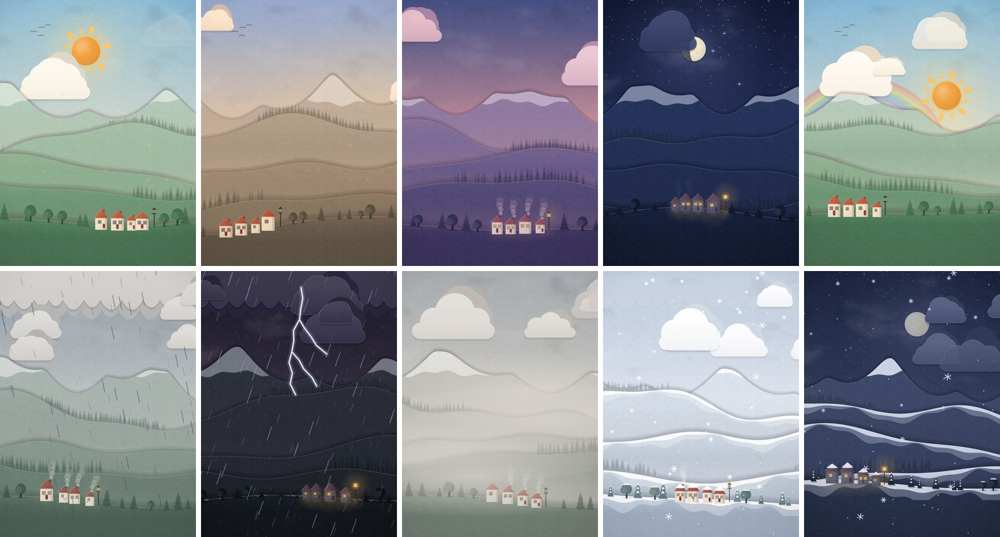
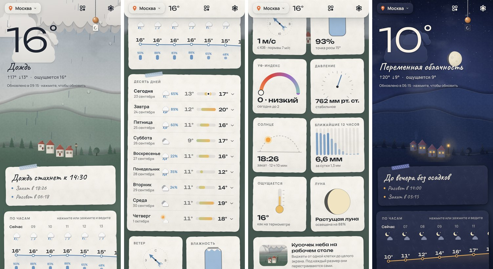
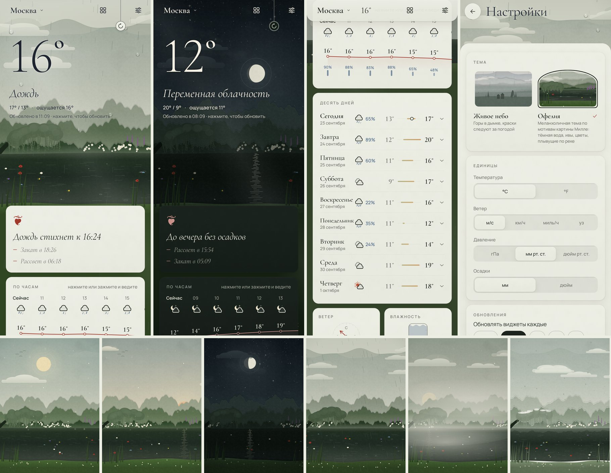
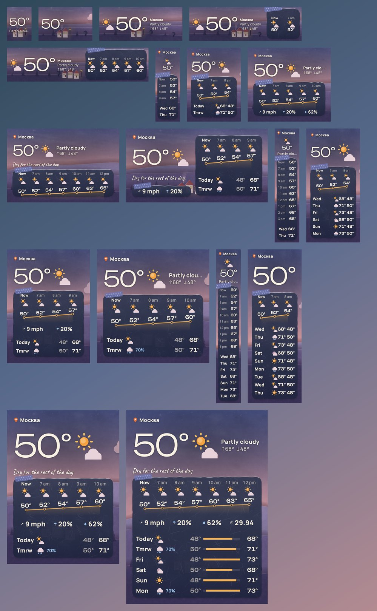
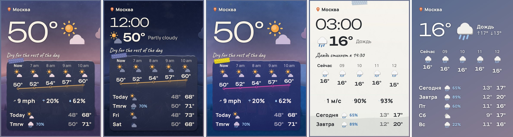
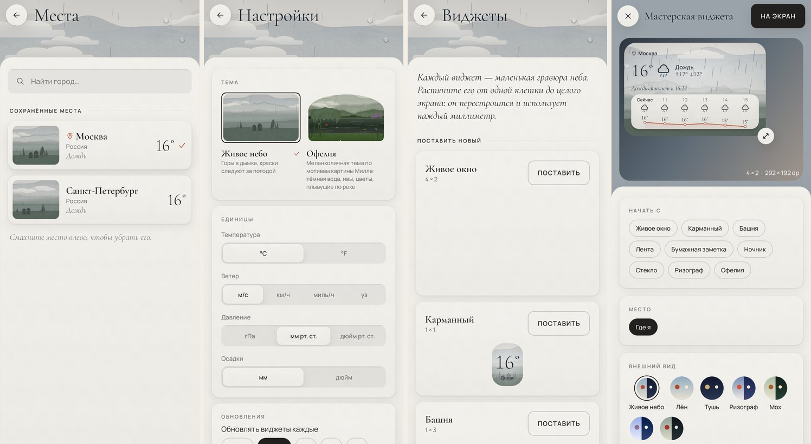

# Papersky · Бумажное небо

Погодное приложение для Android 17 (API 37) в дизайн-языке **«Бумага»**: погода как оттиск на
хорошей бумаге. Верх экрана — многослойная гравюра неба в духе японской ксилографии: горы уходят
в дымку, туман лежит между планами, солнце — ровный диск. Ниже — типографский набор на хлопковой
бумаге: крупная антиква, мелкие капители, волосяные линейки, много воздуха. Погода в гравюре
живая: дождь идёт тремя планами волосяных штрихов, капли собираются на «стекле», снег падает,
бьют молнии, в сумерках в окнах далёких домов загорается свет.

Главное в проекте — **виджеты**. Они растягиваются от одной клетки до всего экрана, под каждый
размер заново раскладывают содержимое, и в них тоже **идёт дождь и мерцают звёзды**.



## Дизайн-язык «Бумага»

Все правила — материалы, свет и глубина, краски, шрифты, иконки, компоненты, пружины, сцена,
жесты и бюджеты кадра — в **[DESIGN_DOCTRINE.md](DESIGN_DOCTRINE.md)**. Числа в документе
не «примерные»: код (`design/Theme.kt`, `design/Materials.kt`, `design/Motion.kt`,
`design/Components.kt`, `scene/ScenePalette.kt`, `scene/SceneLayout.kt`) ссылается на них.
Пять принципов:

1. **Материал, а не декор.** Бумага видна в волокне, точном срезе, тиснении, тени и сгибе.
   Никакого скотча, бусин, наклонённых листов, рваных краёв и рукописного шрифта.
2. **Две краски и бумага.** Тушь и одна пигментная краска: киноварь днём, бледное золото ночью.
   Цвет погоды живёт только в гравюре неба.
3. **Набор, а не интерфейс.** Иерархия — кеглем, начертанием и воздухом. Cormorant Garamond
   (антиква с кириллицей) говорит цифрами и названиями, её курсив — голос человека (погода
   словами, заметки, пояснения), Manrope — данные и капители.
4. **Точность.** Сетка 4 dp, одно левое поле, радиусы 12 / 16 / 24 dp, волосяные линейки.
5. **Вес.** Бумага тяжёлая: пружины почти без перелёта, нажатие — тиснение, а не прыжок.

Шрифт пересобирается скриптом `tools/build_fonts.py`: прописные цифры включены по умолчанию
(и в виджетах, где OpenType-фичи не включить), а знак градуса — тонкое кольцо на высоте прописных.



## Гравюра

Пять планов, как в ксилографии син-ханга: два хребта с острыми гребнями, два холма и луг. Каждый
план — полный цвет у гребня и растушёвка в туман у подножия (*бокаси*), дальние планы растворяются
в воздушной перспективе. Облака — плоские листы кальки, сплошная облачность — мягкая пелена
с длинной пологой волной. На лугу — силуэты хвои и тополей тоном ближнего плана, на холме за ним —
тонкая линия елей; дома (настройка «Дома в пейзаже») — тоже силуэтом.

| Погода | Эффекты |
|---|---|
| Ясно | ровный диск солнца с двумя кольцами кальки, пылинки в свете, стайки птиц |
| Облачно днём | листы кальки дрейфуют по ветру, лучи сквозь облака |
| Золотой час | охра и роза, киноварный диск солнца за хребтом |
| Ночь | звёзды мерцают, падающие звёзды, луна с настоящей фазой, **тёплые точки окон** |
| Тёплая ночь | светлячки над лугом |
| Пасмурно | мягкая пелена вдоль верхнего края |
| Дождь | три плана волосяных штрихов, брызги о луг, **капли на стекле** собираются и стекают |
| Снег | точки трёх размеров, **снежные шапки на пиках** до снеговой линии, иней на листах |
| Туман | туман гуще лежит между планами |
| Гроза | тонкая ветвистая молния, вспышка освещает экран, раскат с задержкой |
| После дождя | едва заметная радуга |

## Тема «Офелия»



Отдельная меланхоличная тема по мотивам «Офелии» Джона Эверетта Милле (1851–52). Включается в
настройках («Тема») для всего приложения и отдельно как стиль виджета (есть пресет «Офелия»).
Вместо гор — своя гравюра-река: две кулисы крон, берег с белым шиповником и пурпурным дербенником,
плакучая ива над тёмной водой, мшистый ближний берег с маргаритками и камышом. В воде отражается
берег, над ней лежит туман; по реке медленно **плывут цветы** — мак, шиповник, незабудки, лютик,
фиалка, — с шиповника падают лепестки, дождь рисует на воде круги, луна ложится дрожащей дорожкой.
Бумага — выцветший шалфей днём и глубокий мох ночью, краска — мак; окошки маленьких гравюр —
с арочным верхом, как холст Милле, а заметки дня открываются книжной виньеткой ❦.

## Взаимодействия

| Где | Что происходит |
|---|---|
| **Температура** | Цифры перекатываются по разрядам; погода словами проступает курсивом, как тушь в бумаге |
| **Подвес** | Pull-to-refresh: бумажный диск на волосяной нити; тянется с сопротивлением, щёлкает под пальцем, на пороге — клик; пока идёт загрузка, по диску бежит киноварная дуга |
| **Небо** | Тап — круги на стекле и порыв ветра; тап по солнцу — ореол вспыхивает и гаснет; удержание под дождём — капли стучат по пальцу; свайп — облака ускоряются, деревья гнутся |
| **Наклон телефона** | Параллакс планов гравюры |
| **По часам** | Кривая прорисовывается; тап или удержание с ведением — метка едет за пальцем, а небо «репетирует» этот час |
| **Десять дней** | День раскрывается по сгибу |
| **Плитки** | Гравированные приборы (компас, гигрометр, барометр, градусник, фаза луны); переворачиваются, на обороте — пояснение курсивом |
| **Места** | Листы с маленькой гравюрой своего неба; свайп влево — лист уходит с шорохом |
| **Переходы** | Новый лист въезжает снизу и ложится; predictive back |
| **Листы** | При открытии экрана поднимаются на место один за другим, без поворотов |

UI-отклик идёт через `performHapticFeedback` (уважает системную настройку), погодные текстуры —
примитивы `VibrationEffect.Composition`, гроза на Android 16+ — огибающая вибрации. Сила отклика и
уровень движения (живое, спокойное, замершее) настраиваются; системное «Убрать анимацию» = замершее.

## Виджеты: любой размер, каждый миллиметр



Виджет разрешено сжимать до 40×40 dp (1×1) и растягивать без ограничений.
`SizeMode.Exact` даёт точный размер в dp для каждой ориентации, и
**планировщик раскладки** (`widget/layout/WidgetLayoutPlanner.kt`, чистая функция с тестами)
решает, что поместится:

- **Режимы**: *кроха* (1×1), *лента* (N×1), *башня* (1×N), *карточка*, *панорама* (широкий 2-колоночный).
- **Жадное распределение по приоритетам**: главный блок → почасовая лента → дни → детали (ветер,
  влажность, осадки, УФ, давление) → «шепчущая» строка. Потом дни добирают строки, главный блок
  дорастает, а оставшийся воздух делится между секциями.
- **Реальные метрики шрифтов**: планировщик меряет текст через `Paint` с теми же вариативными
  шрифтами, что и виджет, поэтому «−23°» никогда не обрежется.
- Порог режимов **масштабируется вместе с размером текста** (настройка виджета и системный font scale).
- Учтены ограничения Glance: не больше 10 детей в Row/Column (тест проверяет это на >1000 размерах).

Как виджет выглядит богато и **двигается** в рамках RemoteViews:

- **Живая погода на рабочем столе** (`widget/ui/WidgetFx.kt`, `tools/widget_fx.py`). Приложение
  не может выполнять код в лаунчере, но лаунчер сам проигрывает неопределённый `ProgressBar`, а
  `ProgressBar` зацикливает `AnimatedVectorDrawable` на render thread. Скрипт генерирует 31 такой
  эффект: дождь трёх сил (штиль/ветер, отражение по направлению ветра), морось, снег трёх сил с
  покачиванием, град, мокрый снег, мерцающие звёзды, дрейфующий туман, вспышки грозы с молнией,
  вращающиеся лучи солнца, пылинки в солнечном свете. Эффекты белые и тонируются палитрой сцены
  (`setIndeterminateTintList`). Они растеризуются в половинном разрешении и масштабируются ×2,
  поэтому стоят лаунчеру вчетверо меньше пикселей. Дождь идёт только над «открытым небом» и не
  залезает под панели. Выключается настройкой «Живая погода»; при системном отключении анимаций
  всё само замирает.
- **Фон-гравюра** рисуется тем же рендерером, что и приложение, в bitmap ровно под размер виджета
  с бюджетом пикселей (далеко от лимита RemoteViews), с домами, если они включены. Плотные
  секции лежат на **листах хлопковой бумаги**: точный срез, волокна, мягкая тень, светлая кромка
  и волосяной край. Туда же впечатана **температурная кривая** киноварной линией, на которой «сидят»
  подписи часов. За текстом на небе — мягкая подложка для читаемости, облака и светила не заходят
  под крупную температуру.
- **Острова RemoteViews внутри Glance** (`widget/ui/Islands.kt`):
  - текст **собственными шрифтами** — Cormorant Garamond для цифр, Manrope для подписей, курсив
    Cormorant для строки-заметки (Glance так не умеет);
  - **`TextClock`**: живые часы в часовом поясе выбранного города, тикают без единого обновления;
  - **`ViewFlipper`**: «шепчущая» строка сама листает заметки прямо на рабочем столе
    («Дождь стихнет к 18:00», «Ночью заморозки до −3°», «Закат в 19:42»…).
- `CircularProgressIndicator` во время обновления; кнопка обновления — `ActionCallback`.
- **Сгенерированные превью** для пикера виджетов (Android 15+, `setWidgetPreviews`) из настоящей
  композиции с реальной погодой; для старых пикеров есть статичный `previewLayout`.



### Настройки виджета

Мастерская (`widget/config/WidgetEditor.kt`) открывается при добавлении виджета, из его меню
(`reconfigurable`) и из приложения. Сверху — **живое превью настоящих RemoteViews** на «рабочем
столе». Уголок можно тянуть до любого размера: он магнитится к ячейкам сетки с тиком отклика на
каждой, и видно, как перестраивается раскладка.

Настраивается: место (где я или любой сохранённый город), палитра (**живое небо**, лён, тушь,
ризограф — двухкрасочная печать индиго и киноварью, мох, **обои Material You**), фон (гравюра, бумага, стекло), прозрачность, радиус углов
(по умолчанию системный), размер текста, плотность, какие секции показывать (место, условия,
макс/мин, ощущается, часы, шепчущие заметки, по часам, дни, детали, кнопка обновления, время
обновления), живая погода, шаг по часам (1, 2 или 3 ч) и действие по нажатию. Есть 8 пресетов, из приложения
их можно поставить на экран через `requestPinGlanceAppWidget`.

## Как виджеты остаются актуальными

`updatePeriodMillis = 0`, обновлением управляет приложение (`core/sync`):

1. **Периодическая задача WorkManager** (интервал задаёт пользователь, 15 мин – 3 ч) **без сетевых
   ограничений**. Если сеть есть, она скачивает прогноз. Если сети нет, она **всё равно
   перерисовывает виджеты**: «сейчас» берётся из почасового прогноза, лента часов сдвигается,
   день сменяется ночью. Виджет не застывает на старом времени.
2. **«Когда появится сеть»**: если периодическая задача не достучалась, ставится одноразовая
   задача с `NetworkType.CONNECTED`, и она отработает сразу при подключении.
3. **Срочное обновление** (`setExpedited`) при потягивании шнурка, нажатии на виджет и первой установке.
4. **Смена сцены на восходе и закате**: задача ставится точно на следующий восход или закат,
   поэтому иллюстрация переключается вовремя.
5. **Системные события**: смена часового пояса, времени, языка, перезагрузка, обновление приложения
   вызывают мгновенную перерисовку.
6. Смена единиц и интервала в настройках, смена темы и масштаба шрифта сразу отражаются на виджетах.
7. При каждом открытии приложения, если данные старше 10 минут, прогноз обновляется, а вместе с ним
   и виджеты.

Отдельная ремарка: приложения с размещённым виджетом система держит не ниже standby-bucket ACTIVE,
поэтому периодические задачи не «засыпают». Если данные старше 3 часов, виджет честно подписывает
«данные от 14:05».

Геолокация — только приблизительная (`ACCESS_COARSE_LOCATION`), через платформенный
`LocationManager` (fused-провайдер) без Google Play Services. Фоновая геолокация включается
отдельным переключателем, только если пользователь хочет, чтобы виджет «ехал» вместе с ним.



## Плавность

Сцена устроена как композитор слоёв GPU, а не как холст, который перерисовывается каждый кадр:

- **Небо, облака и пять планов пейзажа — кешированные слои** (`CompositingStrategy.Offscreen`).
  Пока сцена живёт, у них меняются только *свойства*: сдвиг облаков по ветру, параллакс наклона и
  прокрутки. Такой кадр почти ничего не стоит, слой перерисовывается лишь при смене погоды или
  времени суток.
- **Каждый кадр рисуются только частицы**, и они собраны в несколько батчей: `drawLines` на слой
  дождя, `drawPoints` для снега и звёзд, крошечные растровые спрайты для мягких снежинок, пылинок и
  светлячков. На кадровом пути нет ни аллокаций, ни построения геометрии, ни размытий: мягкие тени
  бумаги сделаны стопкой полупрозрачных сдвигов и живут внутри кешированных слоёв.
- **Никакой рекомпозиции на кадр или скролл**: время сцены, прокрутка и наклон читаются только в
  фазах `graphicsLayer {}` и отрисовки. Почасовая лента меряет тексты один раз; при перемотке
  пальцем перерисовывается только слой подсветки.
- Сцена просит у системы нормальную частоту кадров (`preferredFrameRate(FrameRateCategory.Normal)`,
  ARR на Android 15+): фоновая анимация не держит экран на 120 Гц, а прокрутка его получает.
- Никаких «продвинутых» режимов смешивания (OVERLAY и т. п. заставляют GPU читать кадр обратно):
  фактура бумаги — обычная альфа, генерируется один раз в фоне при старте.
- Живые детали гравюры (деревья, огни окон) — отдельный лёгкий слой; дома и линия елей запечены в
  кешированные слои планов. У иконок запекается тело, а каждый кадр дорисовываются только
  движущиеся части, и только у видимых.
- **Baseline profile** (`src/main/baseline-prof.txt`) и `profileinstaller`: горячие пути
  компилируются заранее даже при установке APK не из магазина.

## Технологии

| | |
|---|---|
| Платформа | `compileSdk`/`targetSdk` **37 (Android 17)**, `minSdk` 31 (Android 12, чтобы включить все возможности виджетов) |
| Сборка | AGP 9.4 со встроенным Kotlin, Gradle 9.7, Kotlin 2.4, version catalog, configuration cache |
| UI | Jetpack Compose (BOM 2026.09), свой дизайн-слой поверх `foundation` (без Material), `Modifier.dropShadow`, `TextAutoSize`, `TextFieldState` |
| Навигация | **Navigation 3** с «бумажными» переходами и predictive back |
| Графика | общий `android.graphics` рендерер для приложения и bitmap-фона виджетов; слои GPU с кешированием в Compose; `AnimatedVectorDrawable` для анимаций на рабочем столе |
| Виджеты | **Glance 1.2** (`SizeMode.Exact`, `providePreview`, `setWidgetPreviews`) + острова RemoteViews |
| Фон | WorkManager 2.11 (periodic, expedited, network-gated, delayed) |
| Данные | Ktor 3 (OkHttp) + kotlinx.serialization, DataStore для мест и настроек, атомарный файловый кеш прогнозов |
| Прочее | Splash screen API с AVD-анимацией, adaptive + monochrome (themed) иконка, edge-to-edge, per-app language (`generateLocaleConfig`), EN/RU с правильными русскими множественными формами |

Погода: [Open-Meteo](https://open-meteo.com) (без ключа, CC BY 4.0): текущая погода, 10 дней,
почасовой прогноз и осадки с шагом 15 минут («дождь начнётся примерно через 20 минут»).

## Структура

```
app/src/main/java/app/papersky/weather/
├── core/            модели, WMO → условия, интерполяция «момента», единицы, рассказчик заметок,
│   ├── data/        Open-Meteo, кеш прогнозов, места, настройки, геолокация
│   └── sync/        WeatherSync, WorkManager-планировщик, системные события
├── scene/           палитры, SceneState, PaperSceneRenderer, GlyphRenderer, фактура бумаги
├── design/          хлопковая бумага, тиснение и тени, свет, пружины и уровни, краски и шрифты,
│                    компоненты (листы, кнопки, переключатели, ползунок), тактильный движок
├── ui/              живая сцена (композитор слоёв), главный экран, места, настройки, студия, Nav3
└── widget/          Glance-виджет, планировщик раскладки, острова, анимации, bitmap-арт, мастерская
tools/widget_fx.py   генератор анимированных эффектов виджета (AnimatedVectorDrawable + макеты)
tools/build_fonts.py сборка антиквы: подмножество, прописные цифры, тонкий знак градуса
DESIGN_DOCTRINE.md   дизайн-язык «Бумага»
```

## Сборка и проверка

```bash
./gradlew :app:assembleDebug          # APK для установки
./gradlew :app:assembleRelease        # R8 + shrinkResources (подписан debug-ключом для удобства)
./gradlew :app:testDebugUnitTest      # юнит-тесты: планировщик, эффекты виджета, разбор API, рассказчик, палитры
python3 tools/widget_fx.py            # пересобрать анимированные эффекты виджета
python3 tools/build_fonts.py          # пересобрать антикву из google/fonts
./gradlew :app:lintDebug
# Скриншоты сцен, виджетов на 18 размерах сетки и экранов (Robolectric native graphics):
./gradlew :app:testDebugUnitTest --tests "*Screenshots*" -Ppapersky.screenshots
#   → app/build/screenshots/*.png
```

Тесты проверяют, среди прочего, что:
- на >1000 размерах и 6 конфигурациях ни одна секция не вылезает за виджет и не превышает лимит Glance;
- текст на небе в любой палитре, времени суток и погоде имеет контраст ≥ 3:1, чернила на бумаге ≥ 7:1.

## Ограничения

- Приложение собрано и проверено в Robolectric (скриншоты сцен, виджетов и экранов, юнит-тесты,
  lint, R8), но на живом устройстве его никто не запускал. Тактильный отклик, датчик наклона,
  частоту кадров и то, как конкретный лаунчер проигрывает анимации виджета, стоит проверить на
  телефоне.
- Скриншоты экранов Compose снимаются в песочнице Robolectric API 36: у Espresso пока несовместимость
  с песочницей API 37. Сцены и виджеты рендерятся на API 37.
- Для виджета «где я» без фонового доступа к геолокации используется последнее место, увиденное в
  приложении.

## Лицензии

Шрифты Cormorant Garamond и Manrope распространяются по SIL Open Font License (см. `third_party/fonts`).
Данные о погоде: Open-Meteo.com, CC BY 4.0.
