# Роса — погода в жидком стекле

Android-приложение погоды для Android 13–17 (target/compile SDK 37, «Cinnamon Bun») с живым
небом, интерфейсом в стилистике Liquid Glass и виджетами, которые растягиваются до **любого**
размера сетки рабочего стола — от 1×1 до целого экрана планшета — и в каждом размере
раскладывают погоду по-своему. А ещё — [календарь](#календарь-месяц-над-картиной-своего-сезона):
месяц над картиной своего времени года.

<p>


</p>

## Идея

Экран — это окно. За стеклом настоящее небо над вами: солнце и луна проходят свой настоящий
дневной путь (эфемериды считаются на устройстве) — восходят низко слева, к полудню поднимаются,
к закату опускаются вправо, — но в свободном углу неба рядом с температурой, так что никогда не
заходят за цифры. Луна в своей реальной фазе, облака, дождь, снег, туман и грозы нарисованы
шейдерами. Во влажный день стекло запотевает — и его можно протереть пальцем.

**Погода за стеклом — как в жизни.**
- **Дождь.** Взгляд сфокусирован на стекле, поэтому погода за ним чуть не в фокусе. Каждая
  капля на стекле — крошечный «рыбий глаз»: в ней резко и вверх ногами видно небо (светлый
  горизонт сверху, глубина неба снизу), кромка темнеет к низу, сверху отражается небо, у
  основания собирается каустика, на ней блик. Стекающие капли оставляют чистые дорожки. Струи
  дождя падают в четырёх глубинах, от мороси вдали до мягких, не в фокусе, у самого стекла.
  Ветер наклоняет их порывами, по небу проходят полосы ливня, дальний дождь затягивает даль дымкой.
- **Снег** — от резких крупинок вдали до больших мягких хлопьев-боке у стекла; каждое хлопье
  качается по-своему, с тенью снизу, как настоящий комочек.
- **Гроза** — близкий удар показывает сам разряд, ветвистый и рваный, дальний только
  подсвечивает облака; раскат приходит тактильно позже вспышки.
- **Облака** клубятся и медленно меняют форму; у солнца их тонкие края светятся.
- **Туман** — плотная гряда внизу и быстрые пряди перед ней.
- **Иней** в мороз нарастает от рамы прожилками кристаллов, стекло за ним мутнеет, изредка
  вспыхивает грань льда.

Весь интерфейс — жидкое стекло, которое преломляет это небо, поэтому приложение меняет
настроение вместе с погодой и временем суток: абрикосовый рассвет, молочно-сиреневый снегопад,
чернильная ночь.

## Что внутри

### Главный экран
- **Лента времени на 48 часов.** Тянете ленту — и всё небо, солнце, дождь и большие цифры
  перематываются в выбранный час. Тактильный тик на каждом часе, более плотный клик на рассвете,
  закате и в полночь; кнопка «Вернуться в сейчас».
- **Города свайпом**, при этом небо *плавно перетекает* из погоды одного города в погоду другого.
- **«Жидкий» pull-to-refresh**: стеклянная капля набухает под пальцем, отрывается на пороге
  (тактильный отклик нарастания) и «шлёпается», запуская обновление.
- **Осадки на 2 часа** (15-минутный наукаст), 10 дней с температурными капсулами на общей шкале
  и раскрывающимися деталями дня.
- **Живые приборы**: компас, чья стрелка пружинит в сторону ветра и дрожит на порывах; влажность
  как жидкость в стеклянной капле; дуга УФ; барометр; путь солнца; луна в реальной фазе;
  качество воздуха; видимость.
- **Главная фраза дня** вместо абстрактного «облачно»: «Дождь через 15 мин», «Закат в 19:04»,
  «Завтра теплее на 6°» — выбирается по приоритету.
- **Оформление** (Настройки → Оформление, выбор — живыми миниатюрами неба): «Авто» следует за
  настоящим небом, «Светлый» — фарфоровое утро с тёмным текстом, «Вечерний» — синий час с первыми
  звёздами, «Тёмный» — ночь. Погода (облака, дождь, снег, туман) остаётся настоящей в любом
  режиме, меняется только свет; переключение плавно перетекает.

### Мелкие анимации
- Любое стекло мягко светится под пальцем (свет следует за ним), а кромка вспыхивает, пока
  стекло держат.
- Иконки на кнопках **подпрыгивают** на пружине; название города **перекатывается** вверх или вниз
  вместе со свайпом; карточки города при первом показе **поднимаются каскадом**.
- В ленте времени часы **укрупняются**, проплывая под линзой, — как лупа; точка на кривой получает
  ореол, температура над ней подрастает.
- Тап по большим цифрам прокручивает их к «ощущается как» и через несколько секунд обратно.

### Тактильность
Семантические эффекты в `RosaHaptics`: на Android 16+ — огибающие вибрации
(`BasicEnvelopeBuilder`, интенсивность + резкость во времени) для раскатов грома (гроза
ощущается с задержкой после вспышки — свет быстрее звука), нарастание при pull-to-refresh;
композиции примитивов, где они есть; `HapticFeedbackConstants` с фолбэком для Android 13.
Три уровня: выкл / мягко / богато.

## Виджеты


### Любой размер
Движок `WidgetLayoutEngine` (чистый Kotlin, покрыт тестами на **все** размеры от 36 до 720 × 900 dp
с шагом 12–16 dp) не переключается между несколькими заготовками, а перебирает шаблоны
композиции — «только главное», «главное сверху + стопка», «главное сбоку + стопка»,
«главное + две колонки» — жадно заполняет их модулями в порядке, заданном пользователем, и
выбирает вариант с лучшей оценкой информативности за вычетом штрафа за пустое место. Лишнее
место отдаётся главному блоку, который масштабирует типографику.

Итог: 1×1 — только температура; 4×1 — температура и часы в строку; 2×2 — полный «герой»;
1×4 — столбик часов; 4×4 — кривая температуры, дни и радар осадков; планшет — всё сразу.

### Пять стилей и тонкая настройка
 

| Стиль | Описание |
|---|---|
| **Стекло** | полупрозрачная панель, подкрашенная небом, толстая стеклянная кромка, свет солнца/луны внутри |
| **Живое небо** | окно в реальное небо: солнце/луна на своих местах, облака, дождь, снег, звёзды, молнии |
| **Прозрачный** | без подложки, монохромные глифы прямо на обоях (как «clear»-виджеты iOS 26) |
| **Тональный** | Material You из цветов обоев, светлая/тёмная версии одновременно |
| **Бумага** | уютная страница альманаха: бумага с зерном, чернила, терракотовый акцент |

**Погода на стекле виджета.** Когда в приложении идёт дождь, он идёт и на виджете: та же сцена,
из того же момента того же прогноза. На картинке виджета — капли-линзы на стекле (с перевёрнутым
небом внутри, тёмной кромкой, каустикой и бликом), в мороз от рамки растёт иней, во влажную
погоду стекло запотевает. Всё это лежит под текстом и цифрами, поэтому они остаются читаемыми.

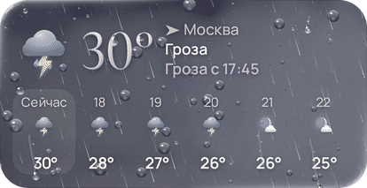

**И она движется.** Пока идёт дождь, снег или гроза, погода на виджете живая: струи падают в
три глубины, новые капли шлёпаются о стекло (сплющиваются, отскакивают, разбрызгивают капельки
и потом медленно тают), тяжёлые капли набирают воду, срываются и сбегают рывками, вытягиваясь
на ходу и оставляя мокрый след и капельки; в грозу весь виджет вспыхивает двойными и тройными
вспышками, а по верхнему краю бьют ветвистые молнии; снег падает в три глубины, покачиваясь и
сносимый ветром.

Код лаунчера не исполняет, но умеет проигрывать `AnimatedVectorDrawable` внутри `ProgressBar` —
так крутятся системные «колёсики» загрузки: на своём потоке отрисовки и только пока виджет на
экране. Поэтому живая погода — это векторные плитки 180 × 90 dp поверх картинки
(`LiveWeather`): струи — узор, замкнутый по всем краям плитки, так что соседние плитки
складываются в одно поле дождя без швов, а сносится и падает он двумя независимыми циклами, что
даёт любой наклон; капли — в четырёх вариантах со своими местами и ритмом, соседние плитки
никогда не повторяют друг друга; все вспышки грозы синхронны, молнии только в верхнем ряду.
Каждый цикл заканчивается ровно там, где начался. Плитки обрезаны по скруглению виджета, а при
обновлении с той же погодой лаунчер переиспользует их (stable id) — дождь не «перезапускается».
Картинка под ними в это время не рисует падающие струи и снег, чтобы они не двоились. Сами
плитки сгенерированы кодом (`MotionResources` в тестах; тест следит, что ресурсы совпадают с
генератором) и используют только то, что анимируется на потоке отрисовки: свойства групп и
путей, ключевые кадры, линейное время, бесконечный повтор.

Эффекты есть во всех стилях, кроме «Бумаги»; в «Прозрачном» капли над обоями — это только
кромка и свет. Движение выключается отдельно («Живые дождь, снег и молнии»), а при системном
«Убрать анимацию» лаунчер показывает неподвижный кадр.

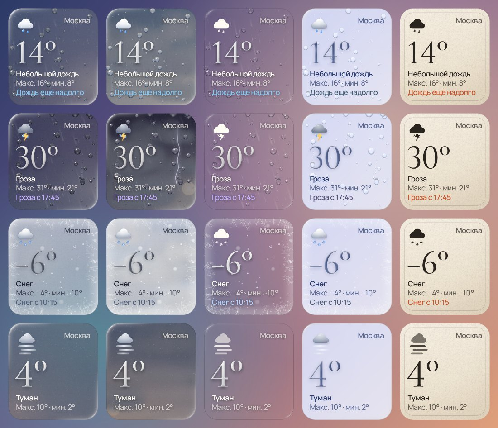

**Стекло 2.0 на виджете** (стили «Стекло», «Живое небо», «Тональный», «Прозрачный»; кромка
выключается в студии). Лаунчер не даёт преломлять обои, поэтому край нарисован так, как свет
ведёт себя на толстом стекле, — и, как в приложении, этот свет даёт небо, которое виджет показывает:

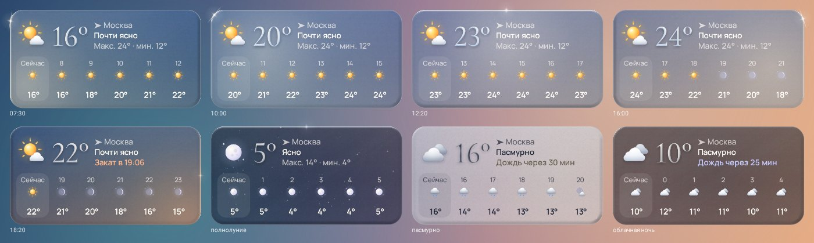

- край панели — **скруглённая фаска толстого стекла**, затенённая попиксельно по той же оптике,
  что и стекло в приложении: тонкая световая линия по всему краю, никогда не пропадающая (поэтому
  панель читается как один кусок стекла, а не как пятна света в углах), вторая, ещё тоньше, чуть
  внутри вдоль освещённой стороны, отражение неба у самого края — светлее сверху — и мягкая
  тень толщины на дальней от света стороне;
- свет падает **со стороны настоящего солнца или луны**: утром слева, в полдень сверху, вечером
  справа — всегда сверху, пока светило над горизонтом, — и **их цветом**: белым днём, золотым низко
  над горизонтом, серебристым от луны; насколько ярко — решают облака и фаза луны;
- где кромка смотрит на солнце, вспыхивает **блик-звёздочка** — только при настоящем солнце;
- **небо** мягко светит сверху слева; в пасмурный день и ночью под облаками светит только оно, а
  солнце и луна в «Живом небе» за плотными облаками не видны, как и их свет;
- по стеклу лежат **полосы отражённого света**, а стеклянные цифры температуры ловят тот же свет.

Код между обновлениями лаунчер не исполняет, поэтому фаска считается при каждом обновлении
виджета в разрешении экрана и только в полосе вдоль края, а свет ходит по виджету вслед за
солнцем.

В **студии виджета** (открывается при добавлении и по долгому нажатию → «Настроить») всё
видно вживую тем же рендерером, что и на рабочем столе: можно **растянуть превью за угол до
любого размера** сетки и сразу увидеть раскладку. Настраиваются: стиль, тема, акцент
(небо / температурная шкала / обои / моно), плотность стекла, скругление (или «как у
лаунчера»), размер текста, «воздух», набор и **порядок важности** модулей, место (по умолчанию
«Как в приложении» — виджет показывает город, открытый в Росе, и переключается вместе с ним;
можно закрепить город или «моё местоположение», а пока геопозиция неизвестна, виджет не
пустеет, а показывает город из приложения), показ
названия/«ощущается»/погодных эффектов, живая погода, действие по нажатию. Живая погода
движется и в превью студии — на тех же плитках, что и на рабочем столе.

### Всегда актуально
Виджет не «висит» с устаревшими данными — обновление устроено слоями:

1. **Время, а не момент скачивания.** Кэш хранит 96 часов прогноза, 15-минутный наукаст и
   10 дней. Каждая отрисовка считает `Forecast.momentAt(now)`: интерполирует температуру между
   часами, берёт осадки из наукаста, считает реальное положение солнца/луны. Поэтому даже без
   сети виджет показывает правильное «сейчас».
2. **Периодическая работа WorkManager** (15 мин – 4 ч, по умолчанию 30) *без* сетевого
   ограничения: всегда перерисовывает, а если данные устарели и сеть есть — обновляет.
3. **Догоняющая работа** с ограничением «есть сеть»: если периодическая застала устройство
   офлайн, обновление произойдёт в момент появления сети.
4. **Тики отрисовки** в следующий «значимый» момент: начало часа, восход/закат, и каждые 5 минут,
   пока фраза вида «Дождь через N мин» требует точности. И ровно в момент, когда меняется
   погода на картинке (начинается или кончается дождь, снег, гроза, туман): он находится
   заранее, с точностью до полминуты, по тем же моментам прогноза, из которых рисует небо
   приложение (`Forecast.nextSceneChange`). Поэтому дождь на виджете начинается вместе с
   приложением, а не через полчаса.
5. **Мгновенно**: при добавлении, изменении размера/поворота (`OPTION_APPWIDGET_SIZES`, отдельный
   bitmap под каждый размер), смене времени/часового пояса/языка, перезагрузке, обновлении
   приложения, смене темы, открытии приложения и по нажатию на виджет.
6. Если данные старше 3 часов, виджет честно показывает возраст и по нажатию обновляется.

Технически виджет — точный по размеру bitmap в `RemoteViews(Map<SizeF, RemoteViews>)` с
бюджетом памяти (≈1,5 экрана на все варианты), голосовым описанием для TalkBack, превью в
пикере, сгенерированными настоящим рендерером (Android 15+ `setWidgetPreview`, для 13–14 —
статичные картинки из того же рендерера).

## Календарь: 52 недели, у каждой своя картина

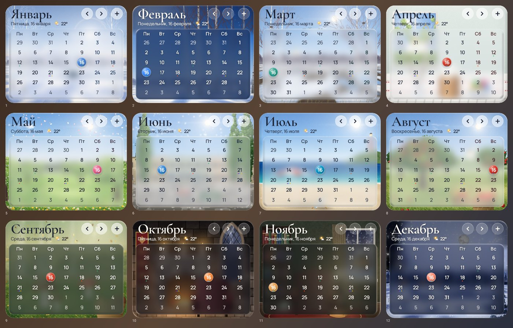

Четвёртый виджет — «Роса · Календарь»: месяц сеткой, а за ним картина. Картин 52, по одной на
каждую неделю года, и ни одна не повторяет другую (это проверяет тест). В них не только погода и
пейзаж, но и то, чем живёт это время года: праздники, дача, море, костёр, кафе, камин.

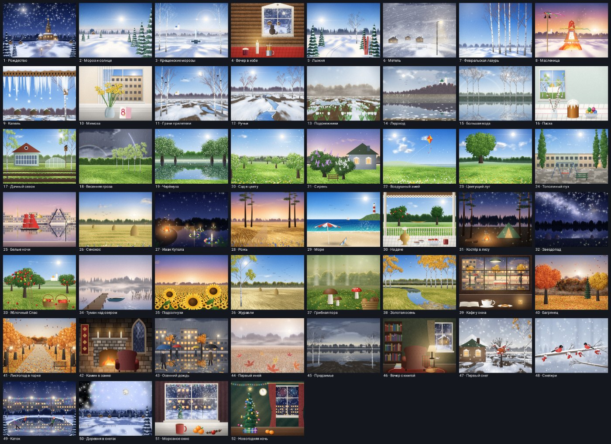

- **Зима:** Рождество у деревянной церкви под звездой; «Мороз и солнце»; Крещенские морозы —
  иордань во льду, берёзы в инее, ложные солнца; вечер в избе — свеча, чай в подстаканнике, кот на
  заиндевелом окне; лыжня в солнечном лесу; метель и фонарь; «Февральская лазурь» Грабаря;
  Масленица — горит соломенное чучело, на столбе ленты и сапоги; капель с резного карниза.
- **Весна:** мимоза на солнечном подоконнике к 8 Марта; «Грачи прилетели»; бумажный кораблик в
  ручье; подснежники; ледоход под городом на круче; «Большая вода» Левитана; пасхальный стол —
  кулич, крашеные яйца, верба; открытие дачного сезона; «Люблю грозу в начале мая»; черёмуха над
  рекой; цветущий сад; сирень у старого дома; воздушный змей над одуванчиками.
- **Лето:** цветущий луг; тополиный пух во дворе; белые ночи — разведённый мост и алые паруса;
  сенокос; Иван Купала — венки со свечами на тёмной воде, костёр; «Рожь» Шишкина; море — зонтик,
  шезлонг, маяк; чай из самовара на даче; костёр и палатка у лесного озера; звездопад; Яблочный
  Спас; туман над озером и лодка у мостков; подсолнухи на закате.
- **Осень:** журавли над жнивьём и паутинки бабьего лета; грибы во мху; «Золотая осень» Левитана;
  кафе у окна — кофе с сердечком в пенке, круассан, дождь на стекле, трамвай и зонты на мокрой
  улице; багряный лес; листопад в парковой аллее; камин в замке; осенний дождь в городе; первый
  иней; предзимье; вечер с книгой; первый снег; снегири; каток; деревня в снегах; морозное окно с
  мандаринами; новогодняя ночь — ёлка, подарки, салют за окном.

Внутри картин время года идёт своим ходом, неделя за неделей (`SeasonClock`): ложится и сходит
снег, желтеют и облетают берёзы, встаёт лёд, зацветает черёмуха, созревает рожь. На текущем месяце
виджет показывает картину текущей недели, на других месяцах — картину их середины. Для TalkBack
картина названа в описании виджета, например «Неделя 39: Кафе у окна».

Картины пишутся кодом, как матовая живопись, слой за слоем:

- **Воздух.** Небо, солнце с ореолом и анаморфным бликом (или луна с морями и кратерами), облака,
  освещённые со стороны солнца. Дальние гряды выцветают в дымку, между планами лежит туман.
- **Вода.** Отражает всё, что над ней, с рябью и дорожкой бликов.
- **Деревья.** Кроны — это объём, собранный из освещённых кустов листвы с тёмными провалами между
  ними. Ели — ярусы лап со снегом на каждом. У берёз белые стволы с чечевичками и тонкие ветви с
  повисшими прядями.
- **Земля.** Сугробы, луг, рожь, оттепель и листопад рисуются в настоящей перспективе.
- **Интерьеры.** Бревенчатая стена, каменная кладка, согретая огнём камина, окно, за которым
  своя картина (улица, деревня, салют), иней папоротником по краям стекла, капли дождя на нём,
  пламя свечи, пар над чашкой, огонь с языками и искрами (`Props`).
- **Последний проход.** Свечение ярких мест, виньетка и плёночное зерно.

Мягкие слои (облака, туман, сугробы, Млечный Путь) считаются попиксельно в пониженном разрешении,
кроны, ели, земля и вода — один в один (`Painting`, `Shaders`, `Flora`, `Props`, `SeasonScene` и
сцены по сезонам).

Стилистика та же, что у погоды. Название месяца набрано Cormorant Garamond прямо по небу картины,
сетка лежит на **матовом стекле**, сквозь которое картина светится размытыми красками, с настоящей
стеклянной фаской, и свет на стекло падает со стороны нарисованного солнца или луны. Сегодняшний
день — стеклянная бусина цвета сезона, выходные — тем же цветом, прошедшие дни чуть тише, дни
соседних месяцев едва видны. На маленьких размерах картина открыта целиком, как открытка, а дата
стоит на ней белыми цифрами.

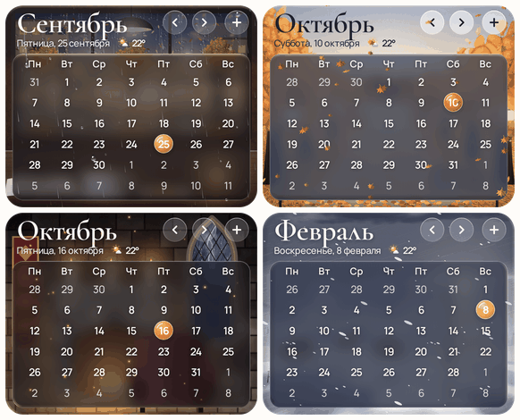 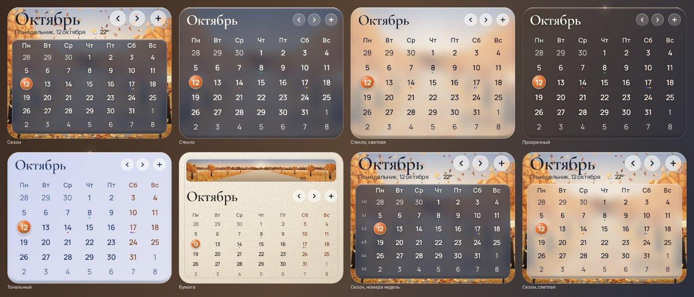

**Живая неделя** (в стилях «Сезон» и «Стекло»). Как дождь на погодных виджетах, по картине
движется то, что происходит в эту неделю, — на сгенерированных векторных плитках, которые лаунчер
крутит сам, на своём потоке отрисовки (на анимации выше — недели 39, 41, 42 и 6: дождь у кафе,
листопад в аллее, искры камина и метель):

- **морозная пыль** вспыхивает крестиками на солнце (январь, первый иней);
- **снег**, гуще в декабре, и **метель** — косые струи снега, одна бесшовная плитка на весь виджет;
- **искры** поднимаются от огня и гаснут на лету (изба, Масленица, костёр, камин);
- **капель**: капля набирается, висит, срывается и падает всё быстрее;
- **пылинки** в солнечном луче (мимоза, Пасха, вечер с книгой, подсолнухи);
- **птицы** кружат только в верхнем ряду, где небо: грачи, чайки, журавли;
- **лепестки** яблони и черёмухи, **соцветия сирени**, **пух** одуванчиков и тополей;
- **бабочки** над лугом, на даче и в саду;
- **светлячки** в Купальскую ночь и над рожью, **падающие звёзды** в августе;
- **туман** медленно дышит над водой;
- **листья** — берёзовые, кленовые и густой оранжевый листопад аллеи. Они раскачиваются маятником,
  наклоняются в сторону качания и переворачиваются, показывая тёмную изнанку;
- **дождь** на окне кафе и на улице, **гроза** в начале мая;
- **мерцающие огни** гирлянд — на катке, у морозного окна и в новогоднюю ночь.

Плитки у недель высокие (180 × 180 dp), в четырёх вариантах по столбцам. Лист, который пролетел
плитку, продолжает падать в следующей под ней, а соседние столбцы не повторяют друг друга.

**Тёмная тема.** Та же картина, но в лунном свете: небо и земля темнеют и холоднеют, тени уходят в
синеву, а то, что светится само — окна, фонари, огонь, свечи, солнце, ставшее луной, — сохраняет свой
свет. Стекло становится дымчатым. Ночные и вечерние сцены затемняются лишь слегка.

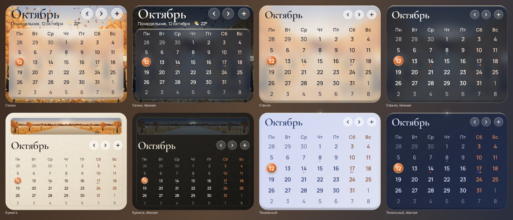
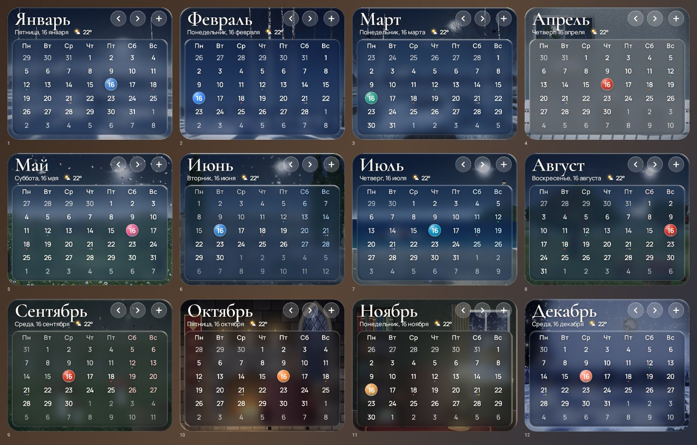

**Читаемость.** Толщина стекла и цвет каждой цифры не подобраны на глаз, а вычислены по картине
под сеткой. Сначала измеряются самые тёмные и самые светлые её места (без одиночных бликов), и
стекло кладётся так, чтобы текст держал контраст 5:1. Потом под ту же подложку с запасом
подбираются цвета выходных, прошедших дней, подписей и дней соседних месяцев. Тест рендерит все 52
недели в стилях «Сезон» и «Стекло», в светлой и тёмной теме, и меряет контраст каждого дня прямо по
пикселям: сердцевина штрихов цифры против того, что вокруг неё. Худший день года — 5,18:1 при норме
WCAG 4,5:1, названия месяцев — от 5,5:1. Этот тест нашёл ошибку, которая была с 2.4.0: общая кисть
рендерера переносила прозрачность из одной отрисовки в другую, и все подложки, кроме первой после
запуска, ложились тоньше рассчитанного. Теперь это исправлено, и отдельный тест проверяет, что
отрисовка не зависит от того, что рисовалось до неё.

**Перелистывание.** По стрелке ничего не рисуется. После каждого обновления виджет в фоне
рисует целиком страницы месяцев вокруг показанного: следующего, предыдущего, текущего (куда ведёт
название месяца) и ещё одного вперёд, чтобы и два быстрых нажатия подряд были мгновенными.
Страница — это ровно то, что получает лаунчер: картинка каждого размера и зоны нажатий. Страницы
хранятся в памяти и на диске, потому что к моменту нажатия процесс приложения часто уже выгружен.
По стрелке страница читается с диска и сразу уходит лаунчеру. Погоду и события на ней виджет
сверяет уже после, в фоновом задании; если что-то изменилось, страница перерисовывается. Страница
годится только для дня, в который нарисована, и для тех же настроек и размеров виджета.

В 2.4.0 месяц мог появиться через несколько секунд. Соседние месяцы рисовались в фоне уже после
того, как система считала работу законченной, и процесс замораживался или выгружался на полпути.
Тогда стрелка на холодном процессе рисовала месяц с нуля — вместе с тяжёлым запуском приложения.
Теперь фоновую дорисовку ждёт то, что держит процесс живым: широковещательное сообщение или
задание. После нажатия её берёт короткое задание, чтобы следующее нажатие не стояло за ней в
очереди. Запуск процесса стал легче: сетевой клиент создаётся только когда нужна сеть, а превью
для списка виджетов рисуются при открытии приложения, а не при каждом пробуждении процесса.
Картины и подложки по-прежнему хранятся в памяти и на диске, а переменный шрифт не пересобирается
на каждую подпись.

**Нажатия:** ‹ и › листают месяцы (на следующий день виджет сам вернётся к текущему), название
месяца открывает календарь телефона, а на другом месяце возвращает к текущему, **+** создаёт
событие в календаре телефона, день открывает календарь на этой дате. В полночь виджет сам
перерисовывается на новый день.

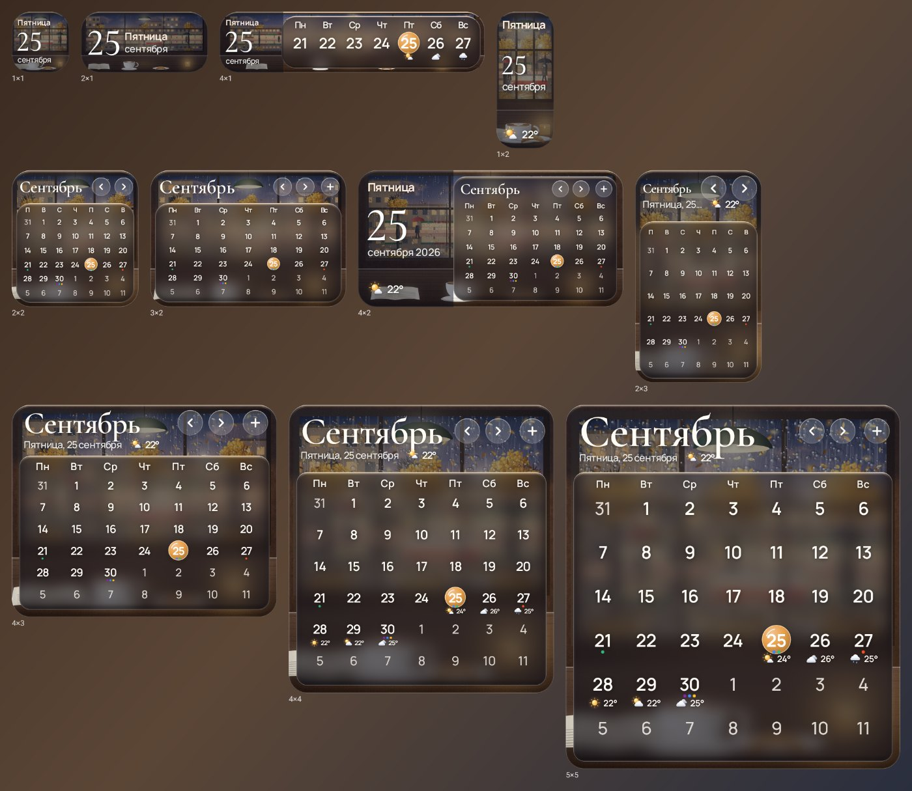

**Любой размер:** 1×1 и 2×1 — открытка с датой, 4×1 — полоса текущей недели с
погодой, 4×2 — сегодняшний день крупно слева и месяц справа, от 2×2 — настенный календарь. В
днях прогноза — их погода, а где хватает места, и дневная температура.

**Настройка в студии:** стиль («Сезон», «Стекло», «Прозрачный», «Тональный», «Бумага» — на высоком
виджете с картиной месяца сверху), тема, акцент (сезон, обои, моно), плотность стекла, скругление,
размер текста, первый день недели (по умолчанию — как принято в языке), номера недель, погода в
днях и город для неё, живой сезон, стеклянная кромка и **события из календарей телефона** — точками под днями, в
цветах их календарей (доступ к календарям Роса попросит, только когда вы включите события).
Новое или изменённое событие появляется на виджете через несколько секунд: система будит Росу,
когда меняются календари телефона (задание WorkManager с триггером по `content://com.android.calendar`,
которое заново взводится после каждого срабатывания), а не держит её запущенной.

## Стекло 3.0: свет проходит через настоящую фаску

Стекло приложения теперь считается как оптика плиты с фаской, а не как круговой спад с
нарисованными бликами:

- **Фаска-суперэллипс.** У края она вертикальна и плавно переходит в плоский верх.
  Нормаль к поверхности трёхмерная.
- **Преломление по закону Снеллиуса** (показатель 1,5). Линии за стеклом изгибаются и
  сгущаются к кромке, как у толстой линзы, а плоская середина остаётся честной. Тест с
  линованным фоном проверяет, что под серединой каждая линия стоит на своём месте.
- **Дисперсия.** У красного и синего свой показатель, но только на фаске, где стекло
  преломляет. Каёмки выходят мягкой радугой, а не неоновой нитью.
- **Отражение по Френелю** (Шлик, F0 = 0,04). Крутая кромка отражает то, что за краем панели.
- **Блик GGX.** Он идёт от света сцены, в его цвете. Слабое внутреннее отражение ложится на
  противоположную кромку, а сбоку, вдали от света, — едва заметная каустика.
- **Исправлены артефакты кромки.** Панели у края экрана больше не читают пустоту за сценой
  (раньше это давало голубую линию), а сложенные блики не пересвечивают цвет.
- **Переключатель режимов** перетекает, как капля: вытягивается на ходу, перелетает и оседает,
  сплющиваясь о стенку на крайнем варианте.

## Стекло 2.0: его освещает сама сцена

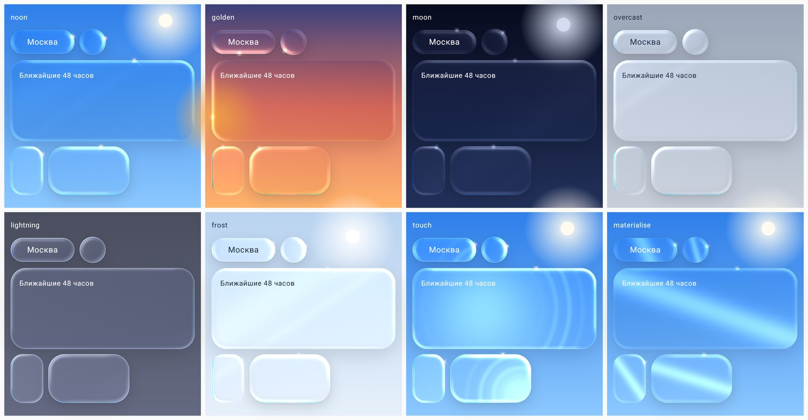

Стекло больше не освещено «условным светом слева сверху» — его освещает то, что на экране:

- **солнце или луна там, где они на небе.** Небо на каждом кадре сообщает стеклу, где светило,
  какого оно цвета и насколько ярко (с учётом облаков и фазы луны). Каждая панель ловит свет со
  своей стороны — поэтому блики на разных карточках смотрят к солнцу, а при прокрутке скользят по
  кромкам; ближе к солнцу — ярче. В полдень свет белый, в золотой час — тёплый, ночью —
  серебристый лунный, в пасмурную погоду — мягкий и рассеянный;
- **блик-звёздочка**: там, где кромка обращена к солнцу, вспыхивает искра — горячее ядро, луч
  вдоль кромки и короткий поперёк, со свечением, выходящим за край стекла; стеклянные цифры
  температуры ловят тот же свет;
- **отражения мира**: по стеклу лежат мягкие полосы отражённого света окна, закреплённые в мире,
  а не на панели, — карточки проезжают под ними при прокрутке, а при наклоне телефона отражения
  скользят по всему стеклу разом; сама сцена за стеклом чуть сдвигается при наклоне (параллакс),
  как будто лежит глубже;
- **погода на стекле**: вспышка молнии освещает всё стекло, сильнее всего кромки; в мороз с
  краёв наползает иней белыми прожилками;
- **жидкое касание**: палец продавливает стекло в линзу — то, что под ним, увеличивается и
  ловит свет;
- **появление**: стекло проявляется нарастанием линзы, а по нему проходит полоса света.

Всё это считается в том же проходе шейдера, что и само стекло: никаких дополнительных слоёв и
размытий, ничего не рисуется на каждом кадре, если ничего не изменилось. Стекло виджетов освещено
так же — со стороны солнца или луны, их светом, с бликом и отражениями (см. «Стекло 2.0 на
виджете»).

## Liquid Glass: что взято у Apple

Дизайн опирается на материалы Apple (HIG «Materials», WWDC25 «Meet Liquid Glass» и «Get to know
the new design system», документация по `glassEffect`) и на реверс-инжиниринг параметров
фильтра `glassBackground`. Свет в AGSL-шейдере `LIQUID_GLASS_SHADER` посчитан так, как он ведёт
себя на настоящей стеклянной пластине со скруглённой фаской:

- **линзирование вместо размытия**: у кромки поверхность изгибается по круговому профилю фаски,
  выборка смещается наружу по нормали — стекло «видит» чуть больше, чем занимает, а плоская
  середина остаётся честной;
- **свет по настоящей нормали**: у фаски есть трёхмерная нормаль, и из неё получаются френелевский
  край (крутая внешняя кромка отражает небо тонкой линией, а не широкой светящейся полосой),
  острый отблеск на самом ребре и **серповидный блик**, бегущий вдоль фаски там, где кромка
  смотрит на свет, — с более слабым двойником в противоположном углу (свет, прошедший сквозь
  стекло): те самые два блика Apple. Вдоль сторон, не обращённых к свету, кромка почти исчезает,
  а дальняя сторона фаски чуть уходит в тень — край читается как толщина, а не как обводка;
  направление света **следует за наклоном телефона** (датчик гравитации, низкочастотный фильтр);
- **у стекла свой тон**: над светлым небом — молочное, над тёмным — дымчатое, но в цвете самого
  неба (глубокий синий днём, фиолетовый в сумерках, чернильный ночью), а не серое; вибрантность
  сдержанная (×1,1–1,3), чтобы цвет светился сквозь стекло, но не превращался в леденец; к свету
  стекло чуть светлее; у матового стекла тонкое **зерно**, которое к тому же не даёт гладкому
  размытию полосить;
- **хроматическая дисперсия** на фаске, сильнее в углах, — считается только в полосе фаски,
  поэтому ничего не стоит даже на больших карточках;
- **тени**: карточки лежат на широкой мягкой тени, плавающие кнопки — ещё и на тугой контактной;
- **подсветка из-под пальца**, которая следует за ним, и вспышка кромки при нажатии; гелевые
  пружины (Apple spring 0.5 s / bounce 0.3), «разбухание» на несколько dp при нажатии;
- **материализация**: элементы появляются нарастанием линзирования, а не альфой;
- **стекло никогда не преломляет стекло**: всё, что лежит на стеклянной поверхности, само
  становится подложкой — полупрозрачной вставкой со светлой кромкой сверху, которая тоже
  подсвечивается под пальцем (основное действие — плотнее и ярче второстепенного); иначе
  кнопка на карточке прорезала бы в ней окно до неба. Карточки контента — «матовый» материал;
  переключатели и слайдеры **становятся стеклом только пока их держат**, а выбор в сегментном
  переключателе в покое — приподнятая плашка, при касании — стеклянная капля, которую можно
  протащить пальцем по вариантам (с щелчком на каждом);
- **край прокрутки** (scroll edge effect Apple): поднимаясь к плавающей панели, карточки
  растворяются в живом небе, а не заезжают под кнопки — панель остаётся читаемой, и её стекло
  показывает то, что за ним действительно есть;
- **адаптивность**: над ярким небом крупное стекло становится плотнее, текст переключается между
  светлым и тёмным по реальной яркости неба с учётом облаков; системная «Контрастность»
  (Android 14+) делает всё стекло плотнее и спокойнее — аналог «Понижения прозрачности» Apple;
  учитываются «убрать анимации», режим энергосбережения и перегрев. Оптику проверяет «стеклянная
  лаборатория» — рендер всех материалов и контролов над ярким днём, ночью, закатом и пёстрым
  фоном (`GlassLabTest`); тест следит, что матовое тело гладкое (без граней по медиальной оси) и
  что стекло на стекле становится подложкой.
- **производительность**: вся фоновая жизнь — облака, иконки, стрелка ветра, вода — идёт по одним
  «часам» 30 кадров/с на любом экране (на 120 Гц небо и стекло перерисовываются вчетверо реже),
  прокрутка и касания — с полной частотой; матовые карточки преломляют одну общую размытую копию
  неба вместо собственного размытия каждая; наклон телефона перерисовывает только заметные
  изменения; режим эффектов «Авто» следит за реальным временем кадров (FrameMetrics) и, если
  телефон хронически не успевает, переходит на лёгкое небо. Стеклянные пиктограммы (мягкие тени,
  свет внутри облака) рисуются один раз в картинку и дальше берутся из кэша, поэтому ленты и
  списки прокручиваются без перерисовки; у анимированных вживую рисуется только то, что движется
  (лучи, капли, снежинки), под готовыми облаками и в собственном слое. Превью виджетов
  рендерятся в фоне в картинку — так же, как их получает лаунчер. Общее матовое размытие
  считается в четверть разрешения один раз на кадр неба и «запекается» в отдельный слой, как и
  капли на оконном стекле: иначе Android заново применял бы эффект под каждой карточкой на каждом
  кадре прокрутки. Стекло «проявляется» один раз, а не каждый раз, когда карточка возвращается
  на экран; сетка «Подробно» собирается по рядам по мере прокрутки; жидкий pull-to-refresh не
  забирает у списка ни движения пальца, ни бросок.

## Стекло до мелочей: цифры, пиктограммы, иконки

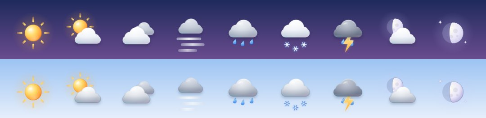

- **Цифры из жидкого стекла.** Большая температура — не текст с тенью, а стекло.
  - Каждое значение превращается в поле расстояний до края (точное евклидово преобразование с
    субпиксельной кромкой). У каждого штриха, волосяного или толстого, настоящая скруглённая
    фаска от своего края, а у толстых штрихов — ровная вершина.
  - AGSL-линза гнёт небо через эту фаску и на самой кромке раскладывает его в радугу.
  - Кромки отражают свет: блик там, где фаска смотрит на свет (он следует за наклоном
    телефона), слабее — напротив. Внутри дальнего края собирается каустика.
  - Тонкая линия на границе стекла и воздуха держит число читаемым над любым небом; под
    цифрами — мягкая тень.
  - Новое значение перетекает из старого: смешиваются их поля расстояний, и формы плавно
    переходят одна в другую.
  - Поля строятся в фоне и заранее для всех температур, до которых можно докрутить ленту.
- **Стеклянные пиктограммы погоды** — на экране, в ленте часов и в виджетах: облака из матового
  стекла с внутренним светом, объёмом, дисперсией на кромке и бликом; солнце — светящаяся
  стеклянная сфера; луна — перламутр (на светлом небе — с тонкой кромкой); капли — стеклянные
  бусины с каустикой; снежинки — кристаллы с искрой; молния — глянцевая грань; туман — матовые
  стеклянные полосы. Монохромный вариант для «Прозрачного» и «Бумаги» остаётся графичным.
- **Стеклянные иконки интерфейса.** У замкнутых форм полупрозрачное тело, кромка светлее сверху,
  а детали, которых касаются, — ползунки настроек, линза поиска, плитки виджетов — со своим
  бликом.
- **Цифры в виджетах** — тоже стекло, но нарисованное обычным Canvas, так что между обновлениями
  оно ничего не стоит. На светлой панели это дымчатое стекло: свет по верхним кромкам, глубина
  по нижним. На тёмной — хрусталь, чьи нижние кромки принимают цвет неба. Мягкая тень отрывает
  цифры от панели. «Бумага» остаётся печатной.
- **Иконка приложения** — капля-линза. Небо за ней видно перевёрнутым: тёплое сверху, синее у
  основания. Собранный ею свет лежит у подножия яркой каустикой, кромка светится со стороны
  света, на стекле — оконный блик и искра. Та же капля падает на заставке.

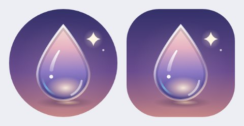

## Архитектура

```
rosa-weather/
├── build-logic/        convention-плагины Gradle (application, library, compose, jvm, hilt)
├── core/model/         чистый Kotlin: модель погоды, WMO-коды, единицы, эфемериды солнца и луны,
│                       «момент» прогноза, главная фраза, палитра неба в OKLab
├── core/data/          Open-Meteo (Ktor), DataStore (JSON), местоположение без Play Services,
│                       синхронизация, WorkManager-воркер и планировщик
├── core/designsystem/  Liquid Glass (Modifier.Node + RuntimeShader), живое небо и оконное стекло
│                       (AGSL), стеклянные цифры, пиктограммы и иконки, тактильность, тема,
│                       шрифты Cormorant + Manrope
├── widget/             движок раскладки, Canvas-рендерер, провайдеры, студия виджета
└── app/                Navigation 3, экраны, ViewModel'и, Hilt
```

- Kotlin 2.4, AGP 9.4 со встроенной поддержкой Kotlin, Gradle 9.7, KSP2, Hilt 2.60
- Compose BOM 2026.09, Material 3, Navigation 3 с предиктивным «назад», edge-to-edge
- WorkManager 2.12 (Hilt-воркеры), DataStore 1.2, Ktor 3.6 + kotlinx.serialization
- Только приблизительное местоположение (`ACCESS_COARSE_LOCATION`); фоновое — опционально
  из настроек, чтобы виджеты следовали за вами при закрытом приложении
- Данные: [Open-Meteo](https://open-meteo.com) (без ключа, CC BY 4.0) — прогноз, 15-минутный
  наукаст, качество воздуха, геокодинг
- Шрифты: Cormorant Garamond (контрастные цифры, лайнинговые цифры включены) и Manrope
  (интерфейс, кириллица), SIL OFL
- Per-app language (RU/EN), бэкап настроек и мест, splash с анимированной каплей, тематическая
  монохромная иконка

## Сборка

Нужны JDK 21 и Android SDK с платформой 37.

```bash
./gradlew assembleDebug          # app/build/outputs/apk/debug/app-debug.apk
./gradlew assembleRelease        # R8 + shrinkResources, подписано debug-ключом для удобства
./gradlew test                   # все unit-тесты (включая Robolectric-рендеры)
./gradlew lintDebug              # lint чистый во всех модулях
```

Визуальные галереи (Robolectric рендерит настоящие Canvas и AGSL):

```bash
./gradlew :widget:testDebugUnitTest   # → widget/build/widget-gallery/*.png
./gradlew :app:testDebugUnitTest      # → app/build/screens/*.png
./gradlew test -Prosa.docs            # обновить картинки в docs/images
./gradlew :widget:testDebugUnitTest -Prosa.previews   # пересобрать превью для пикера
```

## Честно о проверке

Проект собирается (debug и release с R8), проходит unit-тесты и lint без предупреждений.
Экраны, виджеты, пиктограммы, иконки и иконка приложения проверены рендером в Robolectric,
включая AGSL-шейдеры (стеклянные цифры тоже). Живая погода виджета проверена там же: плитки
надуваются внутри тех же `RemoteViews`, что получает лаунчер, прогоняются по времени кадр за
кадром (из этих кадров и сделан GIF выше), а тест проверяет, что каждая анимация — только из
того, что лаунчер крутит на потоке отрисовки, и каждый цикл замкнут. Запуска на физическом
устройстве или эмуляторе не было (в среде разработки нет аппаратной виртуализации), поэтому
производительность шейдеров, поведение конкретных лаунчеров (в том числе проигрывание живой
погоды) и реальная вибрация требуют проверки на железе. Календарный виджет проверен так же:
его картины и подложки, их кэш в памяти и на диске, зоны нажатий внутри настоящих `RemoteViews`,
живая неделя по кадрам (каждая плитка — только то, что крутит поток отрисовки), читаемость всех
52 недель по пикселям и задание, которое ждёт изменений в календарях. Отдельный тест проходит весь путь стрелки: обновление рисует месяцы
вокруг, перелистывание берёт готовую страницу, а страница для других настроек не показывается.
Страница с диска возвращается пиксель в пиксель. Время отрисовки измерено на JVM разработки; на
телефоне картина с нуля будет дольше. Открытие календаря телефона, запрос доступа к событиям, появление новых событий и
скорость перелистывания на виджете нужно проверить на устройстве, как и то, как выглядят на
реальном экране новые картины, анимации недель и оптика Стекла 3.0. Эффекты неба можно ограничить настройкой «Эффекты неба → Эконом».
