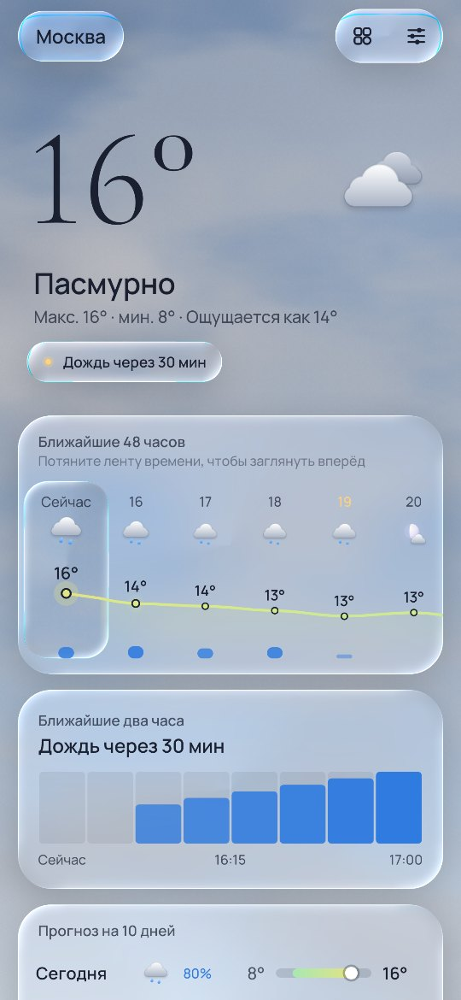
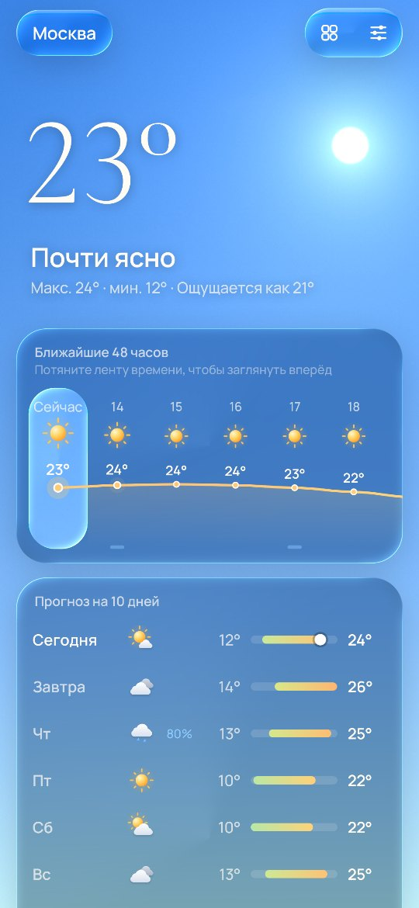
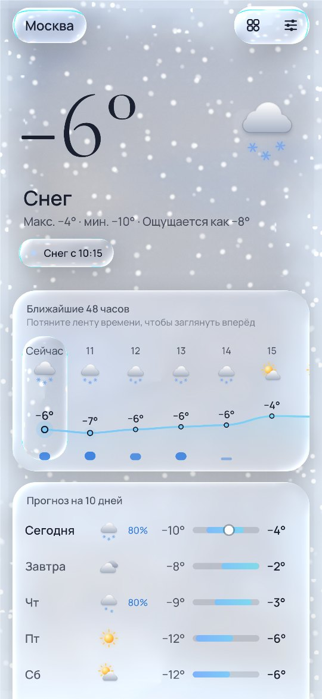
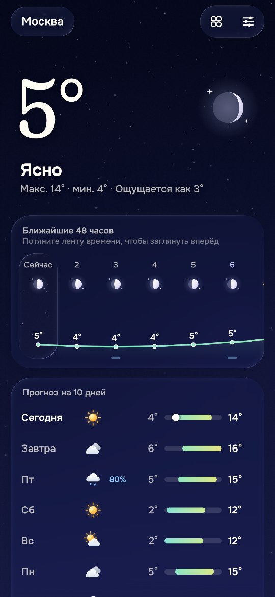
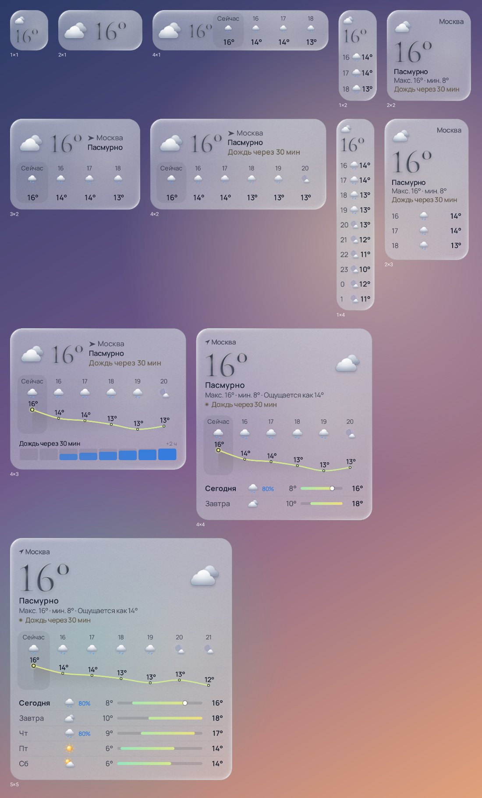
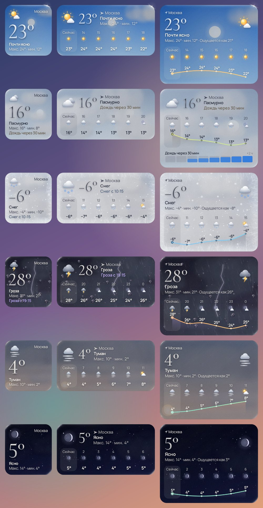
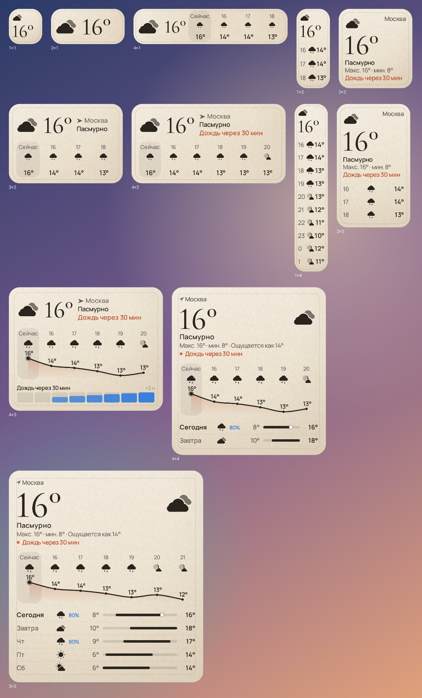

# Роса — погода в жидком стекле

Android-приложение погоды для Android 13–17 (target/compile SDK 37, «Cinnamon Bun») с живым
небом, интерфейсом в стилистике Liquid Glass и виджетами, которые растягиваются до **любого**
размера сетки рабочего стола — от 1×1 до целого экрана планшета — и в каждом размере
раскладывают погоду по-своему.

<p>




</p>

## Идея

Экран — это окно. За стеклом настоящее небо над вами: солнце и луна проходят свой настоящий
дневной путь (эфемериды считаются на устройстве) — восходят низко слева, к полудню поднимаются,
к закату опускаются вправо, — но в свободном углу неба рядом с температурой, так что никогда не
заходят за цифры. Луна в своей реальной фазе, облака, дождь, снег, туман и грозы нарисованы
шейдерами. Когда идёт дождь, по стеклу ползут капли; в мороз с
краёв нарастает иней; во влажный день стекло запотевает — и его можно протереть пальцем.

Весь интерфейс — жидкое стекло, которое преломляет это небо, поэтому приложение меняет
настроение вместе с погодой и временем суток: абрикосовый рассвет, молочно-сиреневый снегопад,
чернильная ночь.

## Что внутри

### Главный экран
- **Лента времени на 48 часов.** Тянете ленту — и всё небо, солнце, дождь и большие цифры
  перематываются в выбранный час. Тактильный тик на каждом часе, более плотный клик на рассвете,
  закате и в полночь; кнопка «Вернуться в сейчас».
- **Города свайпом**, при этом небо *плавно перетекает* из погоды одного города в погоду другого.
- **«Жидкий» pull-to-refresh**: стеклянная капля набухает под пальцем, отрывается на пороге
  (тактильный отклик нарастания) и «шлёпается», запуская обновление.
- **Осадки на 2 часа** (15-минутный наукаст), 10 дней с температурными капсулами на общей шкале
  и раскрывающимися деталями дня.
- **Живые приборы**: компас, чья стрелка пружинит в сторону ветра и дрожит на порывах; влажность
  как жидкость в стеклянной капле; дуга УФ; барометр; путь солнца; луна в реальной фазе;
  качество воздуха; видимость.
- **Главная фраза дня** вместо абстрактного «облачно»: «Дождь через 15 мин», «Закат в 19:04»,
  «Завтра теплее на 6°» — выбирается по приоритету.

### Тактильность
Семантические эффекты в `RosaHaptics`: на Android 16+ — огибающие вибрации
(`BasicEnvelopeBuilder`, интенсивность + резкость во времени) для раскатов грома (гроза
ощущается с задержкой после вспышки — свет быстрее звука), нарастание при pull-to-refresh;
композиции примитивов, где они есть; `HapticFeedbackConstants` с фолбэком для Android 13.
Три уровня: выкл / мягко / богато.

## Виджеты



### Любой размер
Движок `WidgetLayoutEngine` (чистый Kotlin, покрыт тестами на **все** размеры от 36 до 720 × 900 dp
с шагом 12–16 dp) не переключается между несколькими заготовками, а перебирает шаблоны
композиции — «только главное», «главное сверху + стопка», «главное сбоку + стопка»,
«главное + две колонки» — жадно заполняет их модулями в порядке, заданном пользователем, и
выбирает вариант с лучшей оценкой информативности за вычетом штрафа за пустое место. Лишнее
место отдаётся главному блоку, который масштабирует типографику.

Итог: 1×1 — только температура; 4×1 — температура и часы в строку; 2×2 — полный «герой»;
1×4 — столбик часов; 4×4 — кривая температуры, дни и радар осадков; планшет — всё сразу.

### Пять стилей и тонкая настройка
 

| Стиль | Описание |
|---|---|
| **Стекло** | полупрозрачная панель, подкрашенная небом, линзовая кромка с парой диагональных бликов, свет солнца/луны внутри |
| **Живое небо** | окно в реальное небо: солнце/луна на своих местах, облака, дождь, звёзды, молнии |
| **Прозрачный** | без подложки, монохромные глифы прямо на обоях (как «clear»-виджеты iOS 26) |
| **Тональный** | Material You из цветов обоев, светлая/тёмная версии одновременно |
| **Бумага** | уютная страница альманаха: бумага с зерном, чернила, терракотовый акцент |

В **студии виджета** (открывается при добавлении и по долгому нажатию → «Настроить») всё
видно вживую тем же рендерером, что и на рабочем столе: можно **растянуть превью за угол до
любого размера** сетки и сразу увидеть раскладку. Настраиваются: стиль, тема, акцент
(небо / температурная шкала / обои / моно), плотность стекла, скругление (или «как у
лаунчера»), размер текста, «воздух», набор и **порядок важности** модулей, место (по умолчанию
«Как в приложении» — виджет показывает город, открытый в Росе, и переключается вместе с ним;
можно закрепить город или «моё местоположение», а пока геопозиция неизвестна, виджет не
пустеет, а показывает город из приложения), показ
названия/«ощущается»/погодных эффектов, действие по нажатию.

### Всегда актуально
Виджет не «висит» с устаревшими данными — обновление устроено слоями:

1. **Время, а не момент скачивания.** Кэш хранит 96 часов прогноза, 15-минутный наукаст и
   10 дней. Каждая отрисовка считает `Forecast.momentAt(now)`: интерполирует температуру между
   часами, берёт осадки из наукаста, считает реальное положение солнца/луны. Поэтому даже без
   сети виджет показывает правильное «сейчас».
2. **Периодическая работа WorkManager** (15 мин – 4 ч, по умолчанию 30) *без* сетевого
   ограничения: всегда перерисовывает, а если данные устарели и сеть есть — обновляет.
3. **Догоняющая работа** с ограничением «есть сеть»: если периодическая застала устройство
   офлайн, обновление произойдёт в момент появления сети.
4. **Тики отрисовки** в следующий «значимый» момент: начало часа, восход/закат, и каждые 5 минут,
   пока фраза вида «Дождь через N мин» требует точности.
5. **Мгновенно**: при добавлении, изменении размера/поворота (`OPTION_APPWIDGET_SIZES`, отдельный
   bitmap под каждый размер), смене времени/часового пояса/языка, перезагрузке, обновлении
   приложения, смене темы, открытии приложения и по нажатию на виджет.
6. Если данные старше 3 часов, виджет честно показывает возраст и по нажатию обновляется.

Технически виджет — точный по размеру bitmap в `RemoteViews(Map<SizeF, RemoteViews>)` с
бюджетом памяти (≈1,5 экрана на все варианты), голосовым описанием для TalkBack, превью в
пикере, сгенерированными настоящим рендерером (Android 15+ `setWidgetPreview`, для 13–14 —
статичные картинки из того же рендерера).

## Liquid Glass: что взято у Apple

Дизайн опирается на материалы Apple (HIG «Materials», WWDC25 «Meet Liquid Glass» и «Get to know
the new design system», документация по `glassEffect`) и на реверс-инжиниринг параметров
фильтра `glassBackground`. В AGSL-шейдере `LIQUID_GLASS_SHADER`:

- **линзирование вместо размытия**: у кромки поверхность изгибается по круговому профилю фаски,
  выборка смещается наружу по нормали — стекло «видит» чуть больше, чем занимает;
- **два противоположных блика** (45° / −135°), цвет блика — насыщенный фон, а не белый;
  направление света **следует за наклоном телефона** (датчик гравитации, низкочастотный фильтр);
- **хроматическая дисперсия** на фаске, сильнее в углах; **вибрантность** (насыщенность ×1,5);
- **подсветка из-под пальца**, гелевые пружины (Apple spring 0.5 s / bounce 0.3), «разбухание»
  на несколько dp при нажатии;
- **материализация**: элементы появляются нарастанием линзирования, а не альфой;
- **стекло только на навигационном слое**; карточки контента — «матовый» материал, содержимое на
  стекле — заливки, а не стекло на стекле; переключатели и слайдеры **становятся стеклом только
  пока их держат**;
- **адаптивность**: над ярким небом крупное стекло становится плотнее, текст переключается между
  светлым и тёмным по реальной яркости неба с учётом облаков; учитываются «убрать анимации»,
  режим энергосбережения и перегрев.

## Архитектура

```
rosa-weather/
├── build-logic/        convention-плагины Gradle (application, library, compose, jvm, hilt)
├── core/model/         чистый Kotlin: модель погоды, WMO-коды, единицы, эфемериды солнца и луны,
│                       «момент» прогноза, главная фраза, палитра неба в OKLab
├── core/data/          Open-Meteo (Ktor), DataStore (JSON), местоположение без Play Services,
│                       синхронизация, WorkManager-воркер и планировщик
├── core/designsystem/  Liquid Glass (Modifier.Node + RuntimeShader), живое небо и оконное стекло
│                       (AGSL), глифы погоды, тактильность, тема, шрифты Fraunces + Onest
├── widget/             движок раскладки, Canvas-рендерер, провайдеры, студия виджета
└── app/                Navigation 3, экраны, ViewModel'и, Hilt
```

- Kotlin 2.4, AGP 9.4 со встроенной поддержкой Kotlin, Gradle 9.7, KSP2, Hilt 2.60
- Compose BOM 2026.09, Material 3, Navigation 3 с предиктивным «назад», edge-to-edge
- WorkManager 2.12 (Hilt-воркеры), DataStore 1.2, Ktor 3.6 + kotlinx.serialization
- Только приблизительное местоположение (`ACCESS_COARSE_LOCATION`); фоновое — опционально
  из настроек, чтобы виджеты следовали за вами при закрытом приложении
- Данные: [Open-Meteo](https://open-meteo.com) (без ключа, CC BY 4.0) — прогноз, 15-минутный
  наукаст, качество воздуха, геокодинг
- Шрифты: Fraunces (мягкие цифры с оптическим размером) и Onest (кириллица), SIL OFL
- Per-app language (RU/EN), бэкап настроек и мест, splash с анимированной каплей, тематическая
  монохромная иконка

## Сборка

Нужны JDK 21 и Android SDK с платформой 37.

```bash
./gradlew assembleDebug          # app/build/outputs/apk/debug/app-debug.apk
./gradlew assembleRelease        # R8 + shrinkResources, подписано debug-ключом для удобства
./gradlew test                   # все unit-тесты (включая Robolectric-рендеры)
./gradlew lintDebug              # lint чистый во всех модулях
```

Визуальные галереи (Robolectric рендерит настоящие Canvas и AGSL):

```bash
./gradlew :widget:testDebugUnitTest   # → widget/build/widget-gallery/*.png
./gradlew :app:testDebugUnitTest      # → app/build/screens/*.png
./gradlew test -Prosa.docs            # обновить картинки в docs/images
./gradlew :widget:testDebugUnitTest -Prosa.previews   # пересобрать превью для пикера
```

## Честно о проверке

Проект собирается (debug и release с R8), проходит unit-тесты и lint без предупреждений.
Экраны и виджеты проверены рендером в Robolectric, включая AGSL-шейдеры. Запуска на физическом
устройстве или эмуляторе не было (в среде разработки нет аппаратной виртуализации), поэтому
производительность шейдеров, поведение конкретных лаунчеров и реальная вибрация требуют
проверки на железе. Эффекты неба можно ограничить настройкой «Эффекты неба → Эконом».
