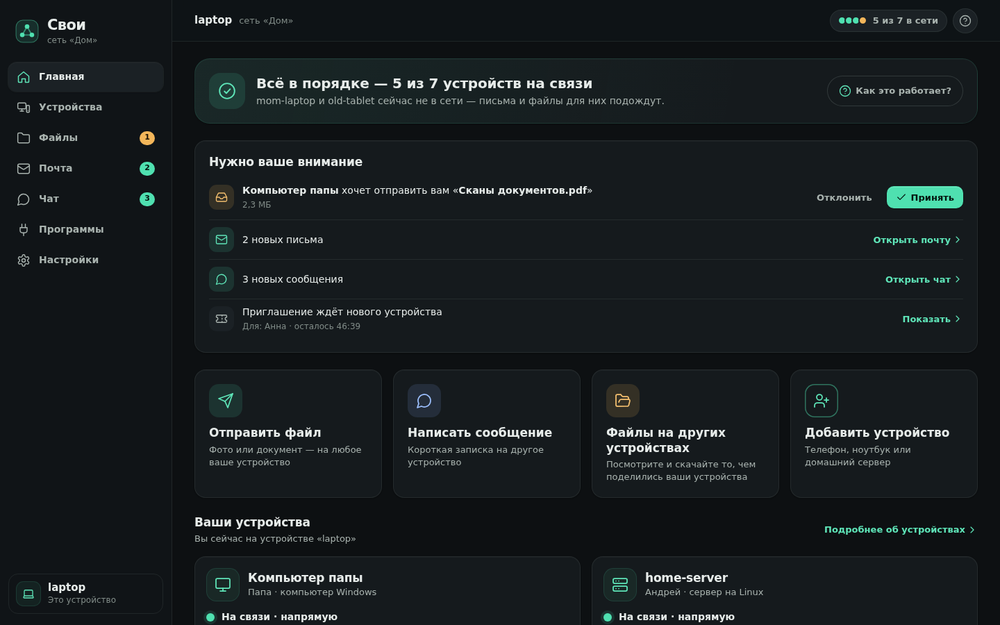
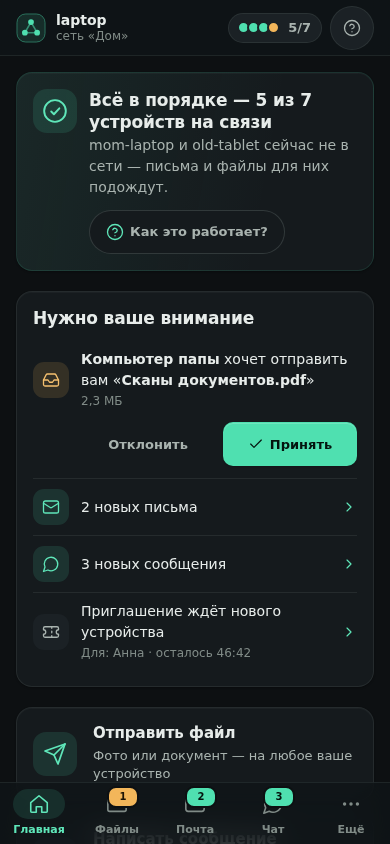
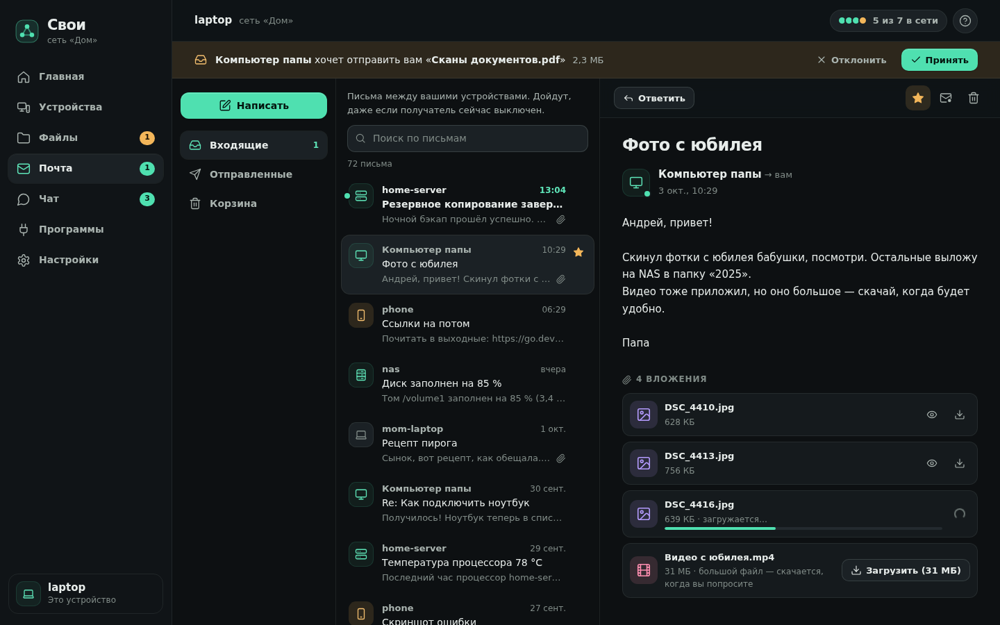

# Свои (svoi)

**Частная сеть ваших устройств — без облака, без аккаунта, без чужого сервера-координатора.**
Телефон, ноутбук, домашний сервер и NAS видят друг друга напрямую по зашифрованному каналу,
где бы они ни находились. Всё это — **одна программа** (один файл, ~12 МБ) с веб-интерфейсом:
обмен файлами, почта, чат, общие папки, проброс портов и виртуальная сеть для остальных программ.

```
   телефон ──────────┐                        ┌────────── ноутбук
   (мобильная сеть)  │   QUIC / TLS 1.3        │   (кафе, Wi-Fi)
                     ├── прямое соединение ────┤
   NAS ──────────────┤   (пробитие NAT)        ├────────── домашний сервер
   (за роутером)     └── или через любого ─────┘           (белый IP / проброс порта)
                         участника сети
```

Задумано как Tailscale, но **нет компании-посредника**: список устройств, их ключи и права живут
у самих устройств и подписаны корневым ключом вашей сети. Если интернет-провайдер, разработчик
или хостинг завтра исчезнут — сеть продолжит работать.

> Статус: рабочий прототип (`0.1`). Протокол, ядро, файловый обмен, почта/чат, проброс портов,
> виртуальный интерфейс и интерфейс в браузере реализованы и проверены автотестами, в том числе
> на настоящих NAT в сетевых пространствах Linux. Что **не** проверено — в разделе
> [«Честно об ограничениях»](#честно-об-ограничениях).

## Как это выглядит

Один интерфейс в браузере для всех устройств, написанный простыми словами: первым открывается
экран **«Главная»** — что с сетью, что требует внимания и четыре крупных действия (отправить файл,
написать, посмотреть файлы других устройств, добавить устройство). Технические подробности
(адреса, тип подключения) спрятаны под «Технические данные». Скриншоты сделаны на демонстрационных
данных (`./svoi demo` показывает то же самое, но на настоящем ядре).

| | |
|---|---|
|  |  |
| **Главная** — «Всё в порядке — 5 из 7 устройств на связи», входящий файл с кнопками «Принять» и «Отклонить», крупные действия | **На телефоне** — тот же экран в одну колонку, внизу пять вкладок |
|  |  |
| **Устройства** — кто в сети и как идёт трафик (в одной сети, напрямую, через другое устройство) | **Файлы** — общие папки других устройств, превью, перемотка видео |
|  | |
| **Почта** — подписанные письма с вложениями; большие скачиваются по кнопке | |

**Посмотреть вживую без установки:** в репозитории есть сборка этого же интерфейса с выдуманной сетью,
которой не нужен сервер (`node web-dev/make-demo.mjs`, подробности — в `web-dev/demo/README.md`).

## Быстрый старт

### 1. Посмотреть, как это выглядит (без настройки)

```bash
make build            # нужен Go 1.26+; получится один файл ./svoi
./svoi demo           # четыре «устройства» в одной программе, за разными NAT
```

Откроется браузер: ноутбук, телефон, NAS и домашний сервер уже в сети, у NAS есть фото, музыка и
документы, приходят письма и сообщения, а телефон иногда «пропадает» из сети и возвращается.
Это симуляция в памяти — реальных сетевых соединений наружу `demo` не делает. Интерфейсы других
«устройств» — на следующих портах (`8778`, `8779`, `8780`), чтобы можно было посмотреть на
сеть их глазами.

### 2. Настоящая сеть из своих устройств

**Первое устройство** (например, домашний сервер или ноутбук):

```bash
./svoi up
```

В браузере откроется мастер: «Создать новую сеть». Укажите название сети и имя устройства.
Либо из терминала: `./svoi init --mesh "Дом" --name nas`.

Вход в интерфейс — по **одноразовой ссылке** (`http://127.0.0.1:8777/?t=…`): её печатает `svoi up` (когда
запущен в терминале), она работает один раз и 10 минут. Не открылся браузер (сервер без экрана, Termux,
контейнер) или ссылка устарела — `./svoi url` выдаст новую (`./svoi open` ещё и откроет её). Как служба
(systemd, Docker), без терминала, `svoi up` ссылку **не пишет** в журнал — он бы её сохранил, —
а подсказывает `svoi url` (`--print-link` включает печать).

**Добавить второе устройство.** На первом откройте «Устройства → Добавить устройство» — вы получите
код `SVOI1-…` и QR-код (или `./svoi invite`). На втором устройстве:

```bash
./svoi up            # и в браузере «Присоединиться», вставьте код
# или
./svoi join SVOI1-…
```

Приглашение одноразовое, действует 30 минут, привязано к устройству-приглашающему и не даёт
ничего тому, кто его подсмотрел позже. Для администратора сети создайте приглашение с
правами администратора (`./svoi invite --admin`) — такое устройство получит ключ сети и сможет
приглашать и отзывать других.

**Дальше всё в браузере** (`http://127.0.0.1:8777`):

| Раздел | Что делает |
|---|---|
| **Главная** | с чего начать: состояние сети одной фразой, входящие файлы, письма и сообщения, четыре крупных действия, ваши устройства с подписанными кнопками; справка «Как это работает?» |
| **Устройства** | кто в сети и как идёт трафик (в одной сети / напрямую / через другое устройство), пригласить, переименовать, отозвать; адреса, ID и тип подключения — в «Технических данных» |
| **Файлы** | обзор общих папок других устройств (видео и музыка проигрываются с перемоткой, превью фото, PDF), загрузка и скачивание; **«Отправить»** — как AirDrop: выберите файл и устройство, получатель принимает (ваши собственные устройства — автоматически) |
| **Почта** | письма с вложениями между устройствами сети; доставляются, когда адресат появится в сети; подпись отправителя проверяется |
| **Чат** | переписка с каждым устройством, вложения, статусы доставки |
| **Программы** (раньше «Сервисы») | выложить TCP-порт устройства (ssh, веб-морда, Plex…) и открыть его на другом устройстве по `127.0.0.1:порт`; встроенный SOCKS5-прокси для программ, которые умеют только прокси: ведёт на устройства сети по имени `<имя>.svoi` (не в интернет; без пароля — доступен любой локальной программе) |
| **Настройки** | папка загрузок, автоприём, ретранслятор, STUN, порт, виртуальный интерфейс |

### 3. Телефон

Приложения-оболочки пока нет: на Android программа запускается в [Termux](https://termux.dev)
(`pkg install golang && make build`, либо готовый `svoi-linux-arm64` из релиза), интерфейс
открывается в обычном браузере телефона по адресу `http://127.0.0.1:8777`. Сборки для iOS нет.
Работа на реальном телефоне в этом репозитории **не проверялась** — только кросс-компиляция
(`android/arm64`, `linux/arm64`) и тесты на Linux.

### 4. Сервер / NAS без экрана

```bash
sudo useradd --system --home-dir /var/lib/svoi --no-create-home --shell /usr/sbin/nologin svoi
sudo install -d -o svoi -g svoi -m 700 /var/lib/svoi
sudo install -m755 svoi /usr/local/bin/svoi
sudo install -m644 deploy/svoi.service /etc/systemd/system/
# один раз, до первого запуска: вступить в сеть (или `init --mesh "Дом" --name nas`, чтобы создать свою)
sudo -u svoi svoi join SVOI1-… --name nas --dir /var/lib/svoi
sudo systemctl enable --now svoi
sudo journalctl -u svoi -n 20              # журнал (ссылки на интерфейс в нём нет: журнал бы её хранил)
sudo -u svoi svoi url --dir /var/lib/svoi  # одноразовая ссылка (10 минут); открыть — через `ssh -L 8777:127.0.0.1:8777`
```

или Docker: `docker compose up -d` (см. `docker-compose.yml`; образ в этой среде не собирался —
нет Docker-демона; внутри контейнера процесс работает не от root, uid 65532, поэтому подключаемую
вместо тома папку данных нужно отдать ему: `chown 65532:65532`). Настраивать такое устройство удобно **с ноутбука**: у администратора сети
в интерфейсе есть переключатель «Управлять устройством ▾» — общие папки, сервисы и настройки
удалённого узла правятся через зашифрованный канал, без SSH.

## Как устройства находят друг друга без сервера

Без центрального сервера нужен хотя бы один способ «познакомиться». Здесь их несколько, и они
работают вместе:

1. **Приглашение содержит адреса.** Код `SVOI1-…` включает ключ сети, ключ пригласившего и до
   8 его адресов (локальные, внешний по STUN, IPv6). Новое устройство подключается напрямую.
2. **Участники рассказывают друг другу о других.** Каждое устройство обменивается со всеми
   списком участников (подписанным корневым ключом) и тем, как видит адреса остальных: один
   раз познакомившись, устройства находят друг друга и при смене сети.
3. **Пробитие NAT.** Если оба устройства за обычными («конусными») NAT, они одновременно шлют
   пробные пакеты и открывают прямой канал. Для этого нужен посредник *только на миг* — им
   служит любой общий участник сети.
4. **Ретрансляция через участников.** Если прямой путь невозможен (симметричный NAT,
   корпоративный файрвол), трафик идёт через любого участника, до которого доступны оба, —
   он видит только зашифрованные пакеты. Ретрансляция включается/выключается в настройках.
5. **Локальная сеть.** В одной LAN устройства находят друг друга широковещательными
   маячками — интернет не нужен.
6. **Порт на роутере — автоматически.** Устройство само просит домашний роутер пробросить свой
   UDP-порт (UPnP IGD, запасной путь — NAT-PMP). Если роутер умеет, домашний сервер или NAS
   становится достижимым снаружи **без ручной настройки**, а полученный адрес устройство
   предлагает остальным первым (в приглашении и при обмене адресами). Порт закрывается, когда
   svoi останавливается; выключается в настройках или `--no-portmap`.
7. **STUN** (необязательно) — публичные серверы возвращают устройству его внешний адрес.
   Ничего, кроме «с какого адреса пришёл пакет», они не узнают; отключается в настройках
   (`--no-stun`) — тогда адреса сообщают друг другу участники. Имена STUN-серверов
   разрешаются системным DNS; если он не работает (статический бинарник на Android, минимальный
   контейнер), имена запрашиваются напрямую у `1.1.1.1` / `8.8.8.8` — и только они, и только пока STUN включён.

**Что нужно, чтобы всё работало «где бы вы ни находились».** Хотя бы одно устройство сети должно
быть доступно извне постоянно: с белым IP, с пробросом одного UDP-порта на роутере (по умолчанию
`41710`; многие роутеры svoi уговаривает сам, см. пункт 6), с IPv6 или хотя бы изредка
оказываться в одной сети с остальными. Обычно это домашний сервер или NAS. Не поможет
автоматика, если у провайдера «серый» адрес (CGNAT) или на роутере выключен UPnP: тогда
нужен ручной проброс порта, IPv6 или недорогой VPS как «якорь». Остальные (телефон, ноутбук) могут быть где угодно за любыми NAT — если все
устройства сети *одновременно* за NAT без единой постоянной «точки входа», они смогут найти
друг друга лишь пока адреса не изменились. Подробности — в [docs/ARCHITECTURE.md](docs/ARCHITECTURE.md).

## Безопасность

* **Личность устройства — его ключ** (Ed25519, `device.key`, права `0600`). Имя и адреса — лишь
  подписи на ярлыке.
* **Членство — сертификат.** Корневой ключ сети выдаёт каждому устройству сертификат
  (имя, владелец, адреса в оверлее, флаг администратора). Два участника проверяют друг друга по
  mTLS (TLS 1.3 поверх QUIC) **без сервера и интернета**; чужое устройство не может установить
  соединение, а отозванное — отключается у всех при следующей синхронизации.
* **Приглашения** одноразовые, с коротким сроком; секрет привязан к каналу, поэтому
  перехваченный код после использования бесполезен. Но **пока он не использован, он равен ключу**:
  кто первым предъявит код, тот и вступит (а код админ-приглашения отдаёт ключ сети). Передавайте
  его надёжным способом и отменяйте неиспользованные приглашения (кнопка «×» в списке).
* **Шифрование — между конечными устройствами** (QUIC / TLS 1.3). Ретранслятор видит только
  зашифрованные пакеты QUIC: прочитать или незаметно подменить их он не может. Дополнительно
  каждый пакет данных (в том числе прямой) и каждый участок ретрансляции подписаны MAC, а служебные
  сообщения привязаны к отправителю и получателю: посторонний, знающий лишь публичный ключ
  участника, не может **сфабриковать** пакеты «от его имени» или использовать участника как открытый
  ретранслятор. (Но **записанный** пакет можно отправить повторно — защиты от повтора «насквозь», как
  у WireGuard, нет: узел запоминает недавние служебные пакеты и отбрасывает их копии, а число адресов,
  которые можно ему подсунуть так, ограничено; подробности — в [docs/ARCHITECTURE.md](docs/ARCHITECTURE.md).)
* **Посторонние ничего не получают.** Тот, кто ещё не вступил в сеть, не видит ни сертификата, ни имени,
  ни адресов оверлея: вступление начинается с токена, выведенного из секрета приглашения (без него узел не
  отвечает и не тратит на чужого ни памяти, ни доли бюджета того, кто держит приглашение), а протокол
  участников принимается только по аутентифицированному пути. Даже предъявившему приглашение узел
  показывает самоподписанный сертификат без имени и владельца. Источники, у которых нет подтверждённого
  адреса, получают QUIC Retry и ограниченный бюджет пакетов.
* **В локальной сети устройство не светит ключ.** Маячки, которыми устройства находят друг друга
  в одной Wi-Fi, зашифрованы ключом, выведенным из открытого ключа сети, и каждый раз выглядят
  по-новому: посторонний видит случайные байты (но не скроешь сам факт UDP-трафика на порт `41711`).
  Этот ключ — не секрет тем, кто видел приглашение: такой человек в той же сети маячки прочитает,
  но выдать чужое устройство за другое не сможет — маячок подписан ключом самого устройства.
* **Чьё это устройство — решает приглашающий.** Имя владельца записывается в сертификат из
  приглашения («Чьё это устройство?» в диалоге «Добавить устройство»), а не со слов вступающего:
  новое устройство не может назваться вашим, чтобы получать файлы без подтверждения.
* **Права на папки.** Каждая общая папка — отдельная «песочница» (`os.Root`): `..`, ссылки и
  абсолютные пути не выводят за её пределы. У каждой папки режим «только чтение / запись» и
  список устройств, которым она доступна.
* **Локальный интерфейс** слушает только `127.0.0.1`. В браузер попадает не секрет, а
  **одноразовая ссылка** (код живёт 10 минут и срабатывает один раз, потом это случайная сессия в
  cookie `HttpOnly; SameSite=Strict`; на диске только её хеш). Главный токен (`ui.token`) нужен
  лишь командной строке, нигде не печатается, а перед отправкой `svoi` убеждается рукопожатием, что
  на порту отвечает именно ваш узел. Проверяются `Host` (защита от DNS-rebinding) и `Origin`,
  изменяющие запросы требуют `X-Svoi: 1` (CSRF; другой заголовок `Authorization` проверку не
  отключает). Новую ссылку выдаёт `svoi open` / `svoi url`, выйти из всех браузеров — `svoi signout`
  (живой поток событий закрывается вместе с сессией). Ссылка, которую `svoi open` (и сам `svoi up`) передаёт
  браузеру на этой же машине, попадает в командную строку, где её видят все пользователи компьютера, поэтому
  она **привязана к пользователю** (Linux): другой пользователь, подсмотревший её в `ps`, получает отказ,
  а ссылка не тратится; ссылка из `svoi url` годится где угодно (например, через ssh-туннель). Чужие файлы из общих папок отдаются с
  `Content-Security-Policy: sandbox`, `nosniff` и как `text/plain` вместо HTML — страница с
  устройства-соседа не может исполнить скрипт в интерфейсе.
* **Администрирование** чужого устройства — только для администраторов и только по списку
  разрешённых путей настройки (общие папки, сервисы, настройки, журнал, состояние); почта и чат такими
  запросами недоступны. Но учтите: администратор может открыть **любую** папку удалённого устройства
  себе и опубликовать любой его локальный порт — доверяйте администраторам как самому себе. Администратор
  держит корневой ключ сети, поэтому его нельзя «разжаловать», а «удаление из сети» не лишает его силы:
  чтобы по-настоящему исключить администратора, создайте новую сеть.
* **Открытый порт.** Если роутер пробросил порт, снаружи виден один UDP-порт svoi. Чужим он не
  отвечает (служебные пакеты запечатаны и подписаны, незнакомцам — только QUIC Retry, и только
  пока ждёте нового устройства). Разговор с роутером ведётся осторожно: ответы на поиск
  принимаются только из своей сети и только от самого устройства, ответившего на поиск (и не с `127.0.0.1`).
  UPnP не проверяет подлинность, так что хост вашей сети, ответивший на поиск раньше роутера, может назвать
  «нашим» чужой публичный адрес — это лишь лишние пробные пакеты, настоящие адреса остаются.
* **Секреты не раздаются.** Папку, которая содержит каталог данных svoi (ключи, корневой ключ сети,
  токен интерфейса) — например, домашнюю — открыть для сети нельзя; выберите подпапку.
* **Чужие данные проверяются:** идентификатор передачи, размер файла, имена, поля писем, подписи и
  размеры служебных сообщений ограничены и очищаются; приём файла не превышает объявленный размер и
  останавливается, если нет места; для миниатюр не декодируются картинки-«бомбы». Вложения писем и
  чата до 25 МБ скачиваются сами, более крупные — только по кнопке «Загрузить». Вложение отдаётся тем, кого
  выбрал владелец файла (адресатам письма, которое вы написали, и соадресатам письма, если вложение вы получили от
  его автора): знать хеш недостаточно, а письмо, которое просто называет чужой хеш, ничего не открывает.

Модель угроз: устройство участника **доверенное** (оно получает общие папки и сервисы, которые
вы ему разрешили, и видит, кто в сети). Защищено от: посторонних в интернете, ретрансляторов,
перехвата приглашений, чужих веб-страниц в вашем браузере. Не защищает от: злоумышленника с
корневым ключом (администратор может всё), от компрометации самого устройства.
Независимого аудита нет — не используйте для того, что нельзя потерять.

## Честно об ограничениях

* **Нет постоянной «точки входа» — нет связи.** DHT/глобального каталога нет (это и значит «без
  облака»). Нужен хотя бы один достижимый участник, см. выше.
* **Симметричные NAT** (часть мобильных операторов, корпоративные сети): прямой канал
  невозможен, трафик идёт через ретранслятор; если ретранслятора нет — связи нет.
* **Прямое соединение за NAT с «разрешающим» файрволом** (iptables `INPUT ACCEPT` вместе с
  conntrack на роутере) иногда не пробивается — на стенде воспроизведено; связь при этом всё равно
  работает через ретранслятор (`lab/lab_test.go`, `TestConeToConePermissiveFirewall`).
* **Почта без «хранителя».** Если адресат выключен, письмо ждёт на устройстве *отправителя* и уйдёт,
  когда адресат появится; третье устройство его не хранит. Отправитель должен дожить до встречи.
* **Повтор записанных пакетов не исключён.** Подделать пакет участника посторонний не может, но
  отправить записанный повторно — может: служебные пакеты запоминаются и повторы отбрасываются, число
  подсовываемых адресов-кандидатов ограничено, повтор пакета данных отбрасывает сам QUIC, — а настоящей защиты
  уровня WireGuard (счётчик на каждый пакет) нет.
* **Cookie входа не привязана к порту.** Браузер отправляет её на все порты `127.0.0.1`: другая программа,
  слушающая другой локальный порт и открытая в том же браузере, получила бы cookie (в имени cookie
  стоит порт — это лишь не даёт двум узлам вытеснять друг друга). На общей машине не открывайте в этом профиле
  браузера чужие локальные страницы; на сервере заходите через ssh-туннель.
* **Участники — доверенные.** Выбор ретранслятора верит самооценке участника: недобросовестный участник может
  объявить себя ретранслятором для всех и «глотать» трафик устройств без прямого пути (читать его не может).
  Квот на отправителя нет: вложения ограничены только по размеру и числу, диск можно занять до резерва.
* **Это не весь Tailscale.** Нет «exit node» и «subnet router» (весь трафик через устройство сети и
  доступ к подсети за ним), нет DNS-сервера (имена `<имя>.svoi` — через `/etc/hosts`, только с `--tun`),
  нет языка ACL (права — на общие папки и сервисы), нет аккаунтов и SSO — их здесь и не должно быть.
* **Виртуальный интерфейс (`--tun`) только на Linux** и требует root / `CAP_NET_ADMIN`. IPv6-путь
  там не проверялся (в тестовом ядре нет IPv6). На macOS/Windows доступны веб-интерфейс, файлы,
  почта, чат, проброс портов и SOCKS5.
* **Автоматический проброс порта (UPnP / NAT-PMP)** проверен на поддельных роутерах (юнит-тесты)
  и на поддельном UPnP-роутере, который превращает запросы в настоящие правила iptables в
  сетевых пространствах Linux (`lab/`); на **настоящих** роутерах с их причудами — нет. Не поможет за
  CGNAT и там, где UPnP отключён.
* **Не проверялось:** реальный интернет (только имитированный и сетевые пространства Linux),
  настоящие телефоны/NAS, Windows и macOS в работе (кросс-компиляция есть, запуска нет), Docker-образ
  (не собирался: в среде разработки нет Docker-демона), unit systemd (синтаксис проверен
  `systemd-analyze verify`, но не запускался).
* Много устройств (>~50) и большие сети не тестировались; нет квот на пользователя.

## Команды

```
svoi [up] [--ui 127.0.0.1:8777] [--no-browser] [--print-link] [--tun] [--no-stun] [--no-portmap] [--dir PATH]
svoi init [--mesh НАЗВАНИЕ] [--name ИМЯ] [--owner ВЛАДЕЛЕЦ]   создать сеть
svoi join КОД [--name ИМЯ]                                     вступить в сеть
svoi invite [--admin] [--owner ВЛАДЕЛЕЦ] [--ttl 30m]               код приглашения и QR
svoi status [--json]                                           кто в сети
svoi send УСТРОЙСТВО ФАЙЛ…                                     отправить файлы
svoi ping УСТРОЙСТВО                                           задержка
svoi open | url                                                войти в интерфейс: новая одноразовая ссылка
svoi signout                                                   выйти из интерфейса во всех браузерах
svoi leave [--yes]                                             выйти из сети (ключ устройства остаётся)
svoi demo [--port 8777] [--dir ПАПКА] [--quiet]                симуляция из четырёх устройств
```

Данные хранятся в `~/.config/svoi` (или `$SVOI_DIR`, `--dir`): `device.key` (секретный ключ
устройства), `mesh.json` (сертификат, список участников, отзывы; **у администратора — ещё и корневой ключ
сети**), `config.json` (настройки), `svoi.db` (почта, чат, передачи), `blobs/` (вложения), `ui.token` (главный токен
командной строки; сам не меняется — чтобы сменить, остановите svoi, удалите файл и запустите снова),
`ui.sessions` (хеши сессий браузеров). **Сделайте копию `device.key` и `mesh.json`** — иначе при потере
устройства придётся вступать заново.

## Виртуальная сеть (`--tun`, Linux)

С `sudo svoi up --tun` (или переключателем в «Настройках») создаётся интерфейс `svoi0` с
адресом из `100.64.0.0/10` (и `fd…/48` для IPv6). Каждое устройство достижимо по своему адресу
и по имени `<имя>.svoi` из **любой** программы — `ssh nas.svoi`, `ping 100.64.0.7`, браузер,
`rsync`, SMB/NFS. Трафик идёт теми же зашифрованными каналами; подмена адреса отправителя
отсекается (сверяется с сертификатом). Имена добавляются в `/etc/hosts` между пометками
`# BEGIN svoi` / `# END svoi` и убираются при остановке; чужие строки файла не трогаются (даже если одна из
пометок потерялась после сбоя).

## Разработка

```bash
make test        # все тесты
make race        # то же с детектором гонок (используется в CI)
make dist        # архивы для linux/darwin/windows/freebsd/android (в ./dist)
make lab         # проверка на настоящих NAT (Linux, root, iptables, conntrack)
node web-e2e/run.mjs   # интерфейс в настоящем браузере против настоящего бэкенда (Node 22+, Playwright)
```

Устройство каталогов, протоколы и подробности — в [docs/ARCHITECTURE.md](docs/ARCHITECTURE.md);
контракт между интерфейсом и ядром — [docs/UI-API.md](docs/UI-API.md). Интерфейс — статические
файлы без сборки и без внешних зависимостей в `internal/web/ui` (встраиваются в бинарник);
для его разработки без бэкенда есть `web-dev/mock-server.mjs`.
