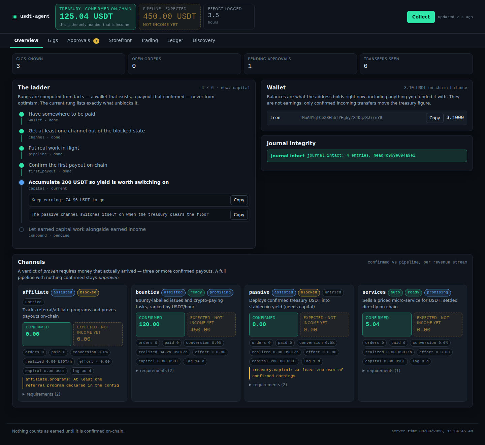

# usdt-agent — агент, который сам добывает USDT в интернете

Автономный агент из двух половин:

- **`earn`** — *добывает* USDT: находит оплачиваемые задачи, продаёт услуги за
  крипту, отслеживает партнёрские выплаты и **доказывает каждый цент чтением
  блокчейна**, а не отчётом с чужой панели.
- **`run`** — *размещает* уже добытое: пять маркет-нейтральных стратегий под
  риск-губернатором со статистическим шлюзом.

Ноль зависимостей — только Python 3.11+. Приватный ключ агент не видит никогда:
он работает **исключительно на чтение** блокчейна.

```bash
cd usdt-agent
make test          # 275 тестов, интернет не нужен
make earn-setup    # что делать первым, если у вас нет вообще ничего
make web           # панель оператора в браузере
```



**Просто посмотреть?** Откройте `docs/dashboard.html` — двойным кликом, без
сервера и без интернета. Это та же панель (тот же CSS, тот же `app.js`, байт в
байт) со встроенным демо-прогоном: все вкладки и кнопки работают. Числа там
помечены как образец — проект, вся суть которого «доход только после
подтверждения в блокчейне», не может раздавать страницу, где выдуманные цифры
выглядят как деньги.

---

## Главный принцип

> **Деньгами считается только то, что подтверждено в блокчейне.**

Найденная задача — это догадка. Отправленная заявка — надежда. «Ожидаемая
выплата» — чужое намерение. Доходом становится только перевод, который агент
увидел в блоке. Ни один канал не может записать себе выручку сам: это делает
только коллектор и только против подтверждённого перевода.

Этот принцип поймал реальный баг ещё при разработке: на тестовом адресе
коллектор насчитал 12.6 млрд USDT при балансе 3.10 — токен-двойник с 18
десятичными знаками маскировался под USDT. Теперь контракт токена и его
decimals проверяются явно, а первый запуск на любой сети только фиксирует
**базовую линию** и не записывает чужую историю себе в доход.

---

## Каналы добычи

| Канал | Механика | Нужен капитал | Автономность |
| --- | --- | --- | --- |
| `bounties` | оплачиваемые задачи (GitHub/Algora-баунти), ранжирование по **USDT в час** | нет | готовит, claim — с вашего одобрения |
| `services` | платный микро-сервис: HTTP 402 + расчёт ончейн, без процессинга и кастоди | нет | **полностью авто** |
| `affiliate` | учёт партнёрских программ и сверка их выплат | нет | сверяет сам, программы заводите вы |
| `discovery` | разбор публичных недокументированных API площадок | нет | предлагает маппинг, подтверждаете вы |
| `passive` | стейблкоин-доходность на уже заработанное | от 200 USDT | мост к торговой половине |

### Лестница с нуля

Порядок каналов продиктован экономикой, а не вкусом:

- **доходность требует капитала** — 8 % годовых на 0 USDT это 0 USDT;
- **продажа требует покупателей** — сервис зарабатывает во сне, но только
  после того, как о нём кто-то узнал;
- **рефералы требуют трафика** — нет аудитории, нет кликов, нет комиссии;
- **оплачиваемая работа требует только навыка и адреса** — поэтому она первая.

`usdt-agent earn setup` вычисляет, на какой ступени вы сейчас, из фактов
(заведён ли кошелёк, была ли хоть одна подтверждённая выплата, каков баланс), и
печатает конкретное следующее действие. Ступень не «засчитывается» на оптимизме.

### Как работает продажа услуги без кастоди

Ключевой приём — **уникальная сумма**. Каждый счёт получает детерминированные
доли цента, поэтому `5.0214 USDT` однозначно идентифицирует один счёт на общем
адресе. Так платёж сопоставляется без деривации адресов (нужен ключ) и без
платёжного процессора (нужны кастоди и KYC).

```
GET  /                    → каталог
POST /order/<sku>         → 402 + «отправьте ровно 5.0214 USDT на <адрес>»
GET  /order/<invoice_id>  → 402 пока не оплачено, 200 + товар после подтверждения
```

---

## Панель оператора

`usdt-agent web` поднимает локальную панель: лестница с текущей ступенью, задачи
по USDT/час, очередь одобрений, витрина со счетами, торговая половина и журнал.

Это **панель управления, а не витрина статуса** — из неё одобряется работа от
вашего имени и выпускаются счета. Отсюда её устройство:

- слушает только loopback — снаружи она недоступна по построению, для удалённого
  сервера пробрасывайте туннель: `ssh -N -L 8500:127.0.0.1:8500 user@server`;
- при старте печатает **одноразовую ссылку** `http://127.0.0.1:8500/?k=…`, которая
  обменивает nonce на `HttpOnly`-cookie и сгорает. Токена нет ни в HTML, ни в
  `localStorage`, поэтому его не прочитает ни соседний процесс через `curl /`, ни XSS;
- проверяет заголовок `Host`: иначе удалённая страница, направившая свой домен на
  127.0.0.1 (DNS rebinding), читала бы ответы как свои.

Главное визуальное решение: **подтверждённый доход и ожидания не выглядят
одинаково.** Подтверждённое — плотное, акцентное. Ожидаемое — приглушённое,
пунктиром, с подписью «not income yet». Перепутать их взглядом нельзя.

## Команды

```bash
usdt-agent web              # панель оператора
usdt-agent earn setup       # ступень, на которой вы сейчас, и что делать дальше
usdt-agent earn channels    # готовность каналов, автономность, блокеры
usdt-agent earn wallet      # балансы USDT на всех сетях (только чтение)
usdt-agent earn scan        # задачи, отранжированные по USDT/час
usdt-agent earn take <id>   # черновик плана работ по задаче
usdt-agent earn approvals   # что ждёт вашего решения
usdt-agent earn invoice <sku>  # выставить счёт
usdt-agent earn serve       # поднять витрину (HTTP 402 + расчёт ончейн)
usdt-agent earn collect     # сверка кошелька: записать только реально пришедшее
usdt-agent earn report      # ожидаемое против подтверждённого
```

Вторая половина (размещение капитала) — `run`, `scan`, `backtest`, `doctor`,
`report`, `verify`, `strategies`; см. раздел «Торговая половина» ниже.

### Быстрый старт с нуля

```bash
# 1. Кошелёк, который контролируете вы. Агент видит только адрес.
export USDT_WALLET_TRON=T...          # Tron: центы за перевод, лучший старт

# 2. Где вы находитесь и что делать
usdt-agent -c config/agent.toml earn setup

# 3. Зафиксировать базовую линию (то, что уже лежит, доходом не считается)
usdt-agent -c config/agent.toml earn collect

# 4. Что есть на рынке задач
export GITHUB_TOKEN=ghp_...           # необязательно, но поднимает лимит поиска
usdt-agent -c config/agent.toml earn scan
```

---

## Честность конструкции

**Агент не претендует на то, чего не может.** У каждого канала объявлен уровень
автономности: `auto` — делает сам от начала до конца; `assisted` — готовит, но
останавливается на очереди одобрений; `manual` — только человек. Всё, что
обращается к третьей стороне от вашего имени, требует явного одобрения.

**Калибровка вместо самообмана.** Оценка трудозатрат и вероятности выплаты —
это догадки. Когда заказы закрываются, измеренные конверсия и USDT/час
заменяют их в отчёте, а канал без подтверждённых выплат помечается `unproven`,
каким бы полным ни был его пайплайн.

**Ранжирование против лотерейных билетов.** `USDT/час` уже включает
вероятность оплаты: баунти на $5000 с шансом 3 % проигрывает задаче на $120 с
шансом 80 %. Заявка на $5000 в пайплайне не делает вас богаче.

**Журнал с хеш-цепочкой.** Каждая подтверждённая выплата попадает в тот же
неизменяемый журнал, что и торговые сделки. `verify` покажет точный номер
записи, если историю правили задним числом.

---

## Торговая половина

Пять стратегий, четыре из них не делают ставку на направление рынка:

| | механика | откуда доход |
|---|---|---|
| `funding_carry` | лонг спот + шорт перп | ставка финансирования раз в 8 ч |
| `cross_venue` | купить на одной бирже, продать на другой | расхождение котировок |
| `triangular` | цикл USDT → A → B → USDT | рассогласование кросс-курса |
| `stable_yield` | лендинг-пулы по risk-adjusted APY | процент по стейблам |
| `grid` | покупка просадок USDC/USDT | возврат к среднему |

Капитал распределяет байесовский бандит (Thompson sampling) с забыванием по
свежести. Стратегия не получает реальных денег, пока её сделки не пройдут
bootstrap-тест и Deflated Sharpe с поправкой на множественное тестирование.
Размер позиции назначает **только** риск-губернатор: у него дневной лимит
убытка, стоп по просадке и право вето с записью причины отказа.

Издержки считаются пессимистично и в одном месте — комиссия, полспреда,
√-импакт от глубины стакана, задержка и adverse selection. Стратегия не может
посчитать свои издержки сама, поэтому спрятать их негде.

```bash
usdt-agent -c config/agent.toml doctor     # что доступно из вашей сети
usdt-agent -c config/agent.toml backtest   # прогон по детерминированному симулятору
usdt-agent -c config/agent.toml run        # бумажная торговля по живым данным
```

Реальная торговля требует четырёх независимых блокировок и всё равно по
умолчанию работает в `--dry-run`; настоящая отправка — только с явным `--arm`.

---

## Архитектура

```
earn/wallet.py      → балансы и переводы     только чтение, 6 сетей, без ключей
earn/channels/      → Gig                    каналы предлагают, размер не назначают
earn/collector.py   → Payout(CONFIRMED)      единственный, кто объявляет доход
earn/bootstrap.py   → Ladder                 на какой ступени вы сейчас
earn/store.py       → журнал                 общий с торговой половиной
earn/server.py      → HTTP 402               витрина с расчётом ончейн

feeds/              → MarketSnapshot         биржи и DefiLlama параллельно
strategies/         → Opportunity            идеи с посчитанной себестоимостью
allocator.py        → бюджет                 Thompson sampling
risk.py             → Decision               единственный источник размера позиции
execution/          → Fill                   paper | live за четырьмя блокировками
statistics.py       → EdgeVerdict            доказано преимущество или нет
```

---

## Чего агент не делает

- **Не подписывает транзакции и не хранит ключи.** Нигде в проекте нет поля для
  приватного ключа или сид-фразы. Депозит в пул и вывод средств делаете вы.
- **Не выполняет работу за вас.** По баунти агент находит, оценивает и готовит
  план; код пишете и отправляете вы (или отдельный агент по вашей команде).
- **Не фармит краны, не накручивает сибил-кошельки под аирдропы, не обходит
  капчу.** Это не заработок, а обман площадок, и живёт такой агент до первого
  бана с обнулением баланса. Модуль `discovery` разбирает только **публичные
  неаутентифицированные** эндпоинты: он уважает `robots.txt`, держит рейт-лимит,
  представляется своим именем и при ответе 401/403/капча помечает хост как
  BLOCKED и больше к нему не возвращается. Обхода в коде нет — не «не
  рекомендуется», а физически отсутствует.
- **Не создаёт реферальные ссылки и не спамит ими.** Программы заводите вы —
  это ваша репутация.
- **Не обещает доходности.** Симулятор моделирует комиссии, задержку и adverse
  selection, но не смоделирует остановку вывода средств на бирже.
- **Live-торговля реализована только для Binance spot.** Остальные площадки —
  публичные данные и бумажная торговля.

## Отказ от ответственности

Учебный и исследовательский проект. Торговля криптовалютой сопряжена с риском
полной потери средств. Результаты на бумаге не являются прогнозом. Доход от
оплачиваемой работы требует, собственно, работы. Проверьте налоговые и
регуляторные требования вашей юрисдикции. Используете — на свой страх и риск.
